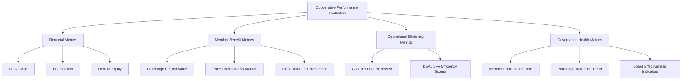

## Cooperative Performance Evaluation

### Overview

Cooperative performance evaluation applies financial, operational, and member-welfare metrics to assess how well a cooperative fulfills its dual mandate: operating as a viable business entity while maximizing benefit to member-owners. Because cooperatives pursue member benefit (patronage value) rather than pure profit maximization, standard IOF performance metrics require adaptation, and evaluation frameworks typically incorporate both conventional financial ratios and cooperative-specific measures.

### The Dual-Objective Evaluation Challenge

**Key Points**

- IOF performance evaluation centers on shareholder wealth maximization (profit, return on equity, share price appreciation).
- Cooperative performance evaluation must instead capture **member benefit**, which flows through multiple channels: patronage refunds, favorable pricing (higher output prices paid to members, lower input prices charged), service quality, and market access — not solely through equity appreciation, since cooperative equity is generally non-tradable and non-appreciating in the conventional sense.
- A cooperative may show comparatively modest reported "profit" while still performing well, if it is passing value to members through favorable pricing rather than retaining it as surplus — a distinction critical to accurate cooperative benchmarking.

### Total Member Benefit Framework

A common conceptual approach decomposes cooperative performance into total value delivered to members, not just retained earnings:

$$TB = (v_c - v_m) \times Q + PR + \Delta E$$

where $TB$ is total member benefit, $v_c$ is the price/terms received from the cooperative, $v_m$ is the counterfactual market price/terms absent the cooperative, $Q$ is patronage volume, $PR$ is cash patronage refund, and $\Delta E$ is the change in allocated member equity.

$[Inference]$ Estimating the counterfactual $v_m$ (what price would have prevailed absent the cooperative) is inherently difficult and typically requires comparison to nearby non-cooperative markets or econometric modeling, making total member benefit calculations more of an analytical estimate than a precisely observable figure.

### Standard Financial Performance Metrics (Adapted for Cooperatives)

**Key Points**

1. **Return on Assets (ROA)** and **Return on Equity (ROE)** — used similarly to IOFs, but interpreted cautiously since cooperatives may intentionally suppress reported net margin by passing value through pricing rather than retaining earnings.
2. **Equity Ratio** — $\frac{\text{Total Equity}}{\text{Total Assets}}$, a solvency indicator particularly important given cooperative redemption obligations discussed in cooperative financing theory.
3. **Local Return on Investment (LROI)** — a cooperative-specific measure sometimes used, capturing patronage refunds plus equity growth relative to member investment, better reflecting the member's actual economic return than standard ROE.
4. **Operating efficiency ratios** — cost per unit processed/marketed, overhead ratio, used to benchmark operational performance against both cooperative peers and comparable IOFs.

$$\text{Debt-to-Equity Ratio} = \frac{\text{Total Liabilities}}{\text{Total Member Equity} + \text{Unallocated Reserves}}$$

Elevated debt-to-equity ratios in cooperatives warrant particular scrutiny because, unlike IOF equity (permanent capital), cooperative member equity carries an implicit or explicit future redemption obligation, effectively functioning partly like deferred liability.

### Non-Financial and Member-Welfare Metrics

**Key Points**

- **Member satisfaction and participation rates** — survey-based measures of member engagement, meeting attendance, and voting participation, used as proxies for governance health and perceived value.
- **Patronage retention/growth rate** — the trend in member volume delivered/purchased over time, indicating whether the cooperative is retaining member loyalty relative to competing outlets.
- **Market share and competitive yardstick effect** — cooperative market share within its trade territory, and evidence of price discipline imposed on competing IOFs (the "competitive yardstick" function discussed in cooperative theory).
- **Service quality indicators** — timeliness of input delivery, grading accuracy, extension/technical support quality — particularly relevant in supply and marketing cooperatives.

### Benchmarking Approaches

**1. Cooperative-to-Cooperative Benchmarking**

Comparing financial and operational ratios against peer cooperatives (similar commodity, similar scale) using data often compiled by cooperative associations or extension services, controlling for regional and commodity-specific factors.

**2. Cooperative-to-IOF Benchmarking**

Comparing cooperative performance to comparable IOF competitors in the same market, used to assess the "yardstick competition" effect and evaluate whether the cooperative is achieving competitive operational efficiency despite its distinct objective function.

**3. Data Envelopment Analysis (DEA) and Stochastic Frontier Analysis (SFA)**

Common econometric techniques for measuring technical efficiency, allowing researchers to estimate how close a cooperative operates to the "best practice" efficiency frontier given its inputs and outputs, relative to peer cooperatives or IOFs.

$$\theta^* = \min \theta \quad \text{s.t.} \quad Y\lambda \geq y_0, \; \theta X_0 \geq X\lambda, \; \lambda \geq 0$$

A standard input-oriented DEA formulation, where $\theta^*$ is the efficiency score for the evaluated cooperative $0$, $X$ and $Y$ are input and output matrices across the peer set, and $\lambda$ is the intensity vector. $[Inference]$ Empirical DEA/SFA studies comparing cooperative and IOF efficiency report mixed findings across sectors and countries, so no single generalized conclusion about relative efficiency is well-supported across the literature.

### Example: Comparative Evaluation of a Grain Marketing Cooperative

**Example**

Suppose a regional grain cooperative reports a net margin of only 1.5% of sales — appearing weak relative to an IOF competitor's 6% margin. However, member-level analysis shows the cooperative paid farmers, on average, $0.15 more per bushel than the prevailing local elevator price (the counterfactual $v_m$), and allocated an additional 2% of sales as qualified patronage equity. When total member benefit is calculated (price premium plus patronage refund plus equity allocation), the cooperative's effective value delivery substantially exceeds the IOF's shareholder return-equivalent — illustrating why raw margin comparisons alone are misleading in cooperative performance evaluation.

### Governance-Linked Performance Indicators

Because governance quality is theoretically linked to cooperative performance (per the agency-cost framework in cooperative governance theory), evaluation frameworks increasingly incorporate:

- **Board turnover and tenure balance** — excessive director tenure may indicate entrenchment; excessive turnover may indicate governance instability.
- **Timeliness and clarity of financial disclosure** to members, as a transparency proxy.
- **Independent audit committee presence and audit opinion history**.
- **Frequency and resolution rate of member grievances/disputes**, as a member-relations health indicator.

### Common Evaluation Pitfalls

**Key Points**

1. **Over-reliance on net margin alone** — as illustrated above, low reported margin does not necessarily indicate poor performance if value is passed through pricing.
2. **Ignoring the counterfactual market** — comparing cooperative prices only to national averages rather than the actual local alternative available to members can misstate true member benefit.
3. **Static single-year analysis** — cooperative performance, particularly patronage refund policy and equity redemption, is inherently multi-year in character; single-year snapshots can misrepresent long-run member value delivery.
4. **Neglecting non-financial governance indicators** — financial performance can mask underlying governance weaknesses (e.g., board-management information asymmetry) that pose longer-term risk to the cooperative's sustainability.

### Related Topics

- Total member benefit estimation methodology
- Data Envelopment Analysis and Stochastic Frontier Analysis in agribusiness
- Competitive yardstick effect and cooperative market discipline
- Cooperative financing and equity redemption policy
- Cooperative governance and agency cost frameworks
- Patronage refund calculation and allocation methods
- Comparative efficiency studies: cooperatives vs. investor-owned firms
- Member satisfaction survey design in cooperative research
- Local Return on Investment (LROI) as a member-centric performance metric
- Benchmarking data sources: extension services and cooperative associations