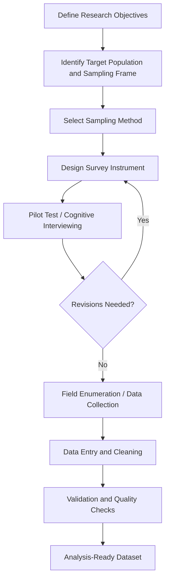

## Survey Design and Data Collection

### Overview

Survey design and data collection in agricultural economics involves the systematic construction of instruments and sampling protocols to gather quantitative and qualitative data on farm households, firms, and markets. Because agricultural populations are often geographically dispersed, seasonally variable in activity, and heterogeneous in literacy and technology access, survey methodology in this field requires careful adaptation of general social science survey principles to rural and agrarian contexts.

### The Survey Research Process

### Defining the Sampling Frame

**Key Points**

- **Sampling frame** — the list or operational definition from which the sample is drawn (e.g., an agricultural census listing, a list of registered farm households, village rosters).
- **Frame errors** are a persistent challenge in agricultural surveys: outdated farm registries, undercoverage of informal/unregistered farms, and exclusion of landless agricultural laborers who may be central to a study's research question.
- **Unit of analysis** must be explicitly defined — the individual farmer, the farm household, the plot, or the farm enterprise — since these units can diverge significantly (e.g., a household may operate multiple non-contiguous plots under different tenure arrangements).

### Sampling Methods

**1. Probability Sampling**

- **Simple random sampling (SRS)** — every unit in the frame has equal selection probability; rarely feasible alone in agricultural contexts due to dispersed populations and high field costs.
- **Stratified random sampling** — population divided into strata (e.g., by agroecological zone, farm size category, irrigation access) before random selection within each stratum, improving precision when strata are internally homogeneous and used extensively in agricultural household surveys to ensure adequate representation of smallholder vs. commercial farm segments.
- **Cluster sampling** — geographic clusters (villages, enumeration areas) are randomly selected first, then units within selected clusters are sampled; widely used in agricultural surveys to reduce field logistics costs, at the expense of increased standard errors due to intra-cluster correlation.
- **Multi-stage sampling** — combines cluster and stratified approaches (e.g., randomly select districts, then villages within districts, then households within villages), the dominant approach in large-scale national agricultural household surveys (e.g., LSMS-ISA, agricultural censuses).

**2. Non-Probability Sampling**

- **Purposive/judgmental sampling** — used when specific subpopulations (e.g., adopters of a new technology) must be deliberately targeted; limits generalizability but useful for exploratory or qualitative research.
- **Snowball sampling** — used for hard-to-reach populations (e.g., informal agricultural laborers, migrant farmworkers) where no sampling frame exists.
- **Convenience sampling** — lowest methodological rigor; generally discouraged for inferential research but sometimes used in preliminary pilot work.

### Sample Size Determination

For estimating a population proportion with a desired margin of error:

$$n = \frac{z^2 \, p(1-p)}{e^2}$$

where $n$ is required sample size, $z$ is the z-score for the desired confidence level, $p$ is the estimated population proportion, and $e$ is the desired margin of error. For cluster and multi-stage designs, this baseline sample size must be inflated by the **design effect (DEFF)**:

$$n_{adj} = n \times \text{DEFF}, \quad \text{DEFF} = 1 + (\bar{m} - 1)\rho$$

where $\bar{m}$ is the average cluster size and $\rho$ is the intra-cluster correlation coefficient. $[Inference]$ Because $\rho$ is rarely known precisely in advance, agricultural survey planners commonly rely on values from prior similar surveys or conservative assumptions, meaning final sample sizes often carry a degree of planning uncertainty until post-hoc design effects can be calculated from collected data.

### Survey Instrument Design

**Key Points**

1. **Question wording** — must minimize ambiguity, leading phrasing, and recall bias, particularly critical for agricultural production data where farmers may not maintain formal records (e.g., asking "how many kilograms of maize did you harvest last season" is more error-prone without recall aids than reference-period-anchored or unit-conversion-assisted questions).
2. **Recall period selection** — shorter recall periods (e.g., 7-day consumption diaries) reduce recall bias but increase respondent burden and survey cost; longer periods (annual production recall) are more feasible logistically but more prone to telescoping and recall decay.
3. **Question sequencing** — sensitive questions (e.g., income, land ownership disputes) are typically placed later in the instrument after rapport is established; module ordering should follow a logical narrative (e.g., household roster → plot inventory → input use → harvest → sales → income) to aid respondent recall coherence.
4. **Response scale design** — Likert-type scales, closed-ended categorical responses, and open numeric fields each carry trade-offs in analytical flexibility versus respondent burden and enumerator training complexity.
5. **Skip patterns and routing logic** — critical in modular agricultural surveys (e.g., livestock modules only administered to livestock-owning households) to reduce irrelevant respondent burden and enumerator time.

### Agriculture-Specific Data Collection Challenges

**Key Points**

- **Plot-level vs. household-level measurement** — many agricultural surveys collect data at the plot level (given that households often cultivate multiple, non-contiguous plots with different soil types, tenure arrangements, and crop choices), requiring more complex data structures than single-record household surveys.
- **Self-reported area vs. GPS measurement** — self-reported land area is subject to substantial measurement error (often systematic, with smaller plots overestimated and larger plots underestimated, a well-documented pattern in the agricultural survey literature); many modern surveys incorporate handheld GPS or GPS-enabled tablet measurement to improve accuracy.
- **Seasonality and multiple visits** — because agricultural production, labor allocation, and consumption vary substantially across the agricultural calendar, single cross-sectional visits can misrepresent annual patterns; many rigorous agricultural household surveys employ **multiple visit designs** (e.g., post-planting and post-harvest visits) to capture seasonal variation accurately.
- **Crop-cutting methods** — an alternative to self-reported yield estimation, involving physical harvesting and weighing of a randomly selected sub-plot area to estimate yield objectively; more accurate but substantially more costly and logistically intensive than farmer-reported yield estimates.
- **Non-response and attrition in panel surveys** — agricultural panel studies face attrition from migration, farm exit, or household dissolution between survey waves, requiring attrition analysis and potentially reweighting to preserve representativeness.

### Modes of Data Collection

| Mode | Description | Trade-offs |
| --- | --- | --- |
| Paper-and-pencil interviewing (PAPI) | Traditional printed questionnaire | Low tech barrier; high data entry error/lag risk; no built-in skip logic |
| Computer-assisted personal interviewing (CAPI) | Tablet/smartphone-based interviewing with digital survey software | Built-in skip logic and range checks; real-time data upload; requires enumerator training and device infrastructure |
| Computer-assisted telephone interviewing (CATI) | Phone-based structured interviews | Lower field cost; limited to populations with reliable phone access, a coverage concern in some rural agricultural contexts |
| Mobile/SMS-based short surveys | Brief structured surveys via SMS or mobile app | Low cost, high frequency feasible; limited question complexity, potential coverage/literacy bias |
| Remote sensing and administrative data linkage | Satellite imagery, administrative records supplementing or substituting field survey data | No direct respondent burden; limited to observable variables (e.g., land cover, not input use or labor allocation) |

### Data Quality Assurance

**Key Points**

1. **Enumerator training** — standardized training protocols and inter-enumerator reliability checks reduce measurement variance attributable to interviewer effects.
2. **Pilot testing and cognitive interviewing** — pre-testing the instrument with a small sample to identify confusing wording, unworkable skip patterns, or culturally inappropriate questions before full fielding.
3. **Back-checks and spot-checks** — supervisors re-visit a subsample of respondents to verify enumerator accuracy and detect fabricated or falsified data.
4. **Range and consistency checks** — automated logical checks built into CAPI software (e.g., flagging implausible yields per hectare, or household members' ages inconsistent with reported relationships) to catch errors during fieldwork rather than post-hoc.
5. **Double data entry** (for paper-based surveys) — independent re-entry of a subsample to calculate keying error rates.

### Ethical Considerations in Agricultural Survey Research

**Key Points**

- **Informed consent** — particularly important when surveys collect sensitive information (land tenure disputes, household income, food insecurity status).
- **Confidentiality of individually identifiable data**, especially where survey results might affect eligibility for government programs or expose disputed land claims.
- **Fair compensation for respondent time**, balanced against concerns about compensation inducing response bias or expectation effects in longitudinal studies.

### Example: LSMS-Integrated Surveys on Agriculture (LSMS-ISA)

**Example**

The World Bank's LSMS-ISA initiative exemplifies best-practice agricultural household survey design: nationally representative multi-stage stratified samples, multiple-visit designs aligned with the agricultural calendar (post-planting and post-harvest modules), GPS-based plot area measurement, and harmonized questionnaire modules across participating countries to enable cross-country comparative analysis — widely used as a reference dataset in agricultural labor, productivity, and household economics research.

### Related Topics

- Sampling theory and design effects in complex survey designs
- Recall bias and reference-period design in production/consumption surveys
- GPS and remote sensing methods for land area measurement
- Panel survey attrition analysis and reweighting techniques
- Crop-cutting yield estimation methodology
- CAPI software platforms and survey digitization
- LSMS-ISA and other major agricultural household survey programs
- Enumerator training and inter-rater reliability protocols
- Ethical review and informed consent in agricultural field research
- Data cleaning and validation pipelines for household survey data