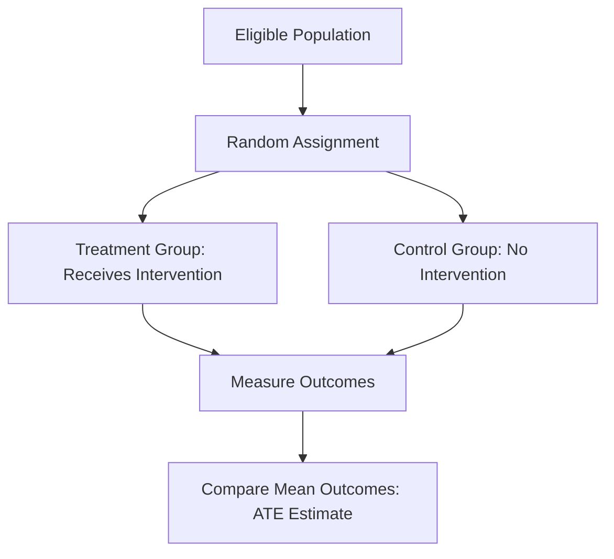
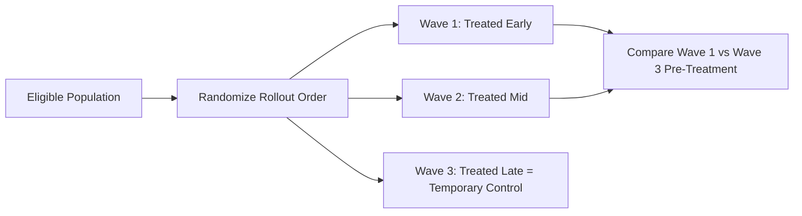

## Experimental and Quasi-Experimental Methods

### Overview

Experimental and quasi-experimental methods provide the toolkit for identifying causal effects in agricultural economics research — for example, the impact of a new seed variety, an extension program, a subsidy, or a market intervention on farm outcomes such as yield, income, or adoption behavior. These methods address the central identification problem in observational data: distinguishing causal effects from mere correlation when treatment assignment (e.g., program participation) is not random.

### The Fundamental Identification Problem

The core causal inference challenge is estimating the counterfactual — what would have happened to treated units absent treatment. For unit $i$, the individual treatment effect is:

$$\tau_i = Y_i(1) - Y_i(0)$$

where $Y_i(1)$ and $Y_i(0)$ are potential outcomes under treatment and control, respectively. Since only one potential outcome is ever observed for each unit, researchers estimate an **average treatment effect (ATE)**:

$$ATE = E[Y_i(1) - Y_i(0)]$$

Naive comparison of treated and untreated group means is biased whenever treatment assignment is correlated with factors that also affect outcomes — **selection bias** — which is pervasive in agricultural settings (e.g., more capable or wealthier farmers may self-select into extension programs).

### Randomized Controlled Trials (RCTs)

**Key Points**

- **Random assignment** of the intervention (e.g., input subsidy, training program, information campaign) ensures treatment and control groups are, in expectation, identical on all observed and unobserved characteristics, eliminating selection bias by design.
- The **average treatment effect** is then simply the difference in mean outcomes between randomized groups:

$$\hat{\tau} = \bar{Y}_{treatment} - \bar{Y}_{control}$$

- **Randomization levels** in agricultural RCTs vary: individual-level (farmer or plot), household-level, or cluster-level (village, cooperative) randomization, with cluster randomization common where spillovers between nearby units are a concern.

**Common Agricultural RCT Applications**

- Input subsidy programs (fertilizer, improved seed) and their effect on adoption and yield.
- Agricultural extension and training delivery mechanisms (e.g., comparing in-person vs. mobile-phone-based extension).
- Index insurance uptake experiments.
- Information and behavioral nudges affecting technology adoption.

**Limitations**

- **External validity concerns** — results from a specific RCT context (region, crop, timeframe) may not generalize to other agroecological or institutional settings. $[Inference]$ The extent of this generalizability gap is context-specific and is an active area of methodological debate in development and agricultural economics, without a settled resolution.
- **Spillover/contamination effects** — control group members may benefit indirectly from treatment (e.g., learning about a new technique from treated neighbors), biasing the estimated effect toward zero unless the experimental design explicitly accounts for spillovers (e.g., through randomization at a sufficiently separated cluster level).
- **Ethical and logistical constraints** — withholding a potentially beneficial intervention from a control group raises ethical considerations, often addressed through phased rollout designs (see below).
- **Hawthorne and Bias from Being Observed** — behavior may change simply due to awareness of being studied, a general concern in field experimentation.

### Quasi-Experimental Methods

When randomization is infeasible, ethically problematic, or the researcher is working with existing observational data, quasi-experimental methods attempt to approximate experimental identification conditions.

**1. Difference-in-Differences (DiD)**

Compares the change in outcomes over time between a treated group and a comparison group, controlling for time-invariant unobserved confounders and common time trends:

$$Y_{it} = \alpha + \beta \, \text{Treat}_i + \gamma \, \text{Post}_t + \delta \, (\text{Treat}_i \times \text{Post}_t) + \varepsilon_{it}$$

where $\delta$ is the DiD estimator of the treatment effect. The key identifying assumption is the **parallel trends assumption**: absent treatment, treated and control groups would have followed the same outcome trajectory. This is commonly tested (though not proven) via pre-treatment trend comparisons.

**Example**

Evaluating the effect of a new irrigation infrastructure investment on crop yields by comparing yield changes (before vs. after construction) in villages that received irrigation versus similar villages that did not, attributing the differential change to the irrigation intervention.

**2. Instrumental Variables (IV)**

Used when treatment is endogenous (correlated with the error term due to selection or reverse causality). An instrument $Z$ must satisfy **relevance** (correlated with treatment $T$) and the **exclusion restriction** (affects outcome $Y$ only through $T$, not directly).

$$T_i = \pi_0 + \pi_1 Z_i + v_i \quad \text{(first stage)}$$

$$Y_i = \beta_0 + \beta_1 \hat{T}_i + u_i \quad \text{(second stage)}$$

**Example**

Rainfall shocks are commonly used as instruments for agricultural income or migration decisions in IV designs, under the assumption that rainfall affects household outcomes only through its effect on agricultural production (an exclusion restriction that requires careful justification, since rainfall could also directly affect health or other unobserved pathways). $[Inference]$ The validity of the exclusion restriction is generally not directly testable and rests on domain-specific argumentation, which is why IV results in agricultural economics are often accompanied by robustness checks and alternative instrument specifications rather than treated as definitively validated.

**3. Regression Discontinuity Design (RDD)**

Exploits a sharp, known threshold or cutoff rule in program assignment (e.g., a subsidy eligibility threshold based on farm size or a poverty score) to compare outcomes for units just above and just below the cutoff, which are assumed comparable in expectation absent the discontinuity:

$$Y_i = \alpha + \tau \, D_i + f(X_i - c) + \varepsilon_i$$

where $D_i = 1$ if the running variable $X_i$ exceeds cutoff $c$, and $f(\cdot)$ is a flexible function of the distance from the cutoff. **Sharp RDD** applies when the cutoff perfectly determines treatment; **fuzzy RDD** applies when the cutoff only probabilistically influences treatment (requiring an IV-style local average treatment effect interpretation).

**Example**

Evaluating an agricultural credit program with an eligibility cutoff based on a land-holding threshold, comparing outcomes for farmers just above and just below the threshold.

**4. Propensity Score Matching (PSM)**

Constructs a comparison group by matching treated units to untreated units with similar observed characteristics (summarized in a single propensity score, the estimated probability of treatment given covariates):

$$p(X_i) = \Pr(T_i = 1 \mid X_i)$$

Matching methods include nearest-neighbor matching, kernel matching, and stratification matching. **Critically, PSM only controls for observed confounders** — it cannot address selection on unobservables, a key limitation relative to RCTs, IV, or RDD.

**5. Panel/Fixed Effects Methods**

When repeated observations on the same units over time are available, fixed-effects models control for all time-invariant unobserved heterogeneity (e.g., innate farmer ability, soil quality) by differencing it out:

$$Y_{it} = \alpha_i + \beta X_{it} + \varepsilon_{it}$$

where $\alpha_i$ is the unit-specific fixed effect. This does not address time-varying unobserved confounders, which remains a limitation relative to randomized designs.

### Comparison of Method Assumptions and Applicability

| Method | Key Identifying Assumption | Best Suited When |
| --- | --- | --- |
| RCT | Random assignment | Feasible to design a prospective intervention with a control group |
| Difference-in-Differences | Parallel trends | Panel/repeated cross-section data with a clear treatment timing |
| Instrumental Variables | Relevance + exclusion restriction | A credible instrument exists that is plausibly exogenous |
| Regression Discontinuity | Continuity of potential outcomes at cutoff | A known, sharp eligibility or assignment threshold exists |
| Propensity Score Matching | Selection on observables (conditional independence) | Rich covariate data available, but no valid instrument or discontinuity |
| Fixed Effects (panel) | No time-varying unobserved confounders | Panel data available; confounders are largely time-invariant |

### Phased/Staggered Rollout Designs

A design compromise addressing ethical concerns about withholding beneficial interventions: all eligible units eventually receive treatment, but the **order/timing** of rollout is randomized, allowing early-treated units to serve as a temporary control group for later-treated units. This generates a staggered-adoption panel structure, increasingly analyzed using modern DiD estimators designed to address bias in traditional two-way fixed-effects models under staggered treatment timing. $[Inference]$ This area of econometric methodology (staggered DiD estimators such as those addressing negative-weighting problems in traditional two-way fixed effects) has seen substantial recent methodological development, and best-practice estimator choice may continue to evolve, so researchers should verify current recommended approaches at the time of analysis rather than relying on older default specifications.

### Threats to Validity Across Methods

**Key Points**

1. **Internal validity threats** — attrition, non-compliance (treatment group members not actually receiving/adopting the intervention), spillovers, and measurement error.
2. **External validity threats** — site-specific results, general equilibrium effects at scale not captured in small pilot experiments (e.g., a subsidy that raises prices when scaled up nationally, unlike in a small experimental sample).
3. **Intention-to-treat (ITT) vs. treatment-on-the-treated (TOT) estimates** — ITT estimates the effect of being offered/assigned treatment (preserving randomization's unbiasedness), while TOT (often estimated via IV using assignment as an instrument for actual uptake) estimates the effect among those who actually complied, addressing imperfect compliance common in field-based agricultural interventions.

### Related Topics

- Potential outcomes framework and the Rubin Causal Model
- Staggered adoption difference-in-differences estimators
- Spillover and general equilibrium effects in scaled agricultural interventions
- Instrument validity and exclusion restriction justification
- Regression discontinuity design: bandwidth selection and manipulation testing
- Propensity score matching diagnostics and covariate balance testing
- Intention-to-treat vs. treatment-on-the-treated estimation
- Power calculations and minimum detectable effect sizes for field experiments
- External validity and scaling of pilot agricultural interventions
- Panel data econometrics and fixed vs. random effects model selection