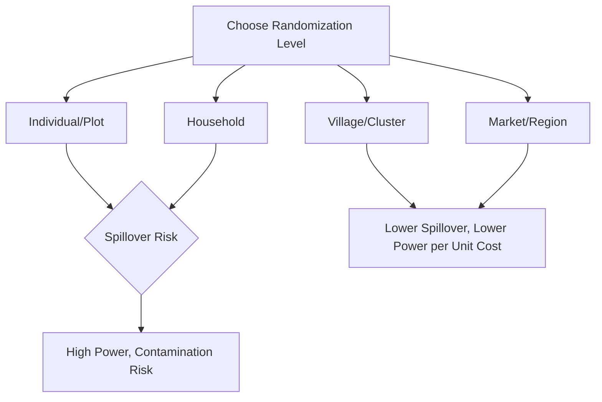

## Randomized Controlled Trials in Agricultural Economics

### Overview

Randomized controlled trials (RCTs) in agricultural economics apply experimental random assignment to evaluate the causal impact of interventions on farm households, plots, and rural markets — including input subsidies, extension services, credit and insurance products, and information campaigns. RCTs have become a dominant methodology in development and agricultural economics since the early 2000s, prized for their ability to eliminate selection bias through design rather than relying on statistical controls for observed confounders alone.

### Core Design Logic

By randomly assigning the intervention across eligible units, treatment and control groups are, in expectation, balanced on both observed and unobserved characteristics. This allows a simple comparison of mean outcomes to yield an unbiased estimate of the **average treatment effect (ATE)**:

$$\hat{\tau}_{ATE} = \bar{Y}_{T} - \bar{Y}_{C}$$

More generally, this is estimated via regression to improve precision and allow covariate adjustment:

$$Y_i = \alpha + \tau \, T_i + X_i'\beta + \varepsilon_i$$

where $T_i$ is the randomized treatment indicator and $X_i$ are baseline covariates included to reduce residual variance (not to address bias, since randomization already ensures $T_i \perp X_i$ in expectation).

### Levels of Randomization

**Key Points**

- **Individual/plot-level randomization** — the finest-grained level, offering maximum statistical power per unit cost but highest risk of spillover contamination between treated and control units in close proximity (e.g., a treated farmer's neighbor observing and adopting the technique).
- **Household-level randomization** — common when the intervention (e.g., a subsidy voucher) is naturally allocated at the household level.
- **Village/community-level (cluster) randomization** — reduces spillover contamination by physically separating treatment and control groups, at the cost of reduced statistical power due to intra-cluster correlation, requiring larger total sample sizes to achieve equivalent precision.
- **Market/region-level randomization** — used for interventions with inherent market-wide effects (e.g., price information campaigns, market infrastructure), where spillovers are unavoidable at finer levels.

### Common Application Domains

**Key Points**

1. **Input subsidy and adoption experiments** — randomized fertilizer or improved seed voucher distribution to estimate adoption elasticities and productivity impacts, often combined with randomized variation in subsidy timing (e.g., testing whether offering subsidies at harvest time, when farmers have cash on hand, increases uptake relative to planting-season offers).
2. **Agricultural extension and information delivery** — comparing traditional in-person extension agents against alternative delivery channels (mobile phone-based advisory services, farmer field days, video-based training) for effects on knowledge retention and practice adoption.
3. **Index insurance experiments** — randomized offers of weather-index or area-yield index insurance products to study take-up determinants (price sensitivity, trust, liquidity constraints) and downstream effects on input investment and risk-taking behavior.
4. **Credit and savings interventions** — randomized access to agricultural credit products or commitment savings accounts, testing effects on input purchase timing and investment levels.
5. **Market information and price transparency interventions** — randomized provision of market price information (e.g., via SMS) to study effects on farmer bargaining position and sale timing decisions.
6. **Behavioral nudges** — randomized messaging or reminder interventions (e.g., planting reminders, input-use timing nudges) evaluated against standard behavioral economics frameworks.

### Design Considerations Specific to Agricultural RCTs

**1. Seasonality Alignment**

Agricultural interventions must be timed to the crop calendar — a subsidy or training intervention delivered after the optimal planting window has passed is confounded by implementation timing rather than the treatment's inherent effect. Baseline and endline surveys are typically scheduled around key agricultural stages (planting, mid-season, harvest).

**2. Spillover and General Equilibrium Effects**

Because agricultural markets are local and often thin, a sufficiently large-scale intervention can shift local prices (e.g., a large fertilizer subsidy program raising local fertilizer demand and price), violating the **Stable Unit Treatment Value Assumption (SUTVA)** that one unit's treatment status does not affect another unit's potential outcomes. $[Inference]$ Detecting and correcting for such general equilibrium effects typically requires randomization at a higher level (e.g., market-level rather than farmer-level) or explicit modeling of price feedback, and the appropriate remedy is context-dependent rather than a single standard fix.

**3. Compliance and the Intention-to-Treat Framework**

Agricultural RCTs frequently experience imperfect compliance — farmers offered a subsidy voucher may not redeem it, or those assigned to training may not attend. Researchers typically report both:

- **Intention-to-Treat (ITT)** — the effect of being offered/assigned to treatment, regardless of actual uptake, preserving the unbiasedness of random assignment.
- **Treatment-on-the-Treated (TOT/LATE)** — the effect among actual compliers, typically estimated via instrumental variables using random assignment as an instrument for actual treatment receipt:

$$TOT = \frac{ITT}{\text{Compliance Rate}}$$

**4. Attrition**

Rural agricultural panels face attrition from migration, crop failure leading to farm exit, or household dissolution; differential attrition between treatment and control arms (e.g., if a failed input subsidy causes disproportionate farm exit in the treatment group) can reintroduce selection bias even in a well-randomized design, requiring attrition bounds analysis (e.g., Lee bounds) as a robustness check.

### Statistical Power and Sample Size Planning

Minimum Detectable Effect (MDE) calculations are central to agricultural RCT design given typically high variance in agricultural outcomes (yields, income) and the need to budget cluster-level randomization costs:

$$MDE = (t_{1-\kappa} + t_{\alpha/2}) \times \sqrt{\frac{2\sigma^2 (1 + (\bar{m}-1)\rho)}{N}}$$

where $\kappa$ is desired statistical power, $\alpha$ is significance level, $\sigma^2$ is outcome variance, $\bar{m}$ is average cluster size, $\rho$ is the intra-cluster correlation coefficient, and $N$ is total sample size. Agricultural outcome variables (especially yield and income) often exhibit high year-to-year and plot-to-plot variance, meaning agricultural RCTs frequently require larger sample sizes than comparable interventions in more stable outcome domains to detect policy-relevant effect sizes.

### Ethical and Practical Considerations

**Key Points**

- **Equipoise and withholding beneficial interventions** — justified when the intervention's effectiveness is genuinely uncertain ex ante (the standard ethical justification for RCTs), and increasingly addressed via phased/staggered rollout designs that eventually extend treatment to all eligible units.
- **Informed consent in low-literacy contexts** — requires careful adaptation of consent procedures (oral consent protocols, local language materials) common in rural agricultural research settings.
- **Community and local authority engagement** — particularly important in agricultural field experiments where interventions occur within visible community/village structures, requiring buy-in beyond individual respondent consent to maintain research legitimacy and minimize spillover-driven resentment between treatment and control groups.
- **Cost and logistics** — agricultural field RCTs typically require sustained multi-season fieldwork teams, cold-chain or input logistics (for input-based interventions), and coordination with local agricultural extension systems, substantially raising implementation costs relative to lab or survey-only experiments.

### Example: Fertilizer Subsidy Timing Experiment

**Example**

A canonical study design in this literature randomizes the **timing** of small, time-limited fertilizer discount offers — some farmers receive the discount offer immediately after harvest (when they have cash from crop sales), others at the start of the planting season (when cash is typically scarcer due to the agricultural cash-flow cycle). This design isolates the effect of a **present-bias/liquidity-constraint mechanism** on input adoption, distinct from simply varying subsidy size, illustrating how RCT design in agricultural economics is frequently used to test specific behavioral or structural mechanisms rather than simply estimating a program's overall effect.

### Reporting and Replication Standards

**Key Points**

- **Pre-registration** of study hypotheses and analysis plans (e.g., via the AEA RCT Registry) has become an increasingly common practice to reduce specification-search concerns and improve credibility.
- **Pre-analysis plans (PAPs)** specify primary outcomes, subgroup analyses, and estimation approaches in advance of endline data collection.
- **Balance tables** reporting baseline covariate means across treatment and control arms are standard practice to verify successful randomization.
- **CONSORT-style flow diagrams** documenting sample attrition from initial eligibility through final analysis sample are increasingly expected in published agricultural RCT studies.

### Related Topics

- Minimum detectable effect and power calculations for clustered designs
- Spillover effects and SUTVA violations in agricultural field experiments
- Intention-to-treat vs. treatment-on-the-treated estimation
- Attrition bounds analysis (Lee bounds) in panel field experiments
- Pre-registration and pre-analysis plans in applied microeconomics
- Index insurance take-up experiments
- Agricultural extension delivery channel comparisons
- General equilibrium effects of scaled agricultural interventions
- Behavioral economics mechanisms in technology adoption experiments
- Staggered/phased rollout designs and ethical equipoise