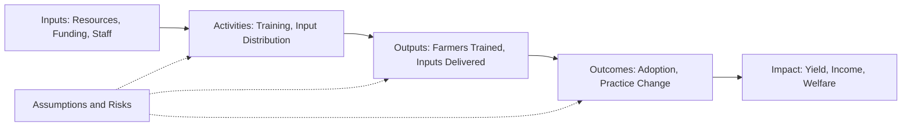
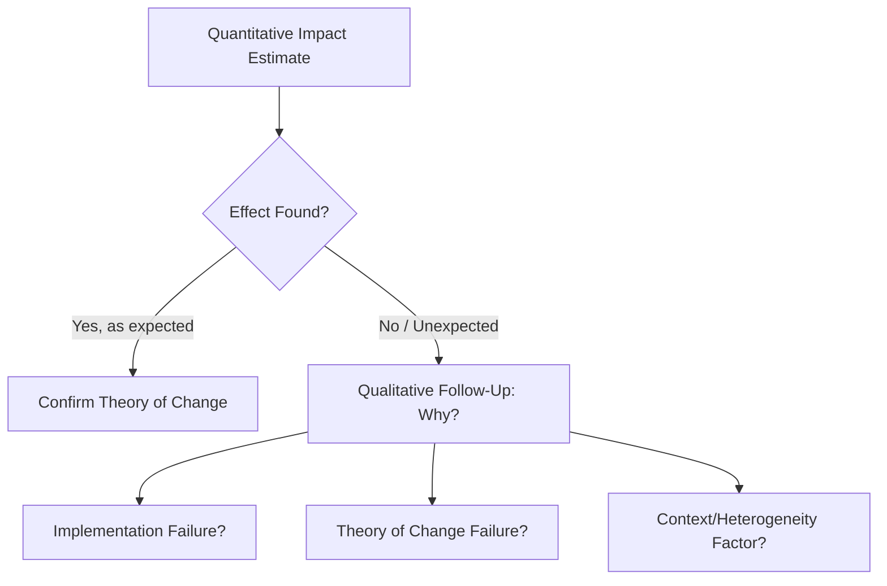
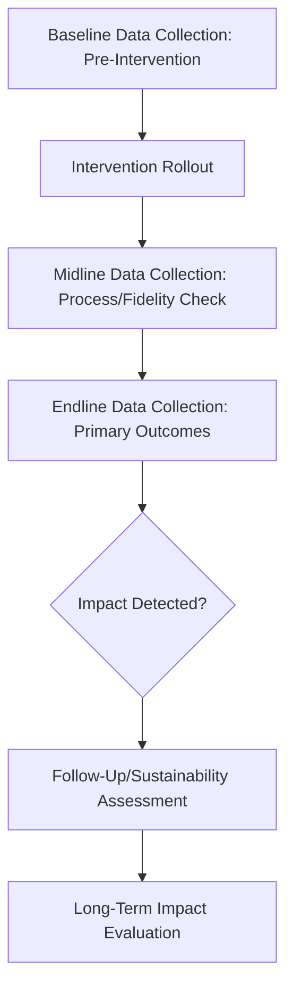

## Impact Evaluation Techniques

### Overview

Impact evaluation techniques comprise the broader methodological toolkit used in agricultural economics to systematically assess the causal effects of programs, policies, and interventions on target outcomes — extending beyond experimental and quasi-experimental identification strategies (covered separately) to include the full evaluation lifecycle: theory of change specification, indicator selection, mixed-methods integration, cost-effectiveness analysis, and evaluation synthesis. Impact evaluation is distinguished from simple monitoring by its explicit focus on establishing causal attribution rather than merely tracking outputs or activities.

### Impact Evaluation vs. Monitoring: A Conceptual Distinction

**Key Points**

- **Monitoring** tracks whether program activities are being implemented as planned (outputs, activities, immediate deliverables) — e.g., number of farmers trained, quantity of subsidized inputs distributed.
- **Impact evaluation** assesses whether the program caused a change in longer-term outcomes (yield, income, food security, welfare) relative to a credible counterfactual — the central causal attribution question.
- A program can be perfectly monitored (all activities delivered as planned) yet show no measurable impact if the underlying theory of change was flawed or offset by external factors.

### The Theory of Change Framework

Before selecting an evaluation design, impact evaluation practice typically requires articulating an explicit **theory of change** (or logical framework/logframe) linking inputs to outputs to outcomes to impact:

This framework guides indicator selection at each level and clarifies which causal links the evaluation design must actually test, versus which are assumed based on prior evidence.

### Core Quantitative Impact Evaluation Designs

The primary causal identification methods (detailed separately under experimental and quasi-experimental methods) form the technical core of impact evaluation:

| Design | Core Logic | Typical Agricultural Application |
| --- | --- | --- |
| Randomized Controlled Trial | Random assignment eliminates selection bias | Input subsidy trials, extension delivery comparisons |
| Difference-in-Differences | Compares outcome change over time, treated vs. comparison | Infrastructure investment evaluation (irrigation, roads) |
| Regression Discontinuity | Compares units near an eligibility cutoff | Means-tested subsidy or credit program evaluation |
| Instrumental Variables | Uses exogenous variation to isolate causal effect | Rainfall-instrumented income/migration studies |
| Propensity Score Matching | Matches on observed characteristics | Evaluating existing (non-randomized) programs retrospectively |

### Indicator Selection and Measurement

**Key Points**

1. **Output indicators** — directly attributable to program activities (e.g., number of extension visits conducted).
2. **Outcome indicators** — intermediate behavioral or practice changes (e.g., adoption rate of a recommended practice).
3. **Impact indicators** — final welfare-relevant measures (e.g., household income, caloric intake, asset accumulation, poverty headcount).
4. **Unintended outcome indicators** — evaluation designs increasingly build in measurement of plausible negative or unintended effects (e.g., a labor-saving technology's effect on landless laborer employment, or an irrigation project's effect on water table depletion).

Selecting indicators that are **sensitive to change within the evaluation timeframe** is a persistent challenge in agricultural impact evaluation — for instance, soil health or long-term productivity improvements from a conservation agriculture program may not manifest measurably within a typical 2–3 year evaluation window, requiring either longer evaluation horizons or validated proxy indicators.

### Cost-Effectiveness and Cost-Benefit Analysis

Impact evaluation is frequently paired with economic analysis to assess value for money, distinguishing:

**Cost-Effectiveness Analysis (CEA)** — compares cost per unit of outcome achieved across interventions with a common outcome metric:

$$CE = \frac{\text{Total Program Cost}}{\text{Total Units of Outcome Achieved}}$$

**Cost-Benefit Analysis (CBA)** — monetizes all outcomes to compute net present value or benefit-cost ratio, enabling comparison across interventions with different outcome types:

$$NPV = \sum_{t=0}^{T} \frac{B_t - C_t}{(1+r)^t}$$

where $B_t$ and $C_t$ are benefits and costs in period $t$, and $r$ is the discount rate. $[Inference]$ Monetizing agricultural and welfare outcomes (e.g., assigning a monetary value to improved food security or reduced child labor) involves significant methodological judgment and assumption-dependent valuation, so CBA results in this domain are generally more sensitive to underlying assumptions than CEA results using a single, directly observed outcome metric.

### Mixed-Methods Integration

**Key Points**

- **Qualitative complementary research** (key informant interviews, focus group discussions, case studies) is commonly integrated alongside quantitative impact evaluation to explain **mechanisms** — why an intervention worked or failed — which quantitative estimation alone cannot fully reveal.
- **Process evaluation** — assesses fidelity of implementation (was the program delivered as designed?), helping distinguish a genuinely ineffective intervention (theory failure) from a poorly implemented one (implementation failure).
- **Sequential explanatory design** — quantitative impact results are followed by targeted qualitative inquiry into unexpected or heterogeneous findings (e.g., investigating via interviews why a subsidy program showed strong effects in one region but null effects in another).

### Heterogeneous Treatment Effects Analysis

Beyond estimating a single average treatment effect, impact evaluations increasingly examine **treatment effect heterogeneity** — whether impacts differ systematically across subgroups (farm size, gender of household head, agroecological zone, baseline wealth):

$$Y_i = \alpha + \tau T_i + \phi (T_i \times X_i) + \beta X_i + \varepsilon_i$$

where $\phi$ captures how the treatment effect varies with characteristic $X_i$. This is critical for agricultural policy design, since a program's average null effect can mask meaningfully positive effects for a specific subgroup (e.g., a credit program that benefits only farmers above a minimum land-holding threshold able to provide collateral).

$[Inference]$ Subgroup analyses not specified in a pre-analysis plan carry elevated risk of false positive findings due to multiple hypothesis testing, so heterogeneity results not pre-registered are generally treated as exploratory rather than confirmatory in the applied literature.

### External Validity and Evidence Synthesis

**Key Points**

- **Systematic reviews and meta-analyses** aggregate impact estimates across multiple studies/contexts to assess the robustness and generalizability of an intervention type's effect (e.g., meta-analyses of fertilizer subsidy program impacts across multiple countries).
- **Evidence gap maps** — visual tools mapping existing impact evaluation evidence against intervention-outcome combinations, used by policymakers and researchers to identify well-evidenced versus under-researched intervention types.
- **Scaling considerations** — pilot-scale impact evaluation results may not hold at national program scale due to general equilibrium effects (e.g., price effects, administrative capacity constraints, targeting errors at scale), a persistent concern connecting impact evaluation to policy translation.

### Evaluation Timing and Design Sequencing

**Example**

An impact evaluation of a farmer field school program on sustainable land management practices might include a baseline survey (pre-training), a midline visit during the growing season to verify practice adoption (process evaluation), an endline survey at harvest to measure yield and income outcomes, and a follow-up survey 2–3 years later to assess whether practice adoption and associated impacts persisted after program support ended — addressing the common concern that many agricultural interventions show effects only while active support/incentives continue.

### Common Threats to Valid Impact Evaluation

**Key Points**

1. **Contamination/spillovers** — control group members indirectly affected by treatment, biasing impact estimates toward zero.
2. **Selective attrition** — differential dropout between treatment and comparison groups reintroducing selection bias.
3. **Anticipation effects** — behavior changes in advance of treatment due to awareness of upcoming program rollout.
4. **Publication and confirmation bias** — evaluations showing positive/expected results may be more likely to be published or emphasized, distorting the accumulated evidence base; pre-registration is a partial mitigation.
5. **Attribution vs. contribution ambiguity** in multi-actor interventions where several programs/actors operate in the same area simultaneously, complicating clean attribution to any single intervention.

### Related Topics

- Theory of change and logical framework (logframe) design
- Cost-effectiveness vs. cost-benefit analysis methodology
- Heterogeneous treatment effects and subgroup analysis
- Mixed-methods and sequential explanatory research designs
- Systematic reviews and meta-analysis in development economics
- Process evaluation and implementation fidelity assessment
- Scaling pilot interventions to national program level
- Evidence gap maps and evidence synthesis tools
- Sustainability and long-term follow-up evaluation design
- Pre-registration and multiple hypothesis testing corrections