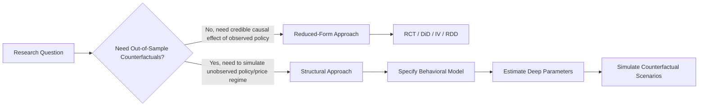
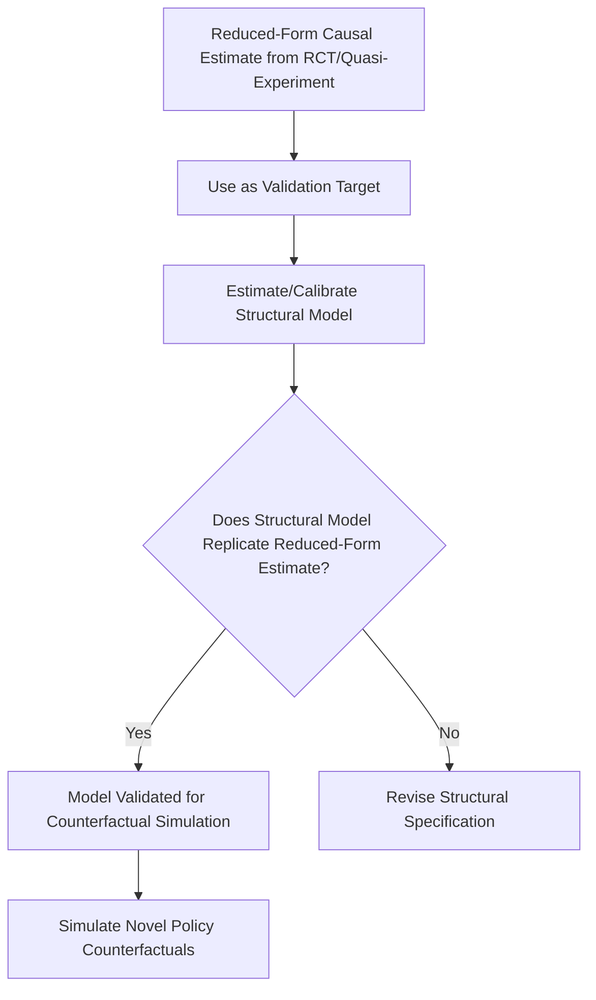

## Structural and Reduced-Form Modeling Approaches

### Overview

Structural and reduced-form modeling represent two distinct methodological philosophies for empirical analysis in agricultural economics. Reduced-form approaches estimate statistical relationships between variables with minimal explicit theoretical restrictions, prioritizing credible causal identification. Structural approaches specify and estimate an explicit economic model (utility functions, production functions, optimization behavior) derived from theory, enabling counterfactual policy simulation beyond the range of observed data. The choice between them reflects a fundamental trade-off between credibility of identification and richness of the questions that can be answered.

### Defining the Distinction

**Key Points**

- **Reduced-form models** estimate the statistical association between a treatment/policy variable and an outcome, typically without fully specifying the underlying behavioral mechanism generating that relationship — the methods covered under experimental and quasi-experimental techniques (RCTs, DiD, IV, RDD) are canonical reduced-form approaches.
- **Structural models** specify the underlying economic behavior explicitly (e.g., a farm household's utility-maximizing choice of labor allocation, or a firm's profit-maximizing input demand derived from an assumed production function), then estimate the deep parameters of that model (preference or technology parameters) using observed data.
- Structural models allow **out-of-sample counterfactual simulation** — asking "what would happen under a policy or price regime never observed in the data" — which reduced-form models generally cannot answer without extrapolation beyond their estimated relationship.

### The Reduced-Form Approach in Detail

Reduced-form estimation typically takes the general form:

$$Y_i = \alpha + \beta X_i + \varepsilon_i$$

where $\beta$ is interpreted as a causal effect only under credible identifying assumptions (randomization, parallel trends, instrument validity, or discontinuity continuity — as detailed under experimental and quasi-experimental methods). The strength of this approach lies in **transparency and credibility**: the identifying assumptions are typically explicit, testable to some degree, and don't require the researcher to correctly specify an entire behavioral model.

**Limitations**

- Cannot generally predict outcomes under policy scenarios substantially different from those observed in the estimation sample (e.g., a DiD estimate of a moderate fertilizer subsidy's effect cannot reliably predict the effect of a much larger subsidy, since behavioral responses may be nonlinear).
- Provides limited insight into the **mechanism** connecting policy to outcome — a reduced-form estimate tells researchers *that* an effect exists, not always precisely *why*.

### The Structural Approach in Detail

Structural estimation begins from an explicit theoretical model of optimizing behavior. For example, a structural model of farm household labor supply (building on the agricultural household model) might specify a utility function:

$$U(C, T_l; \theta) = \frac{C^{1-\sigma}}{1-\sigma} + \gamma \frac{T_l^{1-\eta}}{1-\eta}$$

where $\theta = (\sigma, \eta, \gamma)$ are structural preference parameters to be estimated, $C$ is consumption, and $T_l$ is leisure. Given data on household choices (labor allocation, consumption) and constraints (wages, prices, farm technology), the structural parameters are recovered by finding the values of $\theta$ that best rationalize observed behavior as optimal, typically via:

- **Maximum likelihood estimation (MLE)** — assuming a distributional form for unobserved heterogeneity/error terms and maximizing the likelihood of observed choices.
- **Generalized Method of Moments (GMM)** — matching model-implied moments (e.g., mean labor supply, elasticity) to their empirical counterparts.
- **Simulated Method of Moments (SMM)** — used when the model's likelihood is analytically intractable, simulating model outcomes under candidate parameter values and matching simulated to observed moments.

Once estimated, the structural parameters $\hat{\theta}$ can be used to **simulate counterfactual policy scenarios** — e.g., predicting labor allocation responses to a wage subsidy of a magnitude never observed in the historical data, by solving the household's optimization problem under the new hypothetical constraint set.

### Comparative Trade-offs

| Dimension | Reduced-Form | Structural |
| --- | --- | --- |
| Identification transparency | High; assumptions explicit and often partially testable | Lower; relies on correct model specification, which is generally not directly testable |
| Counterfactual/out-of-sample simulation | Limited; extrapolation risky | Central strength; can simulate unobserved policy regimes |
| Mechanism/interpretation | Often limited to "black box" causal effect | Explicit behavioral interpretation (preference/technology parameters) |
| Robustness to misspecification | Generally more robust to misspecification of unmodeled mechanisms | Vulnerable to functional form and distributional assumption errors |
| Data requirements | Often lighter; a valid identification strategy plus outcome/treatment data | Often heavier; requires data on prices, constraints, and choice variables consistent with the specified model |
| Typical use case | Program/policy impact evaluation | Ex-ante policy design, welfare analysis, counterfactual simulation |

### Structural Modeling Applications in Agricultural Economics

**Key Points**

1. **Production function and technology estimation** — structural estimation of production functions (addressing simultaneity bias between input choice and unobserved productivity, using approaches such as the Olley-Pakes or Levinsohn-Petrin control function methods) to recover technology parameters used in efficiency and productivity analysis.
2. **Discrete choice models of technology adoption** — structural models of farmers' adoption decisions (e.g., a random utility model of choosing among seed varieties) allowing simulation of adoption response to counterfactual price or subsidy changes.
3. **Dynamic structural models** — modeling farmers' intertemporal decisions (e.g., land use change, investment in perennial crops, migration) as dynamic optimization problems, estimated via dynamic programming methods, enabling simulation of long-run responses to policy changes.
4. **General/partial equilibrium agricultural sector models** — structural models of supply, demand, and price determination across an entire commodity market or agricultural sector, used for trade policy and price support simulation (distinct from micro-level household structural models but sharing the same theory-first estimation philosophy).
5. **Structural demand estimation** — recovering consumer preference parameters (e.g., using Almost Ideal Demand System or discrete choice demand models) to simulate counterfactual welfare effects of food price changes or policy interventions.

### The "Credibility Revolution" Debate

**Key Points**

- Agricultural and applied microeconomics broadly experienced a methodological shift (often termed the **"credibility revolution"**) toward reduced-form, quasi-experimental methods beginning in the 1990s–2000s, motivated by concerns that structural models' policy conclusions were highly sensitive to often-untestable functional form and distributional assumptions.
- Proponents of structural methods counter that reduced-form estimates, while more credible for the specific policy studied, offer limited external validity for **different** policy designs, and that many important agricultural policy questions (e.g., simulating an entirely new subsidy scheme) cannot be answered without a structural framework.
- Contemporary applied agricultural economics research frequently combines both approaches: using reduced-form, quasi-experimental estimates as **validation targets** that a structural model must be able to replicate, thereby disciplining the structural model's parameter estimates with credible causal benchmarks — an approach sometimes termed **"structural estimation with reduced-form validation"** or informally as the "sufficient statistics" approach in some public economics-adjacent applications.

### Example: Fertilizer Subsidy Policy Analysis

**Example**

A reduced-form RCT might credibly estimate that a 50% fertilizer discount voucher increased adoption by a specific percentage among the sampled farmers — a credible but narrowly scoped causal estimate. A complementary structural model of farmer input demand (e.g., derived from a profit-maximizing production function with credit constraints) could be calibrated so its predicted response to the same 50% discount matches this RCT-estimated adoption increase (validation), and then used to simulate the effect of an entirely different, untested policy — such as a 25% discount combined with delayed payment terms — a counterfactual scenario the RCT alone cannot directly speak to.

### Estimation Challenges in Structural Models

**Key Points**

1. **Identification of structural parameters** often requires strong functional form assumptions (e.g., specific utility or production function forms) or exclusion restrictions analogous to instrumental variables, and misspecification can bias all downstream counterfactual simulations.
2. **Computational complexity** — dynamic structural models, particularly those involving discrete choice over multiple periods, often require numerically intensive dynamic programming or nested fixed-point estimation algorithms.
3. **Data-intensive requirements** — structural models typically require detailed data on prices, constraints, and the full choice set faced by decision-makers, which may exceed what is available in standard household survey data (connecting to the survey design challenges discussed under agricultural survey methodology).

$[Inference]$ There is no consensus in the applied agricultural economics literature that one approach is universally superior; the appropriate choice depends on whether the research question requires credible identification of an observed policy's effect (favoring reduced-form) or simulation of a hypothetical, unobserved policy scenario (favoring structural), and many contemporary studies blend both approaches as described above rather than treating them as mutually exclusive paradigms.

### Related Topics

- Dynamic programming and discrete choice structural estimation
- Production function estimation and simultaneity bias (Olley-Pakes, Levinsohn-Petrin methods)
- Discrete choice models of agricultural technology adoption
- Partial and general equilibrium agricultural sector modeling
- Almost Ideal Demand System and structural demand estimation
- The credibility revolution in applied microeconomics
- Simulated Method of Moments and Generalized Method of Moments estimation
- Structural model validation using quasi-experimental benchmarks
- Counterfactual policy simulation methodology
- Agricultural household model theoretical foundations