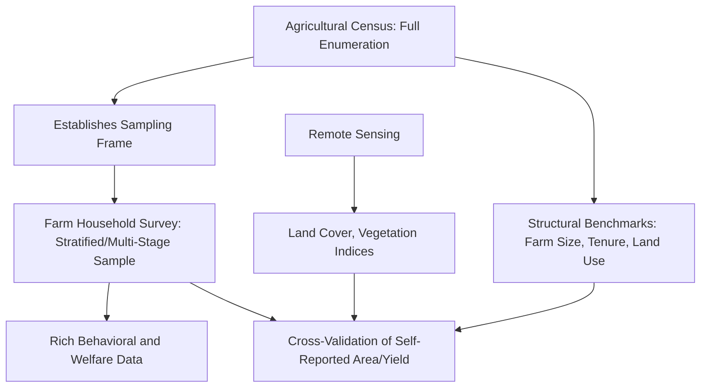

## Data Sources: Farm Surveys, Census, and Remote Sensing

### Overview

Agricultural economics research draws on three principal categories of primary and secondary data: farm-level household/enterprise surveys, agricultural censuses, and remote sensing/geospatial data. Each source carries distinct trade-offs in coverage, granularity, cost, timeliness, and the range of variables observable, and rigorous empirical work frequently combines multiple sources to compensate for individual limitations.

### Farm Household and Enterprise Surveys

Farm surveys (detailed methodologically under survey design and data collection) are the primary source of micro-level behavioral, input-use, and welfare data unavailable from administrative or remote sources.

**Key Points**

- **Cross-sectional surveys** — single-point-in-time data collection, useful for descriptive analysis and matching-based impact evaluation but unable to control for time-invariant unobserved heterogeneity.
- **Panel/longitudinal surveys** — repeated observation of the same units over time (e.g., LSMS-ISA, national panel household surveys), enabling fixed-effects estimation and dynamic analysis of transitions (e.g., poverty entry/exit, technology adoption persistence).
- **Specialized thematic surveys** — targeted instruments for specific research questions (e.g., dedicated labor-time-use diaries, willingness-to-pay experiments, market chain surveys).

**Strengths**: rich behavioral detail (input use, labor allocation, decision-making, informal transactions); ability to capture variables invisible to remote or administrative sources (intra-household dynamics, credit access, risk perceptions).

**Limitations**: high cost per observation, limited geographic/temporal coverage relative to census or remote sensing, subject to recall bias and measurement error (as discussed under survey methodology), and typically infrequent (annual at most, often less).

### Agricultural Census

**Key Points**

- **Full enumeration** (in principle) of all agricultural holdings within a country or region, conducted periodically (commonly every 5–10 years, following FAO's World Programme for the Census of Agriculture guidance, though intervals vary substantially by country in practice).
- Provides the **sampling frame** for subsequent farm household surveys, making census quality foundational to survey representativeness.
- Captures core structural variables at near-universal coverage: land area under cultivation, farm size distribution, livestock holdings, basic input use, and tenure status — but typically with far less behavioral and welfare depth than dedicated household surveys due to the abbreviated questionnaire required for full enumeration feasibility.
- **Agricultural census vs. population census** — distinct instruments; agricultural censuses focus on holdings/farm units (which may not map one-to-one onto households, particularly where farms are corporate, communal, or operated by multiple households), while population censuses focus on demographic counts and characteristics.

**Uses in Agricultural Economics Research**

- Establishing national/regional benchmarks for farm structure (average farm size, land fragmentation, tenure distribution) against which survey samples can be checked for representativeness.
- Constructing sampling frames for multi-stage household surveys (as discussed in survey design methodology).
- Tracking long-run structural transformation trends (e.g., changes in average farm size, mechanization rates) across census rounds.

### Remote Sensing and Geospatial Data

Satellite and aerial remote sensing has become an increasingly important complementary data source in agricultural economics, particularly for objectively measuring variables prone to significant self-report error.

**Key Points**

- **Land cover and land use classification** — satellite imagery (e.g., Landsat, Sentinel, MODIS) used to classify cropland extent, crop type (via spectral signature and phenological pattern recognition), and land use change over time, providing an independent check on self-reported cultivated area, which — as discussed in survey methodology — is subject to well-documented systematic measurement error.
- **Vegetation indices** — Normalized Difference Vegetation Index (NDVI) and related indices derived from spectral reflectance are widely used as proxies for crop health, growing-season vigor, and, with appropriate calibration, yield estimation at scale.
- **Weather and climate data integration** — satellite-derived rainfall estimates (e.g., CHIRPS) and temperature data are commonly merged with household survey data by geolocation to construct weather shock variables used in production risk and adaptation research (and frequently serve as instruments in IV designs, as discussed under quasi-experimental methods).
- **Soil and terrain data** — geospatial soil quality databases (e.g., derived from soil grid products) and digital elevation models provide time-invariant land quality controls often unavailable from household recall.
- **Nighttime lights data** — used as a proxy for local economic activity/development in regions lacking reliable administrative economic data, sometimes applied in rural non-farm economy research.

**Strengths**: near-complete spatial coverage, objective measurement free of respondent recall bias, high temporal frequency (daily to monthly revisit for many satellite platforms), low marginal cost for large-scale application once processing pipelines are established.

**Limitations**: cannot directly observe household-level behavioral variables (labor allocation, input use decisions, income, consumption) — remote sensing measures *what is on the land*, not *who decided what and why*; crop type and yield classification accuracy varies by crop, field size, and cloud cover conditions, and typically requires ground-truth validation against field-measured data to calibrate reliably. $[Inference]$ Reported accuracy rates for satellite-based crop classification and yield estimation vary considerably across studies, crops, and regions, so accuracy figures from one context should not be assumed to generalize directly to a different agroecological or field-size setting without local validation.

### Data Source Comparison

| Dimension | Farm Surveys | Agricultural Census | Remote Sensing |
| --- | --- | --- | --- |
| Coverage | Sample-based, representative if well-designed | Near-universal (full enumeration) | Near-complete spatial coverage |
| Frequency | Typically annual or less | Every 5–10 years (varies by country) | Daily to monthly (satellite revisit) |
| Behavioral depth | High (input use, labor, decisions, welfare) | Low-moderate (structural variables only) | None (land/vegetation observable only) |
| Measurement objectivity | Subject to recall and reporting bias | Subject to enumeration and reporting bias | Objective but requires ground-truth calibration |
| Cost per unit of coverage | High | Moderate (large one-time effort) | Low at scale once pipeline established |
| Typical unit of observation | Household/plot | Holding/farm unit | Pixel/field polygon |

### Data Integration and Triangulation

**Key Points**

Modern agricultural economics research increasingly integrates all three data source types to leverage complementary strengths:

1. **Geo-referencing survey data** — linking household survey responses to their precise plot coordinates enables merging with remote sensing-derived land cover, weather, and soil variables, substantially enriching the analytical dataset without additional respondent burden.
2. **Validating self-reported measures** — comparing survey-reported cultivated area or crop type against satellite-derived classification for the same geolocated plots, used both as a data quality check and as a substantive research topic in its own right (measurement error literature).
3. **Small-area estimation** — combining sparse survey data with dense remote sensing and census covariates to produce statistically modeled estimates for geographic areas too small to be reliably estimated from survey sample size alone (a technique increasingly used for sub-national poverty and agricultural production mapping).
4. **Machine learning-based yield prediction** — combining satellite imagery, weather data, and a training sample of ground-truthed (survey or crop-cutting) yield observations to build predictive models capable of estimating yields across much broader geographic extents than the original ground-truth sample. $[Inference]$ The transferability of such trained models to regions or seasons outside their training data is an active area of methodological scrutiny, and predictive accuracy in novel out-of-sample contexts is not guaranteed without local validation.

### Example: Triangulated Impact Evaluation Design

**Example**

An evaluation of an irrigation infrastructure program might combine: (1) household survey data collected before and after construction to capture self-reported yield, income, and labor allocation changes (the DiD comparison group design discussed under quasi-experimental methods); (2) satellite-derived NDVI time series for the same geolocated plots, providing an independent, objective cross-check on whether vegetation vigor patterns are consistent with the self-reported yield improvements; and (3) national agricultural census structural data to verify that the sampled villages are representative of the broader region's farm size and tenure distribution, strengthening the study's external validity claims.

### Emerging Data Sources

**Key Points**

- **Mobile phone and digital platform data** — transaction records from mobile money or digital agricultural service platforms increasingly used as passive, high-frequency data sources on farmer purchasing behavior and market transactions, though access typically requires partnership with the platform operator and raises distinct privacy/consent considerations.
- **Drone-based imagery** — offers higher spatial resolution than satellite imagery for smallholder plot-level analysis, particularly valuable in regions with highly fragmented, small-field agriculture where satellite pixel resolution may be too coarse to distinguish individual plots. $[Inference]$ Drone-based data collection at scale remains more logistically and cost-intensive than satellite-based approaches for large study areas, so its comparative advantage is most pronounced in smaller, targeted study regions rather than national-scale applications.
- **Crowdsourced and citizen science data** — farmer-reported data via mobile applications, used to supplement formal survey data collection with higher-frequency, lower-cost (though potentially less representative) observations.

### Related Topics

- GPS and remote sensing methods for land area measurement (survey methodology cross-reference)
- Small-area estimation combining survey and geospatial covariates
- Machine learning-based crop yield prediction from satellite imagery
- FAO World Programme for the Census of Agriculture
- Weather shock construction using satellite-derived rainfall/temperature data
- Measurement error in self-reported agricultural production data
- Mobile money and digital platform data in agricultural research
- Nighttime lights data as a rural economic activity proxy
- Ground-truthing and calibration of remote sensing classification models
- Data privacy and consent considerations for digital/administrative data linkage