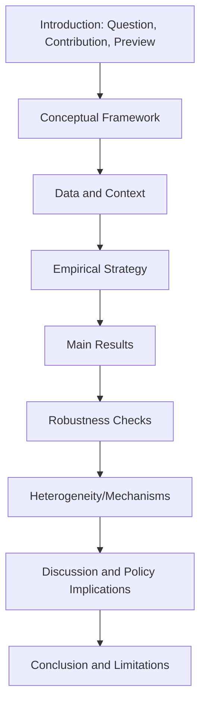
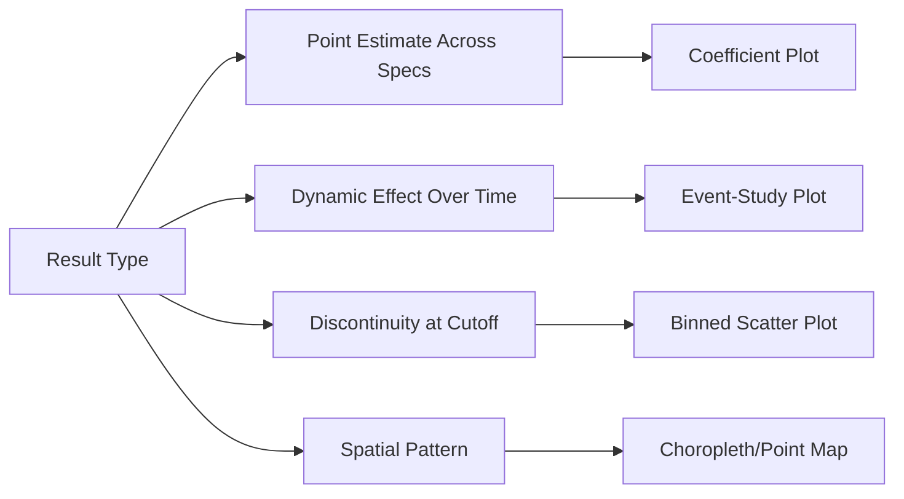

## Writing and Presenting Agricultural Economics Research

### Overview

Effective communication of agricultural economics research requires translating technical methods and findings into forms accessible to distinct audiences: academic peer-reviewed journals, policy briefs for government and development agencies, and presentations to mixed technical/non-technical stakeholders. This chapter section covers the structural conventions, statistical reporting standards, and presentation techniques specific to applied economics research communication.

### Structure of an Academic Empirical Paper

**Key Points**

The standard structure for empirical agricultural economics papers, particularly in economics journals, follows a well-established convention:

1. **Introduction** — motivates the research question, states the contribution relative to existing literature (often explicitly, e.g., "this paper extends X by..."), and previews the main finding.
2. **Literature review/related literature** — situates the study within existing theoretical and empirical work; in top economics journals, often integrated into the introduction rather than presented as a standalone section.
3. **Conceptual framework/theoretical model** — for structural papers, this presents the formal model; for reduced-form papers, this may be a brief conceptual discussion motivating the empirical specification and expected sign/mechanism.
4. **Data and context** — describes the data sources (survey, census, remote sensing, as applicable), sample construction, key variable definitions, and institutional/policy context relevant to interpreting results.
5. **Empirical strategy/identification** — details the estimation approach and, critically, the identifying assumptions (parallel trends, instrument validity, randomization, etc.) with supporting evidence (balance tables, pre-trend tests, first-stage F-statistics).
6. **Results** — presents main findings, typically with a base specification followed by robustness checks and heterogeneity analysis.
7. **Discussion/mechanisms** — interprets results, discusses plausible mechanisms, and addresses alternative explanations.
8. **Conclusion** — summarizes findings and policy implications, and typically notes limitations and directions for future research.

### Reporting Statistical Results

**Key Points**

- **Regression tables** — standard convention presents coefficients with standard errors (or t-statistics) in parentheses below, significance stars (though increasingly de-emphasized in favor of reporting confidence intervals or exact p-values, per evolving disciplinary norms around statistical significance reporting), sample size, and relevant fit statistics (R², first-stage F-statistic for IV).
- **Multiple specification columns** — presenting a progression of specifications (e.g., without controls, with controls, with fixed effects) in successive table columns allows readers to assess result stability, a standard robustness presentation convention.
- **Standard error clustering** — must be explicitly stated and justified (e.g., clustering at the village level in a cluster-randomized design, matching the level of treatment assignment or expected error correlation) since incorrect clustering can substantially misstate statistical precision.
- **Effect size interpretation** — beyond statistical significance, results should be interpreted in economically meaningful terms (e.g., "a one-standard-deviation increase in X is associated with a Y% change in outcome" or comparison to a policy-relevant benchmark), since statistical significance alone does not establish practical importance.

### Reporting Identification Strategy Credibility

**Key Points**

For quasi-experimental and experimental designs, papers must transparently report the evidence supporting their identifying assumptions:

- **Balance tables** (RCTs) — baseline covariate means and mean-difference tests across treatment/control arms.
- **Pre-trend graphs** (DiD) — visual and/or statistical evidence that treatment and comparison groups followed parallel trends prior to treatment.
- **First-stage results and instrument relevance** (IV) — first-stage F-statistics (commonly benchmarked against rule-of-thumb thresholds for weak instrument concerns) and discussion of the exclusion restriction's plausibility.
- **McCrary density tests and bandwidth sensitivity** (RDD) — testing for manipulation of the running variable around the cutoff, and showing result stability across alternative bandwidth choices.
- **Attrition tables** — comparing attrition rates and characteristics of attritors across treatment arms, particularly important in panel/longitudinal agricultural studies given the migration and farm-exit-related attrition discussed under RCT methodology.

### Data and Code Transparency

**Key Points**

- **Pre-registration references** — where applicable, citing the study's pre-analysis plan registry entry (e.g., AEA RCT Registry) and noting any deviations from the pre-specified plan.
- **Replication packages** — increasingly required by leading economics journals: publicly archived code and (where confidentiality permits) data enabling independent replication of reported results.
- **Data availability statements** — clarifying access restrictions for sensitive household-level data (common in agricultural household surveys containing identifiable information), often directing readers to data-sharing agreements with the original survey administering body.

### Policy Briefs and Non-Academic Communication

**Key Points**

Policy-oriented writing for government agencies, NGOs, or development organizations follows substantially different conventions than academic papers:

1. **Executive summary first** — leading with the key finding and policy recommendation rather than building up through literature review and methodology, respecting the time constraints of policy audiences.
2. **Minimal technical jargon and equations** — statistical methods are typically described in plain language ("we compared farmers who received training to similar farmers who did not") rather than formal notation.
3. **Visual emphasis** — charts, infographics, and simple comparison tables generally substitute for dense regression tables.
4. **Explicit, actionable recommendations** — policy briefs typically conclude with specific, implementable recommendations rather than academic papers' more measured "further research is needed" framing.
5. **Length constraints** — policy briefs are typically limited to 2–4 pages, requiring substantial compression relative to a full academic paper's typical 30–50 page length.

| Element | Academic Paper | Policy Brief |
| --- | --- | --- |
| Length | 30–50+ pages | 2–4 pages |
| Statistical detail | Full regression tables, robustness checks | Plain-language summary, simple visuals |
| Audience assumption | Technical peer reviewers | Non-technical decision-makers |
| Opening structure | Literature-motivated introduction | Executive summary with key finding |
| Recommendation framing | Cautious, hedged, future-research-oriented | Direct, actionable |
| Citation style | Full academic citation apparatus | Minimal, often footnoted or omitted |

### Presenting Research: Conference and Seminar Talks

**Key Points**

- **Slide structure** typically mirrors the paper structure but heavily compressed: motivation (1–2 slides), a single clear "roadmap" slide, conceptual framework (brief), data (1–2 slides), empirical strategy (emphasizing the key identifying assumption visually), main results (typically the single most important table or figure), and conclusion.
- **Figures over tables in live presentation** — coefficient plots (showing point estimates and confidence intervals across specifications or subgroups) are generally more digestible in a live talk than dense regression tables, which audiences cannot process as quickly when displayed briefly.
- **Anticipating identification critiques** — because economics seminar audiences typically probe identifying assumptions rigorously, presenters commonly prepare backup slides addressing anticipated questions (alternative specifications, placebo tests, discussion of specific threats to validity).
- **Practitioner/stakeholder presentations** — for non-academic audiences (e.g., ministry officials, cooperative boards), presentations should foreground practical implications and use minimal statistical notation, analogous to the policy brief adaptation described above.

### Visualizing Results Effectively

**Key Points**

1. **Coefficient plots** — visualizing point estimates with confidence intervals across multiple specifications, subgroups, or outcome variables in a single figure, increasingly preferred over large regression tables for conveying robustness at a glance.
2. **Event-study plots** (for DiD/staggered designs) — plotting treatment effect estimates for each time period relative to treatment timing, simultaneously displaying pre-trend evidence and the dynamic pattern of treatment effects over time.
3. **Binned scatter plots** (for RDD) — visualizing the discontinuity by plotting binned average outcomes against the running variable, providing intuitive visual evidence of the jump at the cutoff.
4. **Maps and geospatial visualization** — particularly relevant given the increasing use of remote sensing and geolocated survey data (as discussed under agricultural data sources), maps effectively communicate spatial heterogeneity in outcomes or treatment intensity.

### Common Writing Pitfalls in Applied Agricultural Economics

**Key Points**

1. **Causal language overreach** — using causal verbs ("increases," "reduces," "causes") when the identification strategy only supports correlational or weakly-identified claims; careful papers reserve strong causal language for well-identified estimates and use hedged language ("associated with") elsewhere.
2. **Insufficient institutional/context description** — agricultural economics findings are often highly context-dependent (specific crop, agroecological zone, market structure); omitting this context undermines readers' ability to assess external validity.
3. **Table overload without narrative guidance** — presenting extensive robustness tables without clear prose guiding readers to the key takeaway from each.
4. **Neglecting economic (vs. only statistical) significance** — reporting p-values without discussing whether the estimated effect size is large enough to be policy-relevant.
5. **Opaque variable construction** — insufficient detail on how key variables were constructed from raw survey/remote sensing data (e.g., how a "adoption" indicator or "yield" variable was precisely defined), hampering both interpretation and replication.

### Related Topics

- Regression table conventions and standard error clustering choices
- Event-study and coefficient plot design for applied microeconomics
- Pre-registration and replication package standards
- Policy brief writing for development and government audiences
- Causal language conventions in empirical economics writing
- Peer review process norms in applied economics journals
- Data visualization best practices for spatial agricultural data
- Seminar presentation structure and anticipating identification critiques
- Balance tables, pre-trend tests, and other identification credibility evidence
- Replication and open science standards in agricultural economics