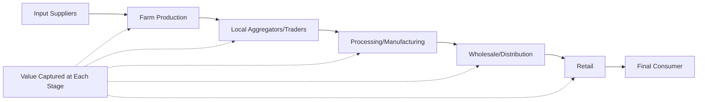
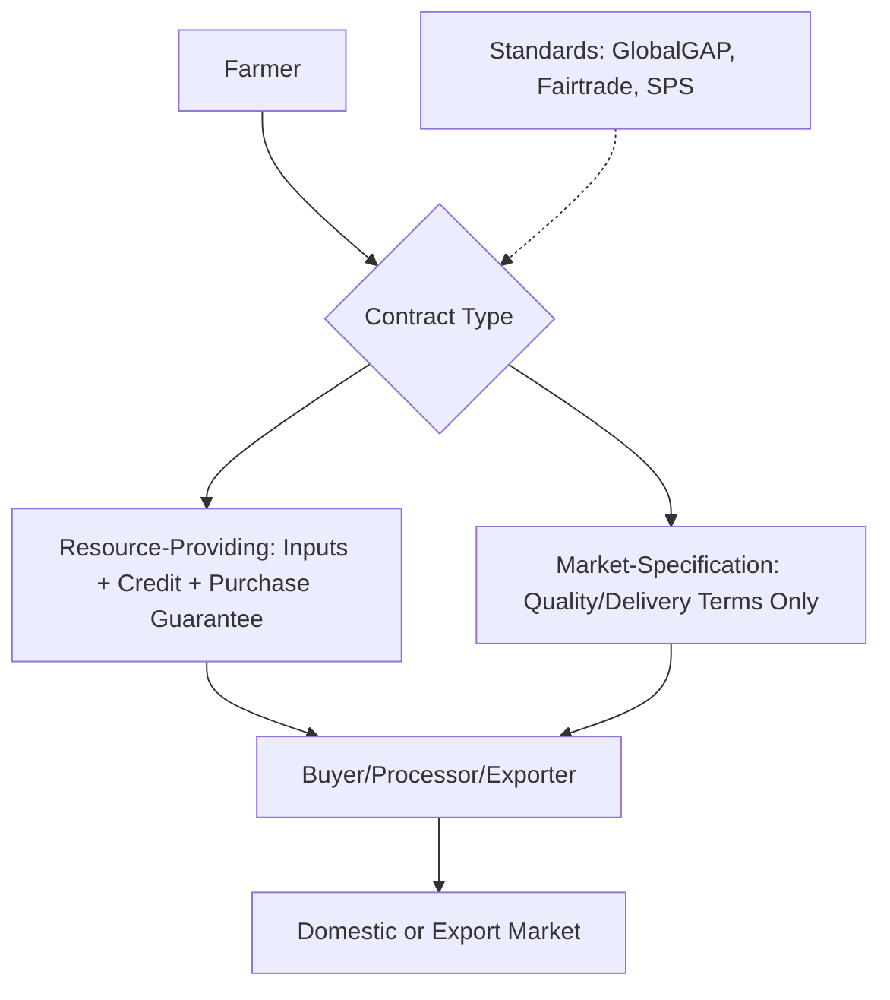

## Agricultural Value Chains and Globalization

### Overview

Agricultural value chains describe the full sequence of activities — production, aggregation, processing, distribution, and retail — through which raw agricultural commodities move from farm to final consumer, capturing value at each stage. Globalization has progressively integrated these chains across national borders, reshaping farmer market access, price transmission, quality standards, and the distribution of bargaining power among chain participants. This topic sits at the intersection of industrial organization, trade economics, and development economics as applied to agriculture.

### The Value Chain Framework

**Key Points**

- A **value chain** encompasses the full range of activities required to bring a product from production to final consumption, including input supply, farm production, aggregation/trading, processing, packaging, distribution, and retail/export.
- Distinguished from a **supply chain** (which emphasizes logistics and physical flow) by its explicit focus on **value addition and distribution** at each stage — who captures what share of the final consumer price.
- **Global value chains (GVCs)** specifically describe chains where different stages occur across multiple countries, driven by comparative advantage in labor costs, climate/agroecological suitability, and processing capacity.

### Governance Structures in Value Chains

Drawing on global value chain theory (notably Gereffi's typology), agricultural value chains exhibit varying governance structures based on the complexity of transactions, the ability to codify product/process specifications, and supplier capability:

| Governance Type | Description | Agricultural Example |
| --- | --- | --- |
| Market | Arm's-length spot transactions, low coordination | Undifferentiated grain commodity sales |
| Modular | Standardized specifications allow suppliers flexibility in meeting them | Certified organic produce meeting defined standards |
| Relational | Complex, tacit knowledge exchange requiring mutual trust and repeated interaction | Specialty coffee direct-trade relationships |
| Captive | High supplier dependence on a dominant buyer who specifies detailed requirements | Contract farming for supermarket private-label produce |
| Hierarchy | Vertical integration; the lead firm owns multiple chain stages | Vertically integrated poultry/livestock production |

$[Inference]$ Governance structure is generally understood to be shaped by the interaction of transaction complexity, codifiability of standards, and supplier capability, but classifying any specific real-world chain into one of these categories can involve some judgment, since chains often exhibit hybrid or evolving governance features rather than fitting a single category cleanly.

### Drivers of Value Chain Globalization

**Key Points**

1. **Trade liberalization** — reduced tariff and non-tariff barriers under multilateral (WTO) and bilateral/regional trade agreements have progressively expanded market access for agricultural exports, though agricultural trade remains among the most protected sectors globally relative to manufactured goods.
2. **Transportation and logistics improvements** — containerization, cold-chain technology, and air freight have expanded the range of perishable agricultural products (fresh produce, cut flowers, seafood) that can be competitively traded internationally.
3. **Retail concentration and supermarketization** — the global expansion of supermarket chains, particularly into developing-country urban markets, has reshaped procurement practices toward centralized sourcing, quality standardization, and often contract-based farmer engagement, a phenomenon extensively documented in the agricultural economics literature as the **"supermarket revolution."**
4. **Standards proliferation** — public (SPS/food safety) and private (GlobalGAP, Fairtrade, organic certification) standards have become de facto requirements for accessing many export markets, functioning simultaneously as quality assurance mechanisms and potential non-tariff barriers for smallholder producers lacking certification capacity.
5. **Information and communication technology** — mobile-based market information systems and digital platforms have reduced information asymmetries in price discovery, though their effect on farmer bargaining power varies by market structure and adoption context.

### Farmer Participation and Contract Farming

**Key Points**

- **Contract farming** — formal or informal agreements specifying production requirements (inputs, practices, quality standards) and often guaranteed purchase terms between farmers and buyers/processors, a common mechanism for smallholder integration into value chains requiring quality consistency.
- **Resource-providing contracts** — where the buyer supplies inputs, credit, or technical assistance in exchange for exclusive purchase rights, addressing farmers' credit and information constraints while securing the buyer's supply and quality requirements.
- **Market-specification contracts** — specify quality/delivery terms without necessarily providing inputs, common where farmer capacity is already adequate to meet standards independently.

**Empirical Findings on Contract Farming Participation**

$[Inference]$ The broader empirical literature on contract farming's welfare effects for participating smallholders shows generally positive average income effects in many studies, though findings vary by crop, contract design, and country context, and are not uniform enough to support a single generalized conclusion about contract farming's effects across all settings.

### Smallholder Exclusion and Inclusion Dynamics

**Key Points**

- **Exclusion risk** — high fixed costs of certification, minimum volume requirements, and quality consistency demands can systematically exclude smaller, more capital-constrained farmers from lucrative export or high-value domestic chains, a widely documented concern in the value chain development literature.
- **Aggregation models as inclusion mechanisms** — farmer cooperatives, producer organizations, and aggregator intermediaries can pool smallholder volumes and provide collective certification/quality management, addressing some scale barriers (connecting directly to cooperative economics theory covered elsewhere in this curriculum).
- **Bargaining power asymmetries** — value chain governance structures with a small number of dominant downstream buyers (processors, retailers) relative to numerous dispersed upstream producers create structural bargaining power asymmetries, a central concern in value chain equity analysis and a rationale for both cooperative formation and regulatory intervention (e.g., fair trading practice regulations in some jurisdictions).

### Value Chain Upgrading

A central concept in value chain development practice, referring to strategies by which firms or farmers move to higher-value activities within or beyond their current chain position:

**Key Points**

1. **Process upgrading** — improving production efficiency within the existing product/activity (e.g., adopting better agronomic practices to reduce cost per unit).
2. **Product upgrading** — moving to higher-value product varieties or quality grades within the same general product category (e.g., shifting from conventional to certified organic production).
3. **Functional upgrading** — moving into new, higher-value-added activities within the chain (e.g., a farmer group moving from raw commodity sales into on-farm primary processing).
4. **Chain/inter-sectoral upgrading** — applying competencies gained in one chain to enter a different, higher-value chain entirely.

### Price Transmission Along Global Value Chains

International price transmission analysis examines how price changes at one point in the chain (e.g., world commodity prices) transmit to other points (e.g., farmgate prices), a key empirical question for understanding whether farmers benefit from favorable global price movements:

$$P^{domestic}_t = \alpha + \beta P^{world}_{t-k} + \gamma Z_t + \varepsilon_t$$

where $\beta$ measures the transmission elasticity and $k$ allows for potential lags in transmission. **Incomplete or asymmetric price transmission** — where farmgate prices respond less to favorable world price increases than to unfavorable decreases — is a well-documented phenomenon in many agricultural value chains, often attributed to market power concentration at intermediary stages, high transaction/transport costs, or policy interventions (price controls, export restrictions) that dampen transmission.

### Trade Policy Instruments Affecting Agricultural Value Chains

| Instrument | Mechanism | Effect on Value Chain |
| --- | --- | --- |
| Tariffs | Tax on imports | Raises domestic price above world price, protecting domestic producers but raising costs for downstream processors reliant on imported inputs |
| Tariff escalation | Higher tariffs on processed vs. raw commodities | Discourages developing-country value-added processing, incentivizing raw commodity export |
| Export restrictions/bans | Limits or prohibits export of a commodity | Can suppress domestic farmgate prices (reducing incentive to produce) while stabilizing domestic consumer prices |
| Sanitary and Phytosanitary (SPS) measures | Food safety/plant health regulations | Legitimate public health tool, but compliance costs can function as a de facto non-tariff barrier for smallholder exporters |
| Regional trade agreements | Preferential tariff treatment among member countries | Can create trade diversion or creation effects depending on relative competitiveness of member vs. non-member suppliers |

### Example: Global Coffee Value Chain

**Example**

The global coffee value chain illustrates many of the concepts above: smallholder farmers in producing countries typically sell to local traders or cooperatives (aggregation addressing scale barriers), which sell to exporters, who sell to international roasters and retailers in consuming countries. Value capture is heavily skewed toward downstream roasting/retail stages relative to farmgate production, a pattern frequently cited in value chain equity discussions. Certification schemes (Fairtrade, Rainforest Alliance, direct trade relationships) represent attempts to shift governance toward more relational structures and improve farmer value capture, though the net welfare impact of certification premiums after accounting for compliance costs remains an actively studied empirical question with mixed findings across contexts.

### Related Topics

- Gereffi's global value chain governance typology
- Supermarket revolution and retail concentration effects on smallholders
- Contract farming welfare impact evaluation
- Price transmission and market integration analysis
- Certification schemes (Fairtrade, GlobalGAP, organic) and smallholder welfare
- Tariff escalation and its effect on developing-country agro-processing
- Cooperative aggregation as a value chain inclusion mechanism
- Sanitary and phytosanitary (SPS) measures as non-tariff barriers
- Value chain upgrading strategies (process, product, functional, inter-sectoral)
- Bargaining power asymmetries and fair trading practice regulation