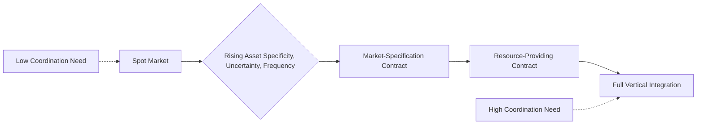
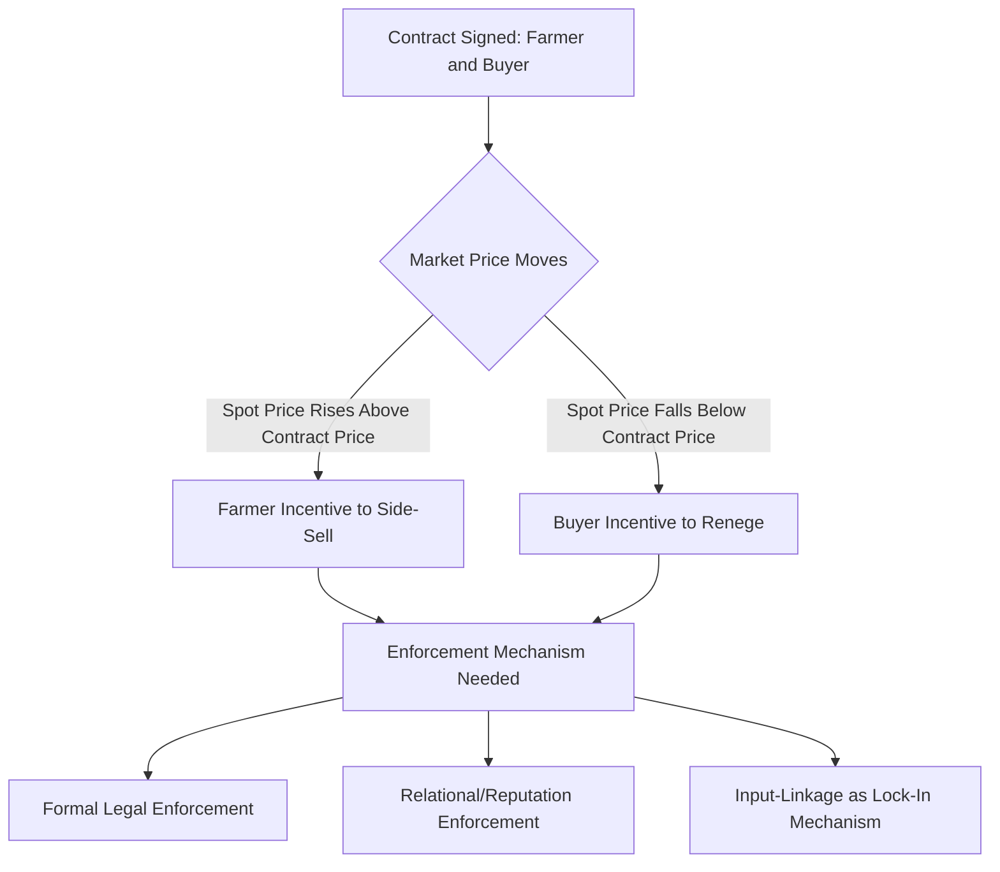

## Contract Farming and Vertical Integration

### Overview

Contract farming and vertical integration represent two distinct but related institutional arrangements through which agribusiness firms coordinate agricultural production beyond arm's-length spot market transactions. Contract farming involves formal or informal agreements between farmers and buyers specifying production and/or marketing terms while farmers retain operational control and ownership of production, whereas vertical integration involves a single firm owning multiple stages of the production-processing-distribution chain directly. Both arrangements address transaction cost, quality control, and coordination challenges inherent in agricultural supply relationships.

### Theoretical Foundations: Why Firms Choose Contracts or Integration

**Transaction Cost Economics**

Building on Williamson's framework (also central to cooperative formation theory), the choice among spot markets, contracts, and full vertical integration depends on the characteristics of the transaction:

$$\text{Governance Choice} = f(\text{Asset Specificity}, \text{Uncertainty}, \text{Frequency})$$

**Key Points**

- **Asset specificity** — when production requires investments specific to a particular buyer relationship (specialized crop varieties, dedicated processing-compatible equipment), the risk of post-investment opportunistic renegotiation ("hold-up") rises, favoring tighter coordination (contracts or integration) over spot markets.
- **Uncertainty** — quality, timing, and volume uncertainty in agricultural production create coordination challenges better managed through contractual specification than repeated spot negotiation.
- **Frequency** — recurring transactions between the same parties justify the fixed costs of establishing contractual or integrated relationships, whereas one-off transactions favor simpler spot market exchange.

**Agency Theory**

Contract design must also address moral hazard (farmer effort/input use is imperfectly observable to the buyer) and adverse selection (buyer cannot perfectly distinguish high- from low-quality/capability farmers ex ante), shaping specific contract terms (price structure, monitoring provisions, input-provision clauses).

### Types of Contract Farming Arrangements

**1. Market-Specification Contracts**

Specify quality, quantity, timing, and price terms for output purchase without the buyer providing production inputs. Farmers retain full operational and financial responsibility for production; the buyer's primary interest is securing supply meeting defined specifications.

**2. Resource-Providing Contracts**

The buyer supplies critical inputs (seed, credit, technical assistance, sometimes land preparation services) in exchange for exclusive purchase rights, typically deducting input costs from the final payment. This structure addresses farmers' credit and information constraints while securing the buyer's quality and supply requirements — closely resembling **interlinked transactions** in agricultural development economics, where credit, input, and output markets are bundled into a single contractual relationship.

**3. Management/Production Contracts**

The most intensive contract form, common in poultry and some livestock production, where the buyer specifies detailed production protocols (feed formulation, housing standards, veterinary inputs) and the farmer essentially provides land, labor, and housing infrastructure while the buyer retains ownership of the animals/inputs throughout production — functionally approaching vertical integration while nominally preserving the farmer's independent contractor status.

### Contract Design Elements

**Key Points**

1. **Pricing mechanisms** — fixed price (certainty for both parties, but risk if market prices diverge substantially), formula pricing (indexed to a reference market price, sharing price risk), and cost-plus arrangements (particularly common in management contracts).
2. **Quality grading and rejection provisions** — specify acceptable quality parameters and consequences (price discounts, outright rejection) for non-compliance, a frequent source of contract dispute given quality's often partially subjective or delayed-observable nature in agricultural products.
3. **Volume and exclusivity clauses** — specify delivery quantity obligations and whether farmers may sell surplus or non-compliant product to alternative buyers (side-selling), a persistent enforcement challenge discussed below.
4. **Input provision and cost recovery terms** — for resource-providing contracts, specifying input costs, repayment schedules, and consequences of default.
5. **Duration and renewal terms** — ranging from single-season agreements to multi-year arrangements, with longer durations generally associated with higher asset-specificity investments (e.g., perennial crop contracts).

### Enforcement Challenges

**Key Points**

- **Side-selling** — farmers selling contracted output to alternative buyers (often for immediate cash, avoiding quality deductions, or responding to favorable spot prices), a widely documented contract farming enforcement problem, particularly acute where formal legal contract enforcement is weak or costly relative to the transaction values involved.
- **Buyer reneging** — buyers failing to honor purchase commitments (e.g., during oversupply periods when spot prices fall below contract prices), which can erode farmer trust and future contract participation.
- **Input diversion** — in resource-providing contracts, farmers may divert provided inputs (fertilizer, credit) to non-contracted uses, undermining both the contracted crop's yield and the input-cost recovery mechanism.
- **Relational contracting as an enforcement substitute** — given formal legal enforcement limitations in many agricultural contexts, repeated interaction, reputation mechanisms, and social sanctions within farming communities frequently substitute for formal contract enforcement, aligning with the "relational" governance category in value chain theory.

### Vertical Integration

**Key Points**

- **Forward integration** — a farm-level producer or cooperative moves into downstream processing/distribution (e.g., a dairy cooperative building its own processing plant, discussed further under cooperative economics and new generation cooperatives).
- **Backward integration** — a processor or retailer moves upstream into direct farm production ownership (e.g., a poultry integrator owning breeding and hatching operations while contracting out grow-out to farmers via management contracts).
- **Degree of integration spectrum** — full ownership integration is relatively rare in primary crop/livestock production (given the difficulty of monitoring dispersed agricultural labor relative to factory settings) but is common in specific sectors (poultry, some vegetable/fruit operations, plantation crops like oil palm and sugarcane) where production is more amenable to direct supervision or where processing-production timing coordination is especially critical.

### Comparative Trade-offs: Spot Market vs. Contract vs. Integration

| Dimension | Spot Market | Contract Farming | Vertical Integration |
| --- | --- | --- | --- |
| Farmer autonomy | Full | Partial (specified terms) | Minimal (management contracts) to none (full integration) |
| Buyer supply/quality certainty | Low | Moderate-high | Highest |
| Capital requirement for buyer | Low | Moderate | High (direct production investment) |
| Farmer risk exposure | Full market price risk | Reduced price risk, retains production risk | Minimal (in management contracts, buyer bears most risk) |
| Coordination cost | Low | Moderate | High (direct monitoring/management) |
| Flexibility to respond to market changes | High | Moderate | Low |

### Welfare Effects on Participating Farmers

**Key Points**

Empirical research on contract farming's effects on smallholder welfare generally examines several outcome channels:

1. **Income and price stability effects** — contracts often provide more stable, sometimes higher, prices relative to volatile spot markets, though the net effect depends on contract pricing terms relative to counterfactual market prices.
2. **Input access and productivity effects** — resource-providing contracts can relax credit and input-access constraints, potentially raising yields independent of the pricing arrangement itself.
3. **Risk-bearing reallocation** — contracts shift certain risks (price risk, in fixed-price contracts) from farmer to buyer, though production risk (weather, pests) typically remains with the farmer unless explicitly addressed (e.g., paired with index insurance).
4. **Selection effects** — buyers often preferentially contract with larger, more capitalized, or geographically accessible farmers, raising equity concerns about differential access to contract farming opportunities among the broader smallholder population.

$[Inference]$ While a substantial share of published contract farming studies report positive average income effects for participants, this literature is also subject to potential selection bias concerns (since farmers who choose to participate, and buyers who choose to contract with them, are not randomly selected), meaning causal interpretation of average effects requires the same identification scrutiny discussed under experimental and quasi-experimental methods, and results should not be assumed to generalize uniformly across all contract types and contexts.

### Example: Poultry Contract Farming (Management Contract Model)

**Example**

In a typical poultry management contract, an integrator company supplies day-old chicks, feed, veterinary inputs, and detailed production protocols to contracted growers, who provide housing, land, labor, and utilities. The integrator retains ownership of the birds throughout the growing period and pays growers a fee based on weight gain and feed conversion efficiency (a performance-based, cost-plus-style payment structure), often within a **tournament-style compensation system** comparing a grower's performance to that of other growers in the same delivery cohort — a contract design intended to incentivize grower effort despite the integrator's inability to perfectly monitor individual farm management practices, though this system has drawn scrutiny in some contexts regarding income volatility and unequal bargaining power between integrators and growers.

### Policy and Regulatory Considerations

**Key Points**

- **Contract enforcement infrastructure** — legal system capacity to adjudicate contract disputes affordably and quickly influences the feasibility and terms of formal contract farming arrangements, particularly relevant in developing-country contexts.
- **Model contract legislation** — some jurisdictions have introduced standardized contract farming legal frameworks specifying minimum farmer protections (payment timing, dispute resolution mechanisms, grading transparency requirements).
- **Antitrust/market power concerns** — in sectors with few dominant integrators or processors, competition policy concerns arise regarding farmer bargaining power and potential monopsonistic contract terms, connecting to the broader value chain bargaining power asymmetry discussed under value chain globalization.

### Related Topics

- Transaction cost economics and asset specificity in agricultural governance choice
- Interlinked credit-input-output market transactions
- Side-selling and relational contract enforcement mechanisms
- Poultry and livestock management contract compensation design (tournament systems)
- Cooperative aggregation as an alternative to individual contract farming
- Global value chain governance typology (market, modular, relational, captive, hierarchy)
- Contract farming welfare impact evaluation methodology
- Model contract farming legislation and farmer protection frameworks
- Forward and backward vertical integration case studies
- Monopsony power and competition policy in agricultural procurement markets