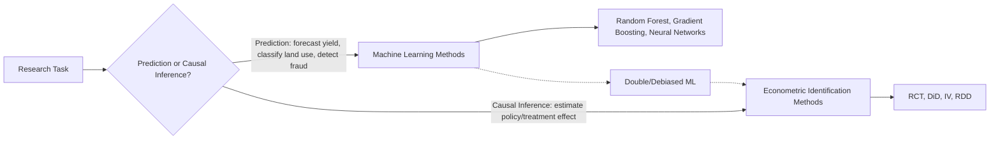
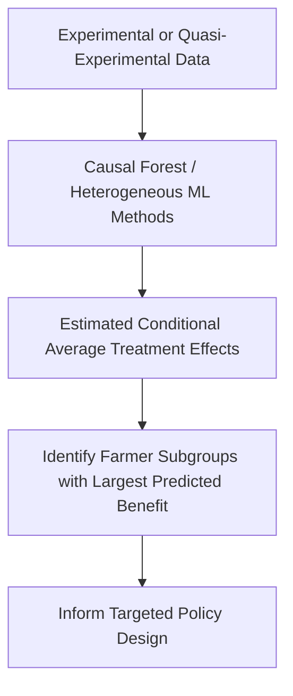

## Big Data and Machine Learning in Agricultural Economics

### Overview

Big data and machine learning methods have increasingly complemented traditional econometric approaches in agricultural economics, offering new capabilities for prediction, pattern discovery in high-dimensional data (satellite imagery, sensor networks, administrative records), and improved causal inference in specific contexts. This section covers the primary application areas, the methodological relationship between machine learning and causal econometrics, and key limitations relevant to agricultural economics research.

### Machine Learning vs. Traditional Econometrics: A Conceptual Distinction

**Key Points**

- **Traditional econometrics** prioritizes unbiased estimation of specific, theoretically motivated parameters (e.g., a treatment effect, an elasticity) with an emphasis on inference (standard errors, hypothesis testing, causal identification).
- **Machine learning** prioritizes out-of-sample predictive accuracy, often using flexible, high-dimensional models (random forests, gradient boosting, neural networks) that may sacrifice interpretability and formal inference properties for improved prediction.
- These are increasingly viewed as **complementary rather than competing** toolkits: machine learning excels at prediction tasks and handling high-dimensional data, while econometric methods (RCTs, DiD, IV, RDD, as detailed under experimental and quasi-experimental methods) remain the standard for credible causal effect estimation.

### Core Application Areas

**1. Yield Prediction and Crop Monitoring**

Combining satellite imagery (vegetation indices, as discussed under remote sensing data sources), weather data, and soil characteristics as predictive features, with machine learning models (commonly random forests, gradient boosting methods, and convolutional neural networks for direct image-based prediction) trained against ground-truthed yield observations to predict yields at scale across large geographic extents where direct measurement (crop-cutting) is infeasible.

**2. Land Use and Land Cover Classification**

Supervised classification algorithms applied to satellite imagery time series to distinguish crop types, detect land use change (deforestation, cropland expansion), and monitor compliance with land use regulations — extending the remote sensing applications discussed under agricultural data sources with more sophisticated pattern recognition than simple threshold-based vegetation index classification.

**3. Price Forecasting**

Machine learning models applied to historical price series, weather forecasts, and other predictive features for short-to-medium-term commodity price forecasting, used by traders, policymakers (for early warning systems), and farmers for marketing decisions. $[Inference]$ The relative forecasting performance of machine learning methods versus traditional time-series econometric models (ARIMA, GARCH-family models) for agricultural commodity prices varies across studies and commodities, and no single method has been established as universally superior across all agricultural price forecasting contexts.

**4. Farmer Segmentation and Targeting**

Clustering and classification algorithms applied to household survey or administrative data to identify farmer segments (e.g., for targeted extension program design, credit risk assessment, or input subsidy targeting), often used to improve the efficiency of limited program resources by identifying farmers most likely to benefit from or be eligible for specific interventions.

**5. Text and Image Analysis**

Natural language processing applied to agricultural market reports, news, or social media for sentiment analysis and early signal detection (e.g., of pest outbreaks or market disruptions); computer vision applied to farmer-submitted smartphone images for automated pest/disease diagnosis, increasingly deployed through mobile agricultural advisory applications.

### Double/Debiased Machine Learning for Causal Inference

A significant methodological development bridging machine learning and causal econometrics is the **double/debiased machine learning (DML)** framework (developed by Chernozhukov and coauthors), which allows machine learning methods to be used for flexible control of high-dimensional confounders while preserving valid statistical inference for a low-dimensional causal parameter of interest:

$$Y_i = \theta D_i + g(X_i) + \varepsilon_i, \quad D_i = m(X_i) + v_i$$

where $\theta$ is the causal parameter of interest, $D_i$ is the treatment variable, $X_i$ is a potentially high-dimensional set of confounders, and $g(\cdot)$ and $m(\cdot)$ are flexibly estimated using machine learning methods (rather than restrictive linear functional forms), with a cross-fitting procedure used to correct for the regularization bias these flexible ML estimators would otherwise introduce into the estimate of $\theta$.

**Key Points**

- This approach is particularly valuable in agricultural economics settings with rich, high-dimensional covariate data (e.g., detailed remote sensing, weather, and soil characteristics as potential confounders) where traditional linear control-variable specifications may be misspecified.
- $[Inference]$ DML and related causal machine learning methods remain a relatively recent and actively developing area of applied econometric methodology; while increasingly adopted in applied agricultural economics research, best-practice implementation details continue to evolve, so researchers should consult current methodological literature rather than treating any specific implementation as a fixed standard.

### Heterogeneous Treatment Effect Estimation via Machine Learning

Machine learning methods (notably **causal forests**, an extension of random forests designed for treatment effect estimation) are increasingly used to estimate **heterogeneous treatment effects** — how a treatment effect varies across observed covariates — extending the heterogeneity analysis discussed under impact evaluation techniques with a more flexible, data-driven approach to detecting effect heterogeneity than pre-specified subgroup interactions alone.

### Data Infrastructure Considerations

**Key Points**

- **High-dimensional and unstructured data handling** — machine learning applications in agricultural economics typically require data infrastructure capable of processing large volumes of satellite imagery, sensor data, or administrative records, often exceeding the scale of traditional household survey datasets.
- **Ground-truth/training data requirements** — supervised machine learning models require labeled training data (e.g., ground-truthed yield measurements, verified land cover classifications) to calibrate predictions, connecting directly to the crop-cutting and field validation methods discussed under survey and remote sensing data sources.
- **Model validation across geographic and temporal contexts** — models trained in one region or season may not transfer reliably to different agroecological zones or years, a persistent limitation requiring explicit out-of-sample, out-of-region validation before deployment for policy or operational decisions.

### Limitations and Cautions

**Key Points**

1. **Interpretability trade-offs** — many high-performing machine learning models (gradient boosting, deep neural networks) function as comparative "black boxes" relative to linear regression, complicating both scientific interpretation and stakeholder communication of results; interpretability methods (e.g., SHAP values, partial dependence plots) partially address this but add analytical complexity.
2. **Overfitting and generalization risk** — flexible ML models risk overfitting to training data idiosyncrasies, particularly acute with the moderate sample sizes common in agricultural household survey data (as opposed to the very large samples typical of commercial ML applications), requiring careful cross-validation and out-of-sample testing.
3. **Data representativeness and bias** — machine learning models trained on data disproportionately representing certain farmer types, regions, or crops (a common issue given uneven agricultural data collection infrastructure globally) risk producing systematically biased predictions for underrepresented groups, a concern particularly relevant to smallholder-focused agricultural development applications.
4. **Not a substitute for causal identification** — prediction accuracy does not establish causal effects; using ML-predicted risk scores or outcome forecasts to justify policy interventions without separate causal validation risks conflating correlation with causation, a distinction central to the reduced-form/structural modeling discussion elsewhere in this curriculum.

### Example: Smallholder Credit Risk Scoring

**Example**

A machine learning-based credit scoring application might combine mobile phone usage patterns, satellite-derived farm productivity indicators, and limited administrative records to predict smallholder farmers' loan repayment probability, enabling lenders to extend credit to farmers lacking traditional collateral or credit history. While such models can improve prediction accuracy for lending decisions, evaluating whether expanded credit access via this mechanism actually *causes* improved farmer welfare outcomes still requires a separate causal impact evaluation design (e.g., a randomized rollout of the credit scoring-based lending program, as discussed under RCT methodology), illustrating the complementary but distinct roles of predictive machine learning and causal econometric methods.

### Related Topics

- Double/debiased machine learning (Chernozhukov et al.) methodology
- Causal forests and heterogeneous treatment effect estimation
- Satellite imagery-based yield prediction model architectures
- Convolutional neural networks for crop and land cover classification
- Model interpretability methods (SHAP, partial dependence) in applied economics
- Cross-validation and out-of-sample testing for agricultural ML applications
- Mobile-based pest and disease diagnosis using computer vision
- Data representativeness and algorithmic bias in agricultural applications
- Time-series forecasting methods for agricultural commodity prices
- Integration of remote sensing, survey, and administrative data for ML training sets