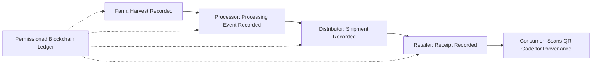
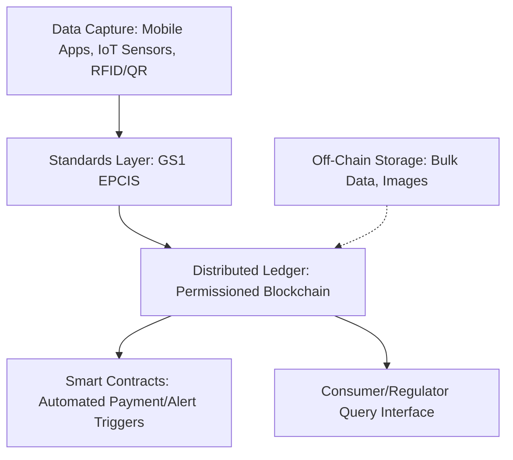

## Blockchain Applications in Food Supply Chains

### Overview

Blockchain applications in food supply chains use distributed ledger technology to create immutable, shared records of product movement, ownership transfer, and attribute verification from farm to final consumer. From an agricultural economics perspective, blockchain is best understood as an institutional and information technology addressing specific transaction cost and information asymmetry problems in agri-food value chains — particularly traceability, provenance verification, and trust between geographically and organizationally distant supply chain participants — rather than as a technology with intrinsic economic value independent of the coordination problem it solves.

### Core Technical Concept Applied to Food Supply Chains

**Key Points**

- A **blockchain** is a distributed, cryptographically linked ledger maintained across multiple network participants (nodes), where each new block of transaction records references and cryptographically depends on the prior block, making retroactive alteration computationally impractical without detection — the property generating the technology's "immutability" claim.
- In food supply chain applications, each significant event in a product's journey (harvest, processing, packaging, shipment, retail receipt) is recorded as a transaction on the ledger, creating a theoretically tamper-evident chain-of-custody record.
- Most enterprise food traceability blockchain deployments use **permissioned (private/consortium) blockchains** rather than fully public, permissionless networks (like the original Bitcoin model), restricting write access to verified supply chain participants — a design choice balancing transparency with commercial confidentiality and computational efficiency.

### Economic Rationale: Transaction Cost and Information Asymmetry Framing

**Key Points**

Applying transaction cost economics (the same framework underlying cooperative formation and contract farming/vertical integration analysis elsewhere in this curriculum), blockchain traceability addresses several specific frictions:

1. **Verification costs** — establishing product provenance (organic status, geographic origin, fair trade certification) traditionally requires costly third-party audits and paper-based documentation prone to fraud or loss; blockchain aims to reduce ongoing verification costs by creating a persistent, shared, harder-to-falsify record.
2. **Information asymmetry between consumers and producers** — consumers cannot directly verify credence attributes (organic, sustainably sourced, animal welfare standards) that are not observable even after purchase; blockchain-enabled traceability is positioned as a mechanism for **credibly signaling** these credence attributes, potentially commanding price premiums for verified claims.
3. **Recall and food safety response speed** — traditional paper-based or fragmented digital record systems can take days to trace a contamination source through a supply chain; blockchain-integrated systems combined with standardized data formats aim to compress this to hours, reducing the scope and cost of recalls.
4. **Coordination costs in fragmented, multi-party chains** — food supply chains typically involve many independent actors (smallholder farmers, aggregators, processors, distributors, retailers) with limited pre-existing data-sharing infrastructure; a shared ledger can reduce the bilateral integration costs otherwise required for each pair of parties to establish trusted data exchange.

### Standard Architecture Pattern

Enterprise food traceability blockchain deployments typically combine several layered components:

**Key Points**

1. **Data capture layer** — mobile applications (for smallholder farmer input, often designed for low-literacy and limited-connectivity contexts), IoT sensors (temperature/humidity monitoring in cold chains), and barcode/RFID/QR code scanning at each handoff point.
2. **Interoperability/standards layer** — data formatting standards (notably **GS1's EPCIS** — Electronic Product Code Information Services — standard) that allow different blockchain platforms and enterprise systems to exchange traceability data in a common format, addressing the well-documented interoperability barrier between different vendors' blockchain platforms.
3. **Ledger layer** — the distributed blockchain itself, recording transaction events; major enterprise platforms in this space include consortium-governed and vendor-hosted solutions.
4. **Smart contract layer** (where used) — self-executing code triggering automated actions based on recorded conditions (e.g., automatic payment release upon verified delivery, or automated flagging of temperature excursions in a cold chain).
5. **Consumer/stakeholder interface layer** — QR code scanning or app-based interfaces allowing end consumers, regulators, or supply chain partners to query provenance information for a specific product batch.

### Regulatory Drivers

**Key Points**

Regulatory frameworks in major markets are increasingly cited as adoption drivers, including food safety traceability provisions such as the U.S. FSMA (Food Safety Modernization Act) traceability rule, EU food safety transparency regulations, and China's food safety law framework — though blockchain is generally one candidate technology for meeting these regulatory requirements rather than the sole or mandated technical solution, since the regulations typically specify traceability outcomes and recordkeeping requirements rather than a specific ledger technology.

### Sector-Specific Applications

**Key Points**

- **High-value, fraud-prone products** — wine, olive oil, and specialty/origin-denominated products have been prominent early adoption sectors, since these products carry substantial price premiums tied to verifiable origin claims that are otherwise vulnerable to counterfeiting.
- **Seafood traceability** — addressing both food safety concerns and illegal, unreported, and unregulated (IUU) fishing verification, an application area with documented pilot and applied research programs (including work on Australian seafood traceability systems).
- **Coffee and cocoa** — direct-trade and certification-linked traceability applications, connecting to the broader certification and value chain governance themes discussed under agricultural value chains and globalization.
- **Meat, dairy, and cold-chain products** — combining blockchain recordkeeping with IoT temperature/humidity sensor integration for cold-chain integrity verification, a segment reported as holding a substantial application-level market share in current industry analyses.
- **Food bank and humanitarian supply chains** — applications addressing donation tracking, distribution transparency, and waste reduction in non-commercial food distribution contexts.

### Smallholder Integration Considerations

**Key Points**

- **Digital and connectivity access barriers** — smallholder farmer onboarding often requires simplified mobile applications designed to function with limited or no internet connectivity, since full node participation or continuous connectivity requirements would exclude much of the target smallholder population in many agricultural contexts.
- **Cost burden distribution** — the upfront investment in sensors, digital devices, and training can be disproportionately burdensome for small farms and regional distributors relative to large agribusiness participants, raising equity concerns analogous to the certification and standards-compliance exclusion risks discussed under agricultural value chains.
- **Retailer-driven adoption pressure** — a notable dynamic in current industry practice is that large retail and foodservice buyers, who control access to shelf space and procurement contracts, are increasingly requiring supplier participation in digital/blockchain traceability systems as a condition of market access — functioning as a private, buyer-driven adoption mechanism operating alongside (and in current practice, reportedly often ahead of) government regulatory mandates.

### Documented Limitations and Critiques

**Key Points**

1. **"Garbage in, garbage out" problem** — blockchain's immutability guarantees only that recorded data cannot be retroactively altered; it does not verify that the data entered was accurate in the first place, meaning blockchain does not solve the underlying problem of fraudulent or erroneous data entry at the point of capture, a frequently noted limitation in the technical and economic literature on this application.
2. **Interoperability fragmentation** — multiple competing enterprise blockchain platforms with limited native interoperability create integration challenges when supply chain partners use different systems; standards efforts (GS1 EPCIS 2.0 being a commonly cited example) aim to mitigate but have not eliminated this friction.
3. **Cost-benefit uncertainty for smaller participants** — while large processors and retailers increasingly report traceability-related cost savings from reduced recall scope and fraud, $[Inference]$ the net cost-benefit calculus for smaller supply chain participants (particularly smallholder farmers facing upfront technology and training costs) is less consistently documented in the available literature and likely depends heavily on whether adoption costs are subsidized or absorbed by downstream buyers.
4. **Data privacy versus transparency tension** — full supply chain transparency can expose commercially sensitive information (supplier relationships, pricing, sourcing volumes) to competitors or counterparties, creating a design tension between the traceability transparency that motivates blockchain adoption and legitimate business confidentiality interests, generally addressed through permissioned access controls rather than fully public ledgers.
5. **Distinguishing blockchain-specific value from general digitization** — $[Inference]$ a recurring methodological question in the applied economics literature is the extent to which traceability and efficiency benefits attributed to "blockchain" adoption are actually attributable to the underlying digitization and standardization of previously paper-based records, rather than to the distributed-ledger architecture specifically; this attribution question has not been definitively settled and depends on the counterfactual comparison used in specific studies.

### Comparative Assessment: Blockchain vs. Centralized Digital Traceability Databases

| Dimension | Blockchain (Distributed Ledger) | Centralized Digital Database |
| --- | --- | --- |
| Tamper resistance | High (cryptographic linkage across distributed nodes) | Dependent on single-operator security and trust |
| Trust requirement | Reduces need to trust a single central authority | Requires trust in the database operator |
| Multi-party governance | Well-suited to consortium/multi-stakeholder chains lacking a natural central operator | Simpler when one dominant actor (e.g., large retailer) can credibly operate the central system |
| Implementation complexity/cost | Generally higher (consensus mechanisms, node infrastructure) | Generally lower |
| Data entry accuracy | Not inherently improved over centralized systems | Not inherently improved over blockchain systems |

$[Inference]$ Because centralized digital traceability databases can achieve many of the same consumer-facing and recall-response benefits at potentially lower implementation complexity where a trusted central operator already exists (e.g., a dominant retailer), the specific economic case for distributed-ledger architecture over a well-designed centralized alternative is most compelling in multi-stakeholder chains lacking such a natural trusted central party — though this remains a live design and research question rather than a settled conclusion applicable to all supply chain configurations.

### Example: Short Food Supply Chain Traceability Pilot

**Example**

A documented small-scale application involves a group of local farms participating in a shared local food market implementing blockchain-based traceability to record product origin, with objectives including improving consumer understanding of local purchasing value and strengthening the competitiveness of participating local producers — illustrating an application at the opposite scale from large multinational cold-chain deployments, emphasizing consumer trust-building and local market differentiation over large-scale fraud prevention or regulatory compliance.

### Related Topics

- GS1 EPCIS standards and cross-platform interoperability
- Credence attribute signaling and price premium capture for certified agricultural products
- Smart contract applications in agricultural payment and settlement systems
- IoT sensor integration for cold-chain integrity monitoring
- Illegal, unreported, and unregulated (IUU) fishing traceability verification
- Retailer-driven versus regulation-driven technology adoption dynamics
- FSMA Section 204 and comparative international food traceability regulation
- Smallholder digital inclusion and technology adoption cost barriers
- Centralized versus distributed data architecture trade-offs in supply chain management
- Certification schemes and value chain governance (cross-reference to agricultural value chains and globalization)