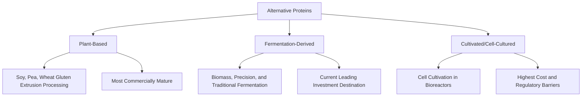
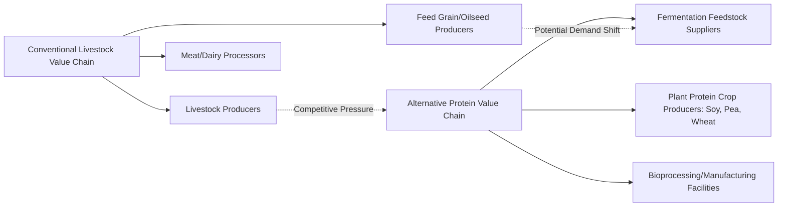

## Alternative Proteins and Food System Disruption

### Overview

Alternative proteins encompass plant-based, fermentation-derived, and cultivated (cell-cultured) protein products designed to substitute for conventional animal-source meat, dairy, and egg products. From an agricultural economics perspective, alternative proteins represent a potential structural disruption to livestock supply chains, feed grain demand, land use patterns, and the broader economic geography of animal agriculture, while simultaneously constituting a new agri-food sector with its own investment, regulatory, and market dynamics. As of 2026, the sector shows substantial category-level divergence: continued (if modest) growth in plant-based retail sales, a marked investor shift toward fermentation-derived proteins, and persistent regulatory and cost barriers constraining cultivated meat commercialization.

### The Three Primary Alternative Protein Categories

**Key Points**

1. **Plant-based proteins** — products formulated from plant protein sources (soy, pea, wheat gluten, and others) processed (often via extrusion) to mimic the taste, texture, and nutritional profile of conventional meat, dairy, or egg products; the most commercially mature category with the longest retail track record.
2. **Fermentation-derived proteins** — proteins produced using microorganisms (yeast, fungi, bacteria) through biomass fermentation (cultivating the microorganism itself as a protein source), precision fermentation (engineering microorganisms to produce specific target proteins, such as dairy or egg proteins identical to their animal-derived counterparts), or traditional fermentation techniques; this category has become the leading destination for alternative protein investment in the current period, reflecting investor reassessment of relative near-term commercial viability across the three categories.
3. **Cultivated (cell-cultured) meat** — meat produced by cultivating animal cells directly in bioreactors rather than raising and slaughtering whole animals; the least commercially mature category, facing the most significant regulatory and cost barriers to scaled commercialization.

### Current Market Status (as of 2026)

**Key Points**

Recent industry reporting indicates significant divergence in trajectory across the three sub-sectors:

- **Plant-based**: global retail sales of plant-based meat, seafood, milk, yogurt, ice cream, and cheese reached an estimated $28.9 billion in 2025, a 3% increase from 2024, though the plant-based meat and seafood subcategory specifically was estimated at $6.6 billion globally, with performance varying by region and continued sales declines in the United States offset by growth elsewhere. [Vegconomist](https://vegconomist.com/studies-numbers/gfis-2026-state-of-industry-reports-detail-mixed-year-alternative-proteins-across-three-sectors/)[Vegconomist](https://vegconomist.com/studies-numbers/gfis-2026-state-of-industry-reports-detail-mixed-year-alternative-proteins-across-three-sectors/)
- **Investment patterns**: total investment in alternative protein companies fell to $881 million in 2025 from $1.1 billion in 2024, though the pullback was highly uneven across sub-segments: plant-based funding rose 39% while fermentation and cultivated protein funding declined. [NextMSC](https://www.nextmsc.com/blogs/alternative-protein-market-trends-regulations-forecasts-for-2026)[NextMSC](https://www.nextmsc.com/blogs/alternative-protein-market-trends-regulations-forecasts-for-2026)
- **Industry consolidation**: since September 2024, more than 70 alternative protein businesses have merged, been acquired, fallen into insolvency, or ceased operations, indicating a sector-wide consolidation phase following the earlier investment boom. [Green Queen](https://www.greenqueen.com.hk/gfi-state-of-the-industry-report-2025-2026-plant-based-sales/)
- **Cultivated meat cost trajectory**: $[Unverified]$ Reported production cost reduction figures for cultivated meat vary substantially across sources and methodologies (a range of cost figures appears in current market analyses), and given the commercial sensitivity and methodological variation in how such costs are calculated and reported by different companies and analysts, specific cost figures should be verified against primary company or peer-reviewed sources rather than treated as a single settled benchmark.

### Regulatory Landscape

**Key Points**

- **Bifurcated regulatory environment**: plant-based and fermentation-derived proteins are advancing through established regulatory channels with relative clarity, while cultivated meat faces a patchwork of state-level prohibitions that materially constrain near-term commercialization in the United States. [NextMSC](https://www.nextmsc.com/blogs/alternative-protein-market-trends-regulations-forecasts-for-2026)
- **Naming and labeling disputes**: EU policymakers agreed in March 2026 to ban the use of the word "meat" and 31 related terms for fermentation-enabled, plant-based, and cultivated products, despite survey data indicating European consumers support the use of these terms for plant-based products — an ongoing policy tension between producer naming preferences, consumer comprehension research, and incumbent animal agriculture interests that continues to shape market access and marketing strategy across jurisdictions. [Vegconomist](https://vegconomist.com/studies-numbers/gfis-2026-state-of-industry-reports-detail-mixed-year-alternative-proteins-across-three-sectors/)
- $[Inference]$ The regulatory patchwork for cultivated meat specifically (varying by country and, within the U.S., by state) means market entry strategy for this category requires jurisdiction-specific legal review rather than a single national or international standard, a distinguishing feature relative to the more harmonized regulatory pathways available to plant-based products.

### Economic Rationale for Disruption Potential

**Key Points**

1. **Feed conversion efficiency argument** — conventional livestock production requires substantial feed grain inputs per unit of edible protein output (feed conversion ratios varying considerably by species), and alternative protein production processes generally bypass this feed-conversion step, forming the core efficiency argument for potential land and resource use reduction if alternative proteins scale to displace significant conventional meat consumption.
2. **Land use implications** — if achieved at scale, protein substitution away from livestock (particularly ruminant systems with comparatively higher land footprints) could theoretically reduce aggregate agricultural land demand, with downstream implications for global cropland allocation, deforestation pressure in expanding pasture/feed-crop frontiers, and grain commodity markets. $[Inference]$ The magnitude and timing of any such land-use effect depends heavily on the pace and scale of consumer adoption, which remains uncertain and contested given the mixed commercial performance data described above.
3. **Feed grain and oilseed demand linkages** — because a substantial share of global corn, soybean, and other feed grain production is currently directed toward livestock feed, sustained large-scale substitution toward alternative proteins would have material implications for feed grain demand and, consequently, commodity crop farmer income — a structural linkage of direct relevance to agricultural economics analysis of this sector, distinguishing it from a purely food-industry or consumer-product framing.

### Producer and Value Chain Implications

**Key Points**

- **Incumbent livestock sector response** — established meat, dairy, and egg producers and their industry associations have in some jurisdictions pursued labeling restrictions (as in the EU naming ban noted above) and lobbying against cultivated meat market access, reflecting a defensive posture toward what is perceived as a substitute-product competitive threat.
- **Feed and input supplier exposure** — grain and oilseed producers and their supply chains face indirect exposure to alternative protein market growth insofar as it displaces livestock feed demand, though $[Inference]$ the empirical magnitude of this displacement effect to date appears modest given the alternative protein sector's still-small absolute market share relative to total global meat and dairy consumption, and is not yet well-established as a material driver of commodity crop demand trends.
- **New agri-food value chain entrants** — fermentation-derived protein production in particular creates new upstream demand for specific feedstocks (sugars, other fermentation substrates) and downstream bioprocessing/manufacturing infrastructure, representing an emerging value chain segment distinct from traditional livestock or crop supply chains.
- **Diversification opportunities for commodity crop producers** — soy, pea, and wheat producers supplying plant-based protein extrusion processes represent an existing and potentially growing market channel for these crops, distinct from conventional food, feed, or biofuel end uses.

### Consumer Adoption Dynamics

**Key Points**

- **Price and sensory parity as adoption barriers** — closing the taste, texture, and price gap with conventional animal products remains a widely cited industry priority, with ongoing formulation research (including large ingredient-supplier product launches) aimed at improving sensory parity as a stated strategic priority for maintaining competitiveness.
- **Ultra-processed food (UPF) perception concerns** — a documented headwind noted in recent industry reporting is heightened consumer concern about the ultra-processed nature of many plant-based meat products, a perception challenge distinct from the price and taste barriers more commonly discussed in earlier industry analysis periods.
- **Category-specific adoption variation** — plant-based dairy alternatives (particularly plant-based milk) generally show more established consumer adoption and market share than plant-based meat, reflecting differing substitution ease, price sensitivity, and sensory expectation gaps across these product categories.

### Research and Policy Questions for Agricultural Economics

**Key Points**

1. **General equilibrium effects on commodity markets** — modeling the aggregate effect of varying alternative protein adoption scenarios on feed grain prices, cropland allocation, and livestock producer income, an application of the structural/general equilibrium modeling approaches discussed under structural and reduced-form modeling.
2. **Rural economic impact and transition considerations** — regions economically dependent on livestock production face potential structural adjustment challenges under significant long-run alternative protein substitution, an emerging area of applied rural economic research analogous to other agricultural structural transformation literature.
3. **Trade and comparative advantage implications** — alternative protein production (particularly fermentation and cultivated categories, which are less land- and climate-dependent than conventional livestock) could reshape international comparative advantage patterns in protein production, a longer-horizon research question given the sector's current early commercialization stage.
4. **Public investment and innovation policy** — government and philanthropic funding for open-access research infrastructure (such as publicly available cultivated meat cell line banks noted in recent industry developments) reflects an active area of innovation policy debate regarding appropriate public versus private investment roles in this emerging sector.

### Comparative Summary Table

| Dimension | Plant-Based | Fermentation-Derived | Cultivated Meat |
| --- | --- | --- | --- |
| Commercial maturity | Most mature | Emerging, currently favored by investors | Least mature |
| 2025 investment trend | Increased | Declined from prior year, but leading current-year investment share | Declined most sharply |
| Regulatory status | Relatively established pathways | Relatively established pathways | Fragmented, patchwork restrictions (notably in parts of the U.S.) |
| Primary current barrier | Sensory/price parity, UPF perception | Cost and scale-up | Cost, regulatory access, production scale |
| Agricultural input linkage | Direct (soy, pea, wheat as feedstock) | Indirect (fermentation feedstocks) | Minimal direct crop linkage |

### Related Topics

- Feed conversion ratios and livestock production efficiency comparisons
- General equilibrium modeling of protein substitution scenarios
- EU and U.S. labeling/naming regulatory disputes for alternative proteins
- Precision fermentation technology and bioprocessing economics
- Rural economic transition and structural adjustment in livestock-dependent regions
- Consumer acceptance research and ultra-processed food perception
- Public versus private investment in emerging agri-food innovation infrastructure
- Land use change modeling under varying protein substitution scenarios
- Trade and comparative advantage implications of decoupling protein production from land
- Commodity crop demand linkages to alternative protein feedstock markets