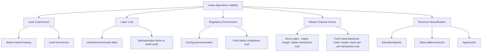

## Urban Agriculture and Local Food Systems

### Definitions and Scope

**Urban agriculture** refers to the cultivation, processing, and distribution of food and other products within and around cities (intra-urban and peri-urban zones). It encompasses a spectrum of activities: rooftop gardens, community allotments, vertical farms, aquaponics systems, urban livestock operations, and peri-urban market gardens.

**Local food systems** describe the network of production, processing, distribution, and consumption activities that occur within a bounded geographic area — typically defined by "foodshed" radius (commonly 100–250 km, though definitions vary by region and context). The economic distinction from conventional systems lies in shortened supply chains and reduced intermediation between producer and consumer.

**Key Points**

- Urban agriculture is not inherently "local food systems" — a rooftop farm shipping produce to a distant distribution hub is urban agriculture without being local in market orientation
- The two concepts overlap most strongly in direct-marketing arrangements (farmers markets, CSAs, farm-to-table)
- [Inference] Definitional inconsistency across the literature makes cross-study comparison of economic impact estimates difficult

### Economic Rationale and Theoretical Framing

#### Market Failures Addressed

Urban agriculture and local food systems are often framed as responses to specific market failures and externalities in the conventional food system:

1. **Transportation externalities**: Conventional food systems do not fully internalize carbon and congestion costs of long-distance "food miles," though the net environmental benefit of localization is contested (see Environmental Trade-offs below)
2. **Information asymmetry**: Consumers face high search costs verifying production methods, freshness, and provenance; direct sales channels reduce this asymmetry
3. **Urban land underutilization**: Vacant lots, rooftops, and brownfield sites represent underpriced or non-market land that agriculture can activate
4. **Food access gaps**: Retail redlining and "food deserts" reflect a spatial market failure where private grocery investment does not reach low-density, low-income areas

#### Land Rent and Opportunity Cost

The central economic constraint on urban agriculture is land rent. Using the standard urban land economics framework, land value at distance $d$ from the city center follows a bid-rent function:

$$R(d) = R_0 e^{-\theta d}$$

where $R_0$ is central land rent and $\theta$ is the rate of rent decline with distance. Agricultural use must compete with residential, commercial, and industrial bid-rent curves. Because agriculture generates low revenue per unit area relative to these alternatives, it is typically only viable:

- On land with near-zero opportunity cost (vacant lots, contaminated brownfields, rooftops with no alternative use)
- Where non-market values (education, community cohesion, aesthetics) are capitalized into public subsidy or philanthropic support
- In high-value-per-area production systems (microgreens, herbs, specialty produce, vertical/controlled-environment agriculture)

**Example**: A commercial vertical farm can justify high per-square-meter capital costs only by producing high-value crops (leafy greens, herbs) with rapid turnover cycles, not staple commodity crops (wheat, maize, rice), which have thin margins per unit area.

### Production Systems and Technical Typology

#### Classification by Method

| System | Typical Scale | Capital Intensity | Representative Crops |
| --- | --- | --- | --- |
| Community/allotment gardens | 10–500 m² per plot | Low | Vegetables, herbs |
| Peri-urban market gardens | 0.1–5 ha | Low–Medium | Mixed vegetables |
| Rooftop farms (soil-based) | 100–5,000 m² | Medium | Vegetables, some fruit |
| Controlled-environment/vertical farms | Variable, stacked | High | Leafy greens, herbs, microgreens |
| Aquaponics/hydroponics | Variable | Medium–High | Leafy greens, tilapia, herbs |
| Urban livestock (poultry, bees) | Small-scale | Low–Medium | Eggs, honey |

#### Controlled-Environment Agriculture (CEA) Economics

CEA systems (vertical farms, greenhouse hydroponics) substitute capital and energy for land and weather-risk. The economic trade-off can be represented in a simplified cost structure:

$$\pi = pQ - (w L + r K + c_e E)$$

where $\pi$ is profit, $p$ is output price, $Q$ is yield, $w L$ is labor cost, $r K$ is capital cost (structures, lighting, climate control), and $c_e E$ is energy cost. In most documented CEA operations, energy and capital depreciation — not labor or land — dominate the cost structure, which differentiates CEA economics sharply from conventional field agriculture where land and labor dominate. [Unverified: exact cost share proportions vary significantly by climate, energy price, and facility design, and figures reported by individual companies are often not independently audited]

### Local Food System Supply Chain Structures

#### Direct-to-Consumer Channels

- **Farmers markets**: Producer captures retail margin but bears marketing/transaction time cost
- **Community Supported Agriculture (CSA)**: Consumers pre-pay for a share of seasonal output, shifting production risk from farmer to consumer and providing farmers working capital ahead of the season
- **Farm-to-table/restaurant direct sales**: Reduces intermediary margin; requires reliable volume and food-safety compliance

#### Intermediated Local Channels

- **Food hubs**: Aggregation and distribution intermediaries that allow small producers to reach institutional buyers (schools, hospitals) without each producer bearing full logistics cost
- **Farm-to-institution procurement**: Often supported by public procurement policy requiring minimum local-sourcing percentages

**Key Points**

- Direct channels maximize producer price capture but face diseconomies of scale in transaction costs
- Intermediated local channels reintroduce some conventional-supply-chain efficiency while preserving geographic sourcing constraints
- Food hubs face a persistent economic tension: they must charge margins sufficient to cover aggregation/logistics costs while remaining competitive with conventional wholesale pricing

### Diagram: Local Food System Value Chain Structures (svg_diagram)

<svg xmlns="http://www.w3.org/2000/svg" viewBox="0 0 900 420" font-family="Helvetica, Arial, sans-serif">
<text x="450" y="30" text-anchor="middle" font-size="18" font-weight="bold">Local Food Value Chain Structures (svg_diagram)</text>

<rect x="40" y="60" width="150" height="50" rx="6" fill="#dff0d8" stroke="#3c763d" />
<text x="115" y="90" text-anchor="middle" font-size="13">Producer</text>
<line x1="190" y1="85" x2="290" y2="85" stroke="#333" stroke-width="2" marker-end="url(#arrow)" />
<rect x="290" y="60" width="150" height="50" rx="6" fill="#d9edf7" stroke="#31708f" />
<text x="365" y="90" text-anchor="middle" font-size="13">Consumer (CSA/Market)</text>

<rect x="40" y="160" width="150" height="50" rx="6" fill="#dff0d8" stroke="#3c763d" />
<text x="115" y="190" text-anchor="middle" font-size="13">Producer</text>
<line x1="190" y1="185" x2="290" y2="185" stroke="#333" stroke-width="2" marker-end="url(#arrow)" />
<rect x="290" y="160" width="150" height="50" rx="6" fill="#fcf8e3" stroke="#8a6d3b" />
<text x="365" y="182" text-anchor="middle" font-size="12">Food Hub</text>
<text x="365" y="198" text-anchor="middle" font-size="11">(aggregation)</text>
<line x1="440" y1="185" x2="540" y2="185" stroke="#333" stroke-width="2" marker-end="url(#arrow)" />
<rect x="540" y="160" width="150" height="50" rx="6" fill="#d9edf7" stroke="#31708f" />
<text x="615" y="182" text-anchor="middle" font-size="12">Institutional Buyer</text>
<text x="615" y="198" text-anchor="middle" font-size="11">(school, hospital)</text>

<rect x="40" y="260" width="150" height="50" rx="6" fill="#dff0d8" stroke="#3c763d" />
<text x="115" y="290" text-anchor="middle" font-size="13">Producer</text>
<line x1="190" y1="285" x2="270" y2="285" stroke="#333" stroke-width="2" marker-end="url(#arrow)" />
<rect x="270" y="260" width="130" height="50" rx="6" fill="#f2dede" stroke="#a94442" />
<text x="335" y="290" text-anchor="middle" font-size="12">Processor</text>
<line x1="400" y1="285" x2="480" y2="285" stroke="#333" stroke-width="2" marker-end="url(#arrow)" />
<rect x="480" y="260" width="130" height="50" rx="6" fill="#f2dede" stroke="#a94442" />
<text x="545" y="290" text-anchor="middle" font-size="12">Distributor</text>
<line x1="610" y1="285" x2="690" y2="285" stroke="#333" stroke-width="2" marker-end="url(#arrow)" />
<rect x="690" y="260" width="150" height="50" rx="6" fill="#d9edf7" stroke="#31708f" />
<text x="765" y="290" text-anchor="middle" font-size="12">Retailer/Consumer</text>

<text x="450" y="360" text-anchor="middle" font-size="12" fill="#555">Fewer intermediary nodes generally raise producer price-capture but shift transaction/logistics cost onto producers or aggregators.</text>

</svg>

### Policy Instruments

#### Land-Based Instruments

- **Vacant lot leasing programs**: Municipalities lease city-owned land at below-market rates for urban farming, converting a non-revenue liability (maintenance, blight) into productive use
- **Land trusts**: Nonprofit ownership structures that remove land from speculative markets, providing long-term tenure security for urban growers
- **Zoning reform**: Permitting agricultural use in residential/commercial zones, addressing regulatory barriers rather than market ones

#### Fiscal Instruments

- **Tax abatements**: Reduced property tax assessments for land in active agricultural use
- **Grants and cost-share programs**: Capital subsidies for infrastructure (hoop houses, irrigation, rooftop structural reinforcement)
- **SNAP/EBT matching programs** (in the U.S. context) and analogous food-assistance matching schemes: Double the purchasing power of low-income consumers at farmers markets, simultaneously addressing access and producer revenue

#### Procurement Instruments

- **Farm-to-school/farm-to-institution mandates**: Public sector uses procurement policy to guarantee demand for local producers, reducing market risk

**Key Points**

- Land-based instruments address the dominant economic constraint (rent) directly
- Fiscal instruments address the residual profitability gap after land constraints are relaxed
- Procurement instruments address demand-side risk and market access, which can be as binding a constraint as supply-side cost

### Environmental and Social Trade-offs

#### The "Food Miles" Contention

A common justification for local food systems is reduced transportation emissions. However, [Inference] the academic literature indicates this argument is more nuanced than commonly presented in popular discourse:

- Transportation typically represents a small share (often cited as under 15%, though estimates vary by study and food category) of total lifecycle greenhouse gas emissions in food systems, with production-phase emissions (fertilizer, land use, enteric fermentation for livestock) often dominating
- Large-scale conventional production can have lower per-unit emissions due to economies of scale in energy use, even after accounting for transport, compared to small-scale local production using less efficient methods or energy-intensive CEA systems
- [Speculation] The net emissions comparison is highly case-specific (crop type, production method, transport mode, regional climate) and resists blanket generalization in either direction

#### Social and Distributional Considerations

- Urban agriculture is frequently promoted as an equity tool addressing food deserts, but [Inference] evidence on whether urban farms and farmers markets meaningfully improve dietary outcomes in low-income neighborhoods is mixed, partly because price and time constraints, not just physical proximity, drive food access
- Community garden and urban agriculture initiatives can contribute to green gentrification, where amenity improvements raise surrounding property values and rents, potentially displacing the low-income populations initially targeted for benefit [Inference]

### Economic Viability and Common Failure Modes

#### Cost Structure Challenges

Common documented barriers to financial sustainability in urban farming ventures:

- High land acquisition or lease costs where below-market land is unavailable
- Regulatory compliance costs (food safety certification, zoning variances) disproportionately burdensome relative to small-scale revenue
- Labor cost intensity — urban agriculture is typically more labor-intensive per unit output than mechanized rural agriculture, and urban labor markets command higher wages
- Limited economies of scale due to constrained land parcel sizes

#### Revenue Diversification Strategies

Many urban farms document dependence on non-sales revenue streams for viability:

- Education and workshop fees
- Grant and philanthropic funding
- Agritourism and event hosting
- Value-added product sales (processed goods with higher margins than raw produce)

**Example**: A 0.5-hectare urban farm generating $40,000 annually from produce sales alone may operate at a loss once labor and overhead are fully costed, but the same operation supplemented with $25,000 in educational program fees and grants can reach breakeven. [Inference] This blended-revenue model is widely reported in case studies of nonprofit urban farms, though it is less descriptive of for-profit CEA ventures, which rely on sales revenue and investor capital.

### Measuring Local Food System Impact

#### Common Metrics

$$\text{Local Food Multiplier} = \frac{\Delta \text{Regional Output}}{\Delta \text{Local Food Spending}}$$

Economic multiplier studies attempt to estimate how much additional regional economic activity is generated per dollar spent on local food, based on the premise that money spent locally recirculates through the regional economy longer than money spent on imported goods before leaking out.

**Key Points**

- Multiplier estimates are highly sensitive to regional economic structure (import dependency, local processing capacity) and methodology (input-output vs. survey-based)
- [Unverified] Widely-cited multiplier figures from advocacy-oriented studies should be treated cautiously due to potential selection in reporting and methodological transparency issues

### Diagram: Determinants of Urban Agriculture Viability

### Conclusion

Urban agriculture and local food systems are best understood as economically constrained by urban land rent and labor cost structures, with viability typically achieved through some combination of below-market land access, revenue diversification beyond raw produce sales, and public policy support (fiscal, procurement, or regulatory). Their environmental and equity benefits, while frequently cited as primary justifications, are more empirically contested and context-dependent than commonly assumed in popular discourse — this does not negate their value, but argues for case-specific economic and environmental assessment rather than categorical claims.

**Related Topics**

- Food desert mapping and spatial access analysis methods
- Controlled-environment agriculture (CEA) capital budgeting and energy economics
- Vertical farming business models and venture capital trends [Inference: fast-evolving subsector, recommend web search for current data]
- Life-cycle assessment (LCA) methodology for food systems
- Agricultural land trusts and conservation easements
- Farm-to-institution procurement policy design
- Green gentrification and equitable development frameworks
- CSA (Community Supported Agriculture) risk-sharing economic models
- Peri-urban land use conflict and the rural-urban fringe
- Food hub logistics and last-mile distribution economics