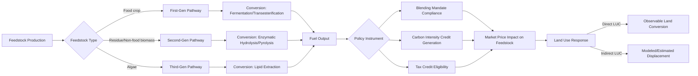

## Bioeconomy and Biofuel Policy

### Definitions and Scope

The **bioeconomy** encompasses all economic activity derived from the sustainable production and conversion of renewable biological resources — agricultural feedstocks, forestry residues, algae, and organic waste — into food, feed, materials, chemicals, and energy. It represents a substitution strategy: replacing fossil-carbon inputs with biogenic-carbon inputs across multiple sectors simultaneously.

**Biofuel policy** is the subset of bioeconomy policy specifically governing liquid and gaseous fuels derived from biomass — primarily ethanol, biodiesel, renewable diesel, and biogas — used as substitutes or blending components for petroleum-based transportation fuel.

**Key Points**

- The bioeconomy is broader than biofuels; biofuels are often the largest-volume application by mass but not necessarily the highest-value application (bioplastics, specialty chemicals, and pharmaceuticals can command substantially higher prices per unit of feedstock)
- Biofuel policy interacts directly with agricultural commodity markets because feedstocks (corn, soybeans, sugarcane, vegetable oils) are also food and feed commodities

### Biofuel Generations and Feedstock Classification

| Generation | Feedstock | Representative Fuel | Key Characteristic |
| --- | --- | --- | --- |
| First-generation | Food crops (corn, sugarcane, soybean, palm oil) | Corn ethanol, sugarcane ethanol, biodiesel | Mature technology; direct food-fuel competition |
| Second-generation | Lignocellulosic biomass, crop residues, non-food energy crops | Cellulosic ethanol | Avoids direct food competition; higher processing cost |
| Third-generation | Algae | Algal biodiesel | High theoretical yield per hectare; commercialization remains limited |
| Fourth-generation | Genetically engineered organisms, carbon-capture-integrated systems | Various | [Speculation] Largely pre-commercial; claims about yield and carbon-negativity require case-specific verification |

**Key Points**

- Most policy-supported biofuel volume produced today remains first-generation, despite decades of second-generation research investment
- [Inference] The persistent gap between second-generation potential and commercial deployment reflects capital cost and feedstock logistics challenges (collection, storage, and transport of low-density biomass) rather than a lack of conversion technology per se

### Core Economic Rationale for Policy Intervention

Biofuel policy is typically justified by three overlapping rationales, each with distinct — and sometimes conflicting — economic logic:

1. **Energy security**: Reducing dependence on imported petroleum by substituting domestically-produced biomass-derived fuel
2. **Rural/agricultural income support**: Creating additional demand for agricultural commodities, effectively functioning as an indirect farm subsidy mechanism
3. **Greenhouse gas mitigation**: Displacing fossil fuel carbon emissions with biogenic carbon that is (in theory) recaptured in the next growing cycle

**Key Points**

- These three rationales do not always point toward the same policy design. A policy optimized for rural income support (favoring high-volume, low-cost first-generation feedstocks) may underperform on emissions rationale relative to a policy favoring second-generation cellulosic feedstocks
- [Inference] This tension helps explain why biofuel policy in most jurisdictions is a political compromise rather than a technically optimized single-objective instrument

### Major Policy Instrument Types

#### Blending Mandates

Governments require that a minimum volume or percentage of transportation fuel sold consist of biofuel. Structured either as:

- **Volumetric mandates**: A fixed volume target (e.g., billions of gallons/liters per year)
- **Percentage mandates**: A required blend ratio (e.g., E10 = 10% ethanol blend)

Mandates shift the biofuel demand curve to be administratively fixed rather than price-responsive, which has the economic effect of decoupling biofuel producer revenue from petroleum price signals to a significant degree.

#### Tax Credits and Subsidies

- **Production tax credits**: Per-unit-volume payments to producers (blenders or producers, depending on jurisdiction design)
- **Feedstock-specific credits**: Differentiated incentive rates based on feedstock type or carbon intensity, used to steer investment toward lower-carbon-intensity pathways

#### Low-Carbon Fuel Standards (LCFS) and Carbon Intensity Crediting

Rather than mandating volume, these systems set a declining carbon-intensity (CI) benchmark for the transportation fuel pool and allow tradable credits generated by fuels below the benchmark, purchased by fuels above it. The credit price is determined by:

$$P_{credit} = f(\text{CI}_{benchmark} - \text{CI}_{fuel})$$

where fuels with larger carbon-intensity reductions relative to the benchmark generate proportionally more credits. This creates a continuous economic incentive to reduce lifecycle carbon intensity, in contrast to blending mandates, which reward volume regardless of relative carbon performance within the qualifying category.

**Key Points**

- LCFS-type systems are more economically efficient at targeting the GHG-mitigation rationale specifically, since they reward carbon performance directly rather than volume
- Blending mandates are more directly effective at the rural-income-support rationale, since they guarantee a demand floor regardless of relative carbon intensity
- [Inference] Jurisdictions with both mandate and credit-trading systems operating concurrently face a more complex incentive structure where the binding constraint (whichever policy requires the larger biofuel volume/quality at a given point) determines actual market behavior

### Diagram: Biofuel Policy Instrument Comparison (svg_diagram)

<svg xmlns="http://www.w3.org/2000/svg" viewBox="0 0 900 380" font-family="Helvetica, Arial, sans-serif">
<text x="450" y="28" text-anchor="middle" font-size="17" font-weight="bold">Biofuel Policy Instrument Comparison (svg_diagram)</text>
<line x1="80" y1="60" x2="80" y2="330" stroke="#333" stroke-width="1.5" />
<line x1="80" y1="330" x2="860" y2="330" stroke="#333" stroke-width="1.5" />
<text x="40" y="200" text-anchor="middle" font-size="12" transform="rotate(-90 40,200)">GHG Targeting Precision</text>
<text x="470" y="360" text-anchor="middle" font-size="12">Volume/Demand Guarantee Strength</text>
<circle cx="200" cy="290" r="12" fill="#a94442" />
<text x="200" y="315" text-anchor="middle" font-size="12">Blending Mandate</text>
<text x="200" y="330" text-anchor="middle" font-size="10" dy="14">(volumetric)</text>
<circle cx="650" cy="110" r="12" fill="#3c763d" />
<text x="650" y="95" text-anchor="middle" font-size="12">Low-Carbon Fuel Standard</text>
<text x="650" y="130" text-anchor="middle" font-size="10">(carbon-intensity credit)</text>
<circle cx="420" cy="200" r="12" fill="#31708f" />
<text x="420" y="185" text-anchor="middle" font-size="12">Production Tax Credit</text>

<text x="450" y="30" opacity="0"> </text>

</svg>

### Market Interactions: Feedstock Price Transmission

Biofuel demand mandates create an artificial demand floor that shifts agricultural commodity markets. The transmission mechanism can be represented via a partial equilibrium relationship:

$$Q_{food} + Q_{biofuel} = Q_{total\ demand}$$

When $Q_{biofuel}$ is policy-determined (via mandate) rather than price-responsive, an increase in the mandate shifts total demand outward at every price level, which — holding supply constant — raises the equilibrium commodity price $P^*$.

**Example**: U.S. corn ethanol policy has historically been documented as a significant driver of increased corn acreage and price levels relative to a no-mandate counterfactual, though the precise magnitude is contested across studies due to differing model assumptions about supply elasticity and co-product (distillers grains) feedback effects. [Unverified: quantitative magnitude estimates vary substantially by study methodology and time period; treat specific percentage figures from any single source with caution]

**Key Points**

- Price transmission effects extend beyond the direct feedstock (e.g., corn-ethanol mandates affecting soybean and wheat prices via land-use competition for acreage)
- Co-products (distillers dried grains with solubles from ethanol production, glycerin from biodiesel) partially offset net feedstock demand by substituting for other feed/chemical inputs
- International price transmission occurs when a large biofuel-producing country's mandate affects globally-traded commodity prices, with distributional effects on food-importing nations [Inference]

### Land Use Change and Lifecycle Carbon Accounting

#### Direct vs. Indirect Land Use Change (LUC)

- **Direct land use change**: Conversion of land specifically to grow biofuel feedstock (e.g., converting grassland to corn cropland)
- **Indirect land use change (ILUC)**: When biofuel feedstock demand displaces existing food/feed production onto previously uncultivated land elsewhere (including internationally), an effect that is difficult to measure directly and is estimated via economic modeling rather than observed directly

**Key Points**

- ILUC estimates are among the most methodologically contested figures in biofuel lifecycle assessment, since they depend on modeled counterfactuals (what would have happened to that land absent the policy) rather than observed data
- [Speculation] Because ILUC estimation requires assumptions about global agricultural market elasticities, land conversion rates, and yield responses, different modeling frameworks (e.g., partial equilibrium vs. general equilibrium approaches) can produce materially different results for the same feedstock and policy scenario
- Regulatory frameworks that incorporate ILUC into carbon-intensity scoring (such as certain LCFS designs) face ongoing methodological revision as models are updated

### Diagram: Feedstock-to-Policy Pathway

### International Policy Comparison Framework

| Dimension | Volumetric Mandate Approach | Carbon-Intensity Credit Approach |
| --- | --- | --- |
| Primary lever | Required blend percentage/volume | Declining carbon-intensity benchmark |
| Price signal | Indirect (compliance cost embedded in fuel price) | Direct (tradable credit price) |
| Feedstock neutrality | Often favors highest-volume, lowest-cost feedstock | Favors lowest-carbon-intensity feedstock regardless of volume |
| Administrative complexity | Moderate (volume tracking, compliance certificates) | High (lifecycle carbon-intensity modeling per pathway) |
| Typical political driver | Agricultural/rural income support | Climate policy integration |

**Key Points**

- Many jurisdictions layer multiple instrument types concurrently, creating compounding rather than substitutable incentive structures
- [Inference] Comparative policy effectiveness assessments are complicated by the fact that jurisdictions differ simultaneously in feedstock availability, existing agricultural structure, and fuel market characteristics, making clean causal attribution of any single instrument's effect difficult

### Bioeconomy Beyond Fuel: Value-Added Alternatives

The broader bioeconomy includes competing end-uses for the same feedstock base, which creates cross-market allocation questions:

- **Bioplastics and biochemicals**: Often command higher per-unit-feedstock value than fuel applications, but face smaller addressable market volume
- **Biomaterials** (e.g., mycelium-based materials, bio-based construction inputs): Emerging, generally smaller-scale commercially [Inference: rapidly evolving subsector; current market data should be verified via web search for up-to-date figures]
- **Bioenergy for stationary power/heat** (biogas, biomass combustion): Competes with biofuel production for the same residue and waste-stream feedstocks in circular-economy contexts

**Key Points**

- Feedstock allocation across these competing uses is generally governed by relative price signals and policy incentive design rather than a centrally planned allocation, except where specific policies (e.g., waste-diversion mandates) direct particular feedstock streams to particular uses
- [Speculation] As carbon-intensity crediting systems mature, some analysts anticipate feedstock reallocation toward whichever end-use generates the highest total value per unit of biogenic carbon processed, though this remains an evolving area without settled empirical consensus

### Conclusion

Biofuel and bioeconomy policy sit at the intersection of energy, agricultural, and climate policy domains, each pulling instrument design in a different direction. Blending mandates most directly serve agricultural income-support and energy-security objectives, while carbon-intensity crediting systems more precisely target emissions reduction — and most real-world policy regimes combine elements of both, producing compounded rather than singular economic incentives. Feedstock price transmission to agricultural commodity markets, and the associated land-use change questions, remain the most economically and methodologically contested dimensions of biofuel policy evaluation, warranting case-specific rather than generalized treatment.

**Related Topics**

- Renewable Fuel Standard (RFS) design and Renewable Identification Number (RIN) credit markets
- Life-cycle assessment (LCA) methodology and functional unit selection in bioenergy studies
- Agricultural commodity price volatility and futures market interactions
- Circular bioeconomy and waste-to-value feedstock streams
- Sustainable Aviation Fuel (SAF) policy and feedstock competition [Inference: fast-evolving policy area, recommend web search for current mandates/incentives]
- Carbon border adjustment mechanisms and bioeconomy trade implications
- Agroforestry and perennial energy crop economics
- Second-generation cellulosic conversion technology cost curves