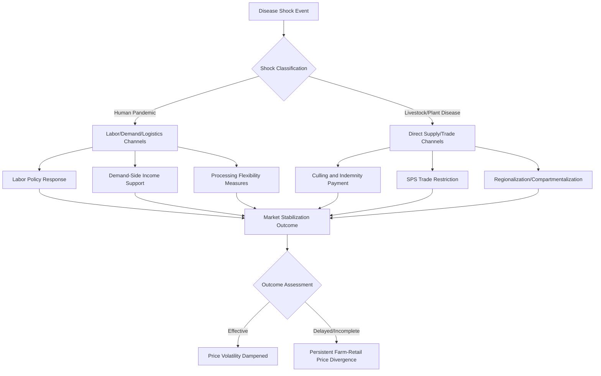

## Pandemic and Disease Shock Impacts on Agricultural Markets

### Definitions and Scope

**Disease shocks** affecting agricultural markets fall into two analytically distinct categories that operate through different transmission channels:

1. **Human disease shocks** (pandemics/epidemics): Affect agricultural markets primarily through labor supply disruption, demand-side changes (income shocks, altered consumption patterns), and logistics/supply-chain interruption
2. **Agricultural disease shocks** (livestock and plant disease outbreaks): Affect markets primarily through direct supply destruction, trade restrictions (sanitary and phytosanitary measures), and production-system restructuring

**Key Points**

- These two categories are sometimes analyzed together in agricultural economics because both represent exogenous supply/demand shocks that propagate through similar market mechanisms (price transmission, storage/inventory response, trade policy response), but the underlying biological and economic mechanisms differ substantially
- A comprehensive treatment requires distinguishing shock type before generalizing about market response patterns

### Human Pandemic Transmission Channels to Agricultural Markets

#### Labor Supply Disruption

Agricultural production, particularly labor-intensive specialty crop and livestock processing sectors, is highly exposed to human illness and workforce disruption through:

- Direct illness reducing available farm and processing labor
- Movement restrictions (quarantines, border closures) disproportionately affecting migrant and seasonal agricultural labor, which many high-income-country horticulture and livestock sectors depend on structurally
- Meatpacking and processing facility disruptions, where labor-intensive, close-proximity work environments have been documented as high-transmission settings during respiratory pandemics

#### Demand-Side Channels

- **Income effects**: Pandemic-induced unemployment and income loss shift consumer demand along the income elasticity of demand for different food categories, typically increasing demand for staple, lower-cost calories and decreasing demand for higher-value items (restaurant meals, premium cuts, specialty produce)
- **Channel shift**: Food-service (restaurant, institutional) demand can collapse rapidly while at-home/retail demand rises, requiring supply chains built around one channel to rapidly reallocate — a structural mismatch since food-service and retail packaging, processing, and logistics infrastructure are often not interchangeable in the short run
- **Precautionary stockpiling**: Consumer-level panic buying can temporarily spike retail demand independent of underlying consumption needs, straining short-run supply chain capacity even when aggregate supply is adequate

#### Logistics and Supply Chain Disruption

- Border and port delays affecting perishable goods disproportionately, given time-sensitive spoilage constraints
- Processing bottlenecks (e.g., meatpacking plant closures) creating a paradoxical simultaneous farm-level oversupply (live animals with no processing capacity) and retail-level shortage

**Example**: During large-scale meatpacking facility disruptions, live animal producers can face a situation where animals are ready for market but processing capacity is constrained, leading to herd/flock backlogs, increased on-farm holding costs, and in severe cases, culling of animals that cannot be processed or held — while simultaneously retail meat prices rise due to processed-product scarcity. This exemplifies a bottleneck-driven price divergence between farm-gate and retail price levels.

### Diagram: Pandemic Shock Transmission Pathways (svg_diagram)

<svg xmlns="http://www.w3.org/2000/svg" viewBox="0 0 900 460" font-family="Helvetica, Arial, sans-serif">
<text x="450" y="28" text-anchor="middle" font-size="17" font-weight="bold">Pandemic Shock Transmission to Agricultural Markets (svg_diagram)</text>
<rect x="370" y="50" width="160" height="45" rx="6" fill="#f2dede" stroke="#a94442" />
<text x="450" y="77" text-anchor="middle" font-size="13">Pandemic Onset</text>
<line x1="450" y1="95" x2="200" y2="140" stroke="#333" stroke-width="1.5" marker-end="url(#arrow2)" />
<line x1="450" y1="95" x2="450" y2="140" stroke="#333" stroke-width="1.5" marker-end="url(#arrow2)" />
<line x1="450" y1="95" x2="700" y2="140" stroke="#333" stroke-width="1.5" marker-end="url(#arrow2)" />
<rect x="100" y="140" width="200" height="55" rx="6" fill="#fcf8e3" stroke="#8a6d3b" />
<text x="200" y="163" text-anchor="middle" font-size="12">Labor Supply Shock</text>
<text x="200" y="180" text-anchor="middle" font-size="10">(illness, movement restriction)</text>
<rect x="350" y="140" width="200" height="55" rx="6" fill="#fcf8e3" stroke="#8a6d3b" />
<text x="450" y="163" text-anchor="middle" font-size="12">Logistics Disruption</text>
<text x="450" y="180" text-anchor="middle" font-size="10">(borders, processing)</text>
<rect x="600" y="140" width="200" height="55" rx="6" fill="#fcf8e3" stroke="#8a6d3b" />
<text x="700" y="163" text-anchor="middle" font-size="12">Demand-Side Shift</text>
<text x="700" y="180" text-anchor="middle" font-size="10">(income, channel shift)</text>
<line x1="200" y1="195" x2="330" y2="250" stroke="#333" stroke-width="1.5" marker-end="url(#arrow2)" />
<line x1="450" y1="195" x2="400" y2="250" stroke="#333" stroke-width="1.5" marker-end="url(#arrow2)" />
<line x1="700" y1="195" x2="500" y2="250" stroke="#333" stroke-width="1.5" marker-end="url(#arrow2)" />
<rect x="280" y="250" width="280" height="55" rx="6" fill="#d9edf7" stroke="#31708f" />
<text x="420" y="273" text-anchor="middle" font-size="12">Farm-Gate / Retail Price Divergence</text>
<text x="420" y="290" text-anchor="middle" font-size="10">(processing bottleneck effect)</text>
<line x1="420" y1="305" x2="420" y2="345" stroke="#333" stroke-width="1.5" marker-end="url(#arrow2)" />
<rect x="280" y="345" width="280" height="55" rx="6" fill="#dff0d8" stroke="#3c763d" />
<text x="420" y="368" text-anchor="middle" font-size="12">Policy Response</text>
<text x="420" y="385" text-anchor="middle" font-size="10">(trade restriction, stockpile release, subsidy)</text>
</svg>

### Agricultural (Livestock/Plant) Disease Transmission Channels

#### Direct Supply Destruction

Livestock diseases (e.g., African Swine Fever, Highly Pathogenic Avian Influenza, Foot-and-Mouth Disease) and plant diseases/pests (e.g., wheat rust strains, banana Fusarium wilt) reduce supply directly through:

- Mortality and mandatory culling of infected/exposed populations
- Reduced productivity in surviving populations (lower yields, reduced reproductive rates)
- Quarantine zones restricting movement of animals/products even from unaffected areas within a region

#### Trade Policy Transmission: Sanitary and Phytosanitary (SPS) Measures

Disease outbreaks frequently trigger trading-partner import bans or restrictions justified under SPS provisions (recognized under WTO frameworks), which can be regionalized (banning imports only from affected zones) or blanket (banning all imports from the origin country regardless of outbreak location).

**Key Points**

- The economic severity of an SPS-triggered trade restriction depends heavily on whether trading partners apply regionalization (compartmentalization) versus country-wide bans — a country-wide ban imposes losses far beyond the directly affected production zone
- [Inference] SPS measures can be economically ambiguous in intent — while grounded in legitimate biological risk management, restriction scope and duration decisions are also influenced by trading-partner domestic industry protection interests, a tension frequently discussed in agricultural trade policy literature
- Disease-driven trade restrictions can persist beyond the epidemiological risk period due to administrative and political friction in reopening markets

### Market Adjustment Mechanisms

#### Price Transmission and Volatility

$$P_t = P_{t-1} + \alpha (\text{Supply Shock}_t) + \beta(\text{Demand Shock}_t) + \varepsilon_t$$

Disease shocks that are geographically concentrated but affect globally-traded commodities transmit price effects internationally, with transmission strength depending on:

- Trade openness of affected and unaffected producing regions
- Storage/inventory buffer capacity available to smooth the shock
- Substitutability between affected and unaffected supply sources (e.g., pork demand shifting to poultry during an African Swine Fever outbreak)

#### Storage and Inventory Response

Storable commodities (grains) can buffer disease/pandemic shocks through inventory drawdown, while highly perishable commodities (fresh produce, fluid milk) cannot, resulting in categorically different price volatility profiles between storable and non-storable agricultural goods during equivalent-magnitude shocks.

**Example**: During the COVID-19 pandemic's initial disruption phase, dairy producers in several regions faced circumstances where fluid milk could not be redirected from disrupted food-service channels to retail channels quickly enough (due to packaging and processing-line incompatibilities), leading to reported on-farm milk dumping even as retail milk experienced localized availability constraints — illustrating the non-storability constraint combined with channel-specific infrastructure rigidity. [Unverified: scale and duration of dumping varied substantially by region and dairy cooperative structure; treat specific volume figures from any single source with caution]

### Policy Response Instruments

| Instrument | Applicable Shock Type | Mechanism |
| --- | --- | --- |
| Strategic reserve release | Both | Buffers price spikes using pre-positioned stockpiles |
| Trade restriction/SPS measures | Agricultural disease | Limits disease spread via movement/import control |
| Compensation/indemnity payments | Agricultural disease | Compensates producers for mandated culling, preserving disease-reporting incentives |
| Labor policy adjustment (essential worker designation, visa flexibility) | Human pandemic | Maintains agricultural labor supply during broader movement restrictions |
| Emergency income/price support | Human pandemic (demand shock) | Offsets farm revenue loss from demand collapse |
| Processing capacity flexibility measures | Human pandemic (logistics) | Eases regulatory constraints to enable channel reallocation (e.g., retail-restaurant repackaging) |

**Key Points**

- Indemnity payment design carries an important incentive dimension: adequate compensation for culled livestock encourages timely disease reporting by producers, whereas inadequate compensation can create incentives to conceal outbreaks, potentially worsening disease spread — a moral hazard consideration central to livestock disease policy design
- [Inference] The effectiveness of labor-policy interventions during human pandemics is constrained by the underlying structural dependency of certain agricultural subsectors on migrant/seasonal labor, meaning policy flexibility alone cannot fully substitute for actual labor availability if broader movement restrictions remain binding

### Diagram: Disease Shock Type and Policy Response Matrix

### Long-Run Structural Effects

Beyond immediate shock absorption, repeated or severe disease shocks have been associated with longer-run structural adjustments in agricultural markets:

- **Supply chain diversification**: Buyers and processors increasing supplier geographic diversification to reduce concentration risk following a disruptive shock
- **Vertical integration shifts**: Large processors may increase direct control over production stages to manage disease/biosecurity risk more directly
- **Biosecurity investment**: Increased on-farm and processing-facility investment in disease prevention infrastructure following major outbreaks, representing a shift from reactive to preventive risk management
- **Trade pattern persistence**: [Inference] Some research suggests that trade flow disruptions from disease-related bans can have effects lasting beyond the immediate biological risk period, as alternative supplier relationships established during the restriction period persist due to switching costs and contract relationships, though the degree of persistence varies by case and is not universal

### Conclusion

Pandemic and disease shocks affect agricultural markets through distinguishable but sometimes overlapping channels: human pandemics primarily disrupt labor, demand patterns, and logistics, while agricultural diseases primarily destroy supply directly and trigger trade policy responses. In both cases, the storability of the affected commodity, the flexibility of downstream processing/logistics infrastructure, and the design of compensation and trade-policy instruments substantially determine whether shocks translate into transient price volatility or more persistent structural market change. Policy design in this domain must balance biological risk management, producer incentive compatibility (particularly indemnity design), and the practical limits of short-run supply chain reconfiguration.

**Related Topics**

- Strategic food reserve design and stockpile release triggers
- WTO Sanitary and Phytosanitary (SPS) Agreement and dispute mechanisms
- Agricultural labor markets and migrant/seasonal worker policy
- Livestock disease indemnity program design and moral hazard
- Food supply chain resilience and diversification strategy
- Price transmission modeling in storable vs. perishable commodity markets
- One Health frameworks linking animal, human, and ecosystem disease risk
- Meat and dairy processing industry concentration and biosecurity investment