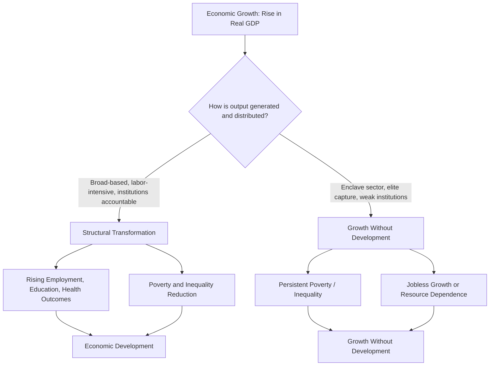

## Defining Economic Development Versus Economic Growth

### Overview

Economic growth and economic development are related but analytically distinct concepts in Development Economics. Growth refers to a quantitative increase in an economy's output, while development refers to a broader, qualitative transformation of an economy's structure, institutions, and the wellbeing of its population. Conflating the two leads to policy errors, most notably the assumption that rising GDP automatically translates into improved living standards for the majority of a population.

### Economic Growth: Definition and Measurement

**Key Points**

- Economic growth is defined as an increase in the real output of goods and services produced by an economy over a period of time, typically measured as the percentage change in real Gross Domestic Product (GDP) or real GDP per capita.
- It is a quantitative measure: it captures "more" of the same kind of economic activity, not necessarily "better" or more equitably distributed activity.
- Standard measurement uses the growth rate formula:

$$g_t = \frac{Y_t - Y_{t-1}}{Y_{t-1}} \times 100$$

where $Y_t$ is real output (real GDP) in period $t$ and $Y_{t-1}$ is real output in the prior period.

- Growth can occur through capital accumulation, labor force expansion, technological progress, or improvements in total factor productivity (TFP), as formalized in growth models such as the Solow-Swan model.
- Growth is agnostic about distribution: an economy can register high growth while inequality widens, poverty persists, or environmental capital is depleted.

**Example**

A country's real GDP rises from $200 billion to $210 billion in one year. The growth rate is:

$$g = \frac{210 - 200}{200} \times 100 = 5\%$$

This 5% figure says nothing about whether unemployment fell, whether the additional output was concentrated in a resource-extraction enclave employing few people, or whether the poorest households saw any income gain. It is purely an aggregate output statistic.

### Economic Development: Definition and Scope

**Key Points**

- Economic development is a broader, multidimensional process encompassing sustained improvements in living standards, structural transformation of the economy, poverty reduction, expansion of human capabilities, and institutional change.
- Michael Todaro and Stephen Smith, in a widely used development economics framework, define development as a process that must satisfy three core values: **sustenance** (the ability to meet basic needs), **self-esteem** (a sense of worth and dignity, not dependent on others), and **freedom from servitude** (the expansion of the range of choices available to individuals and societies, i.e., "freedom to choose").
- Amartya Sen's "capability approach" reframes development as the expansion of substantive freedoms and capabilities people have to lead lives they value, rather than simply the expansion of income or commodities. This view underpins the Human Development Index (HDI).
- Development is inherently normative: it involves value judgments about what constitutes a "better" state of society (e.g., reduced infant mortality, higher literacy, expanded political freedoms), whereas growth measurement is comparatively value-neutral (it just counts output).
- Structural transformation is a central marker of development: a shift in the composition of output and employment from low-productivity agriculture toward higher-productivity manufacturing and services, typically accompanied by urbanization.

**Example**

Two countries both grow real GDP by 6% annually over a decade.

- Country A: growth is driven by an oil sector employing 2% of the labor force; profits are repatriated or captured by a narrow elite; literacy and life expectancy stagnate; poverty rates barely move.
- Country B: growth is driven by labor-intensive manufacturing and agricultural productivity gains; employment expands broadly; public investment in education and health accompanies rising incomes; poverty and infant mortality decline; life expectancy rises.

Both register identical growth rates, but only Country B is experiencing economic development in the substantive sense used in the discipline.

### Core Distinctions

| Dimension | Economic Growth | Economic Development |
| --- | --- | --- |
| Nature | Quantitative | Quantitative and qualitative |
| Primary metric | Real GDP / GDP per capita | Multidimensional indices (HDI, poverty headcount, inequality, life expectancy, literacy) |
| Scope | Narrow (aggregate output) | Broad (structure, institutions, capabilities, welfare) |
| Timeframe focus | Can be short- or long-run | Inherently a long-run, structural process |
| Distributional concern | Not addressed | Central concern |
| Value orientation | Largely descriptive/positive | Normative (embeds judgments about wellbeing) |
| Necessary vs. sufficient | Growth is generally necessary but not sufficient for development | Development typically requires sustained growth as an input, but is not reducible to it |

### The "Growth Without Development" Phenomenon

**Key Points**

- Growth without development, sometimes discussed under the label **"immiserizing growth"** or, in resource contexts, the **"resource curse" / "Dutch disease"**, describes situations where aggregate output rises while poverty, inequality, or human welfare fail to improve, or even worsen.
- Common mechanisms include: growth concentrated in capital-intensive or enclave sectors (mining, oil) that generate few jobs; growth captured by rent-seeking elites amid weak institutions; jobless growth, where output rises through automation or productivity gains without proportional employment growth; and growth that degrades environmental capital, undermining future welfare.
- Dutch disease is a specific and well-documented case: a resource export boom appreciates the real exchange rate, eroding the competitiveness of other tradable sectors (notably manufacturing), a mechanism formally analyzed in the Corden-Neary model. [Inference: the precise magnitude of this effect is country- and commodity-specific and varies with exchange rate regime and fiscal management, so its severity in any given case should be treated as an empirical question rather than assumed.]

### Composite Measures Used to Capture Development

**Key Points**

- **Human Development Index (HDI)**: constructed by the UNDP, combining life expectancy at birth, expected and mean years of schooling, and Gross National Income (GNI) per capita (PPP-adjusted), each normalized and geometrically averaged.
- **Multidimensional Poverty Index (MPI)**: measures overlapping deprivations at the household level across health, education, and living standards, going beyond income-based poverty lines.
- **Genuine Progress Indicator (GPI)** and **Inclusive Wealth Index**: attempt to adjust national accounts for environmental depletion, inequality, and non-market welfare, addressing GDP's blindness to sustainability and distribution.
- **Gini coefficient**: measures income or wealth inequality, used alongside growth figures to assess whether growth is broad-based.

$$HDI = \left( I_{\text{life}} \cdot I_{\text{education}} \cdot I_{\text{income}} \right)^{1/3}$$

where each $I$ term is a dimension index normalized to a $[0,1]$ scale using minimum and maximum reference values.

### Theoretical Perspectives on the Relationship

**Key Points**

- **Modernization theory** (e.g., Rostow's Stages of Growth) historically treated growth as the primary engine that would, in linear stages, produce development outcomes as a byproduct.
- **Dependency theory** and structuralist critiques (e.g., Prebisch-Singer) argued that growth in peripheral economies, structured around primary commodity exports for core industrial economies, could reproduce underdevelopment rather than resolve it.
- **Kuznets' hypothesis** posited an inverted-U relationship between growth and income inequality, suggesting inequality may initially widen with growth before narrowing at higher income levels; this remains empirically contested and country-specific. [Unverified as a universal pattern: cross-country evidence is mixed, and the relationship is not treated as a fixed law in contemporary development economics.]
- Sen's capability approach and the human development paradigm explicitly reject growth as a sufficient proxy for development, arguing income is only instrumentally valuable insofar as it expands real freedoms.

### Diagram: Relationship Between Growth and Development

### Policy Implications

**Key Points**

- Because growth is not sufficient for development, policy frameworks in development economics emphasize complementary conditions: investment in human capital (education, health), institutional quality (property rights, rule of law, low corruption), inclusive labor markets, and social protection systems.
- Growth diagnostics approaches (e.g., Hausmann-Rodrik-Velasco) attempt to identify the specific binding constraints preventing growth from translating into broader development in a given country, rather than applying uniform policy prescriptions.
- Development policy therefore typically targets both the rate of growth and its composition and distribution, using tools such as progressive taxation, targeted social transfers, sectoral industrial policy, and investment in public goods.

### Related Topics

- Structural transformation and the Lewis dual-sector model
- The Human Development Index (HDI) and its construction methodology
- Amartya Sen's capability approach and "Development as Freedom"
- The Kuznets curve and inequality-growth dynamics
- Dutch disease and the natural resource curse
- Multidimensional Poverty Index (MPI) methodology
- Rostow's Stages of Economic Growth (historical/critical context)
- Dependency theory and center-periphery models
- Growth diagnostics (Hausmann-Rodrik-Velasco framework)
- Sustainable Development Goals (SDGs) as a post-2015 development framework