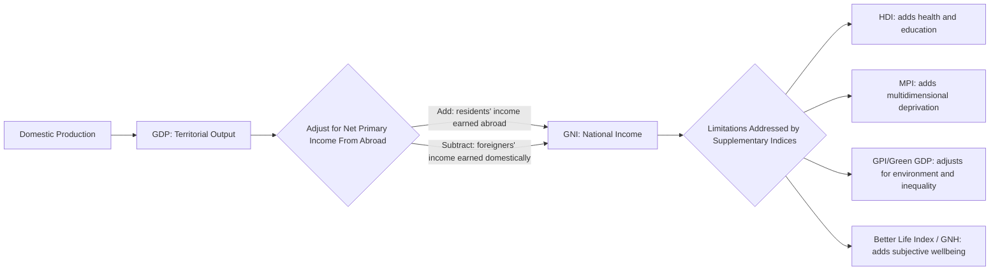

## Measuring Development: GDP, GNI, and Their Limitations

### Overview

Gross Domestic Product (GDP) and Gross National Income (GNI) are the two dominant aggregate measures used to approximate the size and welfare of an economy in development economics. Both are constructed from national accounting frameworks but differ in what geographic and ownership scope of production they capture. Both also suffer well-documented conceptual and empirical limitations when used as proxies for development, which has motivated the construction of alternative and supplementary indices.

### Gross Domestic Product (GDP)

**Key Points**

- GDP measures the total market value of all final goods and services produced within a country's borders in a given period, regardless of the nationality of the producing entity.
- GDP can be calculated through three theoretically equivalent approaches:
  - **Production (value-added) approach**: sums value added at each stage of production across all sectors.
  - **Income approach**: sums all income earned in production (wages, rents, interest, profits).
  - **Expenditure approach**: sums final spending on domestically produced goods and services.
- The expenditure approach is expressed as:

$$GDP = C + I + G + (X - M)$$

where $C$ is household consumption, $I$ is gross investment, $G$ is government expenditure, $X$ is exports, and $M$ is imports.

- **Nominal GDP** is measured at current market prices; **real GDP** is adjusted for inflation using a base-year price index (the GDP deflator), enabling comparison of output across time.
- **GDP per capita** divides GDP by population and is the most common proxy for average material living standards, though it is a mean, not a median, and is therefore sensitive to distributional skew.
- For cross-country comparison, GDP is often converted using **Purchasing Power Parity (PPP)** exchange rates rather than market exchange rates, since market rates can misstate the real purchasing power of local currency for non-traded goods.

**Example**

If a Philippine-based subsidiary of a foreign multinational manufactures electronics domestically, the value it adds is counted in Philippine GDP, even though the profits may ultimately be repatriated to the parent company's home country. GDP captures location of production, not ownership of income.

### Gross National Income (GNI)

**Key Points**

- GNI measures the total income earned by a country's residents and businesses, regardless of whether that production occurred domestically or abroad. It was formerly referred to as Gross National Product (GNP) in national accounts terminology before the shift to an income-based framing.
- GNI is derived from GDP by adjusting for net primary income from abroad:

$$GNI = GDP + \text{(Income earned by residents abroad)} - \text{(Income earned by foreigners domestically)}$$

- This adjustment matters significantly for economies with large diasporas sending remittances, or economies hosting substantial foreign direct investment (FDI) whose profits are repatriated.
- The World Bank uses **GNI per capita (Atlas method)** as its primary criterion for classifying countries into income categories (low-income, lower-middle-income, upper-middle-income, high-income), rather than GDP per capita, precisely because GNI better reflects income actually accruing to residents.
- The **Atlas method** smooths exchange rate fluctuations using a three-year moving average conversion factor, reducing volatility in cross-country income comparisons caused by short-term currency swings.

**Example**

The Philippines has historically had a GNI meaningfully above its GDP due to substantial remittance inflows from Overseas Filipino Workers (OFWs). Income earned by Filipino workers abroad is counted in Philippine GNI (as income earned by residents, broadly construed for this purpose) but not in Philippine GDP, since that production occurred outside Philippine territory. [Inference: the precise gap between Philippine GDP and GNI in any given year is an empirical figure that fluctuates with remittance flows and FDI activity, and should be checked against current national accounts data rather than assumed to be a fixed value.]

### GDP vs. GNI: Structural Comparison

| Dimension | GDP | GNI |
| --- | --- | --- |
| Basis | Territorial (where production occurs) | National (who earns the income) |
| Includes foreign firms' domestic output | Yes | No (excluded as foreign-earned income) |
| Includes residents' income earned abroad | No | Yes |
| Best used for | Measuring domestic economic activity/output | Measuring income available to residents; World Bank income classification |
| Sensitive to | Domestic production structure | Remittance flows, FDI profit repatriation, diaspora size |

### Limitations of GDP and GNI as Development Measures

**Key Points**

- **Distributional blindness**: Both are aggregate or per-capita averages; neither reveals how income or output is distributed across households. High GDP per capita can coexist with severe inequality (a high Gini coefficient) and widespread poverty.
- **Non-market activity excluded**: Unpaid domestic labor, subsistence farming, informal sector output, and care work are largely excluded or poorly captured, understating real economic activity, particularly in developing economies with large informal sectors.
- **No welfare or wellbeing adjustment**: GDP/GNI do not account for leisure time, work-life balance, health outcomes, or subjective wellbeing.
- **Environmental depletion not deducted**: Extraction of natural resources and environmental degradation are recorded as positive contributions to output (e.g., timber sales, mining revenue) without deducting the depreciation of natural capital, overstating sustainable income.
- **Defensive and remedial expenditures counted positively**: Spending to counteract negative outcomes, such as pollution cleanup, disaster reconstruction, or crime-related security spending, adds to GDP even though it responds to a welfare loss rather than generating new welfare, an issue frequently referred to in the literature as the treatment of "regrettable necessities."
- **Quality and composition of output ignored**: GDP does not distinguish between output that improves long-run development capacity (e.g., infrastructure, education services) and output that does not.
- **Informal and shadow economy underestimation**: In many developing countries, a substantial share of economic activity occurs outside formal, taxed, and measured channels, leading to systematic underestimation of true output. [Inference: the scale of this underestimation varies widely by country and by the statistical methodology used to estimate informal activity, so any specific percentage figure should be sourced from country-specific studies rather than generalized.]
- **No capital depreciation of human or social capital**: Deterioration in health, education quality, or social trust is not reflected as a negative adjustment.
- **Exchange rate distortions (for GDP in USD terms)**: Converting local GDP to USD at market exchange rates can misrepresent real purchasing power, which PPP adjustment partially addresses but does not fully resolve for all price distortions.

### Alternative and Supplementary Measures

**Key Points**

- **Human Development Index (HDI)**: combines life expectancy, education (expected and mean years of schooling), and GNI per capita (PPP) into a single composite index, explicitly designed to correct GDP's neglect of health and education.
- **Inequality-adjusted HDI (IHDI)**: discounts the HDI for internal inequality across its three dimensions.
- **Multidimensional Poverty Index (MPI)**: measures overlapping deprivations in health, education, and living standards at the household level, independent of income measures.
- **Genuine Progress Indicator (GPI)**: adjusts GDP-type aggregates for income inequality, environmental costs, and the value of non-market work (e.g., household labor, volunteering), while netting out defensive expenditures.
- **Green GDP / Environmentally-adjusted Net National Income**: attempts to deduct the monetary value of natural resource depletion and environmental damage from standard output measures.
- **Gross National Happiness (GNH)**: a framework (notably associated with Bhutan) incorporating psychological wellbeing, governance quality, and cultural resilience alongside material living standards.
- **Better Life Index (OECD)**: a multidimensional composite covering housing, income, jobs, community, education, environment, governance, health, life satisfaction, safety, and work-life balance.

### Diagram: From GDP to GNI and Beyond

### Practical Use in Development Economics

**Key Points**

- GNI per capita (Atlas method) remains the World Bank's operational threshold for country income classification and eligibility for concessional lending (e.g., International Development Association, IDA, eligibility).
- GDP growth rates remain the standard headline indicator in macroeconomic and development reporting, but development economists routinely pair GDP/GNI figures with HDI, poverty headcount ratios, and Gini coefficients to avoid the "growth without development" fallacy.
- Practitioners are advised to interpret GDP/GNI as necessary but insufficient indicators, always contextualized against distributional, environmental, and capability-based measures when assessing genuine development progress.

### Related Topics

- Purchasing Power Parity (PPP) and its role in cross-country comparisons
- The Human Development Index (HDI) construction methodology
- World Bank income classification thresholds and IDA/IBRD eligibility
- Genuine Progress Indicator (GPI) and Green National Accounting
- Measuring the informal economy and shadow GDP estimation techniques
- Gini coefficient and the Lorenz curve
- Remittances and their macroeconomic role in developing economies
- Multidimensional Poverty Index (MPI) methodology
- National income accounting identities (C + I + G + NX)
- Beyond GDP initiatives (OECD Better Life Index, Bhutan's Gross National Happiness)