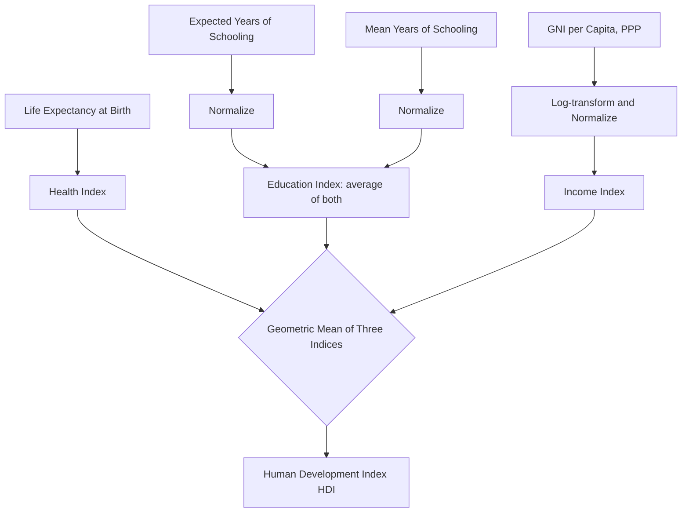

## The Human Development Index and Its Components

### Overview

The Human Development Index (HDI) is a composite statistic developed to measure and compare average achievement in key dimensions of human development across countries, correcting the narrow income-centric view of GDP/GNI-based rankings. First introduced in the 1990 Human Development Report by the United Nations Development Programme (UNDP), the HDI was substantially shaped by the intellectual contributions of economists Mahbub ul Haq and Amartya Sen, grounding it explicitly in the capability approach to development.

### Conceptual Foundation

**Key Points**

- The HDI operationalizes the idea that development should be evaluated by the expansion of people's capabilities and freedoms, not merely by growth in income or output.
- It reflects three basic dimensions of human development: **a long and healthy life**, **access to knowledge**, and **a decent standard of living**.
- The index is explicitly designed as a corrective to reliance on GNI/GDP per capita as a sole proxy for wellbeing, incorporating non-income dimensions that income alone does not guarantee.
- The HDI does not attempt to be a comprehensive measure of all aspects of development (it excludes inequality, poverty, security, empowerment, and environmental sustainability in its core formulation), which has motivated companion indices such as the IHDI, GDI, and MPI.

### The Three Core Dimensions and Indicators

**Key Points**

1. **Health dimension**
   - Indicator: **Life expectancy at birth**.
   - Rationale: captures long-run outcomes of healthcare access, nutrition, sanitation, and public health systems.
2. **Education dimension**
   - Indicators: **Expected years of schooling** (years a child entering school could expect to receive given current enrollment patterns) and **mean years of schooling** (average years of education actually received by adults aged 25 and older).
   - Rationale: captures both current investment in future human capital (expected years) and the accumulated stock of human capital in the adult population (mean years).
3. **Standard of living dimension**
   - Indicator: **Gross National Income (GNI) per capita**, expressed in Purchasing Power Parity (PPP) terms in constant international dollars.
   - Rationale: GNI is used rather than GDP because it better reflects income actually available to residents (see companion note on GDP vs. GNI); PPP adjustment enables valid cross-country comparison of purchasing power.

### Index Construction Methodology

**Key Points**

- Each of the three dimensions is first converted into a **dimension index** using a min-max normalization formula:

$$I_{\text{dimension}} = \frac{\text{actual value} - \text{minimum value}}{\text{maximum value} - \text{minimum value}}$$

- The UNDP sets fixed minimum and maximum "goalpost" values for each indicator (e.g., life expectancy minimum of 20 years, maximum of 85 years; these goalposts are periodically revised by the UNDP and should be checked against the current Human Development Report technical notes for exact values in use). [Inference: exact current goalpost values are subject to periodic UNDP methodological revision, so any cited figures should be verified against the latest Human Development Report technical documentation rather than treated as permanently fixed.]
- For the education dimension, the **Education Index** is calculated as the arithmetic mean of the normalized expected-years and mean-years sub-indices:

$$I_{\text{education}} = \frac{I_{\text{expected years}} + I_{\text{mean years}}}{2}$$

- For the income dimension, GNI per capita is first log-transformed before normalization, reflecting the assumption of diminishing marginal utility of income (an additional dollar of income matters less to wellbeing at higher income levels):

$$I_{\text{income}} = \frac{\ln(\text{GNI per capita}) - \ln(\text{minimum})}{\ln(\text{maximum}) - \ln(\text{minimum})}$$

- The final HDI is calculated as the **geometric mean** of the three dimension indices:

$$HDI = \left( I_{\text{health}} \cdot I_{\text{education}} \cdot I_{\text{income}} \right)^{1/3}$$

- The geometric mean (rather than an arithmetic mean) is used deliberately: it penalizes imbalance across dimensions, meaning a country cannot compensate for very poor performance in one dimension (e.g., health) with very strong performance in another (e.g., income) as easily as an arithmetic average would allow. This reflects an assumption of imperfect substitutability between dimensions.

**Example**

Suppose a hypothetical country has:

- $I_{\text{health}} = 0.85$
- $I_{\text{education}} = 0.70$
- $I_{\text{income}} = 0.75$

Then:

$$HDI = (0.85 \times 0.70 \times 0.75)^{1/3} = (0.446)^{1/3} \approx 0.764$$

Compare this to an arithmetic mean of the same values, $(0.85 + 0.70 + 0.75)/3 = 0.767$, which is very close here because the values are relatively balanced; the geometric mean's penalizing effect becomes much more pronounced when one dimension index is substantially lower than the others.

### HDI Classification Tiers

**Key Points**

- The UNDP classifies countries into four tiers based on their HDI score:

| HDI Range | Classification |
| --- | --- |
| ≥ 0.800 | Very High Human Development |
| 0.700 – 0.799 | High Human Development |
| 0.550 – 0.699 | Medium Human Development |
| < 0.550 | Low Human Development |

- [Unverified: exact threshold boundaries are set by the UNDP and have been adjusted across different editions of the Human Development Report; current-year exact cutoffs should be confirmed against the latest report rather than assumed fixed.]

### Diagram: HDI Construction Pipeline

### Complementary and Adjusted Indices

**Key Points**

- **Inequality-adjusted HDI (IHDI)**: discounts each dimension index for internal distributional inequality, using the Atkinson inequality measure; the IHDI equals the HDI only in the theoretical case of perfect equality, and is otherwise always lower.
- **Gender Development Index (GDI)**: compares HDI values calculated separately for females and males, capturing gender gaps in the same three dimensions.
- **Gender Inequality Index (GII)**: a separate composite capturing reproductive health, empowerment (political representation, educational attainment), and labor market participation disaggregated by gender.
- **Multidimensional Poverty Index (MPI)**: complements the HDI by measuring overlapping household-level deprivations rather than national averages, capturing intra-country heterogeneity the HDI cannot show.

### Limitations of the HDI

**Key Points**

- **Distributional blindness within dimensions**: the standard HDI is a national average and does not reveal within-country inequality in health, education, or income (partially addressed by the IHDI).
- **Narrow dimension set**: excludes political freedom, human rights, environmental sustainability, personal security, and cultural factors that are widely regarded as relevant to human development.
- **Substitutability assumptions**: even with the geometric mean's partial correction, the index still permits some degree of trade-off between dimensions, which critics argue is conceptually questionable (e.g., can health deficits genuinely be "offset" by income gains?).
- **Data quality and comparability issues**: life expectancy, schooling, and GNI estimates depend on national statistical capacity, which varies significantly, particularly across low-income and fragile states, introducing measurement uncertainty into cross-country comparisons. [Inference: the magnitude of this measurement uncertainty differs by country and indicator, and is not uniform across the dataset.]
- **Fixed dimension weighting**: implicitly, the geometric mean formulation applies equal weight to each dimension index, an analytical choice that is itself value-laden and open to debate.
- **Not a full welfare or happiness measure**: the HDI is a proxy for capability expansion in three specific domains, not a comprehensive wellbeing or subjective life-satisfaction index (compare with the OECD Better Life Index or Bhutan's Gross National Happiness framework).

### Practical Applications

**Key Points**

- The HDI is published annually in the UNDP's Human Development Report and is widely used in academic research, development policy benchmarking, and allocation discussions for development assistance.
- It is commonly used alongside GNI per capita and poverty headcount ratios to distinguish "growth without development" cases from broad-based development, consistent with the growth-versus-development distinction covered earlier in this chapter.
- Researchers and policymakers frequently disaggregate the HDI methodology sub-nationally (e.g., by region or province) to identify internal development disparities not visible in the national aggregate.

### Related Topics

- Amartya Sen's capability approach and "Development as Freedom"
- Inequality-adjusted HDI (IHDI) and the Atkinson inequality measure
- Gender Development Index (GDI) and Gender Inequality Index (GII)
- Multidimensional Poverty Index (MPI) methodology
- GDP versus GNI and their limitations as development measures
- UNDP Human Development Report methodology and goalpost revisions
- Beyond-GDP composite indices (OECD Better Life Index, Genuine Progress Indicator)
- Structural transformation and its relationship to human capital indicators