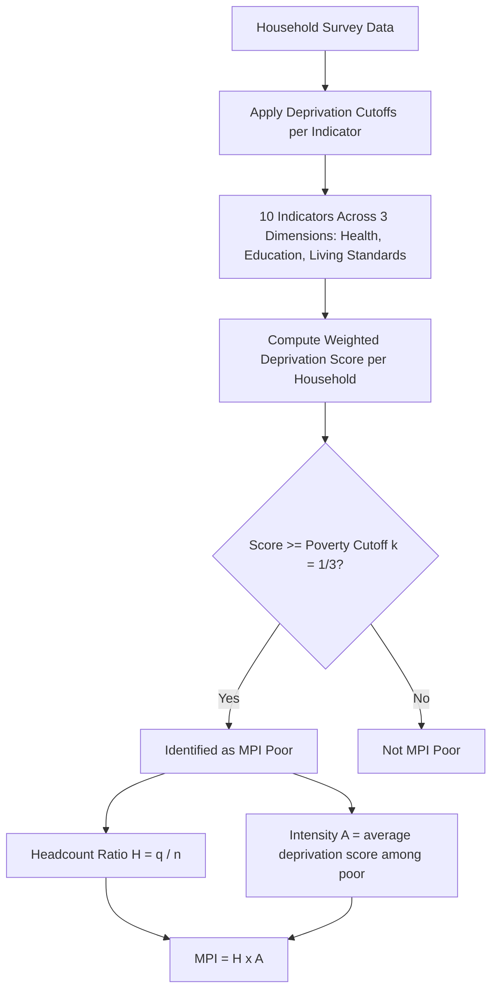

## Multidimensional Poverty Index

### Overview

The Multidimensional Poverty Index (MPI) measures poverty as a state of overlapping deprivations experienced simultaneously by a household, rather than as a shortfall of income or consumption below a monetary poverty line. Developed jointly by the Oxford Poverty and Human Development Initiative (OPHI) and the UNDP, and first published in the 2010 Human Development Report, the MPI operationalizes the capability approach at the household level, complementing income-based poverty measures such as the $2.15/day international poverty line.

### Conceptual Foundation

**Key Points**

- Traditional income-based poverty measures (e.g., the international extreme poverty line) capture only a single dimension of deprivation and can miss households that are non-monetarily poor (e.g., lacking clean water or education) despite marginal income adequacy, or vice versa.
- The MPI is grounded in the **Alkire-Foster (AF) methodology**, a general counting-based approach for measuring multidimensional poverty that identifies who is poor by counting the number of deprivations a person or household simultaneously experiences, then aggregates this into a summary index.
- The MPI treats poverty as **multidimensional and overlapping by construction**: a household is only classified as "MPI poor" if it is deprived across a sufficient breadth of indicators simultaneously, not merely deprived in any single one.

### The Three Dimensions and Ten Indicators

**Key Points**

The global MPI (as constructed by OPHI/UNDP) uses **three dimensions**, each composed of specific indicators, for a total of **ten indicators**:

1. **Health** (weight: 1/6 each)
   - Nutrition
   - Child mortality
2. **Education** (weight: 1/6 each)
   - Years of schooling
   - School attendance
3. **Standard of Living** (weight: 1/18 each)
   - Cooking fuel
   - Sanitation
   - Drinking water
   - Electricity
   - Housing
   - Assets

- Each dimension (Health, Education, Standard of Living) is given **equal overall weight (1/3)**; within the Health and Education dimensions, each of the two indicators receives a weight of 1/6; within the Standard of Living dimension, each of the six indicators receives a weight of 1/18. [Inference: exact weighting schemes and indicator thresholds have been periodically refined by OPHI/UNDP across MPI methodology revisions, so current-year exact cutoffs should be verified against the latest OPHI technical documentation.]

### Alkire-Foster Methodology: Identification and Aggregation

**Key Points**

The AF methodology proceeds in two main steps: **identification** of who is poor, and **aggregation** into a summary measure.

**Step 1 — Identification (the dual cutoff approach)**

- For each indicator, a **deprivation cutoff** determines whether a household is deprived in that specific indicator (e.g., deprived in "years of schooling" if no household member has completed six years of schooling).
- Each household's weighted deprivation score $c_i$ is the sum of the weights of all indicators in which it is deprived:

$$c_i = \sum_{j=1}^{d} w_j \cdot g_{ij}$$

where $w_j$ is the weight of indicator $j$, $g_{ij} = 1$ if household $i$ is deprived in indicator $j$ (and 0 otherwise), and $d$ is the total number of indicators.

- A **poverty cutoff** $k$ (typically set at $k = 1/3$ for the global MPI) determines the minimum weighted deprivation score a household must have to be classified as **multidimensionally poor**: household $i$ is identified as poor if $c_i \geq k$.

**Step 2 — Aggregation**

- The **headcount ratio** $H$ is the proportion of the population identified as multidimensionally poor:

$$H = \frac{q}{n}$$

where $q$ is the number of people identified as MPI poor and $n$ is the total population.

- The **intensity of poverty** $A$ is the average weighted deprivation score among the poor only:

$$A = \frac{\sum_{i=1}^{q} c_i}{q}$$

- The **MPI itself** is the product of the headcount ratio and the average intensity, often referred to as the **adjusted headcount ratio ($M_0$)**:

$$MPI = H \times A$$

- This construction ensures the MPI is sensitive to both **how many** people are poor and **how intensely** deprived they are, distinguishing it from a simple headcount that would treat a household deprived in 4 indicators the same as one deprived in 9.

**Example**

Suppose in a survey population of $n = 1{,}000$ people, $q = 300$ people are identified as MPI poor (deprived in at least $k = 1/3$ of the weighted indicators). Their average weighted deprivation score among the poor is $A = 0.45$ (i.e., poor households are, on average, deprived in 45% of the weighted indicator basket).

$$H = \frac{300}{1000} = 0.30$$

$$MPI = H \times A = 0.30 \times 0.45 = 0.135$$

This MPI value of 0.135 summarizes both the incidence (30% of the population is poor) and the average severity of deprivation among that poor population (45% intensity).

### Diagram: MPI Construction Pipeline

### Properties and Advantages of the MPI

**Key Points**

- **Decomposability**: the MPI can be broken down by population subgroup (region, ethnicity, urban/rural, gender of household head), revealing where poverty is concentrated, which a single national aggregate cannot show.
- **Dimensional decomposability**: the contribution of each dimension (Health, Education, Living Standards) to overall MPI can be calculated, showing policymakers which deprivations drive poverty most in a given context.
- **Captures the "poor among the poor"**: because it incorporates intensity ($A$), the index distinguishes between marginal poverty and deep, compounding deprivation, informing more targeted resource allocation.
- **Complements rather than replaces monetary poverty measures**: the global MPI is designed to be used alongside, not instead of, income/consumption-based poverty lines, since the two can identify different, only partially overlapping, poor populations.

### Limitations of the MPI

**Key Points**

- **Fixed weighting is a normative choice**: the equal-dimension weighting (1/3 each) and specific indicator weights embed value judgments about the relative importance of health, education, and living standards that are open to methodological debate.
- **Indicator and data availability constraints**: the ten-indicator structure is chosen partly based on what is consistently available across Demographic and Health Surveys (DHS) and Multiple Indicator Cluster Surveys (MICS) internationally, which can constrain the index to indicators that are measurable rather than necessarily the most theoretically important.
- **Household-level unit of analysis**: deprivation is typically assessed at the household level, which can mask intra-household inequality (e.g., unequal allocation of food or schooling opportunities among household members, particularly along gender lines).
- **Cutoff sensitivity**: results can be sensitive to the choice of poverty cutoff $k$; using $k = 1/3$ versus a stricter or looser threshold changes which households are classified as poor, and this is a methodological choice rather than a strictly empirical determination.
- **Static indicator basket**: some critics argue the fixed global indicator basket may not fully reflect deprivations relevant to specific national or cultural contexts, which is part of why many countries have developed **national MPIs** with context-specific indicators, in addition to using the global MPI.
- **Data collection lag**: because it relies on household surveys (DHS/MICS), MPI estimates can lag several years behind the current situation on the ground, unlike higher-frequency monetary poverty estimates that can sometimes be modeled more currently. [Inference: the specific lag length varies by country depending on survey cycle frequency, and should not be assumed uniform.]

### MPI in Relation to Other Development Measures

**Key Points**

- The MPI complements the HDI: while the HDI reports national average achievement in health, education, and income, the MPI reports the depth and breadth of deprivation among the poor specifically, at the household level.
- The MPI complements GDP/GNI-based poverty analysis by revealing non-monetary deprivations (e.g., lack of electricity or sanitation) that may persist even in households above an income poverty line, reinforcing the broader theme that growth and rising average income do not automatically eliminate multidimensional deprivation.
- National governments increasingly use national MPIs as official targeting tools for social protection programs, given their capacity for geographic and demographic decomposition.

### Related Topics

- The Alkire-Foster methodology in general multidimensional measurement
- The Human Development Index (HDI) and its components
- International monetary poverty lines and the $2.15/day threshold
- Demographic and Health Surveys (DHS) and Multiple Indicator Cluster Surveys (MICS) as MPI data sources
- National MPIs and context-specific poverty measurement
- Intra-household inequality and gender-disaggregated poverty analysis
- Targeting mechanisms for social protection programs using multidimensional poverty data
- Inequality-adjusted HDI (IHDI) as a related distributional correction