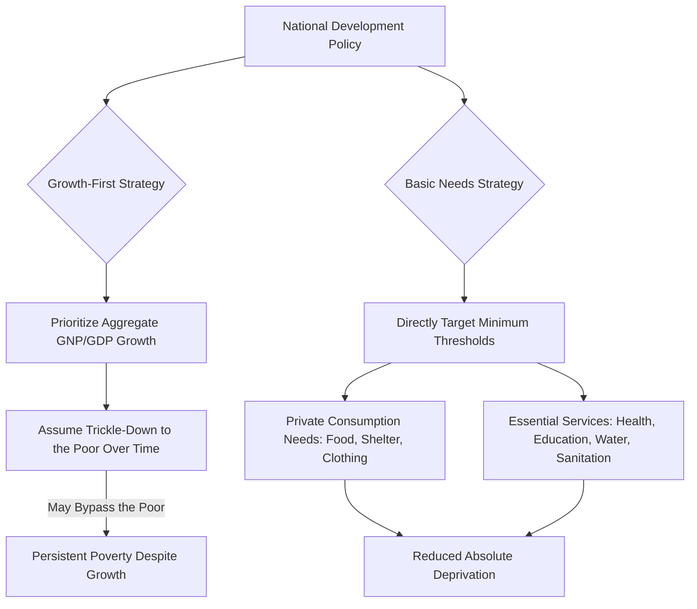

## Basic Needs Approach to Development

### Overview

The basic needs approach (BNA) is a development strategy and evaluative framework that emerged prominently in the 1970s, prioritizing the direct provision of a minimum threshold of essential goods and services to the poorest segments of a population, rather than relying primarily on aggregate income growth to eventually "trickle down" to the poor. It represented a significant shift in development economics thinking, moving the unit of policy concern from national output aggregates toward the material conditions of individual households, particularly the poorest.

### Historical and Intellectual Context

**Key Points**

- The basic needs approach gained institutional prominence through the **International Labour Organization (ILO)**, particularly via its 1976 World Employment Conference, which articulated basic needs satisfaction as a central objective of national and international development policy.
- It emerged partly as a reaction against the **growth-first paradigm** dominant in earlier development economics (associated with modernization theory and trickle-down growth models), which had assumed that aggregate GNP/GDP growth would, given sufficient time, resolve poverty without requiring direct redistributive or targeted intervention.
- The approach was influenced by mounting empirical evidence through the 1960s and 1970s that many developing countries were achieving respectable aggregate growth rates while absolute poverty, malnutrition, and illiteracy remained widespread, reinforcing the "growth without development" critique.
- The World Bank, under President Robert McNamara, also incorporated basic needs and poverty-focused lending considerations into its policy framework during the 1970s, reflecting a broader institutional shift toward redistribution-with-growth strategies.

### Core Components of Basic Needs

**Key Points**

The basic needs approach typically specifies two broad categories of needs:

1. **Private consumption needs**: minimum requirements for household or individual consumption, most commonly:
   - Adequate food and nutrition
   - Shelter/housing
   - Clothing
   - Household goods and furniture (in some formulations)
2. **Essential services (public/community needs)**: services generally delivered collectively rather than purchased individually, most commonly:
   - Safe drinking water and sanitation
   - Healthcare (including preventive and maternal/child health services)
   - Education (typically basic/primary education)
   - Public transportation
   - Cultural and recreational facilities (in some formulations)

- Beyond material consumption, some formulations of the basic needs approach (echoing broader development values discussed under the Todaro/Smith framework of sustenance, self-esteem, and freedom) also incorporate participation in decision-making and employment as a basic need, on the grounds that meaningful work and civic participation are intrinsic to human dignity, not merely instrumental to material consumption.

### Distinguishing Features Versus Growth-Centered Strategies

**Key Points**

| Dimension | Growth-Centered Strategy | Basic Needs Approach |
| --- | --- | --- |
| Primary target | Aggregate output (GDP/GNP growth rate) | Direct fulfillment of minimum consumption and service thresholds |
| Assumed mechanism | Trickle-down: growth eventually raises living standards broadly | Direct provision/targeting: needs met through deliberate public policy and resource allocation |
| Timeframe for poverty reduction | Longer-run, contingent on growth sustaining and diffusing | Prioritizes more immediate reduction in absolute deprivation |
| Role of the state | Facilitator of aggregate investment and growth conditions | Active provider/guarantor of minimum thresholds via public services and targeted transfers |
| Risk highlighted | Growth without development; enclave growth bypassing the poor | Possible short-run trade-off with capital accumulation if consumption is prioritized over investment |

### Measurement and Operationalization

**Key Points**

- Basic needs are typically operationalized through **physical/quantity thresholds** rather than purely monetary income lines: for example, minimum caloric intake per day, minimum liters of safe water per capita, minimum square meters of housing, or minimum years of schooling.
- A common composite measurement tool associated conceptually with the basic needs era is the **Physical Quality of Life Index (PQLI)**, developed by Morris David Morris, which combines infant mortality rate, life expectancy at age one, and basic literacy rate into a single index — explicitly designed, similarly to the later HDI, to move measurement away from pure income/GNP metrics toward direct welfare outcomes.
- The PQLI is calculated by normalizing each of its three component indicators onto a 0–100 scale (based on historically observed best and worst country performance) and taking the simple average:

$$PQLI = \frac{I_{\text{infant mortality}} + I_{\text{life expectancy}} + I_{\text{literacy}}}{3}$$

- [Inference: exact historical normalization scales used in the original PQLI construction vary across published sources and should be confirmed against Morris's original methodology if used for precise replication.]

### Policy Instruments Associated with the Basic Needs Approach

**Key Points**

- **Targeted public expenditure**: direct government spending on primary healthcare, primary/basic education, rural water supply, and sanitation infrastructure, often prioritized over large-scale industrial or infrastructure megaprojects.
- **Food subsidies and public distribution systems**: government-administered programs to ensure minimum food access for vulnerable populations, sometimes through price subsidies or in-kind distribution.
- **Employment-generation programs**: labor-intensive public works or employment guarantee schemes designed to raise incomes of the poor directly while also building local infrastructure.
- **Redistribution with growth**: a policy stance, associated with the World Bank's 1970s-era research agenda, arguing that growth strategies should be explicitly designed to simultaneously improve the income distribution of the poor, rather than pursuing growth first and equity later.

### Diagram: Basic Needs Approach Logic

### Criticisms and Limitations

**Key Points**

- **Paternalism concern**: critics argue that externally or centrally defined "basic needs" baskets risk imposing a particular vision of an adequate life on diverse populations, rather than respecting individual or community-defined priorities, a critique that parallels later debates around Nussbaum's fixed capability list.
- **Neglect of income and empowerment**: by focusing on direct provision of goods and services, early basic needs strategies were sometimes criticized for underemphasizing income-generating capacity, asset ownership, and the structural/institutional causes of poverty, rather than simply its material symptoms.
- **Fiscal sustainability and investment trade-offs**: heavy government expenditure on consumption-oriented basic needs provision was, in some critiques, seen as potentially crowding out capital investment needed to sustain long-run growth, creating a possible tension between immediate needs satisfaction and future productive capacity. [Inference: the empirical extent of any such crowding-out effect is context- and country-specific, and is not treated as a universal outcome in the literature.]
- **Superseded conceptually by the capability approach**: Amartya Sen and others argued that the basic needs approach, while a valuable corrective to pure growth-centrism, still focused primarily on **commodities and outcomes** (goods delivered, needs met) rather than on the underlying **freedoms and capabilities** to achieve valued functionings, motivating the shift toward the capability approach and eventually the HDI as a more theoretically grounded successor framework.
- **Targeting and delivery challenges**: in practice, basic needs programs can face significant implementation obstacles, including weak administrative capacity, corruption/leakage in distribution systems, and difficulty accurately identifying the intended beneficiary population. [Inference: the severity of these implementation challenges is highly country- and program-specific.]

### Legacy and Relationship to Later Frameworks

**Key Points**

- The basic needs approach is widely regarded as an important historical bridge between purely growth-centered development thinking and the later, more theoretically elaborated **human development paradigm** (capability approach, HDI, MPI).
- Many of its core concerns—direct measurement of deprivation, prioritization of health/education/water/sanitation, and skepticism of pure trickle-down growth—persist in contemporary frameworks such as the Sustainable Development Goals (SDGs), particularly SDG 1 (No Poverty), SDG 2 (Zero Hunger), SDG 3 (Good Health), and SDG 6 (Clean Water and Sanitation).
- Modern social protection policy design (conditional cash transfers, universal basic services debates) continues to grapple with the same underlying tension the basic needs approach first foregrounded: whether to guarantee specific goods/services directly, or to provide income/cash and trust households to allocate it toward their own needs.

### Related Topics

- The capability approach and Amartya Sen's critique of commodity-based welfare measures
- The Physical Quality of Life Index (PQLI) methodology
- Redistribution-with-growth strategies (World Bank, 1970s)
- The Human Development Index (HDI) as a theoretical successor framework
- Multidimensional Poverty Index (MPI) and its relationship to basic needs indicators
- Conditional cash transfer programs versus in-kind/service-based social protection
- Sustainable Development Goals (SDGs) and their basic-needs-oriented targets
- Employment guarantee schemes and labor-intensive public works programs