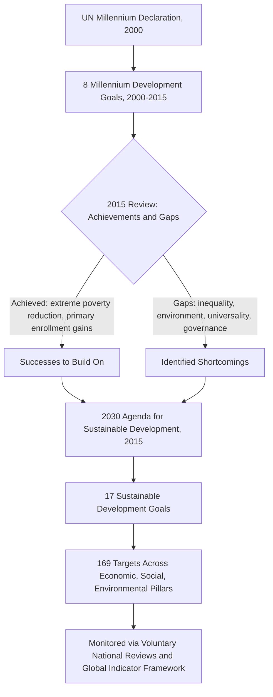

## Millennium Development Goals and Sustainable Development Goals

### Overview

The Millennium Development Goals (MDGs) and their successor, the Sustainable Development Goals (SDGs), represent the two major global frameworks adopted by the United Nations to set time-bound, measurable international development targets. The MDGs (2000–2015) focused primarily on reducing extreme poverty and its most acute symptoms in developing countries, while the SDGs (2015–2030) represent a broader, universal agenda applying to all countries and explicitly integrating economic, social, and environmental dimensions of sustainability.

### The Millennium Development Goals (MDGs)

**Key Points**

- The MDGs were adopted by UN member states in September 2000 following the **UN Millennium Declaration**, establishing eight goals to be achieved by the target year 2015.
- The eight MDGs were:
  1. Eradicate extreme poverty and hunger
  2. Achieve universal primary education
  3. Promote gender equality and empower women
  4. Reduce child mortality
  5. Improve maternal health
  6. Combat HIV/AIDS, malaria, and other diseases
  7. Ensure environmental sustainability
  8. Develop a global partnership for development
- Each goal was accompanied by specific, quantified targets and indicators (e.g., MDG 1 included the target of halving, between 1990 and 2015, the proportion of people living on less than $1.25 a day), enabling standardized progress tracking across countries.
- The MDGs were widely credited with mobilizing substantial global attention, financing, and coordinated effort toward a focused set of poverty-related outcomes, and with some notable measurable successes, particularly in reducing extreme income poverty rates and expanding primary school enrollment in many regions. [Inference: the degree of causal attribution between the MDG framework itself versus broader concurrent economic growth (e.g., in China and other large developing economies) in driving global poverty reduction over this period remains a subject of academic debate.]

### Criticisms of the MDG Framework

**Key Points**

- **Narrow scope focused on developing countries**: the MDGs were widely perceived as a framework primarily directed at low- and middle-income countries, with limited direct obligations placed on high-income countries beyond aid and partnership commitments (Goal 8), rather than a genuinely universal agenda.
- **Top-down design process**: the MDGs were criticized for being formulated largely by international technical experts and institutions with limited direct input from developing country governments and civil society during the initial goal-setting process.
- **Neglect of inequality and environmental sustainability depth**: while Goal 7 nominally addressed environmental sustainability, critics argued it lacked the integration and ambition later seen in the SDGs, and the framework as a whole gave limited attention to within-country inequality, governance quality, and conflict/fragility.
- **Averages masking disparities**: because MDG progress was often tracked via national averages, aggregate achievement could mask persistent or widening disparities across regions, income groups, and gender within a country, echoing broader critiques of aggregate development metrics discussed elsewhere in this chapter.

### The Sustainable Development Goals (SDGs)

**Key Points**

- The SDGs were adopted by all UN member states in September 2015 as part of the **2030 Agenda for Sustainable Development**, establishing 17 goals and 169 associated targets to be achieved by 2030.
- The 17 SDGs are:
  1. No Poverty
  2. Zero Hunger
  3. Good Health and Well-being
  4. Quality Education
  5. Gender Equality
  6. Clean Water and Sanitation
  7. Affordable and Clean Energy
  8. Decent Work and Economic Growth
  9. Industry, Innovation and Infrastructure
  10. Reduced Inequality
  11. Sustainable Cities and Communities
  12. Responsible Consumption and Production
  13. Climate Action
  14. Life Below Water
  15. Life on Land
  16. Peace, Justice and Strong Institutions
  17. Partnerships for the Goals
- The SDGs are explicitly designed as a **universal agenda**, applicable to all countries regardless of income level, in contrast to the MDGs' primary focus on developing countries.
- The SDGs integrate three interdependent pillars of sustainable development: **economic development, social inclusion, and environmental sustainability**, reflecting a deliberate broadening beyond the MDGs' more narrowly poverty-and-health-centered scope.
- Progress is tracked via a global indicator framework maintained by the UN Statistical Commission, comprising the 169 targets and associated statistical indicators, monitored through mechanisms such as Voluntary National Reviews (VNRs) submitted by countries at the UN High-Level Political Forum.

### Core Differences Between MDGs and SDGs

| Dimension | MDGs (2000–2015) | SDGs (2015–2030) |
| --- | --- | --- |
| Number of goals | 8 | 17 |
| Number of targets | 21 (associated with the 8 goals) | 169 |
| Scope of applicability | Primarily developing countries | Universal — all countries |
| Design process | Largely top-down, expert/institution-driven | More extensive multi-stakeholder and country consultation process |
| Environmental integration | Limited (single goal, Goal 7) | Deeply integrated across multiple goals (climate, oceans, land, consumption/production) |
| Inequality focus | Limited explicit treatment | Dedicated goal (SDG 10) and inequality-sensitive framing throughout |
| Institutional/governance focus | Largely absent | Explicit goal on peace, justice, and institutions (SDG 16) |
| Conceptual grounding | Primarily basic-needs and MDG-specific targets | Explicitly framed around sustainability across economic, social, environmental pillars |

### Diagram: From MDGs to SDGs

### Financing and Implementation Mechanisms

**Key Points**

- SDG implementation is supported through frameworks such as the **Addis Ababa Action Agenda** (2015), which addresses financing for development, including domestic resource mobilization, official development assistance (ODA), private investment, and debt sustainability considerations.
- Both frameworks rely heavily on **Official Development Assistance (ODA)** commitments from high-income countries, including the longstanding (though inconsistently met) target of allocating 0.7% of Gross National Income to ODA. [Inference: actual ODA disbursement levels relative to this target vary significantly by donor country and by year, and should be checked against current OECD Development Assistance Committee (DAC) data for up-to-date figures.]
- The SDG framework places greater emphasis than the MDGs on **domestic resource mobilization** (tax capacity building) and **blended finance** mechanisms that combine public and private capital, reflecting recognition that ODA alone is insufficient to finance the substantially larger scope of the 2030 Agenda.

### Criticisms and Challenges of the SDG Framework

**Key Points**

- **Breadth versus focus trade-off**: critics argue that expanding from 8 MDGs to 17 SDGs with 169 targets creates a much harder framework to prioritize, communicate, and monitor coherently compared to the MDGs' narrower focus, potentially diluting political attention and resource concentration.
- **Target interlinkages and trade-offs**: some SDG targets can be in tension with one another (e.g., certain interpretations of rapid industrialization/economic growth targets under SDG 8/9 versus climate and environmental targets under SDG 13/14/15), requiring careful policy coherence work that the framework itself does not automatically resolve.
- **Data and monitoring capacity gaps**: many low-income countries face significant statistical capacity constraints in reliably measuring progress across the full breadth of 169 targets, creating persistent data gaps in global SDG progress reporting. [Inference: the extent of these data gaps varies substantially by country and by specific indicator, and is documented in periodic UN SDG progress reports rather than being a fixed, uniform shortfall.]
- **Non-binding nature**: like the MDGs before them, the SDGs are a voluntary, aspirational framework without binding legal enforcement mechanisms, relying on political commitment, peer accountability (e.g., Voluntary National Reviews), and civil society pressure rather than compliance mechanisms.
- **On-track assessment**: as of recent UN progress reporting, many SDG targets are assessed as off-track or significantly behind schedule for 2030 achievement, particularly following disruptions from the COVID-19 pandemic and subsequent economic shocks. [Unverified: precise current on-track/off-track statistics change with each UN SDG Progress Report release and should be checked against the latest report for current figures.]

### Relationship to Broader Development Economics Concepts

**Key Points**

- Both frameworks operationalize, at a global policy level, many of the theoretical concerns raised earlier in this chapter: the MDGs reflect basic-needs-style prioritization of health, education, and poverty reduction, while the SDGs more explicitly incorporate capability-approach-style breadth (covering decent work, institutions, and inequality, not just material deprivation).
- Progress toward the SDGs is tracked using indicators closely related to those covered elsewhere in this chapter, including poverty headcount ratios, the Human Development Index, and Multidimensional Poverty Index components (health, education, and living standards indicators feed directly into several SDG targets).
- The SDG framework's explicit environmental integration (Goals 6, 7, 12, 13, 14, 15) reflects the broader "beyond GDP" critique discussed in relation to GDP/GNI limitations, incorporating environmental sustainability directly into the definition of development progress rather than treating it as an externality.

### Related Topics

- The Human Development Index (HDI) and its relationship to SDG indicators
- Multidimensional Poverty Index (MPI) and SDG 1/target 1.2 alignment
- Official Development Assistance (ODA) and the Addis Ababa Action Agenda
- Basic needs approach as a conceptual precursor to the MDGs
- Climate finance and Nationally Determined Contributions (NDCs) under the Paris Agreement
- Voluntary National Reviews (VNRs) and global SDG monitoring architecture
- Policy coherence for sustainable development and SDG target trade-offs
- Domestic resource mobilization and tax capacity building in developing countries