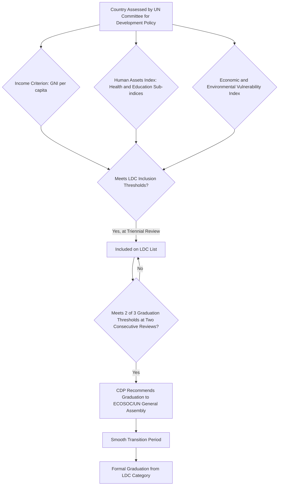

## Classifying Countries: Developed, Developing, Least Developed

### Overview

Country classification systems group nations into categories based on income, structural characteristics, and vulnerability, enabling standardized international policy treatment, aid eligibility, and comparative analysis in development economics. Several parallel classification frameworks exist, maintained by different institutions (the World Bank, the United Nations, and the IMF), each using distinct criteria and terminology, and it is important to distinguish between them since they are not fully interchangeable.

### World Bank Income Classification

**Key Points**

- The World Bank classifies the world's economies into four income groups based on **GNI per capita**, calculated using the **Atlas method** (a three-year moving average exchange rate conversion designed to smooth short-term currency volatility, as covered in the earlier note on GDP/GNI).
- The four categories are: **Low-income**, **Lower-middle-income**, **Upper-middle-income**, and **High-income** economies.
- Threshold values in USD are **revised annually** by the World Bank (typically each July) to account for inflation and exchange rate movements, meaning exact dollar cutoffs shift from year to year. [Unverified: current-year exact threshold values should be confirmed against the World Bank's most recent country classification update rather than treated as fixed, since they are adjusted annually.]
- The term "developing country" has historically been used loosely by international institutions to refer collectively to low-, lower-middle-, and upper-middle-income economies, though the World Bank has in recent years moved away from using "developing" as an official operational category, given the wide heterogeneity of economies it lumps together (e.g., grouping small fragile states with large middle-income industrial economies).
- **Operational lending eligibility**: the World Bank uses GNI per capita classification, alongside creditworthiness assessments, to determine eligibility for concessional financing through the **International Development Association (IDA)** versus market-rate financing through the **International Bank for Reconstruction and Development (IBRD)**.

### The United Nations Least Developed Countries (LDC) Category

**Key Points**

- The LDC category was established by the **UN General Assembly in 1971** to identify the most structurally disadvantaged economies among developing countries, entitling them to preferential market access, aid, and technical assistance.
- The list is reviewed every **three years (triennially)** by the **Committee for Development Policy (CDP)**, an independent expert body reporting to the UN Economic and Social Council (ECOSOC).
- There are currently 44 economies designated by the United Nations as least developed countries. [unctad](https://unctad.org/topic/least-developed-countries/list)
- Three criteria are used jointly to determine LDC status:

1. **Income criterion**: based on a three-year average estimate of GNI per capita in US dollars, with an inclusion threshold of $1,088 or below and a graduation threshold of $1,306 or above (as of the 2024 review; these thresholds are revised at each triennial review). [Inference: these specific dollar figures reflect the 2024 CDP review cycle and are subject to revision at the next triennial review (2027), so current-year values should be verified against the latest CDP report.] [unctad](https://unctad.org/topic/least-developed-countries/list)
2. **Human Assets Index (HAI)**: a composite index consisting of a health sub-index and an education sub-index. The health sub-index uses under-five mortality rate, maternal mortality ratio, and prevalence of stunting; the education sub-index uses lower secondary school completion rate, adult literacy rate, and gender parity index for lower secondary school completion, with all six indicators combined using equal weighting. [unctad](https://unctad.org/topic/least-developed-countries/list)[unctad](https://unctad.org/topic/least-developed-countries/list)
3. **Economic and Environmental Vulnerability Index (EVI)**: measures structural exposure to economic shocks (e.g., export concentration, instability of agricultural production) and environmental/climate vulnerability (e.g., exposure to natural disasters, remoteness).

- **Graduation process**: a country can graduate from the LDC category by meeting two of the three criteria, or by having a per capita income of more than three times the income graduation threshold, at two consecutive triennial reviews of the LDC category conducted by the CDP. At the second qualifying review, the CDP can recommend the country's graduation to ECOSOC and the UN General Assembly. [un](https://www.un.org/ldcportal/content/frequently-asked-questions-graduation)[un](https://www.un.org/ldcportal/content/frequently-asked-questions-graduation)
- A **"smooth transition" period** is typically granted to graduating countries (often several years) to gradually phase out LDC-specific preferences and support measures, cushioning the transition.

### Recent and Scheduled LDC Graduations

**Key Points**

- By the end of 2025, eight countries had left the LDC list: Botswana (1994), Cabo Verde (2007), Maldives (2011), Samoa (2014), Equatorial Guinea (2017), Vanuatu (2021), Bhutan (2023), and São Tomé and Príncipe (2024). [un](https://www.un.org/ldcportal/content/frequently-asked-questions-graduation)
- Bangladesh, Lao PDR, and Nepal are scheduled to graduate in 2026, with Solomon Islands scheduled for 2027, and Cambodia and Senegal scheduled for 2029. [un](https://www.un.org/ldcportal/content/frequently-asked-questions-graduation)
- Bangladesh's graduation timeline has faced procedural developments: reporting indicates Bangladesh requested consideration of an extension to its preparatory period under the CDP's crisis-response provisions in early 2026 due to persistent structural vulnerabilities, illustrating that graduation dates and processes can be adjusted in response to a country's evolving circumstances. [Unverified: the final resolution of this specific extension request should be confirmed against the most current UN/CDP communications, as this reflects a developing procedural matter as of the search date.]
- The next triennial review of the LDC list is scheduled to take place in 2027. [unctad](https://unctad.org/topic/least-developed-countries/list)

### Comparing Classification Frameworks

| Framework | Maintaining Institution | Primary Criteria | Category Labels | Review Frequency |
| --- | --- | --- | --- | --- |
| Income Classification | World Bank | GNI per capita (Atlas method) | Low / Lower-middle / Upper-middle / High income | Annual |
| LDC Category | United Nations (CDP/ECOSOC) | GNI per capita, Human Assets Index, Economic & Environmental Vulnerability Index | Least Developed Countries (LDCs) vs. others | Triennial |
| IMF Classification | International Monetary Fund | Per capita income, export diversification, degree of integration into global financial system | Advanced economies vs. Emerging market and developing economies | Periodic (World Economic Outlook updates) |

- These frameworks are **not interchangeable and can classify the same country differently**: a country can be "upper-middle-income" under the World Bank framework while simultaneously appearing on neither the LDC list nor the IMF's advanced-economy list, since each system uses distinct thresholds and dimensions.
- The **term "Global South"** is also widely used in development discourse as a broader, more geopolitical/historical grouping (roughly corresponding to Africa, Latin America, and most of Asia excluding Japan), distinct from any single institution's formal statistical classification, and is generally used descriptively rather than as an operational eligibility category for aid or lending.

### Diagram: LDC Classification Logic

### Rationale for Multidimensional Classification

**Key Points**

- The LDC framework's explicit incorporation of the Human Assets Index and vulnerability index, rather than relying on income alone, reflects the same broader critique addressed elsewhere in this chapter: income (GNI per capita) alone does not fully capture structural development constraints such as poor health/education outcomes or high exposure to economic and climate shocks.
- A country can have moderate income but remain highly vulnerable to external shocks (e.g., small island states highly exposed to natural disasters, or economies with narrow export concentration in a single commodity), which the EVI is specifically designed to capture, independent of the income criterion.
- This multidimensional design parallels the logic behind the Human Development Index and Multidimensional Poverty Index covered earlier in this chapter: a single monetary indicator is treated as necessary but insufficient for classifying genuine developmental status.

### Policy Significance of Classification

**Key Points**

- LDC status confers specific benefits under international trade and finance frameworks, including preferential market access under schemes such as the **Everything But Arms (EBA)** initiative (EU) and duty-free/quota-free access provisions under various WTO-related arrangements, along with eligibility for concessional development financing and technical assistance.
- Graduation from LDC status, while reflecting genuine development progress, also carries **transition risks**: loss of preferential trade access, reduced eligibility for concessional aid, and potentially higher borrowing costs, which is why "smooth transition" support measures are built into the graduation process.
- World Bank income classification thresholds directly determine eligibility for **IDA concessional lending** versus market-rate IBRD lending, making annual reclassification decisions materially significant for a country's access to development finance terms.

### Related Topics

- GDP versus GNI and the Atlas method of currency conversion
- The Human Assets Index and Economic and Environmental Vulnerability Index methodologies
- IDA versus IBRD lending eligibility criteria
- Preferential trade access schemes for LDCs (Everything But Arms, WTO duty-free/quota-free provisions)
- The "Global South" as a geopolitical versus statistical classification
- IMF advanced economies versus emerging market and developing economies classification
- Structural vulnerability and small island developing states (SIDS)
- LDC graduation "smooth transition" support mechanisms