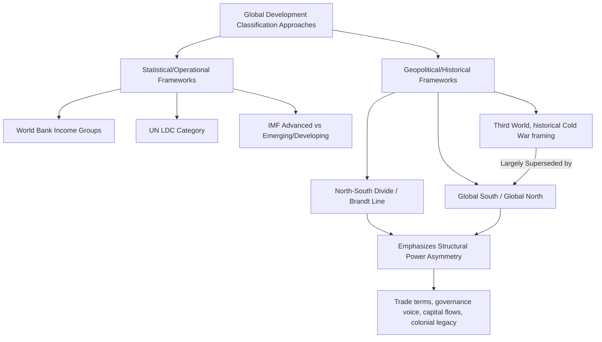

## The Global South and North-South Divide Framework

### Overview

The Global South and North-South divide framework is a geopolitical and analytical lens used to describe persistent structural disparities in wealth, power, and development between two broadly defined groups of countries. Rather than a precise statistical classification (like the World Bank income groups or the UN LDC category), it is a heuristic, historically and politically rooted framework used to discuss global inequality, colonial legacy, and asymmetries in international economic and political relations.

### Origins and Historical Development

**Key Points**

- The **North-South terminology** gained prominence particularly through the **Brandt Line**, popularized by the 1980 report of the Independent Commission on International Development Issues, chaired by former West German Chancellor Willy Brandt, which visually divided the world along a roughly horizontal line at approximately 30° north latitude (with notable exceptions, placing Australia and New Zealand in the "North" despite their southern hemisphere location).
- The "North" broadly corresponded to wealthy, industrialized countries (North America, Europe, and parts of the developed Asia-Pacific, e.g. Japan, Australia, New Zealand), while the "South" corresponded to lower-income, less industrialized countries across Africa, Latin America, and most of Asia.
- The term **"Global South"** emerged and gained wider currency somewhat later, particularly from the 1990s onward, partly as a preferred replacement for earlier Cold War-era terminology such as **"Third World"** (a term originally referring to countries not aligned with either the capitalist "First World" or the communist "Second World" bloc), which had become viewed as outdated, hierarchical in connotation, or tied to a bipolar geopolitical framing that no longer matched the post-Cold War world.
- The Global South framework is also historically linked to the **Non-Aligned Movement** and the **Group of 77 (G77)**, coalitions of developing countries formed during the Cold War era to advocate collectively for their shared economic and political interests in international forums, including calls for a **New International Economic Order (NIEO)** in the 1970s.

### Conceptual Basis: Geopolitical Rather Than Strictly Geographic

**Key Points**

- Despite its name, "Global South" is **not a strict geographic descriptor**: it includes countries in the Southern Hemisphere as well as much of Asia and parts of Eastern Europe that are geographically in the Northern Hemisphere, while excluding wealthy Southern Hemisphere countries such as Australia and New Zealand.
- The term is better understood as denoting a shared position within the global economic and political system, characterized by factors such as historical experience of colonialism, relatively lower per capita income and industrial capacity, and comparatively lower influence in global governance institutions, rather than a fixed set of physical coordinates.
- The framework is frequently used in a **relational sense**: it foregrounds the *relationship* and *power asymmetry* between the North and South (e.g., in trade terms, capital flows, technology transfer, and global governance representation) rather than being purely a descriptive label for a fixed list of countries.

### North-South Divide Framework and Dependency Theory

**Key Points**

- The North-South divide framework has close intellectual ties to **dependency theory** and **structuralist economics**, particularly the work of Argentine economist **Raúl Prebisch** and the **Prebisch-Singer hypothesis**, which argued that countries specializing in primary commodity exports (broadly, the "South" or periphery) face a long-run tendency toward declining terms of trade relative to countries exporting manufactured goods (the "North" or core), disadvantaging their capacity to accumulate capital and industrialize.
- This core-periphery framing, associated with the **Economic Commission for Latin America (ECLA/CEPAL)** structuralist school, positioned the North-South relationship as one of structural economic dependency rather than simply differing stages on a common developmental path (in contrast to modernization theory's linear-stages view).
- The **New International Economic Order (NIEO)**, proposed by developing countries (largely through the G77) at the UN in 1974, called for reforms including more favorable terms of trade, technology transfer, and greater voice for developing countries in international economic governance institutions, reflecting the North-South framework's emphasis on structural and institutional power asymmetries, not merely income gaps.

### Key Dimensions of the North-South Divide

**Key Points**

The framework is typically used to highlight disparities across several interrelated dimensions:

1. **Income and living standards**: aggregate and per capita income gaps, alongside gaps in health, education, and other human development indicators.
2. **Industrial and technological capacity**: concentration of manufacturing value-added, research and development spending, and patent activity in Northern/high-income economies relative to the Global South.
3. **Trade structure**: historical tendency for Global South economies to export primary commodities and import manufactured/high-value-added goods, a pattern central to dependency theory and terms-of-trade debates.
4. **Global governance representation**: disproportionate influence of Northern countries in institutions such as the UN Security Council permanent membership, voting shares at the IMF and World Bank, and standard-setting bodies, relative to the population and economic weight of the Global South.
5. **Capital and debt flows**: historical patterns of capital flowing from South to North through debt service, profit repatriation, and, in some analyses, illicit financial flows, which some scholars argue can offset or exceed inflows of aid and investment moving from North to South. [Inference: whether net financial flows favor North or South at any given time is a debated and empirically contested question, sensitive to which flows are included (aid, FDI, debt service, remittances, illicit flows) and the specific time period examined, so this should not be treated as a settled, universal claim.]
6. **Environmental and climate responsibility**: the Global South framework is frequently invoked in climate negotiations to highlight that industrialized Northern economies bear disproportionate historical responsibility for cumulative greenhouse gas emissions, while Global South countries often face disproportionate current and projected climate change impacts, underpinning debates over "common but differentiated responsibilities" in frameworks such as the UNFCCC and Paris Agreement.

### Diagram: North-South Framework in Relation to Other Classification Systems

### Critiques and Limitations of the Framework

**Key Points**

- **Internal heterogeneity**: the "Global South" spans an enormously diverse range of economies, from large emerging economies with substantial industrial and technological capacity (e.g., China, India, Brazil) to small, fragile, or least-developed states, making any single unifying narrative about "the South" prone to overgeneralization.
- **Blurring with rise of large emerging economies**: the increasing economic weight, technological capacity, and geopolitical influence of major Global South economies (particularly reflected in groupings such as **BRICS**) has led some scholars to argue the traditional North-South binary increasingly understates important internal stratification within the "South," sometimes described as a "Global South within the Global South" or a rising "middle" tier of countries.
- **Static geographic framing versus dynamic reality**: because the framework originated from a specific historical snapshot (the Brandt Line era), it can obscure subsequent convergence or divergence in specific countries' economic trajectories that a static North/South binary does not capture.
- **Analytical versus operational use**: unlike the World Bank income groups or UN LDC category, the Global South/North-South framework does not have a single official operational definition tied to specific aid eligibility or lending criteria; it functions primarily as an analytical, political, and rhetorical framework rather than a precise administrative classification.
- **Risk of essentializing**: critics caution that the North-South binary, if used uncritically, can risk flattening important within-country variation (e.g., wealthy elites in Global South countries versus impoverished populations in Global North countries) and can obscure transnational class dynamics that cut across the North-South divide.

### Continued Relevance in Contemporary Development Discourse

**Key Points**

- The Global South framework remains actively used in **multilateral diplomacy and coalition-building**, including in climate negotiations (UNFCCC/COP processes), World Trade Organization negotiating blocs, and calls for reform of international financial institution governance (e.g., IMF quota reform, UN Security Council reform advocacy).
- It continues to inform debates over **global governance legitimacy**, particularly arguments that institutions established primarily by Northern powers in the mid-20th century (Bretton Woods institutions, UN Security Council structure) inadequately reflect the current economic weight and population share of the Global South.
- The framework is frequently used alongside, rather than instead of, the more precise statistical classifications covered in the related note on developed/developing/least-developed classification, since it captures qualitative, historical, and power-relational dimensions that GNI-based or index-based classifications do not directly measure.

### Related Topics

- Dependency theory and the Prebisch-Singer hypothesis
- The New International Economic Order (NIEO) and G77 coalition-building
- World Bank income classification and UN LDC category (statistical alternatives)
- BRICS and the rise of major Global South economies
- Common but differentiated responsibilities in international climate negotiations
- Bretton Woods institutional governance and reform debates
- Terms of trade and the structuralist critique of primary commodity dependence
- Post-colonial theory and its intersections with development economics