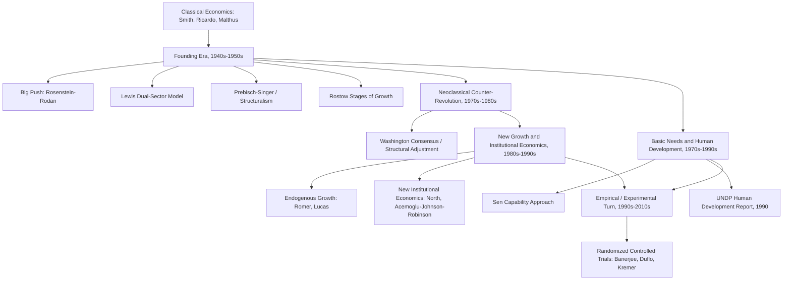

## History of Development Economics as a Discipline

### Overview

Development economics emerged as a distinct subfield of economics primarily in the aftermath of World War II, driven by the practical challenges of post-colonial nation-building, reconstruction, and the felt need to explain why some economies remained persistently poor while others industrialized. Its intellectual history reflects successive waves of theory and counter-theory, moving from early structuralist and stages-based models through neoclassical counter-revolutions, institutional and endogenous growth theory, and eventually toward the empirically-driven, experimental methods that characterize much of the field today.

### Precursors and Early Foundations (Pre-1940s)

**Key Points**

- Classical economists such as **Adam Smith**, **David Ricardo**, and **Thomas Malthus** addressed questions of national wealth, capital accumulation, and population dynamics that prefigure later development economics concerns, though not as a distinct specialized field.
- **Ricardian comparative advantage** and Malthusian population theory (the concern that population growth could outpace food production, leading to subsistence-level equilibrium) both fed into later development thinking, particularly early debates over trade policy and demographic transition in poor countries.
- Prior to the mid-20th century, questions of "underdevelopment" were largely subsumed within colonial administration, general economic history, or agricultural/trade economics, rather than treated as a unified analytical field with its own dedicated theory and methods.

### The Founding Era: Structuralism and Big Push Theories (1940s–1950s)

**Key Points**

- Development economics is widely regarded as having emerged as a distinct field in the **1940s and 1950s**, closely tied to the wave of decolonization and the practical policy question of how newly independent and war-affected economies could industrialize and raise living standards.
- **Paul Rosenstein-Rodan**'s 1943 concept of the **"Big Push"** argued that coordinated, simultaneous investment across multiple industrial sectors was necessary to overcome market failures and coordination problems that prevented poor economies from escaping low-level equilibrium traps, since isolated individual investments could fail due to insufficient complementary demand and infrastructure.
- **Ragnar Nurkse** developed related ideas around the **"vicious circle of poverty"**, arguing that poor countries remained poor partly because low income led to low savings, which led to low investment, which perpetuated low income — a self-reinforcing trap requiring external or coordinated intervention to break.
- **Arthur Lewis**'s 1954 **dual-sector model** (the Lewis model) formalized structural transformation as a process of labor migration from a traditional, low-productivity agricultural sector with surplus labor to a modern, higher-productivity industrial/capitalist sector, becoming one of the most influential early formal models in the field and directly linking to the structural-transformation concerns discussed elsewhere in this chapter.
- **Raúl Prebisch** and **Hans Singer** independently developed the **Prebisch-Singer hypothesis**, arguing that countries specializing in primary commodity exports faced a long-run tendency toward declining terms of trade relative to manufactured goods exporters, providing key intellectual grounding for the **structuralist school** centered at the UN Economic Commission for Latin America (ECLA/CEPAL) and for **import substitution industrialization (ISI)** policy prescriptions widely adopted across Latin America and elsewhere from the 1950s through the 1970s.
- **Walt Rostow**'s **Stages of Economic Growth** (1960) proposed a linear model in which all economies pass through common sequential stages (traditional society, preconditions for takeoff, takeoff, drive to maturity, and age of high mass consumption), heavily influencing Western, particularly US, development policy thinking during the Cold War era, including its explicit framing as a non-communist alternative development pathway.

### Institutional Consolidation (1950s–1960s)

**Key Points**

- This period saw the institutional consolidation of development economics as a field, including the establishment of dedicated development economics research programs, the growth of the **World Bank** as a development lending institution (established 1944, but expanding its development-specific mandate through this period), and the founding of UN agencies focused specifically on developing-country concerns, including **UNCTAD (UN Conference on Trade and Development)** in 1964, closely associated with Prebisch's structuralist and terms-of-trade arguments.
- Development economics during this period was heavily associated with **planning-oriented, state-led industrialization strategies**, reflecting the Big Push and structuralist emphasis on coordination failures that markets alone were seen as unable to resolve.

### The Neoclassical Counter-Revolution (1970s–1980s)

**Key Points**

- Beginning particularly in the 1970s and intensifying through the 1980s, a **neoclassical counter-revolution** in development economics challenged the earlier structuralist and interventionist consensus, arguing that many developing-country economic problems stemmed from excessive state intervention, price distortions, and rent-seeking rather than from market failures requiring coordinated public investment.
- Economists associated with this shift, including **Peter Bauer**, **Anne Krueger**, and **Deepak Lal**, argued for trade liberalization, reduced state intervention, and greater reliance on market price signals, directly challenging the import-substitution industrialization model associated with the earlier structuralist school.
- This intellectual shift coincided with, and reinforced, the **Washington Consensus** policy framework of the late 1980s and 1990s (associated with the IMF, World Bank, and US Treasury), which prescribed fiscal discipline, trade and financial liberalization, privatization, and deregulation as core policy prescriptions for developing countries, often implemented through **Structural Adjustment Programs (SAPs)**.
- The debt crises of the 1980s across Latin America and elsewhere (the "lost decade") provided both the immediate policy context for widespread adoption of SAPs and later became a significant point of critique regarding the human and developmental costs of rapid liberalization without adequate institutional or social safety net preparation.

### The Basic Needs and Human Development Response (1970s–1990s)

**Key Points**

- Partly in reaction to the perceived neglect of direct poverty and welfare outcomes under both the earlier growth-first structuralist paradigm and the market-oriented neoclassical counter-revolution, the **basic needs approach** (covered elsewhere in this chapter) gained institutional traction through the ILO and World Bank in the 1970s.
- This trajectory culminated in the **human development paradigm**, formally launched with the UNDP's first **Human Development Report in 1990**, drawing directly on **Amartya Sen**'s capability approach and Mahbub ul Haq's advocacy, explicitly repositioning development measurement and policy around human capabilities rather than income or output alone.
- Sen was awarded the **Nobel Memorial Prize in Economic Sciences in 1998**, substantially for his contributions to welfare economics and the capability approach, marking significant mainstream recognition of this alternative development paradigm within the economics discipline.

### New Growth Theory and Institutional Economics (1980s–1990s)

**Key Points**

- **Endogenous growth theory**, developed particularly by **Paul Romer** and **Robert Lucas** in the mid-to-late 1980s, challenged the earlier Solow-Swan growth model's treatment of technological progress as exogenous, instead modeling innovation, human capital accumulation, and knowledge spillovers as endogenous drivers of sustained long-run growth, with significant implications for development policy emphasis on education, R&D, and human capital investment.
- **New institutional economics**, associated with economists such as **Douglass North**, emphasized the centrality of institutions (property rights, contract enforcement, rule of law) in explaining long-run divergence in economic development between countries, providing an influential alternative or complement to both structuralist and pure market-liberalization explanations. North received the Nobel Memorial Prize in Economic Sciences in 1993 for this institutional economic history work.
- This period also saw influential empirical and theoretical work, including **Daron Acemoglu**, **Simon Johnson**, and **James Robinson**'s research linking historical colonial institutions to contemporary patterns of economic development, further embedding institutional analysis as a central pillar of development economics.

### The Empirical and Experimental Turn (1990s–2010s)

**Key Points**

- From the 1990s onward, and accelerating through the 2000s and 2010s, development economics underwent a significant **methodological shift toward microeconomic, empirical, and experimental research**, moving away from a primary focus on macro-level growth theory and aggregate cross-country regressions toward rigorous causal identification at the household, firm, or community level.
- This shift is closely associated with the rise of **Randomized Controlled Trials (RCTs)** in development economics, pioneered and popularized substantially by economists including **Esther Duflo**, **Abhijit Banerjee**, and **Michael Kremer**, who were jointly awarded the **Nobel Memorial Prize in Economic Sciences in 2019** "for their experimental approach to alleviating global poverty."
- The RCT-based approach emphasizes testing specific, narrowly-scoped development interventions (e.g., deworming programs, microfinance products, conditional cash transfer designs, teacher incentive schemes) with randomized treatment and control groups to establish credible causal impact estimates, in contrast to earlier, more macro-theoretical or ideologically-driven policy debates.
- This empirical turn has been influential but is not without critique: concerns raised in the broader economics literature include questions about the **external validity** of RCT findings (whether results from a specific local context generalize elsewhere), the relatively narrow scope of interventions RCTs are well-suited to test (compared to macro-institutional or structural questions), and debates over whether the RCT movement has adequately displaced or merely supplemented earlier structural and macro-development concerns. [Inference: the relative weight and resolution of these methodological debates continue to evolve within the discipline and are not settled matters.]

### Diagram: Evolution of Development Economics Paradigms

### Contemporary Directions

**Key Points**

- Contemporary development economics increasingly integrates **behavioral economics** insights (recognizing systematic deviations from full rationality in household decision-making relevant to savings, health, and education choices in poor households), **environmental and climate economics** (given the disproportionate exposure of many developing economies to climate change impacts), and continued attention to **inequality** (influenced by work such as Thomas Piketty's long-run analysis of capital and inequality).
- Debates continue over the appropriate balance between **micro-empirical (RCT-style) research** and **macro-structural analysis** (growth theory, institutional economics, structural transformation), with many contemporary researchers and institutions advocating for complementary use of both approaches rather than treating them as mutually exclusive.
- The field continues to grapple with integrating the measurement innovations covered elsewhere in this chapter (HDI, MPI, SDG indicators) with rigorous causal-impact evaluation methods, reflecting an ongoing synthesis of the discipline's structuralist, human-development, and empirical traditions.

### Related Topics

- The Lewis dual-sector model and structural transformation
- The Prebisch-Singer hypothesis and terms-of-trade debates
- The Washington Consensus and Structural Adjustment Programs
- Endogenous growth theory (Romer, Lucas) versus the Solow-Swan model
- New institutional economics and the Acemoglu-Johnson-Robinson colonial origins thesis
- The capability approach and Amartya Sen's contributions
- Randomized Controlled Trials (RCTs) in development economics
- The Human Development Index and the 1990 UNDP Human Development Report