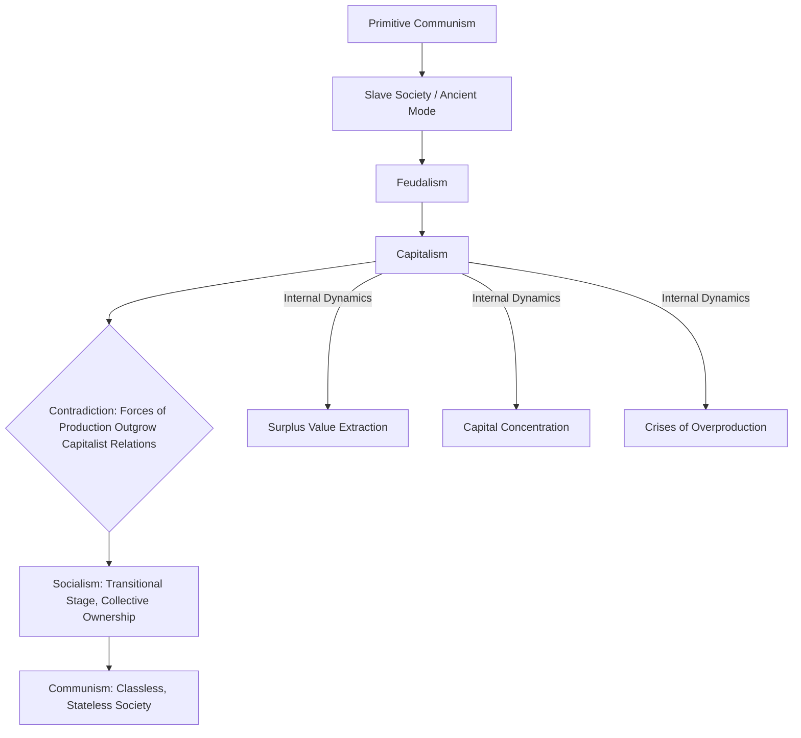

## Marx and Stages of Historical Development

### Overview

Karl Marx's theory of historical materialism proposes that human societies progress through a determinate sequence of socioeconomic stages, each defined by its characteristic mode of production and the class relations arising from it. Although Marx was not a "development economist" in the modern institutional sense, his framework has exerted substantial influence on development theory, particularly on structuralist, dependency, and world-systems approaches, and it remains a significant point of theoretical contrast with both classical and neoclassical growth theory.

### Historical Materialism: The Core Framework

**Key Points**

- Marx's theory, developed principally in collaboration with **Friedrich Engels** and elaborated across works including *The German Ideology* (1846), *A Contribution to the Critique of Political Economy* (1859), and *Capital* (Vol. I, 1867), holds that the **economic base** (the mode of production, comprising the forces of production and the relations of production) fundamentally shapes the **superstructure** of a society (its legal, political, and ideological institutions).
- The **forces of production** refer to the technology, tools, labor, and productive knowledge available to a society; the **relations of production** refer to the social and property relations governing who controls productive resources and who performs labor (e.g., slave/master, serf/lord, worker/capitalist).
- Marx argued that historical change occurs through **dialectical contradiction**: as the forces of production develop over time, they eventually come into conflict with the existing relations of production, which become a "fetter" on further development, precipitating social and political upheaval (often framed as class struggle) that ultimately transforms the relations of production to accommodate further productive advance.

### The Sequence of Modes of Production

**Key Points**

Marx outlined a broadly sequential (though not always presented as strictly universal or linear across all societies) succession of modes of production:

1. **Primitive communism**: early human societies characterized by communal ownership of resources and minimal social stratification, prior to the emergence of significant surplus production and private property.
2. **Slave society (ancient mode of production)**: characterized by the direct ownership of laborers (slaves) by a ruling class, exemplified by classical antiquity (e.g., ancient Rome).
3. **Feudalism**: characterized by a landowning aristocracy (lords) extracting surplus labor or produce from a dependent peasantry (serfs) typically tied to the land, with production organized primarily around agrarian estates.
4. **Capitalism**: characterized by private ownership of the means of production by a capitalist class (bourgeoisie), and a class of workers (proletariat) who, lacking ownership of productive assets, must sell their labor power for a wage; Marx analyzed capitalism as historically progressive in developing productive forces enormously, while simultaneously generating intensifying class conflict and periodic crises.
5. **Socialism**: a transitional stage following the (theorized) revolutionary overthrow of capitalist relations, in which the means of production come under collective or state ownership, organized to meet social needs rather than private profit.
6. **Communism**: the theorized final stage, characterized by a classless, stateless society with common ownership of the means of production and distribution according to the principle "from each according to his ability, to each according to his needs."

- Marx sometimes referred to a separate category, the **"Asiatic mode of production,"** to describe certain non-European historical societies (associated with centralized state control over large-scale infrastructure such as irrigation systems), though this category has been extensively debated and critiqued within Marxist and historical scholarship for its analytical clarity and applicability. [Inference: the precise theoretical status and applicability of the Asiatic mode of production remains a genuinely contested topic among Marxist scholars and historians, rather than a settled element of the core stage sequence.]

### Marx's Analysis of Capitalism

**Key Points**

- Marx analyzed capitalism through the **labor theory of value**, arguing that the exchange value of commodities derives from the socially necessary labor time required to produce them, and that capitalists extract **surplus value** by paying workers a wage below the full value their labor creates, appropriating the difference as profit.
- Marx predicted a tendency toward the **concentration and centralization of capital** (larger firms absorbing or outcompeting smaller ones), alongside recurring **crises of overproduction** (periodic economic crises arising from capitalism's tendency to produce more than markets can profitably absorb, exacerbated by competitive pressure to reduce wages, which simultaneously undermines aggregate demand).
- Marx also discussed the **"reserve army of labor"** — a persistent pool of unemployed or underemployed workers that capitalism tends to generate and maintain, which serves to discipline wage demands and facilitate capital's flexibility in expanding or contracting production.
- Marx viewed capitalism as historically necessary and progressive in one specific sense: it dramatically expands humanity's productive forces (technology, industrial capacity, global market integration) beyond what prior modes of production achieved, thereby creating the material preconditions (abundance, socialized large-scale production) that Marx argued would eventually make socialism and communism achievable.

### Diagram: Marx's Stages of Historical Development

### Relationship to Development Economics and Later Theory

**Key Points**

- Marx's historical materialism, while not itself a development economics framework in the modern applied sense, exerted substantial influence on later **structuralist** and **dependency theory** approaches (Prebisch, Singer, and the ECLA/CEPAL school covered elsewhere in this curriculum), which similarly emphasized structural class and power relations, rather than purely technical efficiency considerations, as central to explaining persistent underdevelopment.
- **Dependency theory** more specifically drew on Marxist concepts of exploitation and surplus extraction to analyze relations between "core" (developed, industrialized) and "periphery" (developing, primary-commodity-exporting) economies within the world capitalist system, arguing that underdevelopment in the periphery was not simply an earlier stage on a path toward eventual development, but was actively produced and reproduced by exploitative integration into the global capitalist system.
- **World-systems theory**, associated particularly with **Immanuel Wallerstein**, extended this Marxist-influenced framework further, analyzing the entire global economy as a single integrated capitalist "world-system" with core, semi-periphery, and periphery zones related through structured, unequal economic exchange.
- Marx's emphasis on **class relations and the social organization of production** stands in direct contrast to the classical (Smith, Ricardo) and later neoclassical emphasis on individual optimization, market efficiency, and factor productivity as the primary lenses for understanding growth and development, representing one of the most significant alternative theoretical traditions within the broader history of economic thought relevant to development economics.

### Critiques and Limitations of the Marxist Stage Framework

**Key Points**

- **Historical determinism concerns**: critics have long argued that Marx's stage sequence, if interpreted as a strict, universally applicable and inevitable historical law, does not adequately account for the substantial historical diversity of actual development paths across different societies and regions, some of which did not neatly follow the proposed sequence (e.g., debates over whether all societies passed through a genuinely distinct "slave" or "feudal" stage in the specific European sense).
- **Empirical outcomes of 20th-century socialist states**: the practical experience of self-identified Marxist-Leninist states in the 20th century (e.g., the Soviet Union, Maoist China) generated extensive debate over the relationship between Marx's original theoretical framework and the actual economic and political systems implemented in his name, including significant divergence in outcomes, economic performance, and human costs that remain subjects of substantial historical and political debate. [Inference: assessment of these historical outcomes involves significant interpretive and political disagreement among historians and economists, and is not treated here as a settled empirical matter beyond noting that substantial debate exists.]
- **Neoclassical and institutionalist counter-critiques**: neoclassical economists have generally argued that Marx's labor theory of value and predictions of capitalist crisis and collapse have not been borne out as originally formulated, while institutional economists (e.g., Douglass North) have offered alternative, non-Marxist explanations for long-run divergence in development outcomes centered on property rights and institutional quality rather than class-based surplus extraction.
- **Continued analytical relevance despite predictive critiques**: even among scholars who reject Marx's specific stage sequence or crisis predictions, many aspects of his analytical apparatus (attention to class relations, structural power asymmetries, and the socially constructed nature of economic institutions) continue to inform contemporary heterodox and structuralist strands within development economics.

### Related Topics

- Dependency theory and the core-periphery framework
- World-systems theory (Immanuel Wallerstein)
- The Prebisch-Singer hypothesis and structuralist economics
- New institutional economics as an alternative explanation for long-run divergence
- Import substitution industrialization and structuralist policy prescriptions
- History of development economics as a discipline
- Class analysis and surplus extraction in political economy
- Comparative economic systems: capitalism, socialism, and mixed economies