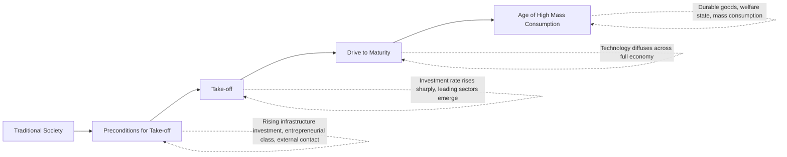

## Rostow's Stages of Economic Growth

### Overview

Walt Whitman Rostow's *The Stages of Economic Growth: A Non-Communist Manifesto* (1960) presented one of the most influential and widely taught models in early development economics: a linear, sequential theory positing that all economies pass through five common stages on the path from traditional society to advanced industrial modernity. Explicitly framed by Rostow as an ideological alternative to Marxist historical stages, the model became a cornerstone of **modernization theory** and heavily influenced Western, particularly US, development policy during the Cold War era.

### Historical and Ideological Context

**Key Points**

- Rostow, an American economist and later a senior US government foreign policy advisor, developed the stages model explicitly as a **"non-communist manifesto"** — a direct ideological counter-framework to Marx's stages of historical development, intended to demonstrate that economic modernization could be achieved through capitalist, market-oriented development rather than communist revolution.
- The model emerged during the Cold War, when the United States and Soviet Union were actively competing for ideological and strategic influence in newly decolonized and developing nations, and Rostow's framework was influential in shaping US foreign aid and development policy thinking during this period, including its association with US development assistance programs aimed at newly independent countries.
- The stages model belongs to the broader **modernization theory** tradition, which held that "underdeveloped" societies were essentially earlier versions of currently developed societies, destined to progress through analogous stages of economic and social transformation given the right conditions and interventions.

### The Five Stages

**Key Points**

1. **Traditional Society**
   - Characterized by limited production functions based on pre-Newtonian science and technology, a large share of resources devoted to agriculture, hierarchical social structures, and limited social and geographic mobility.
   - Output per capita is limited primarily by the ceiling imposed on production given the available technology and social organization, rather than by resource scarcity per se.
2. **Preconditions for Take-off**
   - A transitional stage in which the ideas and institutions supporting modern economic growth begin to emerge: rising investment in transportation, communication, and other infrastructure; the emergence of an entrepreneurial class; expanding external trade or contact with more advanced societies (often triggered by external influence, exploration, or colonial contact); and the gradual application of modern science to agriculture and industry.
   - Rostow emphasized the political and institutional preconditions necessary for take-off, including the emergence of an effective centralized nation-state capable of mobilizing resources for development.
3. **Take-off**
   - The central and most decisive stage, in which a society undergoes a fundamental transformation: the rate of productive investment rises sharply as a share of national income (Rostow specified a rise from roughly 5% to 10% or more of national income, a figure widely cited though its precise empirical universality has been questioned), one or more leading manufacturing sectors emerge with high growth rates, and a political, social, and institutional framework emerges that exploits the impulse to expansion and makes growth self-sustaining.
   - Rostow drew historical analogies to specific take-off periods he identified in various countries (e.g., Britain's take-off associated with the late 18th-century Industrial Revolution, drawing on railway construction and cotton textiles as leading sectors in various national cases). [Inference: Rostow's specific historical dating and identification of "leading sectors" for particular countries have been subject to extensive historical debate and revision by economic historians.]
4. **Drive to Maturity**
   - A prolonged period following take-off (Rostow suggested roughly several decades) in which the economy demonstrates the capacity to extend modern technology across the full range of its economic activity, moving beyond the original leading sectors of take-off into a much broader and more technologically sophisticated and diversified economic structure.
   - This stage is characterized by rising shares of national income invested (Rostow suggested a sustained range of roughly 10-20%), increasing technical and managerial sophistication, and the capacity to produce whatever the economy chooses to produce rather than being constrained by what it inherited from the take-off stage.
5. **Age of High Mass Consumption**
   - The final stage, in which the leading economic sectors shift toward durable consumer goods and services, real income rises to the point where a large majority of the population can consume well beyond basic necessities, and society allocates increasing resources toward social welfare, security, and consumer amenities.
   - Rostow associated this stage with mid-20th-century United States and Western European economies at the time of his writing, characterized by widespread automobile ownership, consumer durables, and expanded social welfare provisions.

### Diagram: Rostow's Five Stages

### Key Analytical Concepts Within the Model

**Key Points**

- **Leading sectors**: Rostow emphasized that take-off is typically driven by rapid expansion in one or a few specific industries (e.g., textiles, railways) that generate substantial forward and backward linkages to the rest of the economy, stimulating broader industrial development.
- **Investment rate threshold**: the model places significant emphasis on a specific quantitative threshold in the domestic investment share of national income as the marker distinguishing the take-off stage from the preceding preconditions stage, representing one of the model's more empirically testable (and subsequently contested) claims.
- **Linear and universal sequencing**: a defining feature of the model is its claim that all economies, regardless of historical period or starting conditions, pass through this same sequence, implying that "underdeveloped" countries in the mid-20th century were, in effect, in an earlier stage analogous to historical Western Europe's own developmental past.

### Critiques and Limitations

**Key Points**

- **Empirical universality challenged**: economic historians have extensively challenged whether specific historical "take-off" periods and investment-rate thresholds can be reliably identified across diverse countries in the manner Rostow proposed, with some arguing the historical record does not support a clean, universal take-off threshold. [Inference: the degree to which Rostow's specific quantitative thresholds hold across different national historical experiences remains a matter of ongoing historical-economic debate rather than settled consensus.]
- **Ahistorical and ethnocentric framing**: dependency theorists and structuralist critics (Prebisch, Frank, and others) argued the model ignores the historically specific international context: today's developing countries, unlike historical Britain or the United States, industrialize within a global economy already dominated by established industrial powers, facing different terms of trade, colonial legacies, and competitive pressures that historical "first movers" did not face.
- **Andre Gunder Frank's dependency critique**: Frank and other dependency theorists directly attacked the modernization/stages framework, arguing that "underdevelopment" in the Global South was not a natural earlier stage on the same path as the currently developed world, but was actively produced through historical processes of colonial exploitation and unequal integration into the world capitalist system — meaning developing countries could not simply replicate the historical trajectory of currently developed nations because the very structure of the global economy had been shaped by that prior exploitation.
- **Neglect of institutional and structural diversity**: the model's linear sequencing gives limited attention to the vast institutional, political, and structural diversity among developing countries, treating "underdevelopment" as a largely homogeneous starting condition rather than the product of highly varied historical and structural circumstances.
- **Neglect of distributional and human development outcomes**: consistent with broader critiques discussed elsewhere in this curriculum, the stages model focuses almost exclusively on aggregate output and investment metrics, offering little direct treatment of poverty, inequality, or capability expansion — concerns that later motivated the basic needs approach and the capability approach as correctives to purely growth-stage-based development thinking.
- **Determinism and lack of policy nuance**: critics have argued the model's stage-based framing can encourage overly mechanistic policy prescriptions (e.g., simply "raising the investment rate" to trigger take-off) without adequate attention to the complex institutional, political, and social preconditions genuinely required for sustained structural transformation.

### Legacy and Continued Relevance

**Key Points**

- Despite extensive critique, Rostow's stages model remains widely taught as a foundational, historically influential framework in development economics courses, valuable both for understanding mid-20th-century development policy thinking and as a reference point against which subsequent theoretical alternatives (dependency theory, structuralism, endogenous growth theory, institutional economics) explicitly positioned themselves.
- The model's emphasis on leading sectors and infrastructure investment as preconditions for broader industrial take-off retains some conceptual resonance in later discussions of structural transformation and industrial policy, even as its strict linear universality claim has been largely abandoned by mainstream development economics.
- Rostow's explicit Cold War ideological framing makes the model a useful case study in how development economics theory has often been shaped by, and deployed within, broader geopolitical contests, a theme also relevant to understanding the historical origins of the Washington Consensus and structural adjustment era covered elsewhere in this curriculum.

### Related Topics

- Marx and stages of historical development (the framework Rostow explicitly countered)
- Dependency theory and Andre Gunder Frank's critique of modernization theory
- The Lewis dual-sector model and structural transformation
- Import substitution industrialization and the structuralist policy response
- Leading sectors and linkage effects in industrial development
- History of development economics as a discipline
- The Washington Consensus and Cold War-era development policy