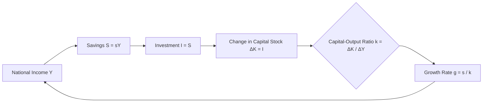

## Harrod-Domar Growth Model

### Overview

The Harrod-Domar model is one of the earliest formal mathematical growth models in economics, independently developed by Roy Harrod (1939) and Evsey Domar (1946), linking an economy's rate of savings and investment directly to its rate of output growth through a fixed capital-output ratio. Although originally formulated to analyze instability in advanced industrial (Keynesian) economies, the model was widely adopted and adapted in the 1950s and 1960s as a practical planning tool in development economics, particularly for estimating the investment required to achieve a target growth rate in developing countries.

### Theoretical Origins

**Key Points**

- **Roy Harrod**'s 1939 paper "An Essay in Dynamic Theory" extended Keynesian short-run macroeconomic analysis into a dynamic, long-run growth framework, examining the conditions under which an economy's actual growth rate would align with its warranted (or equilibrium) growth rate.
- **Evsey Domar**'s independent 1946 work approached a similar question from the perspective of the dual role of investment: investment simultaneously creates income in the short run (via the Keynesian multiplier) and expands productive capacity in the long run (via the accelerator effect of capital accumulation), raising the question of what growth rate is required to keep these two effects in balance.
- Though developed independently and with somewhat different theoretical emphases, the two contributions are conventionally combined and taught jointly as the **Harrod-Domar model** due to their shared core mechanism and similar resulting growth equation.

### Core Assumptions

**Key Points**

- **Fixed capital-output ratio (Incremental Capital-Output Ratio, ICOR)**: the model assumes a constant, technologically determined ratio between capital stock and the output it produces, meaning there is no substitutability between capital and labor in production (unlike later neoclassical growth models, which typically assume a variable capital-output ratio via a flexible production function).
- **Fixed savings rate**: a constant proportion of national income is assumed to be saved, generating the pool of resources available for investment.
- **No technological change** (in the model's most basic form): output growth is driven purely by capital accumulation, with technology held constant, in contrast to later endogenous growth models that explicitly incorporate technological progress.
- **Closed economy simplification** (in the basic version): the core model does not incorporate international trade, foreign capital inflows, or a government sector, though extensions of the model do incorporate these features.

### The Core Growth Equation

**Key Points**

- The model derives from two basic accounting relationships:
  - **Savings**: $S = sY$, where $s$ is the savings rate (a constant fraction of national income $Y$) and $S$ is total savings.
  - **Capital-output ratio**: $k = \Delta K / \Delta Y$, where $k$ (the ICOR) represents the additional units of capital required to produce one additional unit of output.
- Assuming that all savings are converted into investment ($S = I$), and that investment translates into additional capital stock ($I = \Delta K$), the model derives the fundamental growth equation:

$$g = \frac{s}{k}$$

where $g$ is the growth rate of national output (i.e., $g = \Delta Y / Y$), $s$ is the savings rate, and $k$ is the capital-output ratio.

- This equation states that an economy's growth rate is directly proportional to its savings (and hence investment) rate, and inversely proportional to the amount of capital required to produce each additional unit of output.

**Example**

Suppose a developing economy has a savings rate of $s = 0.15$ (15% of national income saved and invested) and a capital-output ratio of $k = 3$ (meaning 3 units of capital investment are required to generate 1 additional unit of output). The model predicts a growth rate of:

$$g = \frac{0.15}{3} = 0.05 \text{, or } 5\%$$

If policymakers wished to raise the growth rate to 7% while the capital-output ratio remained fixed at 3, the model implies the required savings rate would need to rise to:

$$s = g \times k = 0.07 \times 3 = 0.21 \text{, or } 21\%$$

### Diagram: Harrod-Domar Growth Mechanism

### The Harrod-Domar Model as a Development Planning Tool

**Key Points**

- From the 1950s through the 1970s, the Harrod-Domar equation became widely used by development economists and international financial institutions as a **practical planning tool** for estimating the **"financing gap"** — the amount of additional investment (and, correspondingly, foreign aid or capital inflow) a developing country would need to achieve a specific target growth rate, given its existing domestic savings capacity and capital-output ratio.
- This application, often referred to as the **"financing gap model"** or **two-gap model** (in extended versions incorporating a foreign exchange constraint alongside the domestic savings constraint), directly informed development aid allocation logic: if a country's domestic savings were insufficient to finance the investment required for a desired growth target, the shortfall (the "gap") could, in principle, be filled by foreign aid or capital inflows.
- This planning application made the Harrod-Domar model highly influential in shaping mid-20th-century foreign aid policy, including its use by the World Bank and other development institutions in project and country-level investment planning during this era.

### Instability and the Knife-Edge Problem

**Key Points**

- In Harrod's original theoretical formulation, the model highlighted a structural **instability problem**, sometimes called the **"knife-edge" property**: because the model assumes fixed technological coefficients (a fixed capital-output ratio) and a fixed savings rate, there is no automatic market mechanism to bring the economy's actual growth rate into alignment with the "warranted" growth rate (the rate consistent with full capacity utilization) or the "natural" growth rate (the rate consistent with full employment of a growing labor force and technological progress).
- If the actual growth rate deviates even slightly from the warranted rate, Harrod argued the economy would tend to diverge further away from equilibrium, rather than self-correct, implying persistent instability, cyclical over- or under-investment, and business cycle fluctuations rather than smooth, self-stabilizing growth.
- This instability result was one of the model's most theoretically significant original contributions in a Keynesian macroeconomic context, distinct from its later, somewhat different application as a straightforward planning/financing-gap tool in development economics.

### Critiques and Limitations

**Key Points**

- **Fixed capital-output ratio assumption is unrealistic**: critics, particularly proponents of the later neoclassical Solow-Swan growth model, argued that the assumption of a fixed, non-substitutable capital-output ratio does not reflect real production processes, where capital and labor can typically be combined in varying proportions depending on relative factor prices and technology.
- **Neglect of technological change**: because the basic model holds technology constant, it cannot explain sustained long-run per capita income growth in the way later growth theory (Solow-Swan's exogenous technological progress, and subsequently endogenous growth theory) attempts to.
- **Overemphasis on capital as the binding constraint**: the model's core policy implication — that raising the savings/investment rate (potentially through foreign aid) is the primary lever for accelerating growth — was later criticized as overly simplistic, since it neglects other potentially binding constraints on developing-country growth, including institutional quality, human capital, technology absorption capacity, governance, and macroeconomic stability. This critique gained particular force following disappointing outcomes from aid-financed investment programs in various developing countries that did not achieve their Harrod-Domar-projected growth rates despite receiving substantial capital inflows. [Inference: attributing any specific country's growth shortfall to the model's assumptions versus other confounding factors (governance, external shocks, policy implementation) is a matter of case-specific empirical analysis rather than a general proof that the model is invalid in all applications.]
- **"Aid absorption" and diminishing returns concerns**: subsequent development economics literature has raised the concern that simply increasing capital inflows/aid does not mechanically translate into proportional growth if an economy faces binding constraints on its capacity to productively absorb and deploy additional capital (e.g., limited administrative capacity, insufficient complementary human capital or infrastructure), a critique closely related to later "growth diagnostics" approaches that seek to identify the actual binding constraint on growth in a specific country context rather than assuming capital scarcity is always the primary bottleneck.
- **Superseded by the Solow-Swan model for mainstream growth theory**: within mainstream growth theory, the Harrod-Domar model was substantially superseded by the neoclassical Solow-Swan model (1956), which introduced a variable capital-output ratio via a standard production function and explicitly incorporated exogenous technological progress, resolving the knife-edge instability problem through the assumption of factor substitutability.

### Continued Relevance

**Key Points**

- Despite its theoretical limitations, the Harrod-Domar framework remains pedagogically valuable as an introduction to formal growth modeling and to the fundamental savings-investment-growth relationship, and its underlying logic (that investment financed by savings or capital inflows is necessary, though not sufficient, for growth) continues to inform basic development planning heuristics and back-of-envelope investment-requirement estimates.
- The two-gap model extension (incorporating a foreign exchange constraint alongside the domestic savings constraint) remains referenced in balance-of-payments-constrained growth analysis and in discussions of the role of foreign capital inflows and export earnings in financing developing-country investment.
- The model's central critique — that capital/investment alone is not necessarily the binding constraint on growth in every context — helped motivate the shift toward more diagnostic, context-specific approaches to identifying growth constraints in later development economics, including the growth diagnostics framework referenced elsewhere in this curriculum.

### Related Topics

- The Solow-Swan neoclassical growth model
- The two-gap model and foreign exchange constraints on growth
- Growth diagnostics (Hausmann-Rodrik-Velasco framework)
- Endogenous growth theory and the treatment of technological change
- Foreign aid effectiveness and aid absorption capacity debates
- Incremental Capital-Output Ratio (ICOR) in development planning
- History of development economics as a discipline
- Rostow's stages of economic growth and its investment-rate threshold