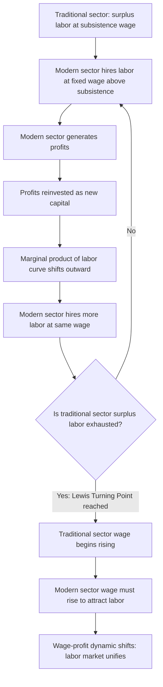

## Lewis Dual-Sector Model of Development

### Overview

The Lewis dual-sector model, developed by Nobel laureate W. Arthur Lewis in his 1954 paper "Economic Development with Unlimited Supplies of Labour," is a foundational model in classical development economics explaining structural transformation — the reallocation of labor and output from a low-productivity traditional (agricultural/subsistence) sector to a high-productivity modern (industrial/capitalist) sector. The model provided the first rigorous theoretical framework for understanding industrialization in labor-abundant developing economies and remains a core reference point in development economics, though its predictive limitations motivated substantial subsequent refinement.

### Theoretical Foundations

#### The Two-Sector Structure

**Key Points**

- The **traditional (subsistence) sector**: predominantly agricultural, characterized by very low or zero marginal productivity of labor due to labor surplus relative to fixed land and capital — meaning some workers could be removed from this sector without reducing total agricultural output. Wages in this sector are determined by an institutional/subsistence norm (roughly, average product per worker, or a socially determined subsistence minimum) rather than by marginal productivity.
- The **modern (capitalist) sector**: industrial and urban, characterized by capitalist firms employing wage labor, using reproducible capital, and operating with the objective of profit maximization, where marginal productivity determines labor demand.
- The model's central mechanism: because the traditional sector has effectively "unlimited" (or highly elastic) labor supply at a wage close to the subsistence level, the modern sector can expand employment substantially without triggering significant wage increases, generating high profits that are reinvested to further expand capital and employment — a self-reinforcing growth dynamic.

#### The Institutional Wage Gap

A key structural feature of the model is that the modern-sector wage is set at a premium above the subsistence-sector wage (Lewis suggested roughly 30% higher), reflecting the higher cost of urban living, the psychological cost of migration, and the need to incentivize movement from traditional to modern employment. This wage gap is treated as **institutionally fixed** rather than market-clearing, and remains constant throughout the labor transfer process as long as surplus labor persists in the traditional sector.

### Mathematical and Diagrammatic Structure

#### The Marginal Productivity Curve

In the modern sector, labor demand follows the standard neoclassical marginal productivity condition. With capital stock $K$ fixed in the short run, the marginal product of labor curve $MPL(L)$ is downward-sloping. The modern-sector wage $W_M$ is set institutionally above the subsistence wage $W_S$, and employment is determined by:

$$MPL(L_M) = W_M$$

As capital accumulates (through reinvestment of profits), the entire marginal product of labor curve shifts outward, allowing employment $L_M$ to expand at the constant wage $W_M$ — this is the engine of structural transformation in the model.

#### Diagram: The Lewis Turning Point Dynamic

#### Profit Reinvestment and Capital Accumulation

The model assumes capitalists save and reinvest the entirety (or a very high proportion) of profits, in contrast to workers, who are assumed to consume their entire wage income (a classical, Ricardian-influenced savings assumption). This generates a **self-sustaining growth mechanism**:

$$\text{Capital stock}_{t+1} = \text{Capital stock}_t + \text{Profits}_t$$

Because the wage rate stays constant (pinned by the institutional wage gap and elastic labor supply) while the marginal product of labor rises with capital accumulation, the **profit share of modern-sector output rises continuously** during the surplus-labor phase — this rising profit share is the mechanism that accelerates capital accumulation and, in turn, structural transformation.

### The Lewis Turning Point

**Key Points**

- The **Lewis Turning Point** (a term formalized by later scholars building on Lewis's original framework) refers to the point at which the traditional sector's labor surplus is exhausted — i.e., continued transfer of labor to the modern sector would begin to reduce agricultural output, since remaining workers now have positive marginal product.
- Beyond this point, the traditional-sector wage is no longer institutionally fixed at subsistence level but begins rising to reflect labor's rising marginal product in agriculture, forcing the modern sector to raise wages correspondingly to continue attracting workers.
- This marks the transition from a "labor-surplus economy" (Lewis's original framework) to a fully integrated, neoclassical-style labor market in which wages in both sectors are determined by marginal productivity and adjust together.
- [Inference] The Lewis Turning Point is generally treated in the growth economics literature as a useful analytical marker for a structural transformation milestone rather than a single precisely dateable historical event, since real economies exhibit gradual and regionally uneven transitions rather than a sharp discontinuity.

### Empirical Applications

#### East Asian Structural Transformation

- The Lewis framework has been extensively applied to explain the rapid industrialization of Japan (1950s-60s), South Korea and Taiwan (1960s-80s), and more recently China (1980s-2010s), all of which began industrialization with very large agricultural labor surpluses relative to modern-sector employment.
- China's experience has generated substantial contemporary research interest in identifying its own Lewis Turning Point: several economists (notably Cai Fang and colleagues at the Chinese Academy of Social Sciences) argued China approached or passed this turning point around 2010-2015, evidenced by accelerating rural-to-urban wage convergence and rising manufacturing wages in coastal export zones.
- [Unverified] The precise timing and even the underlying interpretation of China's wage dynamics as reflecting a genuine Lewis Turning Point (versus alternative explanations such as demographic shifts from the one-child policy, hukou/household registration system reforms, or regional labor market segmentation) remains actively debated among China-focused development economists.

#### Sub-Saharan Africa

- Application of the Lewis model to Sub-Saharan African economies has been more contested, since many African economies have exhibited substantial rural-to-urban migration without a correspondingly robust formal modern (industrial) sector absorbing this labor — leading to large urban informal sectors rather than the capitalist wage-employment sector envisioned in Lewis's original model.
- This divergence from the model's predicted pattern substantially motivated later refinements (see Harris-Todaro model below).

### Major Critiques and Limitations

#### The Harris-Todaro Refinement

The most significant formal extension addressing a key empirical shortfall of the Lewis model is the **Harris-Todaro model** (1970), which addressed the observation that rural-to-urban migration in many developing economies substantially exceeded the rate of formal modern-sector job creation, producing high urban unemployment rather than the smooth absorption Lewis's model implied.

- Harris and Todaro proposed that migration decisions depend on the **expected** urban wage (the formal-sector wage multiplied by the probability of obtaining formal employment), rather than the actual wage differential alone.
- This reformulation explains persistent urban unemployment as an *equilibrium* outcome: migrants continue moving to cities even with substantial open unemployment risk, as long as the probability-weighted expected urban wage exceeds the rural wage.

#### Questioning the Zero/Low Marginal Productivity Assumption

- Empirical agricultural economics research (beginning with critiques by Theodore Schultz in the 1960s) challenged Lewis's foundational assumption that marginal productivity of agricultural labor is at or near zero, arguing that even in labor-abundant traditional agriculture, removing workers typically does reduce output to some degree — i.e., "disguised unemployment" in the strict zero-marginal-product sense is empirically rare.
- [Inference] Contemporary development economics generally treats the "surplus labor" concept as a matter of degree (low, but not necessarily zero, marginal productivity) rather than accepting the model's strict zero-marginal-product assumption literally, while still finding the broader structural-transformation framework useful.

#### Constant Institutional Wage Assumption

- Critics note the assumption of a constant modern-sector wage premium throughout the surplus-labor phase is a simplifying device rather than a fully theorized labor market outcome; subsequent efficiency wage theory and labor market segmentation literature provide more developed microeconomic foundations for why modern-sector wages might remain above market-clearing levels (e.g., to reduce turnover, increase effort, or reflect trade union bargaining power).

#### Neglect of Human Capital and Technology

- The model's simple two-factor (labor and capital) framework does not incorporate human capital differences between sectors, nor does it address technological change within the traditional sector itself (the Green Revolution's substantial agricultural productivity gains in South and Southeast Asia from the 1960s onward complicate the model's assumption of a stagnant, technologically static traditional sector).

### Comparative Summary: Lewis Model vs. Harris-Todaro Extension

| Feature | Lewis Model (1954) | Harris-Todaro Extension (1970) |
| --- | --- | --- |
| Migration driver | Wage gap between sectors (institutionally fixed) | Expected wage (formal wage × employment probability) |
| Urban unemployment | Not explicitly modeled; assumed labor smoothly absorbed | Central feature; explains persistent equilibrium unemployment |
| Rural sector wage | Fixed subsistence/institutional wage | Determined by marginal productivity or similar institutional norm |
| Best empirical fit | Rapid industrializers with strong formal-sector job growth (East Asia) | Economies with large informal urban sectors (much of Sub-Saharan Africa, South Asia) |
| Policy implication | Encourage capital accumulation and modern-sector expansion | Caution against policies that increase expected urban wage without matching formal job creation (may worsen unemployment) |

### Contemporary Relevance

**Conclusion**

The Lewis model remains a core reference framework in development economics for understanding structural transformation, and its central insight — that economic development fundamentally involves the reallocation of labor from low-productivity traditional activities to higher-productivity modern activities — continues to underpin contemporary structural transformation and "growth diagnostics" literature (e.g., work by Dani Rodrik and others on premature deindustrialization, which examines cases where manufacturing employment shares peak and decline at much lower income levels than historical East Asian patterns, raising questions about whether the classical Lewis-style transformation path remains available to today's developing economies). [Inference] Current development economics generally treats the Lewis model as a foundational conceptual starting point rather than a literally accurate description of any specific economy's transition, valued primarily for the analytical vocabulary and causal intuition it provides (surplus labor, structural transformation, the turning point concept) rather than for precise quantitative prediction, with the Harris-Todaro and subsequent extensions considered necessary complements for empirical application.

### Related Topics

- Harris-Todaro model of rural-urban migration and urban unemployment
- The Lewis Turning Point in contemporary Chinese economic development
- Structural transformation and premature deindustrialization (Rodrik)
- Green Revolution and agricultural productivity growth in traditional sectors
- Efficiency wage theory as a microfoundation for institutional wage gaps
- Dualism and labor market segmentation theory
- Solow-Swan growth model (comparison of single-sector vs. dual-sector frameworks)
- Informal sector economics and urban labor markets in developing economies