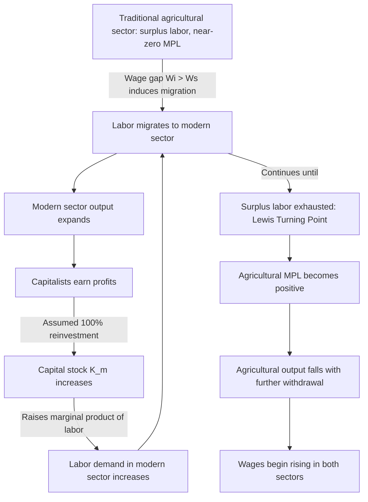

## Structural Change Theory

### Overview

Structural change theory is a body of development economics that models economic development as a systematic transformation of an economy's structure — moving productive resources (labor, capital) from a low-productivity traditional sector (predominantly subsistence agriculture) to a high-productivity modern sector (predominantly industry and urban manufacturing). Unlike theories that treat development as a purely quantitative process (accumulation of capital and savings), structural change theory treats underdevelopment as a problem of resource misallocation across sectors with fundamentally different production characteristics.

The theory's central claim: sustained growth requires internal structural transformation — a shrinking share of agriculture and a rising share of industry/services in output and employment — not merely more investment within an unchanged economic structure.

### Historical and Intellectual Context

Structural change models emerged in the 1950s–1960s as a response to two gaps in earlier growth theory:

- **Harrod-Domar limitations**: Harrod-Domar treated all capital and output as homogeneous, ignoring that developing economies are typically dualistic — coexisting traditional and modern sectors with different technologies, factor productivities, and market structures.
- **Empirical observation**: Economists observing post-colonial and post-war developing economies noted a persistent pattern — countries did not grow by simply scaling up existing agrarian structures; growth was accompanied by declining agricultural employment shares and rising industrial/urban shares.

The two foundational contributions are the **Lewis Model** (W. Arthur Lewis, 1954) and **Chenery's Patterns of Development** (Hollis Chenery, 1960s–1970s), often called the "empirical" or "statistical" structural-change approach.

---

### The Lewis Two-Sector Model

#### Core Assumptions

1. The economy consists of two sectors:
   - **Traditional/subsistence (agricultural) sector**: characterized by surplus labor — the marginal product of labor is at or near zero (or, in the strict version, negative or zero beyond a threshold), because too many workers are on a fixed amount of land.
   - **Modern/capitalist (industrial) sector**: uses reproducible capital and modern technology, and wages are determined institutionally rather than by marginal product.
2. The industrial wage is set at a premium above the average subsistence-sector income (Lewis suggested roughly 30% higher) to induce migration.
3. Because subsistence-sector marginal product is near zero, labor can be withdrawn from agriculture with negligible loss of agricultural output.
4. Capitalists in the modern sector reinvest 100% of profits, since profit is assumed to be the sole source of savings in the economy (workers in both sectors are assumed not to save).

#### Mechanism

Labor migrates from agriculture to industry as long as the institutional industrial wage exceeds the rural subsistence wage. Because labor is "unlimited" (elastic supply) at this fixed institutional wage, industrial output can expand without triggering wage increases. Profits accrue to capitalists, who reinvest them into further capital formation, expanding the capital stock and labor demand in the modern sector. This creates a self-reinforcing growth loop:

$$\text{Profits} \rightarrow \text{Reinvestment} \rightarrow \text{Capital Stock} \uparrow \rightarrow \text{Labor Demand} \uparrow \rightarrow \text{Migration} \uparrow \rightarrow \text{Modern Sector Output} \uparrow \rightarrow \text{Profits} \uparrow$$

This process continues until the **Lewis turning point** — the point at which surplus agricultural labor is exhausted. Beyond this point, further labor withdrawal from agriculture reduces agricultural output, agricultural prices rise, and the rural wage (and hence the industrial wage needed to attract labor) begins rising with labor demand — the labor supply curve to industry stops being flat.

**Diagram: Lewis Model Labor Market (svg_diagram)**

<svg xmlns="http://www.w3.org/2000/svg" viewBox="0 0 720 460" font-family="Helvetica, Arial, sans-serif">
<text x="360" y="28" font-size="18" font-weight="bold" text-anchor="middle">Lewis Two-Sector Model: Modern Sector Labor Market (svg_diagram)</text>

<line x1="90" y1="380" x2="650" y2="380" stroke="black" stroke-width="2" />
<line x1="90" y1="380" x2="90" y2="60" stroke="black" stroke-width="2" />
<text x="660" y="385" font-size="14">Labor (L)</text>
<text x="60" y="60" font-size="14">Wage (W)</text>

<line x1="90" y1="300" x2="470" y2="300" stroke="#c0392b" stroke-width="3" />
<text x="480" y="304" font-size="13" fill="#c0392b">Institutional industrial wage (W_i)</text>

<line x1="90" y1="340" x2="650" y2="340" stroke="#7f8c8d" stroke-width="1.5" stroke-dasharray="6,4" />
<text x="500" y="335" font-size="12" fill="#7f8c8d">Subsistence wage (W_s)</text>

<path d="M 470 300 Q 560 260 650 150" stroke="#c0392b" stroke-width="3" fill="none" />
<circle cx="470" cy="300" r="5" fill="#c0392b" />
<text x="440" y="410" font-size="12" fill="#c0392b">Lewis turning point</text>
<line x1="470" y1="380" x2="470" y2="300" stroke="#c0392b" stroke-width="1" stroke-dasharray="3,3" />

<path d="M 120 380 Q 250 200 400 90" stroke="#2980b9" stroke-width="2" fill="none" />
<text x="380" y="85" font-size="12" fill="#2980b9">MPL_1 (t=1)</text>
<path d="M 180 380 Q 320 220 520 90" stroke="#27ae60" stroke-width="2" fill="none" />
<text x="500" y="85" font-size="12" fill="#27ae60">MPL_2 (t=2, after reinvestment)</text>
<path d="M 260 380 Q 420 240 630 100" stroke="#8e44ad" stroke-width="2" fill="none" />
<text x="580" y="112" font-size="12" fill="#8e44ad">MPL_3 (t=3)</text>

<circle cx="255" cy="300" r="4" fill="black" />
<circle cx="330" cy="300" r="4" fill="black" />
<circle cx="405" cy="300" r="4" fill="black" />

<text x="90" y="410" font-size="12">O</text>

</svg>

The horizontal segment of the wage line reflects the "unlimited supply of labor"; successive outward shifts of the marginal product of labor (MPL) curve — driven by reinvested profits raising the capital stock — expand modern-sector employment at a constant wage, until the supply curve turns upward at the Lewis turning point.

#### Strengths

- Provides a coherent micro-founded story for how surplus labor and capital accumulation interact to drive structural transformation.
- Explains historically observed patterns of rural-to-urban migration alongside industrialization in early-stage developing economies (e.g., parts of East Asia in the mid-20th century).
- Introduced the influential concept of "dualism" — coexisting sectors with different production technologies and labor market rules — that persists in later development models (e.g., Harris-Todaro).

#### Criticisms

- **Zero marginal product assumption is empirically weak**: Most empirical studies since the 1960s found agricultural marginal product of labor is positive, not zero, even in labor-abundant economies, undermining the "costless withdrawal" premise. [Inference: the degree to which this holds varies substantially by country and season, and remains a contested empirical question rather than a settled fact.]
- **Constant institutional wage assumption**: Assumes industrial real wages stay fixed despite rising labor demand, which does not match cases where wages rose well before full absorption of surplus labor.
- **Full reinvestment of profits assumption**: Assumes capitalists save/invest 100% of profits and workers save nothing — an oversimplification, since profits may be repatriated, consumed conspicuously, or invested abroad rather than reinvested domestically.
- **Employment vs. output growth**: Emphasis on the modern sector's capital-intensity can mean the modern sector's employment absorption is slower than population/labor-force growth, producing rising urban unemployment/underemployment rather than smooth absorption — a pattern later modeled explicitly by Todaro.
- **Neglects agricultural productivity growth as a driver**: Treats agriculture largely as a passive labor reservoir rather than a sector that itself needs productivity-enhancing investment (a critique central to later "balanced growth" and green revolution literature).

---

### Chenery's Patterns of Development (Structural-Change/Empirical Approach)

#### Core Method

Hollis Chenery and collaborators (notably with Moises Syrquin) used large cross-country and time-series statistical analysis (regressions across dozens of countries at varying income levels) to identify **empirical regularities** — "stylized facts" — in how economic structure changes as per-capita income rises. Rather than a single mechanistic model like Lewis's, this approach documents patterns and treats them as the systematic path all successfully developing economies tend to traverse.

#### Key Empirical Regularities Identified

1. **Shift in output composition**: The share of agriculture in GDP declines steadily and substantially as per-capita income rises; the share of industry (particularly manufacturing) rises, typically until an economy reaches upper-middle-income levels, after which services begin dominating.
2. **Shift in employment composition**: Labor share in agriculture declines, though typically with a lag relative to the decline in agriculture's output share (since agricultural labor productivity growth is often slower than industrial productivity growth in early stages).
3. **Change in demand composition**: As income rises, Engel's Law implies the share of income spent on food (a proxy for agricultural demand) falls, while demand for manufactured goods and services rises — providing a demand-side complement to the supply-side transformation.
4. **Accumulation processes**: Domestic savings and investment rates rise as income grows; the composition of investment shifts toward physical and human capital appropriate to industrial production.
5. **Urbanization**: The share of population in urban areas rises systematically with industrialization, consistent with (though not identical to) the resource-reallocation logic of the Lewis model.
6. **International trade and capital flows**: Exports shift over time from primary commodities toward manufactured goods; reliance on foreign capital (aid, foreign investment) typically follows an inverted-U or declining pattern as domestic savings capacity grows.
7. **Demographic transition**: Population growth rates and fertility rates typically decline as income and urbanization rise, altering labor-force growth and dependency ratios.

#### Distinguishing Feature vs. Lewis

| Dimension | Lewis Model | Chenery's Patterns of Development |
| --- | --- | --- |
| Method | Theoretical, single-mechanism model | Empirical, cross-country statistical regularities |
| Driver of change | Labor migration + capital accumulation via reinvested profits | Multiple interacting factors: demand shifts, trade, accumulation, demographics |
| Scope | Two sectors (agriculture vs. industry) | Multi-sector, multi-dimensional (output, employment, trade, demographics, urbanization) |
| Predictive claim | A specific mechanism/turning point | A "typical path" observed across many countries, allowing for variation |

#### Chenery's Contribution to Policy Thinking

Chenery's work underpinned the idea that development strategy should be tailored to a country's structural starting point (resource endowments, country size, initial income level) rather than assuming one uniform growth recipe applies everywhere — a more nuanced, empirically grounded successor to the Lewis model's single mechanism.

---

### Mathematical Formalization (Simplified Lewis Framework)

Let the traditional sector have a fixed factor (land, $\bar{T}$) and variable labor $L_a$, with production function $Q_a = f(L_a, \bar{T})$ exhibiting diminishing (or zero, in the extreme case) marginal returns to labor beyond a subsistence-surplus threshold $L^*$:

$$\frac{\partial Q_a}{\partial L_a} \approx 0 \quad \text{for } L_a > L^*$$

The modern sector has production function $Q_m = g(L_m, K_m)$ with capital $K_m$ accumulated from reinvested profits $\pi$:

$$K_{m,t+1} = K_{m,t} + s_c \cdot \pi_t, \quad \text{where } s_c \approx 1$$

Profits are the residual after paying the institutional wage $W_i$ to $L_m$ workers:

$$\pi_t = Q_{m,t} - W_i \cdot L_{m,t}$$

Labor migrates from $a$ to $m$ as long as $W_i > W_s$ (subsistence income), and $L_m$ expands with each increase in $K_m$ (since $\partial Q_m/\partial L_m$ shifts outward with more capital), continuing until $L_a$ falls to $L^*$ — the Lewis turning point — after which $\partial Q_a/\partial L_a$ becomes positive, agricultural output falls with further withdrawal, and $W_i$ must rise to continue attracting labor.

---

### Process Flow Diagram

---

### Real-World Applications and Illustrative Cases

- **East Asian industrializers (e.g., South Korea, Taiwan, mid-20th century)**: Rapid absorption of agricultural labor into export-oriented manufacturing is often cited as broadly consistent with Lewis-type dynamics, though scholars debate how literally the "unlimited labor supply" assumption held. [Inference: characterizations of these episodes as clean confirmations of the Lewis model are a simplification; multiple complementary factors, including trade policy and education investment, were also central.]
- **Sub-Saharan Africa**: Many economies have shown structural change in output composition (declining agricultural GDP share) without a matching shift in employment composition — a pattern termed "growth without structural transformation" or jobless structural change in later literature, illustrating a divergence from the smooth Lewis/Chenery pattern.
- **China (1980s–2000s)**: Large-scale rural-to-urban migration alongside industrial expansion is frequently analyzed using Lewis-model frameworks, with debate over whether and when China reached its "Lewis turning point" (commonly discussed as occurring sometime in the late 2000s to early 2010s). [Unverified: precise dating varies significantly across studies and is not a settled empirical consensus.]

---

### Critiques and Position Relative to Other Development Theories

- **Vs. Linear Stages Theory (Rostow)**: Structural change theory shares the idea of a sequential transformation but focuses on *sectoral resource reallocation mechanisms* rather than a fixed universal sequence of stages defined by savings/investment thresholds.
- **Vs. Dependency Theory**: Dependency theorists criticized structural change models (along with linear-stages models) for assuming that developing countries could replicate the historical industrialization paths of currently developed countries, ignoring how existing global trade and power structures constrain peripheral economies.
- **Vs. Neoclassical Counterrevolution**: Neoclassical critics argued structural change models understate the role of price distortions, government intervention, and market failures (e.g., overvalued exchange rates, protected industry) in explaining why labor and capital reallocation did not always proceed smoothly as Lewis/Chenery predicted.
- **Contribution to later models**: The dualistic labor market concept was extended and modified by the **Harris-Todaro model**, which incorporated urban unemployment/underemployment as an equilibrium outcome of rational migration decisions under wage differentials and job-finding probabilities — directly addressing one of the Lewis model's key blind spots.

---

### Worked Example

**Scenario**: A hypothetical economy has 10 million agricultural workers with total agricultural output of 100 million units. Suppose 3 million of these workers have a marginal product of approximately zero (disguised unemployment). The modern sector pays an institutional wage 30% above the average rural income and initially employs 1 million workers.

**Step 1** — Migration incentive: If average rural income per worker is $10 units, the industrial wage is $13 units, creating a persistent pull factor as long as $13 > 10$.

**Step 2** — Labor withdrawal: The 3 million zero-MPL workers can migrate to the modern sector with agricultural output remaining at approximately 100 million units (no loss), since their marginal contribution was negligible.

**Step 3** — Capital accumulation loop: As the modern sector absorbs workers, its output rises; assuming capitalists reinvest all profits, the capital stock grows, shifting the labor demand curve outward and permitting further absorption at the same wage $13.

**Step 4** — Turning point: Once agricultural employment falls below 7 million (the surplus-labor threshold in this example), further withdrawal begins reducing agricultural output below 100 million units, agricultural prices rise (given fixed or slow-growing demand for food is not the constraint — supply is), and the wage gap needed to attract further migrants widens, ending the "unlimited supply of labor" phase.

---

### Related Topics

- Harris-Todaro model of rural-urban migration and urban unemployment
- Rostow's Stages of Economic Growth (linear-stages theory)
- Harrod-Domar growth model
- Balanced growth vs. unbalanced growth (Nurkse vs. Hirschman)
- Big Push theory (Rosenstein-Rodan)
- Dependency theory and center-periphery models
- Dual economy models and disguised unemployment
- Green Revolution and agricultural productivity as a precondition for structural transformation
- Premature deindustrialization (Dani Rodrik) — contemporary critique of the classical structural change trajectory
- Structural transformation and total factor productivity growth (Duarte and Restuccia framework)