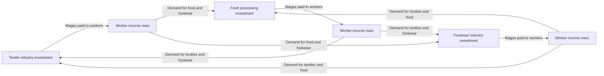
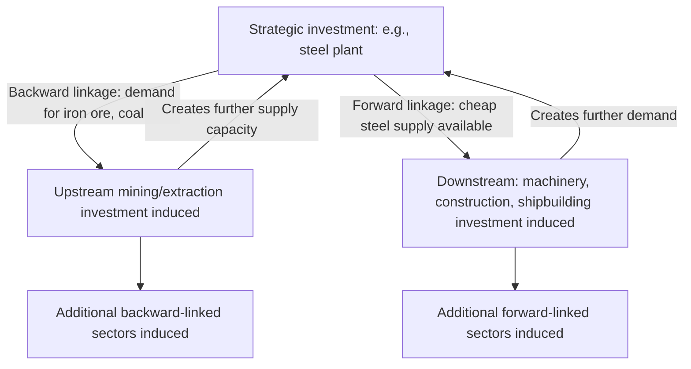

## Balanced versus unbalanced growth theory

### Overview

Balanced versus unbalanced growth theory refers to a major debate within classical development economics over the optimal *pattern of investment allocation* across sectors during the early stages of industrialization. The debate centers on a single strategic question: should a developing economy invest simultaneously across many sectors to expand demand and supply in a coordinated, mutually reinforcing way (**balanced growth**), or should it deliberately concentrate investment in a few strategic, high-linkage sectors to create productive tensions and induce further investment (**unbalanced growth**)?

Both camps agree on the underlying diagnosis: developing economies are trapped in low-level equilibria because markets alone fail to coordinate investment decisions across interdependent sectors. They disagree sharply on the prescribed remedy.

### Historical and Intellectual Context

The debate emerged in the 1940s–1960s among development economists responding to the same core problem — market failure in coordinating investment in poor, capital-scarce economies — but arriving at opposite strategic conclusions.

- **Balanced growth** is associated primarily with **Ragnar Nurkse** (*Problems of Capital Formation in Underdeveloped Countries*, 1953) and, in a related but distinct formulation, **Paul Rosenstein-Rodan** (the "Big Push" theory, 1943).
- **Unbalanced growth** is associated primarily with **Albert O. Hirschman** (*The Strategy of Economic Development*, 1958), who directly critiqued Nurkse's framework.

Both theories responded to the same stylized fact: private investors in poor countries under-invest relative to the socially optimal level because the profitability of any single investment depends on complementary investments elsewhere that have not yet been made.

---

### Balanced Growth Theory

#### The Vicious Circle of Poverty (Nurkse's Diagnosis)

Nurkse's starting point is the **vicious circle of poverty**, operating on both the supply and demand sides:

**Supply side**:

$$\text{Low income} \rightarrow \text{Low savings} \rightarrow \text{Low investment} \rightarrow \text{Low productivity} \rightarrow \text{Low income}$$

**Demand side**:

$$\text{Low income} \rightarrow \text{Low purchasing power} \rightarrow \text{Small market size} \rightarrow \text{Low inducement to invest} \rightarrow \text{Low productivity} \rightarrow \text{Low income}$$

Nurkse argued the demand-side circle is the more binding constraint in poor economies: even if a single entrepreneur wanted to invest in a new industry, the domestic market is too small and too poor to absorb the industry's output profitably, because incomes across the rest of the economy remain low.

#### Core Mechanism: Market-Size Constraint

Nurkse's key insight is that the size of the market for any one good depends on income generated in *other* sectors. A single shoe factory built in isolation may fail commercially, not because shoes are undesirable, but because the workers who might buy shoes don't yet earn enough income (having no complementary industries to work in) to create demand for them.

**Solution — simultaneous, coordinated investment**: If many industries are established simultaneously across a wide range of sectors, workers in each new industry become customers for the output of the others. This mutually reinforcing demand expansion breaks the vicious circle because each investment creates the market for the others.

$$\text{Simultaneous investment across sectors} \rightarrow \text{Workers in sector A earn income} \rightarrow \text{Demand for sector B's output} \rightarrow \text{Sector B profitable} \rightarrow \text{(and vice versa)}$$

#### Diagram: Balanced Growth Demand Complementarity

Each sector's viability depends on demand generated by the others — hence the requirement that investment proceed across a broad front simultaneously ("balanced") rather than sector by sector.

#### Rosenstein-Rodan's Big Push (Related Formulation)

Rosenstein-Rodan arrived at a similar prescription — large-scale, simultaneous investment — but emphasized different mechanisms:

1. **Indivisibilities in production**: Many modern production technologies (e.g., infrastructure, power generation, steel) require large minimum-efficient-scale investments; piecemeal investment below this threshold is unprofitable.
2. **Indivisibility of demand**: Similar to Nurkse — demand for any single product is too small unless complementary income-generating investments occur elsewhere.
3. **Indivisibility of savings**: Because propensity to save rises with income, and income is initially too low and unequally distributed to generate sufficient savings, a large simultaneous push (potentially requiring external financing) is needed to jump-start the savings-investment cycle.

Rosenstein-Rodan's "Big Push" argument is often treated as the theoretical precursor to formal models of **multiple equilibria** in development economics — the idea that an economy can be stuck in a "bad" low-investment equilibrium and a large enough coordinated shock can move it to a "good" high-investment equilibrium, even though no single small investment would be profitable on its own.

#### Requirements for Balanced Growth Implementation

- Requires substantial capital mobilization across many sectors simultaneously — typically necessitating either significant state planning capacity or considerable foreign aid/capital inflows.
- Requires coordination capacity that private markets alone, by assumption, cannot provide (hence a strong role for government planning or development banks in most versions of the theory).
- Presupposes some minimum administrative and institutional capability to plan and sequence dozens of interdependent projects — a demanding requirement for economies that are, by definition, resource- and capacity-constrained.

#### Criticisms of Balanced Growth

- **Resource infeasibility (Hirschman's central critique)**: The theory effectively asks a poor country to do what a rich, developed country could do — mobilize massive capital and administrative resources across many sectors at once. If a country had that level of resources and capacity, it arguably would not be underdeveloped in the first place. This is sometimes summarized as a fundamental paradox: successful balanced growth requires the very capacities that underdevelopment implies are absent.
- **Neglects linkage effects**: Treats all sectors as roughly symmetric in their capacity to induce further investment, ignoring that some sectors (e.g., steel, transport infrastructure) have far greater backward and forward linkages to the rest of the economy than others.
- **Underestimates the role of deliberate imbalance as a spur to entrepreneurship**: By eliminating scarcity signals and bottlenecks, balanced growth may remove exactly the pressures that historically pushed entrepreneurs and governments to solve problems and innovate.
- **May be more applicable to closed economies**: Critics note the argument for market-size constraints weakens considerably where a country can export to and import from world markets, since domestic demand is not the sole determinant of an industry's viability.

---

### Unbalanced Growth Theory (Hirschman)

#### Core Critique and Alternative Logic

Hirschman rejected the balanced growth prescription primarily on feasibility grounds and proposed the opposite strategy: **deliberately concentrate investment in a few key sectors**, allowing resulting imbalances (shortages, bottlenecks, profit opportunities) to induce further investment decisions — by both private entrepreneurs and government — in complementary sectors.

Hirschman's central claim: development is not a smooth, simultaneous process but a **disequilibrium process**, propagated through a chain of induced investment decisions responding to visible scarcities and profit signals created by prior investment.

#### Linkage Effects — The Central Analytical Tool

Hirschman's key theoretical contribution is the concept of **linkages** — the degree to which investment in one sector creates pressure or incentive for investment in others.

- **Backward linkages**: Investment in a final-goods industry creates demand for inputs from upstream supplier industries, incentivizing investment in those input industries. Example: building an automobile assembly plant creates demand for steel, rubber, and glass production.
- **Forward linkages**: Investment in a sector that produces intermediate inputs creates opportunities for downstream industries to use that input profitably. Example: building a steel plant creates opportunities for machinery and construction industries that use steel as an input.

$$\text{Total Linkage Effect} = \text{Backward Linkages} + \text{Forward Linkages}$$

Hirschman argued development strategy should prioritize investment in sectors with the **highest combined linkage effects** — typically capital-intensive, intermediate-goods industries (e.g., steel, chemicals, basic manufacturing) — because such investments trigger the largest number of subsequent induced investment decisions.

#### Diagram: Unbalanced Growth via Linkages

#### The Role of Shortages and Bottlenecks

Unlike balanced growth theory, which treats imbalance as a problem to be eliminated, Hirschman treats induced imbalance as the *engine* of growth:

- A bottleneck (e.g., insufficient power generation capacity relative to growing industrial demand) signals clearly where the next profitable investment opportunity lies.
- This is more informationally efficient than a "balanced" approach, since decision-makers (private or public) do not need comprehensive economy-wide planning knowledge — visible scarcities and price signals do the coordinating work.
- Hirschman termed this **"development via a series of disequilibria"** — growth proceeds precisely because the economy is *not* kept in balance; imbalance provides the signal and motive force for the next investment.

#### "Excess Capacity" Approach vs. "Shortage" Approach

Hirschman identified two contrasting sequencing strategies for unbalanced growth:

1. **Development via shortage of Social Overhead Capital (SOC)**: Investing first in directly productive activities (DPA — factories, plantations) and allowing shortages in supporting infrastructure (SOC — power, transport, education) to emerge, which then creates political and economic pressure to invest in infrastructure.
2. **Development via excess capacity of SOC**: Investing first in infrastructure (SOC) ahead of demand, on the expectation that the resulting excess capacity will lower costs for private investors and induce directly productive investment (DPA) to fill the gap.

Hirschman argued that most real-world development sequences involve continuous, tension-driven alternation between these two approaches rather than a single fixed sequence.

#### Criticisms of Unbalanced Growth

- **Risk of persistent bottlenecks**: Deliberately created imbalances may not always be resolved efficiently or quickly; bottlenecks can become chronic constraints (e.g., persistent infrastructure deficits) rather than temporary spurs to investment, particularly where institutional or political capacity to respond is weak.
- **Distributional and regional concerns**: Concentrating investment in a few sectors/regions can exacerbate regional or sectoral inequality if linkage effects do not, in practice, diffuse benefits broadly.
- **Measurement difficulty**: Identifying which sectors truly have the "highest" linkage effects in a given economy is empirically difficult and was, at the time, not always backed by rigorous input-output data. Later development economics used formal input-output analysis to operationalize linkage measurement (e.g., via Leontief input-output tables), which strengthened but also complicated Hirschman's originally more qualitative argument.
- **Assumes responsive private/public investment behavior**: The theory assumes entrepreneurs and governments will reliably notice and respond to induced opportunities; in practice, information gaps, risk aversion, or political distortions can prevent bottlenecks from triggering the intended follow-on investment.

---

### Comparative Summary

| Dimension | Balanced Growth (Nurkse / Rosenstein-Rodan) | Unbalanced Growth (Hirschman) |
| --- | --- | --- |
| Core mechanism | Simultaneous investment across many sectors creates mutually reinforcing demand | Concentrated investment in high-linkage sectors induces sequential follow-on investment |
| View of imbalance | A problem to eliminate | A necessary spur/engine of growth |
| Resource requirement | High — requires mobilizing capital across many sectors at once | Lower — concentrates scarce capital where it has greatest leverage |
| Coordination mechanism | Centralized planning / large-scale coordination | Decentralized response to price signals, shortages, and profit opportunities |
| Underlying market failure addressed | Demand-side market-size constraint (Nurkse); indivisibilities (Rosenstein-Rodan) | Information/coordination constraint — relies on linkage-induced signaling rather than comprehensive planning |
| Feasibility for capital-scarce economies | Criticized as infeasible (requires resources underdeveloped countries lack) | Criticized as potentially destabilizing if bottlenecks aren't resolved |
| Sectoral emphasis | Broad-based, symmetric across many consumer-goods industries | Selective, favoring capital-intensive sectors with high backward/forward linkages |

---

### Worked Example

**Scenario**: A government has a fixed development budget of $500 million and must choose between two strategies for a small, capital-scarce economy with an underdeveloped industrial base.

**Balanced growth approach**: Split the $500 million across ten different consumer-goods industries (textiles, footwear, food processing, furniture, etc.), $50 million each, on the reasoning that workers in each new industry will supply mutual demand for the others' output. Risk: with only $50 million per sector, none may reach minimum efficient scale, and if even one or two sectors fail to materialize demand as planned, the interlocking demand assumption collapses for the rest.

**Unbalanced growth approach**: Concentrate the full $500 million in a single steel plant with strong backward linkages (to iron ore mining and coal) and forward linkages (to construction, machinery, and shipbuilding). Risk: without complementary investment in power supply or transport (SOC), the steel plant may face early bottlenecks; but per Hirschman, this bottleneck itself becomes the signal that induces subsequent public or private investment in power/transport infrastructure — deliberately using scarcity as the coordinating mechanism rather than trying to plan the ten industries at once.

---

### Position Relative to Other Development Theories

- **Vs. Structural Change Theory (Lewis)**: The balanced/unbalanced debate operates one level below Lewis-style dual-sector theory — it doesn't ask *whether* labor should move from agriculture to industry, but *how investment should be sequenced within* the emerging industrial sector.
- **Vs. Big Push formalization**: Later economists (e.g., Murphy, Shleifer, and Vishny, 1989) formalized Rosenstein-Rodan's Big Push argument using modern general-equilibrium models with increasing returns to scale, showing rigorously how multiple equilibria (low-level "poverty trap" vs. high-level industrialized equilibrium) can coexist, giving the balanced-growth intuition a more modern technical foundation.
- **Vs. Dependency Theory**: Both balanced and unbalanced growth theories were later critiqued by dependency theorists for assuming that internal investment sequencing was the primary constraint on development, downplaying external constraints such as terms-of-trade deterioration, foreign capital dependence, and unequal exchange in the global trading system.
- **Legacy in industrial policy debates**: Hirschman's linkage concept remains directly influential in contemporary industrial policy discussions (e.g., debates over targeted sectoral promotion versus horizontal, economy-wide support), while Rosenstein-Rodan and Nurkse's coordination-failure logic underlies modern "poverty trap" and multiple-equilibria models in development economics.

---

### Related Topics

- Big Push theory and multiple equilibria (Murphy-Shleifer-Vishny formalization)
- Linkage effects and input-output analysis (Leontief models)
- Structural change theory (Lewis dual-sector model)
- Poverty trap models in modern growth theory
- Social overhead capital vs. directly productive activities
- Import substitution industrialization as an unbalanced-growth-adjacent strategy
- Dependency theory and critiques of internally focused development strategies
- Economies of scale and indivisibilities in production
- Coordination failure models in development microeconomics