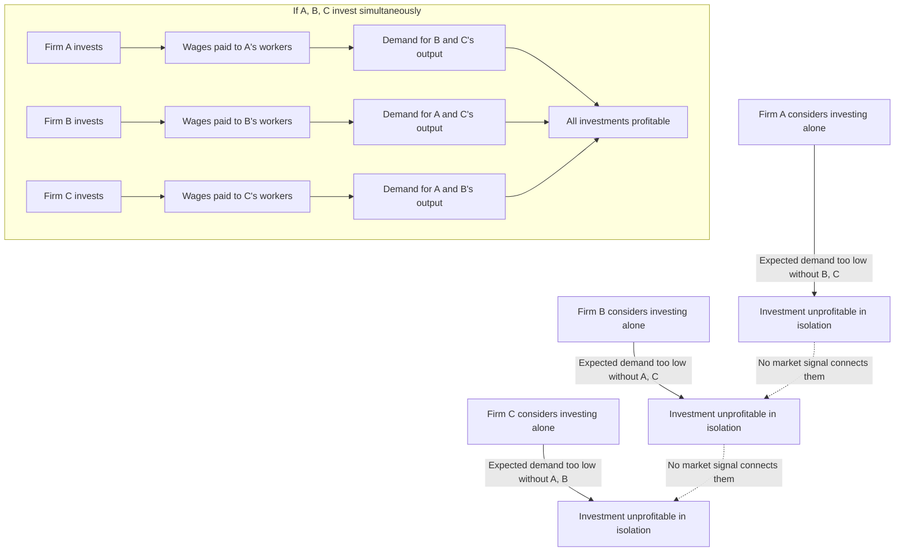

## Big push theory and Rosenstein-Rodan

### Overview

Big Push theory, developed principally by **Paul Rosenstein-Rodan** in his 1943 paper "Problems of Industrialisation of Eastern and South-Eastern Europe," argues that underdeveloped economies can be trapped in a low-level equilibrium not because of a lack of *any* profitable investment opportunities, but because of a **coordination failure**: many investments that would be profitable if undertaken *together* are unprofitable if undertaken *individually*. The theory prescribes a large-scale, simultaneous wave of investment across multiple sectors — a "big push" — sufficient to overcome the indivisibilities and externalities that keep the economy locked in stagnation.

Big Push theory is closely related to, and historically often grouped with, Nurkse's balanced growth theory, but it has a distinct analytical core: rather than emphasizing market-size/demand constraints alone, Rosenstein-Rodan built his argument on three specific types of **indivisibility** and the **pecuniary externalities** they generate.

### Historical Context

Rosenstein-Rodan wrote his 1943 paper in the context of postwar reconstruction planning for Eastern and South-Eastern Europe, addressing the practical question of how agrarian, underdeveloped regions with substantial disguised unemployment could industrialize. The paper predates most formal development economics and is widely regarded as one of the founding texts of the field, alongside contributions by Nurkse, Lewis, and Hirschman in the following two decades.

The theory gained a much stronger formal foundation decades later when **Kevin Murphy, Andrei Shleifer, and Robert Vishny (1989)** built a rigorous general-equilibrium model demonstrating that Rosenstein-Rodan's intuition about multiple equilibria could be derived formally from standard microeconomic assumptions plus increasing returns to scale — converting a qualitative narrative into a technically defensible proposition.

---

### The Three Indivisibilities

Rosenstein-Rodan identified three specific sources of indivisibility that prevent decentralized, atomistic markets from achieving the coordinated investment outcome needed for industrialization.

#### 1. Indivisibility in the Production Function (Technical Indivisibility)

Many industrial and infrastructural technologies exhibit **increasing returns to scale** and require a large minimum efficient scale of investment to be profitable at all. Examples: railways, power plants, ports. A small-scale power plant serving only a handful of nearby firms cannot cover its fixed costs; only a large plant serving many industries achieves viable unit costs. This creates a **lumpiness** problem — investment cannot proceed in small, incremental steps and still be profitable.

#### 2. Indivisibility of Demand (Complementarity of Investment Decisions)

This closely parallels Nurkse's market-size argument, but Rosenstein-Rodan framed it explicitly in terms of interdependent profitability: an investor considering a new shoe factory will only find it profitable if there is sufficient purchasing power among consumers, but that purchasing power depends on complementary industries paying wages to workers who then buy shoes. No single investor, acting alone, can generate that complementary income — hence *demand is indivisible* across the group of potential investments; profitability only "switches on" when a critical mass of complementary investments occurs together.

#### 3. Indivisibility of Savings (Supply of Capital)

The propensity to save rises with income levels, and income distribution in underdeveloped economies is often concentrated in ways unfavorable to saving (e.g., dominated by low-saving subsistence agricultural incomes or conspicuously consuming elites). A large simultaneous industrialization push generates the higher aggregate incomes needed to produce higher aggregate savings — but this savings capacity does not exist *before* the push occurs, creating a chicken-and-egg financing problem that may require external capital (foreign aid, foreign investment, or state-directed forced saving) to resolve.

---

### Pecuniary Externalities — The Core Coordination-Failure Mechanism

The unifying analytical concept behind all three indivisibilities is the **pecuniary externality**: a situation where one firm's investment decision affects the profitability of another firm's investment decision *through market prices and demand*, rather than through any direct technological spillover.

$$\text{Profitability of Firm } B = f(\text{Investment decision of Firm } A, \text{Investment decision of Firm } C, \ldots)$$

Because these interdependencies operate through markets (wages paid, goods purchased) rather than through technology transfer, they are invisible to any single decentralized investor making an isolated calculation — no market price signal exists to tell Firm B that Firm A's investment, if it happened, would make Firm B's investment profitable too. This is the essence of the **coordination failure**: the potential Pareto improvement (all firms invest, all become profitable) is not attainable through the price mechanism alone.

#### Diagram: Pecuniary Externality and Coordination Failure

---

### Formal Model: Multiple Equilibria (Murphy-Shleifer-Vishny Framework)

The Murphy-Shleifer-Vishny (1989) model formalizes Rosenstein-Rodan's intuition. In simplified terms, consider an economy where firms can choose between two technologies:

- A **low-productivity, constant-returns "cottage" technology**, usable in isolation.
- A **high-productivity, increasing-returns "factory" technology**, whose profitability depends on aggregate demand — i.e., on how many *other* firms have also adopted the factory technology.

This structure creates **two self-fulfilling equilibria**:

$$\text{Equilibrium 1 (bad):} \quad \text{No firms industrialize} \Rightarrow \text{Low aggregate income} \Rightarrow \text{Low demand} \Rightarrow \text{Industrialization unprofitable}$$

$$\text{Equilibrium 2 (good):} \quad \text{All firms industrialize} \Rightarrow \text{High aggregate income} \Rightarrow \text{High demand} \Rightarrow \text{Industrialization profitable}$$

Both equilibria are individually self-consistent (no firm has an incentive to unilaterally deviate), which is precisely why a decentralized market economy can become permanently trapped in the "bad" equilibrium despite the "good" equilibrium being strictly superior for all participants — a formal, rigorous restatement of Rosenstein-Rodan's 1943 intuition using modern general-equilibrium tools.

#### Diagram: Multiple Equilibria (svg_diagram)

<svg xmlns="http://www.w3.org/2000/svg" viewBox="0 0 700 460" font-family="Helvetica, Arial, sans-serif">
<text x="350" y="28" font-size="18" font-weight="bold" text-anchor="middle">Multiple Equilibria in the Big Push Model (svg_diagram)</text>
<line x1="90" y1="380" x2="640" y2="380" stroke="black" stroke-width="2" />
<line x1="90" y1="380" x2="90" y2="60" stroke="black" stroke-width="2" />
<text x="650" y="385" font-size="13">Fraction of firms industrializing (n)</text>
<text x="55" y="55" font-size="13">Profitability of industrializing</text>

<line x1="90" y1="380" x2="640" y2="80" stroke="#bdc3c7" stroke-width="1.5" stroke-dasharray="4,4" />

<path d="M 100 350 C 200 340, 280 330, 340 260 C 400 190, 480 110, 630 90" stroke="`#2980b9`" stroke-width="3" fill="none" />

<text x="440" y="150" font-size="13" fill="`#2980b9`">Profitability curve (S-shaped)</text>

<circle cx="105" cy="352" r="6" fill="#27ae60" />
<text x="60" y="410" font-size="12" fill="#27ae60">Bad equilibrium (n≈0)</text>
<circle cx="345" cy="262" r="6" fill="#e67e22" />
<text x="355" y="255" font-size="12" fill="#e67e22">Unstable threshold</text>
<circle cx="625" cy="95" r="6" fill="#27ae60" />
<text x="540" y="80" font-size="12" fill="#27ae60">Good equilibrium (n≈1)</text>

<path d="M 105 352 Q 250 400 345 262" stroke="#c0392b" stroke-width="2" fill="none" marker-end="url(#arrow)" />
<text x="150" y="420" font-size="12" fill="#c0392b">"Big Push" — coordinated jump past threshold</text>
</svg>

The S-shaped profitability curve crossing the 45-degree reference line at three points is the hallmark of a multiple-equilibria system: the two outer intersections are stable equilibria, and the middle intersection is an unstable threshold. A "big push" is precisely a coordinated policy intervention large enough to move the economy past this unstable threshold from the low equilibrium into the basin of attraction of the high equilibrium.

---

### Policy Implications and Instruments

Because the core problem is coordination failure rather than a simple lack of resources or a single missing market, Big Push theory implies specific categories of policy remedy:

1. **State-led coordinated investment planning**: Since no single private actor can internalize the pecuniary externalities across many sectors, government direction (state-owned enterprise, development planning boards, or subsidized coordination) is the natural remedy in the original Rosenstein-Rodan framing.
2. **Large-scale foreign aid or capital inflows**: Addresses the "indivisibility of savings" problem directly by supplying the capital that a low-income economy cannot yet generate domestically — a major theoretical justification cited historically for large development aid programs (e.g., post-WWII Marshall Plan-style reasoning applied to developing economies).
3. **Coordinated infrastructure investment (SOC)**: Overlaps with Hirschman's social-overhead-capital discussion — investing ahead of demand in power, transport, and communications to remove the technical-indivisibility constraint, making subsequent private investment in directly productive activities viable.
4. **Industrial policy targeting complementary sectors**: Rather than a single "best" sector (as in Hirschman's linkage-maximizing approach), Big Push logic favors identifying *clusters* of mutually reinforcing sectors and promoting them together.

---

### Criticisms of Big Push Theory

- **Resource and administrative infeasibility**: The theory's core practical criticism — most sharply raised by Hirschman — is that it demands the very capital mobilization and planning capacity that underdeveloped countries, by definition, lack. If a government had the fiscal and administrative capacity to coordinate simultaneous investment across dozens of sectors, the economy would likely already be substantially developed.
- **Risk of misallocation under central planning**: Concentrating the coordination function in the state raises standard public-choice and information concerns — government planners may lack the local knowledge to correctly identify which sectors are truly complementary, leading to wasted "big push" investment (historically cited in critiques of some import-substitution-era state-led industrialization programs).
- **Open-economy critique**: In an economy open to international trade, domestic demand indivisibility is less binding, since firms can sell into export markets rather than relying solely on complementary domestic income growth — reducing the necessity of a simultaneous domestic push. [Inference: the empirical significance of this critique varies by country and time period, particularly given trade costs, tariffs, and the sophistication required to access export markets, and is not a uniformly settled matter.]
- **Empirical identification difficulty**: Verifying the existence of multiple equilibria (versus a single equilibrium with slow convergence) is econometrically difficult, and the theory's central formal claim — that economies can be stuck in a "bad" equilibrium purely due to coordination failure — has proven hard to test rigorously against alternative explanations (e.g., poor institutions, human capital deficits) for persistent underdevelopment.
- **Neglect of sequencing**: Unlike Hirschman's unbalanced growth framework, which offers an explicit theory of *which* sector to prioritize and how bottlenecks resolve sequentially, Big Push theory is comparatively silent on execution sequencing once the decision to mobilize a coordinated push has been made.

---

### Worked Example

**Scenario**: An underdeveloped region has potential for a shoe factory, a textile mill, and a food-processing plant. Each requires an investment of $20 million and would employ 2,000 workers. Each plant, in isolation, projects losses because local demand for its output (assuming workers only spend within their own sector's output category) is insufficient to cover costs.

**Isolated investment calculation**: If only the shoe factory is built, its 2,000 workers earn wages but have no complementary textile or food-processing industry paying *other* households wages that could be spent on shoes beyond a small subsistence-agriculture baseline. Projected demand is insufficient; the shoe factory posts a loss and is not built.

**Coordinated Big Push calculation**: If all three plants are built simultaneously with combined investment of $60 million, the 6,000 total workers across all three sectors now collectively generate enough wage income to create meaningful cross-sector demand: shoe-factory workers buy food and textiles, textile-mill workers buy shoes and food, and food-processing workers buy shoes and textiles. Aggregate demand for each sector's output rises sufficiently that all three become individually profitable — even though none would have been profitable alone. This demonstrates the theory's central proposition: the profitability of the whole package can exceed the sum of the (negative) profitability of each isolated part.

---

### Position Relative to Other Development Theories

- **Vs. Nurkse's Balanced Growth**: Big Push theory is often treated as a formal microfoundation for Nurkse's more demand-centric balanced growth argument; Rosenstein-Rodan's three indivisibilities provide a more granular decomposition of *why* balanced, simultaneous investment is necessary, beyond Nurkse's more general market-size framing.
- **Vs. Hirschman's Unbalanced Growth**: Direct theoretical opposite in prescription (simultaneous vs. sequential investment), though both share the premise that market coordination failures, not resource scarcity per se, are the central obstacle to industrialization.
- **Vs. Modern Poverty Trap Literature**: The Murphy-Shleifer-Vishny formalization is a direct ancestor of contemporary multiple-equilibria "poverty trap" models used in modern growth and development economics (e.g., models of geographic poverty traps, nutrition-based poverty traps, and institutional poverty traps), all sharing the mathematical structure of self-fulfilling low-level versus high-level equilibria.
- **Vs. Structural Change Theory (Lewis)**: Complementary rather than competing — Lewis's model describes the *labor-market mechanism* of structural transformation (migration from agriculture to industry), while Big Push theory addresses the *investment-coordination problem* of getting the industrial sector off the ground in the first place.

---

### Related Topics

- Balanced growth theory (Nurkse) and unbalanced growth theory (Hirschman)
- Multiple equilibria and poverty trap models in modern growth theory
- Murphy-Shleifer-Vishny (1989) formalization of the Big Push
- Pecuniary externalities and coordination failure in development economics
- Import substitution industrialization as a historical policy application
- Increasing returns to scale and market structure
- Social overhead capital vs. directly productive activities
- Structural change theory and the Lewis dual-sector model
- Foreign aid effectiveness debates in development economics
- Input-output analysis and sectoral interdependency modeling