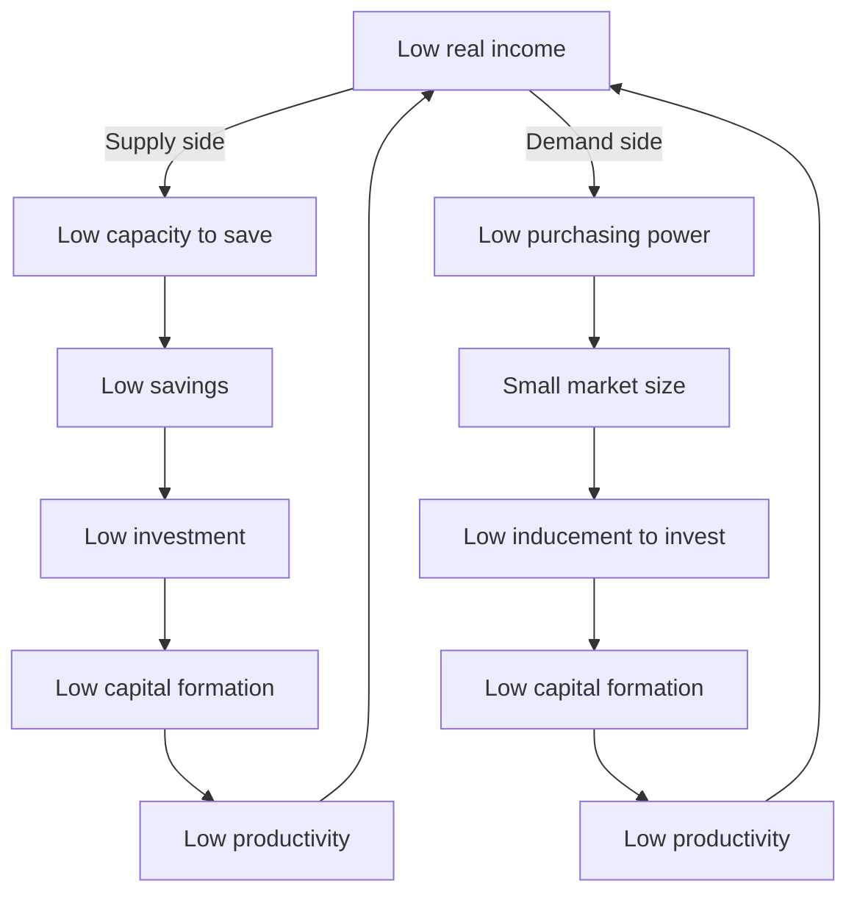

## Nurkse's theory of the vicious circle of poverty

### Overview

Ragnar Nurkse's **vicious circle of poverty** is a foundational diagnostic framework in development economics explaining why poor countries tend to remain poor in the absence of deliberate intervention. First articulated systematically in his 1953 work *Problems of Capital Formation in Underdeveloped Countries*, the theory argues that poverty is self-perpetuating through a set of circular causal relationships operating simultaneously on both the **supply side** (capital formation) and the **demand side** (market size), each of which reinforces low income rather than allowing it to rise.

Nurkse's summary formulation captures the core idea concisely: **"a country is poor because it is poor."** Low income is simultaneously the cause and the consequence of the very conditions that keep it low — a circular, self-reinforcing trap rather than a one-directional causal chain.

### Historical and Intellectual Context

Nurkse developed this framework in the early 1950s as part of the first generation of formal development economics, alongside contemporaries such as Rosenstein-Rodan, Lewis, and later Hirschman. It responds to the same underlying empirical puzzle that motivated the whole field: why do some economies fail to achieve self-sustaining capital accumulation despite decades or centuries of exposure to the same technologies and trade opportunities available to industrialized nations?

Nurkse's diagnosis became the theoretical foundation for his prescriptive policy conclusion — **balanced growth** — making the vicious circle of poverty and balanced growth theory two halves of a single argument: the vicious circle explains *why* underdevelopment persists, and balanced growth explains *how* to break it.

---

### The Supply-Side Vicious Circle

The supply-side circle explains why underdeveloped economies cannot accumulate the capital needed to raise productivity.

$$\text{Low real income} \rightarrow \text{Low capacity to save} \rightarrow \text{Low savings} \rightarrow \text{Low investment} \rightarrow \text{Low capital formation} \rightarrow \text{Low productivity} \rightarrow \text{Low real income}$$

**Mechanism**: In a low-income economy, most household income is consumed simply to meet subsistence needs, leaving little or no surplus available for saving. Without domestic savings, there is no pool of loanable funds to finance investment in capital goods (machinery, infrastructure, tools). Without investment, labor productivity cannot rise (since productivity gains typically require capital deepening — more or better capital per worker). Without rising productivity, real income cannot rise — closing the loop back to the starting point of low income.

---

### The Demand-Side Vicious Circle

The demand-side circle explains why, even where some investment capacity exists, entrepreneurs still lack sufficient incentive to invest.

$$\text{Low real income} \rightarrow \text{Low purchasing power} \rightarrow \text{Small size of the market} \rightarrow \text{Low inducement to invest} \rightarrow \text{Low capital formation} \rightarrow \text{Low productivity} \rightarrow \text{Low real income}$$

**Mechanism**: Even if capital were somehow made available (e.g., through foreign borrowing), a low-income population represents a small market for the output that new investment would produce. A firm producing an expanded quantity of manufactured goods needs consumers with sufficient income to buy that output; if the surrounding population is uniformly poor, expected sales revenue will not justify the investment. This is the demand-side twin of the market-size problem central to balanced growth theory — Nurkse treats the two circles (supply and demand) as operating jointly and reinforcing one another.

#### Diagram: The Dual Vicious Circle of Poverty

Both circles converge on the same two variables — capital formation and productivity — illustrating why Nurkse treated the poverty trap as a single, mutually reinforcing system rather than two independent problems requiring separate solutions.

---

### Underlying Causal Components in Detail

#### 1. The Savings Constraint

Nurkse emphasized that in underdeveloped economies, the **marginal propensity to save** is often further suppressed by cultural and structural factors beyond raw income levels:

- **Demonstration effect**: Exposure to the consumption patterns of wealthier countries (via trade, media, or migration) raises the consumption aspirations of populations in poor countries even before their incomes rise to match — a concept Nurkse himself introduced. This pulls resources toward consumption and away from saving, even among the relatively better-off segments of a poor economy who might otherwise have surplus income to save.
- **Structure of asset holding**: Savings in traditional economies were frequently held in unproductive forms (land, precious metals, hoarded cash) rather than channeled into productive investment via formal financial intermediaries, which were often underdeveloped or absent.

#### 2. The Investment Constraint

Even where some savings exist, converting them into productive investment faces additional frictions:

- Underdeveloped financial markets and banking institutions limit the efficient channeling of available savings toward productive investment opportunities.
- Risk aversion and uncertainty in unstable economic and political environments discourage long-term capital commitments.

#### 3. The Market-Size Constraint

This component links directly to Nurkse's balanced growth prescription: the small size of the market is not simply a function of population size but of aggregate purchasing power, which itself depends on how many other complementary industries exist to generate wage income across the economy.

---

### Diagram: Nurkse's Circular Trap in Static Equilibrium Form (svg_diagram)

<svg xmlns="http://www.w3.org/2000/svg" viewBox="0 0 700 500" font-family="Helvetica, Arial, sans-serif">
<text x="350" y="28" font-size="18" font-weight="bold" text-anchor="middle">Vicious Circle of Poverty — Convergence Structure (svg_diagram)</text>
<circle cx="350" cy="270" r="200" fill="none" stroke="#bdc3c7" stroke-width="1.5" stroke-dasharray="5,5" />

<circle cx="350" cy="270" r="55" fill="#c0392b" opacity="0.9" />
<text x="350" y="265" font-size="14" fill="white" text-anchor="middle" font-weight="bold">Low Real</text>
<text x="350" y="283" font-size="14" fill="white" text-anchor="middle" font-weight="bold">Income</text>

<circle cx="200" cy="130" r="42" fill="#2980b9" />
<text x="200" y="126" font-size="11" fill="white" text-anchor="middle">Low</text>
<text x="200" y="140" font-size="11" fill="white" text-anchor="middle">Savings</text>
<circle cx="120" cy="270" r="42" fill="#2980b9" />
<text x="120" y="266" font-size="11" fill="white" text-anchor="middle">Low</text>
<text x="120" y="280" font-size="11" fill="white" text-anchor="middle">Investment</text>
<circle cx="200" cy="410" r="42" fill="#2980b9" />
<text x="200" y="406" font-size="11" fill="white" text-anchor="middle">Low Capital</text>
<text x="200" y="420" font-size="11" fill="white" text-anchor="middle">Formation</text>

<circle cx="500" cy="130" r="42" fill="#27ae60" />
<text x="500" y="122" font-size="11" fill="white" text-anchor="middle">Low</text>
<text x="500" y="136" font-size="11" fill="white" text-anchor="middle">Purchasing</text>
<text x="500" y="150" font-size="11" fill="white" text-anchor="middle">Power</text>
<circle cx="580" cy="270" r="42" fill="#27ae60" />
<text x="580" y="266" font-size="11" fill="white" text-anchor="middle">Small</text>
<text x="580" y="280" font-size="11" fill="white" text-anchor="middle">Market</text>
<circle cx="500" cy="410" r="42" fill="#27ae60" />
<text x="500" y="406" font-size="11" fill="white" text-anchor="middle">Low</text>
<text x="500" y="420" font-size="11" fill="white" text-anchor="middle">Inducement</text>

<circle cx="350" cy="470" r="42" fill="#8e44ad" />
<text x="350" y="466" font-size="11" fill="white" text-anchor="middle">Low</text>
<text x="350" y="480" font-size="11" fill="white" text-anchor="middle">Productivity</text>

<line x1="350" y1="215" x2="230" y2="155" stroke="#2980b9" stroke-width="2" />
<line x1="230" y1="155" x2="140" y2="245" stroke="#2980b9" stroke-width="2" />
<line x1="120" y1="312" x2="180" y2="390" stroke="#2980b9" stroke-width="2" />
<line x1="235" y1="425" x2="320" y2="480" stroke="#2980b9" stroke-width="2" />
<line x1="350" y1="215" x2="470" y2="155" stroke="#27ae60" stroke-width="2" />
<line x1="470" y1="155" x2="560" y2="245" stroke="#27ae60" stroke-width="2" />
<line x1="580" y1="312" x2="520" y2="390" stroke="#27ae60" stroke-width="2" />
<line x1="465" y1="425" x2="380" y2="480" stroke="#27ae60" stroke-width="2" />
<line x1="350" y1="428" x2="350" y2="325" stroke="#8e44ad" stroke-width="2" marker-end="url(#arrow2)" />
</svg>

---

### Nurkse's Proposed Escape Routes

Nurkse himself, and subsequent literature building on his work, identified several mechanisms by which the vicious circle could theoretically be broken:

1. **Balanced growth (Nurkse's own primary prescription)**: Simultaneous investment across many sectors generates mutually reinforcing demand, directly attacking the demand-side circle (see the companion topic on balanced vs. unbalanced growth theory for full mechanism detail).
2. **Foreign capital inflows**: External savings (foreign aid, foreign direct investment, or international lending) can substitute for the missing domestic savings pool, directly breaking the supply-side link between low income and low investment without first requiring domestic income to rise.
3. **Export-led demand expansion**: Access to foreign markets can substitute for weak domestic market size, allowing investment to be profitable even where the domestic population's purchasing power remains low — a mechanism Nurkse acknowledged but treated as secondary to his balanced growth prescription, and one that later trade-oriented development strategies (e.g., East Asian export-led industrialization) leaned on much more heavily.
4. **Redistributive policy and forced saving**: Government intervention (taxation, state enterprises, or mandated savings schemes) can mobilize resources for investment even without waiting for private savings behavior to change organically.
5. **Technological and institutional improvements**: Raising productivity directly (e.g., agricultural technology adoption) without waiting for prior capital accumulation can raise incomes at the entry point of the circle, though Nurkse treated this as complementary to, rather than a substitute for, capital formation.

---

### Criticisms of the Vicious Circle of Poverty Theory

- **Empirical counterexamples**: Numerous economies with very low initial income levels (e.g., several East Asian economies in the mid-20th century) achieved sustained high savings and investment rates and rapid structural transformation despite starting inside the conditions the vicious circle describes, suggesting the "trap" is not as deterministic or inescapable as the pure theory implies. [Inference: the relative importance of export orientation, institutional quality, and specific historical/geopolitical circumstances in these cases is still debated in the broader development literature, rather than being fully explained by the vicious circle framework alone.]
- **Overly aggregate and mechanical**: The theory operates at a highly aggregated, largely non-institutional level — it does not address why savings rates or investment inducements might differ across countries with similar income levels due to institutional quality, property rights, financial system depth, or governance, factors given far more weight in later development economics (e.g., new institutional economics).
- **Underestimates the role of foreign trade**: By focusing heavily on domestic market size as a determinant of investment inducement, the framework (in its Nurkse-associated policy prescription) understates how international trade can substitute for domestic demand — a criticism directly paralleling the critique of balanced growth theory's implicit closed-economy assumption.
- **Does not fully explain reversal mechanisms**: The theory is stronger as a description of *why* stagnation persists than as a rigorous causal account of exactly *how* individual economies have historically escaped it, since real-world escapes often involved a combination of factors (trade liberalization, foreign investment, institutional reform, resource windfalls) not uniquely predicted by the circular model itself.
- **Static rather than dynamic**: The circular framing captures a self-reinforcing steady state but offers limited guidance on the dynamics and timing of transition — later poverty-trap and multiple-equilibria models (e.g., the Big Push formalization by Murphy, Shleifer, and Vishny) provided a more rigorous dynamic treatment of essentially the same underlying idea.

---

### Worked Example

**Scenario**: An agrarian economy has GDP per capita of $300/year. Households spend approximately 95% of income on subsistence food and basic necessities, leaving a 5% savings rate — far below the roughly 15–20% savings/investment rate typically associated with sustained industrial takeoff in classical growth accounting.

**Supply-side trace**: At a 5% savings rate on $300 average income, annual per-capita savings equal $15. Assuming a capital-output ratio of 4 (i.e., $4 of capital investment is needed to generate $1 of additional annual output — a simplified Harrod-Domar-style assumption), this level of savings supports only a marginal increase in capital stock, translating into per-capita output growth of well under 1% per year — insufficient to meaningfully outpace population growth in many historical cases, leaving real income per capita roughly stagnant.

**Demand-side trace**: Even if a foreign lender supplied $50 million in capital for a new manufacturing plant, the plant's target market — the same $300/year population — has too little discretionary purchasing power to absorb a meaningfully expanded quantity of manufactured goods at prices covering the plant's costs, unless a complementary set of investments (as in the Big Push/balanced growth logic) simultaneously raises incomes elsewhere in the economy or the plant can sell into export markets instead.

**Nurkse's implied conclusion**: Neither the supply-side gap (savings) nor the demand-side gap (market size) can be closed by addressing only one side in isolation; his balanced growth prescription argues that closing both simultaneously, across many sectors, is required to break the circle.

---

### Position Relative to Other Development Theories

- **Vs. Balanced Growth Theory**: The vicious circle of poverty is Nurkse's *diagnosis*; balanced growth is his *prescription*. They form a single integrated theoretical package, and the vicious circle cannot be fully understood in isolation from the balanced-growth remedy it motivates.
- **Vs. Big Push Theory (Rosenstein-Rodan)**: Rosenstein-Rodan's three indivisibilities (technical, demand, savings) can be read as a more granular decomposition of the same demand-side and supply-side circles Nurkse describes, with the "indivisibility of savings" concept corresponding closely to Nurkse's supply-side circle.
- **Vs. Harrod-Domar Growth Model**: The vicious circle provides a behavioral/structural explanation for *why* the savings rate in the Harrod-Domar model might remain persistently low in poor countries, giving a causal story behind an otherwise exogenously assumed parameter in that model.
- **Vs. Modern Poverty Trap Models**: Contemporary development economics (nutrition-based traps, geographic traps, institutional traps) formalizes essentially the same "self-reinforcing low-level equilibrium" logic using modern general-equilibrium and dynamic-systems tools, treating Nurkse's verbal circular description as an intellectual precursor to today's rigorously modeled multiple-equilibria poverty traps.

---

### Related Topics

- Balanced growth theory (Nurkse's own prescriptive remedy)
- Big Push theory and Rosenstein-Rodan's three indivisibilities
- Harrod-Domar growth model and the savings-investment relationship
- Demonstration effect and consumption behavior in developing economies
- Multiple equilibria and modern poverty trap models
- Structural change theory (Lewis dual-sector model)
- Foreign aid and capital flows as a substitute for domestic savings
- Export-led growth strategies as an alternative to balanced domestic demand expansion
- Financial sector development and savings mobilization in low-income economies