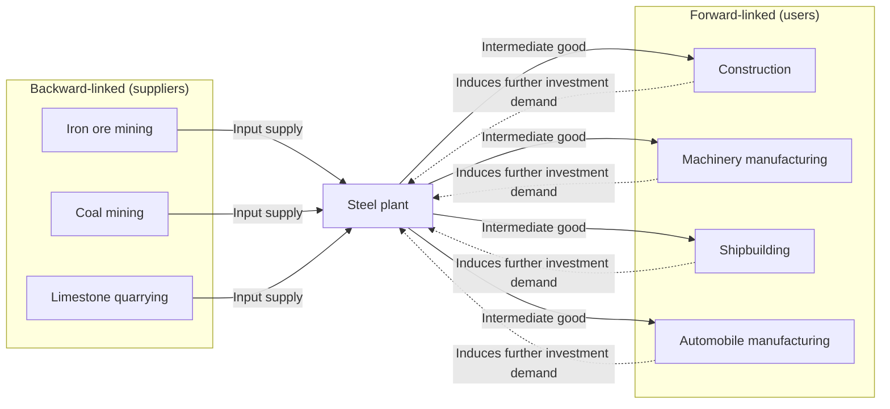
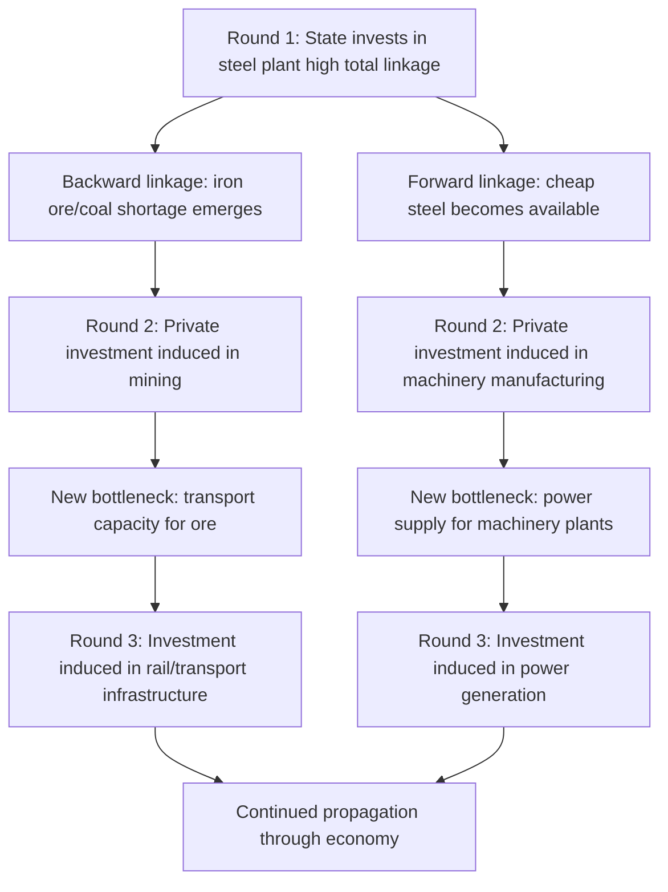

## Hirschman's linkages and unbalanced growth strategy

### Overview

Albert O. Hirschman's theory of **linkages**, presented in *The Strategy of Economic Development* (1958), provides the analytical core of unbalanced growth theory: a systematic method for identifying *which* sectors an underdeveloped economy should prioritize for investment. Rather than treating all sectors as equally deserving of simultaneous investment (as in Nurkse's balanced growth prescription), Hirschman argued that development strategy should deliberately concentrate scarce capital in sectors with the highest **backward and forward linkage effects** — sectors whose expansion most strongly induces further investment in complementary upstream and downstream activities.

This entry focuses specifically on the linkage concept as an analytical and measurement tool; it builds on and extends the general unbalanced growth framework, providing the technical apparatus Hirschman used to operationalize his strategic prescription.

### Historical Context

Hirschman developed the linkage concept while working as an economic advisor in Colombia in the 1950s, drawing on direct observation of how investment decisions in one industry visibly created — or failed to create — knock-on investment opportunities in related industries. His work was explicitly framed as a critique of the "balanced growth" school (Nurkse, Rosenstein-Rodan), arguing their prescriptions demanded resources and coordination capacity that underdeveloped economies did not possess. The linkage framework was Hirschman's proposed alternative: rather than requiring comprehensive simultaneous planning, development could proceed through a sequence of induced, decentralized investment decisions triggered by strategically chosen initial investments.

---

### Defining Backward and Forward Linkages

#### Backward Linkages (BL)

A **backward linkage** exists when an industry's output requires inputs from other (upstream) industries, and expanding that industry's output creates increased demand for those inputs, thereby incentivizing investment in the supplying industries.

$$BL_i = \sum_j a_{ij}$$

where $a_{ij}$ represents the input coefficient of sector $j$'s good used in the production of sector $i$'s output (in an input-output framework, this is the column sum of the technical coefficient matrix for sector $i$).

**Example**: An automobile assembly plant creates backward linkages to steel, glass, rubber, and electronics component manufacturers, since assembly requires these inputs.

#### Forward Linkages (FL)

A **forward linkage** exists when an industry's output serves as an input to other (downstream) industries, and expanding that industry's output makes those downstream industries more viable (by providing them a reliable, often cheaper, supply of an intermediate good).

$$FL_i = \sum_k a_{ki}$$

where this represents the row sum of the technical coefficient matrix — how much of sector $i$'s output is used as an input by other sectors $k$.

**Example**: A steel plant creates forward linkages to construction, machinery manufacturing, and shipbuilding, since these industries use steel as an input and benefit from its increased availability.

#### Total Linkage Effect

$$\text{Total Linkage}_i = BL_i + FL_i$$

Hirschman's strategic prescription: prioritize investment in sectors where this combined measure is highest, since such sectors generate the greatest number of induced follow-on investment opportunities per unit of initial capital deployed.

#### Diagram: Backward and Forward Linkages

Note the dotted feedback arrows: as forward-linked industries expand using cheap steel, they in turn increase demand for steel, reinforcing the original investment — the hallmark of Hirschman's "induced investment via linkage" mechanism.

---

### Measurement via Input-Output Analysis

Hirschman's originally qualitative linkage concept was later operationalized rigorously using **Leontief input-output tables**, which quantify the technical coefficients $a_{ij}$ describing how much of sector $j$'s output is required as an input to produce one unit of sector $i$'s output.

Given the Leontief inverse matrix $(I - A)^{-1}$, where $A$ is the technical coefficient matrix:

- **Backward linkage index for sector $i$**: the column sum of $(I - A)^{-1}$ for column $i$, normalized by the average column sum across all sectors. A value greater than 1 indicates sector $i$ has above-average backward linkages (its expansion pulls unusually strongly on other sectors as suppliers).
- **Forward linkage index for sector $i$**: the row sum of $(I - A)^{-1}$ for row $i$, normalized similarly. A value greater than 1 indicates sector $i$ is an unusually important supplier to other sectors.

$$\text{Normalized Backward Linkage}_i = \frac{\sum_j (I-A)^{-1}_{ji}}{\frac{1}{n}\sum_i \sum_j (I-A)^{-1}_{ji}}$$

Sectors classified as **"key sectors"** in this framework are those with both backward and forward linkage indices above 1 — they both depend heavily on other sectors as inputs and are heavily depended upon by other sectors as an input source, making them theoretically the highest-priority targets for Hirschman-style unbalanced investment.

#### Sector Classification Matrix

| Backward Linkage | Forward Linkage | Classification | Strategic Implication |
| --- | --- | --- | --- |
| High | High | **Key sector** | Highest priority for unbalanced growth investment (e.g., basic metals, chemicals) |
| High | Low | Backward-linked sector | Pulls on upstream suppliers but weak downstream diffusion (e.g., some final assembly/consumer goods industries) |
| Low | High | Forward-linked sector | Strong downstream diffusion but limited pull on suppliers (e.g., some raw material extraction) |
| Low | Low | Non-strategic sector | Limited linkage-induced follow-on investment; lower priority under Hirschman's framework |

---

### The Investment Decision Sequence

Hirschman envisioned development proceeding as an ongoing chain reaction rather than a single planning exercise:

1. **Initial strategic investment** is made in a high-total-linkage sector (often with state involvement, given the scale typically required).
2. **Backward linkage pressure** creates visible input shortages or supply opportunities, prompting private or public investment in upstream supplier industries.
3. **Forward linkage pressure** creates newly available cheap or reliable intermediate inputs, prompting private investment in downstream user industries that previously found such investment unprofitable or too risky.
4. **New bottlenecks emerge** at each stage (e.g., insufficient transport capacity to move the new steel output, insufficient power generation to run new machinery plants), which become the next round's investment signals.
5. The process **repeats**, propagating investment outward through the input-output structure of the economy, rather than requiring the state to plan the entire structure in advance.

#### Diagram: Sequential Unbalanced Growth Process

---

### Social Overhead Capital (SOC) vs. Directly Productive Activities (DPA)

Hirschman distinguished two broad categories relevant to sequencing decisions:

- **Social Overhead Capital (SOC)**: Infrastructure and services that support production broadly but are not themselves directly productive — power, transport, communications, education, public health.
- **Directly Productive Activities (DPA)**: Investment in the production of actual goods and services (factories, farms, mines).

Hirschman argued unbalanced growth could proceed via either sequencing:

$$\text{"Shortage" sequencing:} \quad \text{DPA investment first} \rightarrow \text{SOC shortages emerge} \rightarrow \text{SOC investment induced by visible bottleneck}$$

$$\text{"Excess capacity" sequencing:} \quad \text{SOC investment first} \rightarrow \text{Lower costs for potential DPA investors} \rightarrow \text{DPA investment induced}$$

He noted no single sequence is universally superior; different countries and periods exhibit different SOC/DPA sequencing patterns, and productive tension between the two — rather than perfect balance — is itself part of what drives the development process forward.

---

### Practical Application and Illustrative Cases

- **Steel and heavy industry emphasis in mid-20th-century industrial policy** (e.g., in India's early Five-Year Plans, and in various Latin American import-substitution programs) drew explicitly or implicitly on linkage-based reasoning to justify prioritizing basic metals and chemicals sectors as "key sectors" with high total linkage scores. [Inference: the degree to which these specific historical programs were rigorously guided by formal input-output linkage calculations versus more general industrial-policy intuition varies by country and is not uniformly documented.]
- **Colombia (Hirschman's direct field experience)**: Hirschman's observations of Colombian development projects — where investment in one sector visibly created pressure and opportunity for investment in adjacent sectors — directly informed the theory's emphasis on real-world, decentralized, disequilibrium-driven investment behavior rather than purely theoretical modeling.

---

### Criticisms of the Linkage Framework

- **Static input-output coefficients**: Standard input-output analysis assumes fixed technical coefficients ($a_{ij}$ constant), which may not capture how linkage patterns evolve as an economy industrializes and technology changes — a sector's linkage profile calculated from historical data may not predict its future linkage-inducing potential accurately.
- **Does not guarantee induced investment materializes**: The theory assumes entrepreneurs and/or the state will reliably notice and respond to linkage-induced opportunities; information gaps, risk aversion, weak financial intermediation, or political distortions can prevent the theoretically induced investment from actually occurring, leaving bottlenecks unresolved rather than resolved.
- **Definitional and measurement ambiguity in "key sector" identification**: Different input-output table classifications, level of sectoral aggregation, and choice of normalization method can produce different rankings of which sectors qualify as "key," making the practical policy application less clean than the underlying theoretical concept suggests.
- **Risk of chronic bottlenecks rather than productive tension**: Critics note that in economies with weak institutional or fiscal capacity to respond to bottlenecks, the "tension" Hirschman celebrated as a growth engine can instead become a persistent drag (e.g., chronic power shortages or transport bottlenecks that are never adequately resolved), undermining rather than propagating growth.
- **International trade considerations understated in the original framework**: The linkage concept, as originally formulated, emphasizes primarily domestic input-output relationships; in a globally integrated economy, backward linkages can potentially be satisfied via imports rather than inducing domestic upstream investment, weakening the domestic linkage-propagation mechanism the theory relies on. [Inference: the practical extent of this weakening depends heavily on trade policy, tariff structure, and transport costs specific to each economy and period.]

---

### Worked Example: Calculating Simplified Linkage Indices

**Scenario**: A simplified three-sector economy (Agriculture, Steel, Machinery) has the following technical coefficient matrix $A$ (each entry $a_{ij}$ = units of sector $i$'s output required to produce one unit of sector $j$'s output):

| Input \ Output | Agriculture | Steel | Machinery |
| --- | --- | --- | --- |
| Agriculture | 0.10 | 0.05 | 0.02 |
| Steel | 0.02 | 0.15 | 0.30 |
| Machinery | 0.05 | 0.20 | 0.10 |

**Backward linkage (column sums)**:

- Agriculture: $0.10 + 0.02 + 0.05 = 0.17$
- Steel: $0.05 + 0.15 + 0.20 = 0.40$
- Machinery: $0.02 + 0.30 + 0.10 = 0.42$

**Forward linkage (row sums)**:

- Agriculture: $0.10 + 0.05 + 0.02 = 0.17$
- Steel: $0.02 + 0.15 + 0.30 = 0.47$
- Machinery: $0.05 + 0.20 + 0.10 = 0.35$

**Total linkage**:

- Agriculture: $0.17 + 0.17 = 0.34$
- Steel: $0.40 + 0.47 = 0.87$
- Machinery: $0.42 + 0.35 = 0.77$

**Interpretation**: Steel has both the highest backward linkage (heavy reliance on machinery and its own output as inputs) and the highest forward linkage (heavily used as an input by both other sectors), making it the "key sector" by Hirschman's criterion — the sector where a marginal unit of investment would generate the largest total induced investment response elsewhere in this simplified economy. This is a simplified illustrative calculation using a full technical coefficient matrix rather than the Leontief inverse; a complete analysis would also incorporate indirect effects via $(I-A)^{-1}$.

---

### Position Relative to Other Development Theories

- **Vs. Balanced Growth / Big Push (Nurkse, Rosenstein-Rodan)**: The linkage framework is the direct analytical counterpoint — where balanced growth theory says invest everywhere simultaneously to avoid demand bottlenecks, Hirschman's linkage theory says invest selectively in sectors that will *create* productive bottlenecks, deliberately using scarcity as an information and incentive mechanism.
- **Vs. Structural Change Theory (Lewis)**: Complementary — Lewis explains labor reallocation from agriculture to industry in aggregate terms; Hirschman's linkage framework provides a more granular tool for deciding *which specific industrial sectors* should be prioritized to receive that reallocated labor and associated capital.
- **Legacy in modern industrial policy and input-output economics**: The linkage concept remains a standard tool in applied input-output economics and industrial policy analysis today, often used alongside multiplier analysis to identify priority sectors for targeted public investment or industrial promotion programs.
- **Relationship to Global Value Chain (GVC) analysis**: Contemporary trade and development economics extends linkage thinking to international production networks, examining how integration into global backward and forward linkages (via GVC participation) can substitute for or complement purely domestic linkage-building strategies — a modern extension of concerns Hirschman's original framework did not fully anticipate given the more closed-economy context of 1950s development thinking.

---

### Related Topics

- Balanced growth theory (Nurkse) and Big Push theory (Rosenstein-Rodan)
- Input-output analysis and Leontief inverse matrix computation
- Social overhead capital vs. directly productive activities sequencing
- Structural change theory and the Lewis dual-sector model
- Import substitution industrialization and key-sector targeting
- Global value chains and international linkage analysis
- Industrial policy design and sector prioritization frameworks
- Multiplier analysis in regional and sectoral economics