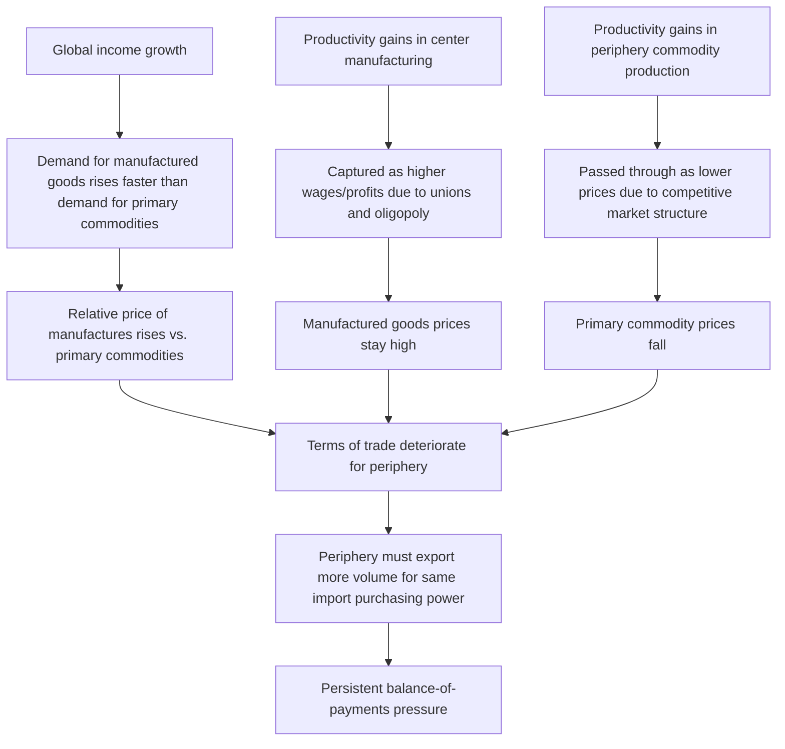
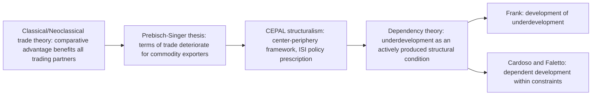

## Origins of dependency theory in Latin America

### Overview

Dependency theory emerged in Latin America in the late 1940s through the 1960s as a direct intellectual and political reaction against the classical development economics of the period — structural change theory, balanced/unbalanced growth theory, and modernization theory — all of which assumed that developing ("peripheral") economies could and would follow a development trajectory broadly similar to that of already-industrialized ("core") economies, given sufficient capital accumulation, industrial policy, and time. Dependency theorists rejected this assumption, arguing instead that the very structure of the international economic system — historically shaped by colonialism and perpetuated through trade and financial relationships — actively produces and reproduces underdevelopment in peripheral economies as a *structural condition*, not a temporary stage to be outgrown.

### Historical and Institutional Context

#### The Economic Commission for Latin America (ECLA/CEPAL)

Dependency theory's institutional origin point is the **United Nations Economic Commission for Latin America (ECLA)**, known by its Spanish acronym **CEPAL** (Comisión Económica para América Latina), established in 1948 and headquartered in Santiago, Chile. Under the intellectual leadership of Argentine economist **Raúl Prebisch**, who became CEPAL's Executive Secretary in 1950, the commission developed what became known as the **Prebisch-Singer thesis** and the broader **"structuralist" school of Latin American economics** — the direct precursor to dependency theory proper.

#### The Prebisch-Singer Thesis

Independently developed by Raúl Prebisch and Hans Singer around 1949–1950, the thesis challenged classical and neoclassical trade theory's prediction that free trade based on comparative advantage would benefit all trading partners, including primary-commodity-exporting developing countries.

**Core claim**: The **terms of trade** for primary commodity exporters (agricultural goods, raw materials) tend to *deteriorate* over time relative to manufactured goods importers, rather than remaining stable or improving as classical trade theory implied.

$$\text{Terms of Trade} = \frac{P_x}{P_m}$$

where $P_x$ is the price index of a country's exports and $P_m$ is the price index of its imports. The Prebisch-Singer thesis argued this ratio tends to fall over time for commodity-exporting peripheral economies, meaning they must export ever-larger physical quantities of raw materials just to purchase the same quantity of manufactured imports.

**Proposed mechanisms behind terms-of-trade deterioration**:

1. **Income elasticity asymmetry (Engel's Law effects)**: As global income rises, demand for manufactured goods grows faster than demand for primary commodities (whose income elasticity of demand is lower), putting persistent downward pressure on relative commodity prices.
2. **Market structure asymmetry**: Manufacturing sectors in industrialized "center" countries are typically more oligopolistic, with stronger labor unions able to capture productivity gains as higher wages/profits (keeping manufactured goods prices from falling even as productivity rises). Primary commodity sectors in the "periphery" are typically more competitive/fragmented, so productivity gains are passed through as lower prices rather than captured as higher incomes.
3. **Technological innovation bias**: Technical progress in the center tends to be captured domestically (via higher wages and profits), while technical progress in the periphery's export sectors tends to be transmitted internationally through lower export prices, benefiting center-country consumers rather than periphery-country producers.

#### Diagram: The Prebisch-Singer Mechanism

---

### Center-Periphery Framework

Prebisch and CEPAL formalized the global economy as divided into two structurally distinct zones:

- **Center**: Industrialized economies (primarily Western Europe and North America historically), characterized by diversified, technologically dynamic manufacturing sectors, higher wages, and stronger labor market institutions.
- **Periphery**: Primary-commodity-exporting economies (Latin America, and by extension most of the developing world), characterized by narrow, undiversified export sectors tied to a small number of raw materials or agricultural products, weaker labor institutions, and technological dependence on imported capital goods and know-how.

The center-periphery framework departed sharply from classical trade theory's assumption of symmetric, mutually beneficial exchange between trading partners, instead positing a **structurally asymmetric relationship** in which the periphery's role in the international division of labor systematically disadvantages it over time.

---

### Policy Response: Import Substitution Industrialization (ISI)

The direct policy conclusion CEPAL drew from the Prebisch-Singer thesis and center-periphery analysis was **Import Substitution Industrialization (ISI)** — a strategy of deliberately protecting and promoting domestic manufacturing industries (via tariffs, quotas, subsidized credit, and overvalued exchange rates) to reduce dependence on imported manufactured goods and break out of the disadvantageous primary-commodity-export role in the international division of labor.

**Core ISI logic**:

$$\text{Reduce reliance on manufactured imports} \rightarrow \text{Protect domestic "infant industries"} \rightarrow \text{Build indigenous industrial capacity} \rightarrow \text{Escape terms-of-trade deterioration}$$

ISI was adopted, with varying degrees of intensity and success, across much of Latin America (notably Brazil, Argentina, and Mexico) from the 1950s through the 1970s, and represents the direct policy legacy of the CEPAL/structuralist school that preceded fully-fledged dependency theory.

---

### From Structuralism to Dependency Theory Proper

While CEPAL's structuralist analysis diagnosed a *trade-based* structural disadvantage, it retained an underlying optimism that appropriate industrial policy (ISI) could allow peripheral economies to industrialize and eventually converge with the center. **Dependency theory proper**, emerging from the mid-1960s onward, radicalized this critique substantially, arguing that:

1. **Underdevelopment is not a prior stage of development but an actively produced condition**: Dependency theorists (most notably **André Gunder Frank**, whose 1967 work on Latin America was highly influential) argued the periphery's underdevelopment is not simply a lagging or earlier version of the center's history, but a direct, ongoing consequence of its integration into the world capitalist system on unfavorable terms — Frank's famous phrase for this was **"the development of underdevelopment."**
2. **Surplus extraction, not merely unequal terms of trade**: Dependency theorists (drawing on Marxist political economy) emphasized how profits, resources, and economic surplus generated in the periphery are systematically extracted and transferred to the center through mechanisms including foreign ownership of key industries, repatriation of profits by multinational corporations, and unequal exchange embedded in trade and financial relationships.
3. **ISI's limits and internal contradictions**: Later dependency theorists (e.g., **Fernando Henrique Cardoso** and Enzo Faletto, in *Dependency and Development in Latin America*, 1969) offered a more nuanced "dependent development" position — arguing that some industrialization and growth *could* occur within a dependency relationship, but remained structurally constrained, distorted toward serving foreign capital's interests, and vulnerable to the same underlying center-periphery power asymmetries (e.g., via multinational corporate ownership, technology licensing dependence, and foreign debt).
4. **Structural heterogeneity within peripheral economies**: Some dependency theorists highlighted internal dualism — a modern, often foreign-owned export enclave sector coexisting alongside a traditional, low-productivity domestic sector — arguing that dependency relationships could reproduce underdevelopment *within* peripheral economies, not just between center and periphery internationally.

---

### Key Contributors and Their Distinct Positions

| Thinker | Position/Emphasis |
| --- | --- |
| **Raúl Prebisch** | Founder of CEPAL structuralism; terms-of-trade deterioration; advocate of ISI as the practical remedy within a broadly reformist framework |
| **Hans Singer** | Independently co-developed the terms-of-trade deterioration thesis (Prebisch-Singer thesis) |
| **André Gunder Frank** | Radical dependency theorist; "development of underdevelopment"; argued capitalist world-system integration is the direct *cause* of Latin American underdevelopment, not merely an obstacle to overcome |
| **Fernando Henrique Cardoso & Enzo Faletto** | "Dependent development" — more nuanced position allowing for industrialization and growth within dependency, while still emphasizing structural constraints and foreign capital's disproportionate influence |
| **Theotônio dos Santos** | Articulated dependency as a conditioning structural situation shaping (without wholly determining) the internal economic dynamics of dependent countries |

---

### Diagram: Evolution from Classical Trade Theory to Dependency Theory

---

### Criticisms and Limitations of Early Dependency Theory Origins

- **Empirical challenges to the terms-of-trade deterioration thesis**: Subsequent empirical studies produced mixed results on whether commodity terms of trade exhibit a genuine long-run secular decline versus cyclical volatility around a roughly stable trend; the strength and universality of the Prebisch-Singer effect remains a debated empirical question rather than a settled fact. [Inference: results are sensitive to the choice of time period, commodity basket, and price index methodology used in different studies.]
- **East Asian counterexamples**: The rapid, export-oriented industrialization of several East Asian economies from the 1960s onward — achieved partly through integration into global manufacturing trade rather than ISI-style protection — is frequently cited as challenging the more deterministic strands of dependency theory's claim that peripheral integration into the world economy structurally forecloses industrialization. [Inference: dependency theorists have offered various responses to this critique, and the debate over how fully these cases refute dependency theory's core claims versus representing a distinct historical/geopolitical case remains active in the literature.]
- **ISI's own practical shortcomings**: By the late 1970s and 1980s, many Latin American ISI programs faced criticism for fostering inefficient, uncompetitive domestic industries sheltered from international competition, chronic balance-of-payments problems, and fiscal strain — contributing to the debt crises of the 1980s and a subsequent shift toward more externally oriented, neoliberal policy reforms across the region.
- **Determinism critique**: Critics (including from within Latin American economics) argued some dependency theory formulations, especially Frank's, were overly deterministic in treating peripheral underdevelopment as an almost mechanical consequence of world-system integration, leaving insufficient room for domestic institutional, political, and policy variation in explaining why some dependent economies performed better than others.

---

### Position Relative to Other Development Theories

- **Vs. Structural Change Theory (Lewis)**: Direct rejection — Lewis-style structural change theory implicitly assumes a domestically driven transition from agriculture to industry is achievable; dependency theory argues international structural constraints (terms of trade, capital ownership, technological dependence) can prevent this transition from ever fully occurring in the periphery.
- **Vs. Balanced/Unbalanced Growth and Big Push Theories**: These theories focus on domestic coordination failures as the primary obstacle to industrialization; dependency theory relocates the primary obstacle to the international system itself, arguing domestic coordination alone cannot overcome externally imposed structural disadvantage.
- **Vs. Modernization Theory**: Dependency theory is often understood as the most direct and sustained critique of modernization theory (the view, associated with thinkers such as Rostow, that all societies pass through a similar sequence of development stages) — dependency theorists argued modernization theory ignored how colonial and neocolonial international relationships actively shape and constrain peripheral development trajectories.
- **Relationship to World-Systems Theory**: Dependency theory is the direct precursor to **Immanuel Wallerstein's world-systems theory** (1970s onward), which generalized the center-periphery framework into a more comprehensive historical and sociological account of the entire modern capitalist world-economy, adding a "semi-periphery" category and a longer historical timeframe extending back to the 16th century.

---

### Related Topics

- Prebisch-Singer thesis and terms-of-trade deterioration debates
- Import substitution industrialization: mechanisms, case studies, and later critiques
- André Gunder Frank and "the development of underdevelopment"
- Cardoso and Faletto's dependent development framework
- Wallerstein's world-systems theory and the semi-periphery concept
- Modernization theory (Rostow's stages) and its critics
- Unequal exchange theory in international trade
- Latin American debt crisis of the 1980s and the shift toward neoliberal reform
- Export-oriented industrialization as an alternative development strategy (East Asian comparison)