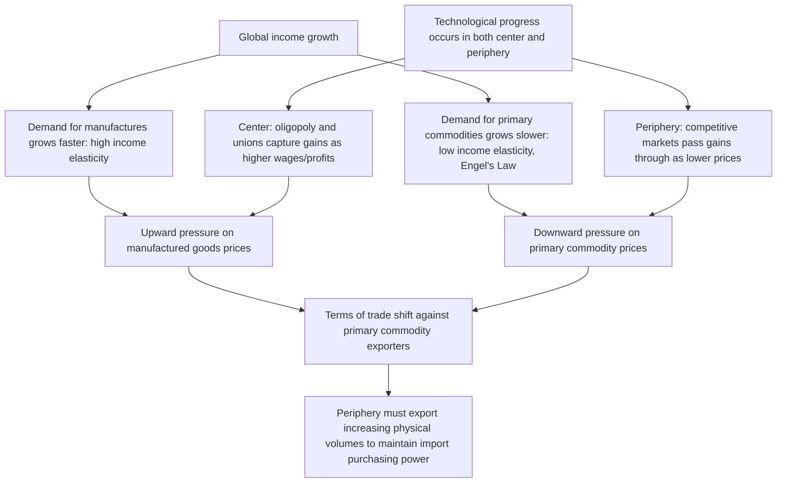

## Prebisch-Singer thesis on terms of trade

### Overview

The Prebisch-Singer thesis is the foundational empirical and theoretical proposition that the **net barter terms of trade** of primary-commodity-exporting countries exhibit a long-run tendency to **deteriorate** relative to those of manufactured-goods-exporting countries. Developed independently and near-simultaneously by **Raúl Prebisch** and **Hans Singer** around 1949–1950, the thesis directly contradicted the prevailing classical and neoclassical trade-theory assumption that specialization according to comparative advantage — including specialization in primary commodity production — would deliver broadly symmetric, mutually beneficial gains from trade to all participating countries over time.

This topic focuses specifically on the terms-of-trade mechanism itself — its definition, proposed causal explanations, empirical evidence, and policy implications — as the analytical engine underlying the broader center-periphery and dependency framework covered elsewhere in this chapter.

### Historical Origin

Both economists arrived at similar conclusions independently and published their arguments around the same time:

- **Raúl Prebisch**, as Executive Secretary of the newly formed UN Economic Commission for Latin America (ECLA/CEPAL), presented the thesis in his 1950 report *The Economic Development of Latin America and Its Principal Problems*, drawing on UN statistical data on historical trade prices.
- **Hans Singer**, a UN economist, published closely related findings in his 1950 paper "The Distribution of Gains between Investing and Borrowing Countries," examining similar long-run price trends.

Because of this near-simultaneous, independent development, the proposition is jointly attributed to both economists as the **Prebisch-Singer thesis** (sometimes also called the Prebisch-Singer-Hypothesis or PS thesis).

---

### Defining the Terms of Trade

The **net barter terms of trade (NBTT)** for a country or country group is defined as the ratio of an export price index to an import price index:

$$\text{NBTT} = \frac{P_x}{P_m} \times 100$$

where $P_x$ is the price index of exported goods and $P_m$ is the price index of imported goods, typically normalized to a base year value of 100. A rising NBTT means a country can purchase more imports per unit of exports over time (an *improvement*); a falling NBTT means it must export more to purchase the same quantity of imports (a *deterioration*).

For primary-commodity-exporting countries, the Prebisch-Singer thesis proposes:

$$\frac{d}{dt}\left(\frac{P_{\text{primary}}}{P_{\text{manufactures}}}\right) < 0 \quad \text{over the long run}$$

That is, the relative price of primary commodities to manufactured goods trends downward over extended periods, independent of short-term cyclical fluctuations.

---

### Proposed Causal Mechanisms

The thesis rests on several distinct, mutually reinforcing explanations for why this asymmetric price trend would emerge and persist.

#### 1. Income Elasticity of Demand Asymmetry (Engel's Law Effect)

As global per-capita income rises, the income elasticity of demand for manufactured goods and services is systematically higher than for primary commodities (particularly food, which follows Engel's Law — the share of income spent on food falls as income rises). This means global demand for manufactures grows faster than demand for primary commodities as world income expands, exerting persistent relative upward pressure on manufactured goods prices and downward pressure on commodity prices.

$$\eta_{\text{manufactures}} > \eta_{\text{primary commodities}}$$

where $\eta$ denotes income elasticity of demand.

#### 2. Market Structure and Factor Market Asymmetry

Prebisch emphasized a structural asymmetry in how productivity gains are distributed between center and periphery:

- **Center (manufacturing) sectors**: Characterized by oligopolistic firm structures and strong labor unions. When productivity rises in these sectors, gains are substantially captured domestically as higher wages and profits, rather than being passed through to consumers as lower prices. Manufactured goods prices therefore remain relatively sticky or rising even as underlying production costs fall.
- **Periphery (primary commodity) sectors**: Characterized by highly competitive, fragmented producer structures (numerous small farmers/miners) and weak labor market institutions. When productivity rises in these sectors, competitive pressure forces the resulting cost savings to be passed through to buyers as lower prices, rather than being captured as higher domestic wages or profits.

$$\text{Center: Productivity} \uparrow \rightarrow \text{Wages/profits} \uparrow \rightarrow \text{Prices roughly stable}$$

$$\text{Periphery: Productivity} \uparrow \rightarrow \text{Competitive pass-through} \rightarrow \text{Prices} \downarrow$$

This asymmetry means that even when *both* sectors experience technological progress and rising productivity, the periphery's gains are transmitted internationally (benefiting center-country consumers of cheap raw materials) while the center's gains are retained domestically.

#### 3. Business Cycle Asymmetry

Primary commodity prices are typically more volatile than manufactured goods prices over the business cycle, and some versions of the argument note that commodity prices tend to fall proportionally more than manufactured goods prices during downturns but do not rise proportionally as much during recoveries — a ratchet-like asymmetry that, repeated over successive cycles, produces a long-run downward drift in relative commodity prices. [Inference: this cyclical-asymmetry component of the thesis is treated with somewhat less consensus in the literature than the income-elasticity and market-structure arguments, and its empirical robustness across different historical periods is debated.]

#### 4. Low Price and Income Elasticity of Supply in Primary Commodities

Some formulations note that primary commodity supply (particularly agricultural) can be relatively slow to adjust downward in response to falling prices (due to sunk costs in land and long production cycles), meaning oversupply conditions can persist and continue depressing prices for extended periods, unlike manufacturing supply which can adjust more flexibly.

---

### Diagram: The Prebisch-Singer Causal Chain

---

### Diagram: Terms of Trade Trend Illustration (svg_diagram)

<svg xmlns="http://www.w3.org/2000/svg" viewBox="0 0 700 420" font-family="Helvetica, Arial, sans-serif">
<text x="350" y="28" font-size="18" font-weight="bold" text-anchor="middle">Stylized Net Barter Terms of Trade Path (svg_diagram)</text>
<line x1="90" y1="360" x2="640" y2="360" stroke="black" stroke-width="2" />
<line x1="90" y1="360" x2="90" y2="50" stroke="black" stroke-width="2" />
<text x="650" y="365" font-size="13">Time</text>
<text x="40" y="45" font-size="13">NBTT Index</text>
<line x1="90" y1="160" x2="640" y2="160" stroke="#bdc3c7" stroke-width="1" stroke-dasharray="4,4" />
<text x="600" y="152" font-size="11" fill="#7f8c8d">Base year = 100</text>

<path d="M 100 150 L 150 120 L 190 180 L 230 140 L 270 220 L 310 170 L 350 240 L 390 200 L 430 260 L 470 220 L 510 280 L 550 240 L 590 300 L 630 270" stroke="`#c0392b`" stroke-width="2.5" fill="none" />

<line x1="100" y1="140" x2="630" y2="280" stroke="#2980b9" stroke-width="2" stroke-dasharray="8,4" />
<text x="450" y="255" font-size="12" fill="#2980b9">Long-run declining trend</text>
<text x="200" y="110" font-size="12" fill="#c0392b">Actual (volatile) NBTT path</text>
</svg>

The stylized path illustrates the thesis's key claim: short-run volatility around commodity price cycles coexists with a longer-run downward trend line — the volatility is what makes the underlying secular trend historically difficult to isolate and verify empirically.

---

### Policy Implications

The Prebisch-Singer thesis provided the direct theoretical justification for CEPAL's **Import Substitution Industrialization (ISI)** policy prescription:

$$\text{Terms of trade deteriorate} \rightarrow \text{Reliance on primary exports is a losing long-run strategy} \rightarrow \text{Protect and build domestic manufacturing} \rightarrow \text{Reduce dependence on unfavorable trade structure}$$

Beyond ISI, the thesis also motivated:

- **Commodity price stabilization schemes**: International commodity agreements and buffer stock arrangements intended to reduce price volatility and support minimum prices for primary-commodity-exporting countries.
- **Preferential trade treatment demands**: The thesis underpinned developing-country arguments (voiced through institutions such as UNCTAD, itself substantially shaped by Prebisch, who became its first Secretary-General in 1964) for preferential market access to industrialized-country markets to compensate for structurally disadvantageous terms of trade.
- **Diversification policy**: Encouraged developing countries to diversify export bases away from narrow reliance on one or two primary commodities, reducing vulnerability to sector-specific price deterioration.

---

### Empirical Evidence and Ongoing Debate

The empirical status of the Prebisch-Singer thesis has been extensively studied and remains genuinely contested rather than settled.

- **Early supporting evidence**: Prebisch's original 1950 analysis drew on historical British trade price data (comparing UK export and import prices as a proxy for center-periphery terms of trade) suggesting a declining trend from the late 19th century into the mid-20th century.
- **Methodological critiques**: Subsequent researchers (e.g., critics writing in the 1980s–1990s) challenged the original data series on multiple grounds, including that the specific historical dataset used (UK trade prices) may not accurately represent the broader universe of primary-commodity-exporting countries' actual terms of trade, and that changes in shipping costs, quality improvements, and commodity composition over the period studied complicate the price index comparisons.
- **Longer time-series studies**: Various researchers extending the analysis across the 20th century have found evidence broadly consistent with a modest long-run downward trend in real primary commodity prices relative to manufactures, though with substantial disagreement over the trend's magnitude, statistical significance, and consistency across different commodity categories and time periods. [Unverified: there is no single, universally accepted definitive empirical resolution to this debate in the economics literature; different studies using different data, time periods, and econometric methods have reached different conclusions.]
- **Post-2000 commodity super-cycle**: The substantial rise in many commodity prices during the 2000s (driven significantly by rapid demand growth from China and other emerging economies) was noted by some economists as at least a temporary reversal of the long-run pattern the thesis describes, though others characterized it as a cyclical episode consistent with continued longer-run volatility around a still-declining trend rather than a refutation of the underlying thesis. [Inference: characterizing the 2000s commodity boom as either confirming or refuting the Prebisch-Singer thesis depends heavily on the time horizon and specific commodities examined, and remains an area of active disagreement among economists.]

---

### Criticisms of the Thesis

- **Failure to account for quality and composition changes**: Critics argue simple price-index comparisons between broad "primary commodity" and "manufactured goods" categories can be distorted by improvements in manufactured goods quality over time (a modern manufactured good is often qualitatively different from its historical equivalent, complicating like-for-like price comparison) and by shifts in the composition of countries' commodity export baskets.
- **Heterogeneity across commodities and countries**: The thesis was originally framed at a high level of aggregation (primary commodities vs. manufactures broadly); different commodity categories (energy, metals, agricultural goods) have shown quite different long-run price behavior, and lumping them together may obscure more than it reveals.
- **Alternative explanations for observed patterns**: Some economists argue that where terms-of-trade deterioration for commodity exporters has been observed, it may be better explained by country-specific factors (exchange rate policy, resource curse dynamics, domestic institutional quality) rather than a universal structural feature of primary-commodity trade per se.
- **Endogeneity of ISI's own effects**: To the extent countries adopted ISI in response to the thesis, some economists argue the resulting trade patterns (reduced manufactured imports, continued commodity export dependence) may have been partly self-reinforcing rather than purely reflecting an independent underlying price trend — complicating clean empirical tests of the original causal claim.

---

### Worked Example

**Scenario**: In year 0, a country's export price index (commodities) is 100 and its import price index (manufactures) is 100, so NBTT = 100. Over 30 years, suppose commodity export prices rise by 40% (to 140) while manufactured import prices rise by 90% (to 190), consistent with the general pattern the thesis predicts (both rise in nominal terms due to general inflation, but manufactures rise faster).

$$\text{NBTT}_{\text{year 30}} = \frac{140}{190} \times 100 \approx 73.7$$

**Interpretation**: The country's terms of trade have deteriorated by roughly 26.3% over the 30-year period — it must now export approximately 26% more physical volume of commodities than it did in year 0 to purchase the same quantity of manufactured imports, even though the nominal price of its exports has technically risen. This illustrates why terms-of-trade analysis requires examining the *relative* price ratio rather than the absolute price trend of exports alone — a country can experience deteriorating terms of trade even while its own export prices are nominally rising, as long as import prices rise faster.

---

### Position Relative to Other Development Theories

- **Vs. Classical/Neoclassical Trade Theory (Comparative Advantage)**: Directly contradicts the Ricardian/Heckscher-Ohlin prediction that specialization according to comparative advantage yields stable or improving mutual gains from trade over time; the thesis argues a specific, structurally disadvantaged position (commodity exporter) systematically loses relative purchasing power over the long run.
- **Foundation for Center-Periphery Framework and Dependency Theory**: The thesis is the empirical and analytical bedrock on which CEPAL's broader center-periphery framework, and subsequently the more radical dependency theory tradition (Frank, Cardoso and Faletto), was built — see the companion topic on the origins of dependency theory in Latin America for the fuller structural and political-economy elaboration.
- **Vs. Structural Change Theory and Big Push Theory**: These theories focus on domestic constraints to industrialization (labor market dualism, coordination failures); the Prebisch-Singer thesis instead identifies an external, trade-based constraint operating independently of domestic conditions, motivating a trade-policy-oriented remedy (ISI) rather than a purely domestic-investment-oriented one.
- **Relationship to Resource Curse Literature**: Modern resource curse research (examining why resource-abundant economies sometimes underperform resource-poor peers) shares intellectual lineage with Prebisch-Singer concerns about commodity dependence, though the resource curse literature typically emphasizes different mechanisms (Dutch disease, rent-seeking, institutional quality) rather than a strict terms-of-trade deterioration argument.

---

### Related Topics

- Origins of dependency theory in Latin America (CEPAL, Frank, Cardoso and Faletto)
- Import substitution industrialization: mechanisms and later critiques
- UNCTAD and preferential trade arrangements for developing countries
- Commodity price stabilization schemes and buffer stock agreements
- Resource curse and Dutch disease in resource-dependent economies
- Terms-of-trade measurement methodology and price index construction
- Export diversification strategies in developing economies
- Wallerstein's world-systems theory and the center-periphery-semi-periphery structure