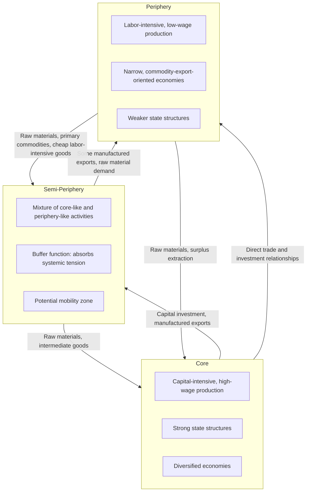

## Core-periphery framework

### Overview

The core-periphery framework is a structural model of the international economic system that divides the world economy into hierarchically related zones — most commonly a **core** (or "center"), a **periphery**, and, in extended versions, a **semi-periphery** — distinguished by their position and role within global production, trade, and capital accumulation processes. Originating in Raúl Prebisch's center-periphery analysis at CEPAL in the late 1940s–1950s, the framework was substantially generalized and extended by **Immanuel Wallerstein's world-systems theory** from the 1970s onward, becoming the dominant structural lens through which dependency and world-systems scholars analyze global economic inequality.

Unlike theories that treat "underdeveloped" and "developed" as points on a single linear developmental continuum (as in modernization theory or Rostow's stages), the core-periphery framework treats these categories as **relationally defined and mutually constitutive** — the core's prosperity and the periphery's underdevelopment are understood as two sides of a single, interconnected global system, not as independent, separately explicable outcomes.

### Historical Development

#### Prebisch's Original Center-Periphery Model (CEPAL, 1949–1950)

Prebisch's original formulation (see the companion topic on the Prebisch-Singer thesis) was primarily a **trade-based** model:

- **Center**: Diversified, technologically dynamic, manufacturing-based economies with strong labor institutions.
- **Periphery**: Narrow, primary-commodity-export-dependent economies with weaker labor institutions and technological dependence on the center.

This bipolar structure explained deteriorating terms of trade and motivated the Import Substitution Industrialization policy response.

#### Wallerstein's World-Systems Extension (1974 onward)

Immanuel Wallerstein's *The Modern World-System* (1974) substantially generalized Prebisch's bipolar trade model into a comprehensive historical-sociological framework analyzing the entire capitalist world-economy as a single integrated system, with three key innovations:

1. **Addition of the semi-periphery** as an intermediate category.
2. **Extension of historical scope** back to the emergence of the modern capitalist world-economy in roughly the "long 16th century" (c. 1450–1650), rather than focusing only on 20th-century trade patterns.
3. **A world-systems unit of analysis**: Wallerstein argued the appropriate unit for economic and social analysis is not the individual nation-state but the entire interconnected world-economy, since a country's core/periphery/semi-periphery position is defined relationally within this single system rather than through any purely domestic characteristic.

---

### The Three-Tier Structure

#### Core

Core regions/countries are characterized by:

- Capital-intensive, high-wage, technologically advanced production (historically industrial manufacturing; in later periods, also finance, advanced services, and high-technology sectors).
- Strong, centralized state structures capable of enforcing favorable terms of exchange with other zones.
- Diversified economies less dependent on any single export sector.
- Historically: Western Europe (originating in the Dutch Republic, England, France), later joined by the United States, and subsequently other industrialized economies.

#### Periphery

Peripheral regions/countries are characterized by:

- Labor-intensive, low-wage production, historically often coerced or semi-coerced labor systems (e.g., plantation slavery, encomienda systems, indentured labor in the historical formation of the world-system).
- Narrow, primary-commodity-export-oriented economic structures.
- Weak state structures relative to core states, historically often subject to direct colonial rule or informal imperial control.
- Historically: Latin America, much of Africa, and parts of Asia in their roles within the emerging capitalist world-economy from the 16th century onward.

#### Semi-Periphery

The semi-periphery is Wallerstein's key structural addition — regions/countries exhibiting a *mixture* of core-like and periphery-like economic activities and social structures, occupying an intermediate structural position:

- Engage in both some core-like activities (limited manufacturing, more diversified production) and some periphery-like activities (raw material export, lower-wage labor-intensive production relative to the core).
- Historically function as a **political and economic buffer zone**, absorbing some of the class and political tensions that might otherwise polarize the system into a stark two-tier core/periphery conflict.
- Can serve as a zone of **relative mobility** within the world-system — some regions have historically moved from periphery to semi-periphery, or semi-periphery to core, though Wallerstein and subsequent world-systems scholars generally treat full mobility as difficult and historically rare given the structural advantages accruing to established core positions.
- Historical and contemporary examples discussed in the literature include parts of Southern and Eastern Europe (historically), and in various analyses, rapidly industrializing middle-income economies. [Inference: specific country classifications within the semi-periphery category are analytically contested and vary across different world-systems scholars' applications of the framework, rather than being a fixed, universally agreed list.]

---

### Diagram: The Three-Tier Core-Periphery-Semi-Periphery Structure

---

### Diagram: Surplus Flow and Unequal Exchange (svg_diagram)

<svg xmlns="http://www.w3.org/2000/svg" viewBox="0 0 700 420" font-family="Helvetica, Arial, sans-serif">
<text x="350" y="28" font-size="18" font-weight="bold" text-anchor="middle">Core-Periphery Surplus Flow (svg_diagram)</text>

<rect x="450" y="80" width="180" height="100" rx="10" fill="#2980b9" />
<text x="540" y="125" font-size="15" fill="white" text-anchor="middle" font-weight="bold">CORE</text>
<text x="540" y="145" font-size="11" fill="white" text-anchor="middle">Manufacturing, finance,</text>
<text x="540" y="160" font-size="11" fill="white" text-anchor="middle">high-wage production</text>

<rect x="260" y="180" width="180" height="100" rx="10" fill="#8e67ad" />
<text x="350" y="225" font-size="15" fill="white" text-anchor="middle" font-weight="bold">SEMI-PERIPHERY</text>
<text x="350" y="245" font-size="11" fill="white" text-anchor="middle">Mixed core/periphery</text>
<text x="350" y="260" font-size="11" fill="white" text-anchor="middle">activities</text>

<rect x="70" y="280" width="180" height="100" rx="10" fill="#c0392b" />
<text x="160" y="325" font-size="15" fill="white" text-anchor="middle" font-weight="bold">PERIPHERY</text>
<text x="160" y="345" font-size="11" fill="white" text-anchor="middle">Raw materials,</text>
<text x="160" y="360" font-size="11" fill="white" text-anchor="middle">low-wage labor</text>

<path d="M 160 280 L 300 200" stroke="#e67e22" stroke-width="3" marker-end="url(#arrow3)" />
<text x="180" y="240" font-size="11" fill="#e67e22">Surplus, raw materials</text>
<path d="M 400 200 L 500 180" stroke="#e67e22" stroke-width="3" marker-end="url(#arrow3)" />
<text x="410" y="175" font-size="11" fill="#e67e22">Surplus, intermediate goods</text>
<path d="M 300 260 L 200 300" stroke="#27ae60" stroke-width="2" stroke-dasharray="4,3" marker-end="url(#arrow4)" />
<text x="150" y="270" font-size="10" fill="#27ae60">Capital, manufactured goods</text>
<path d="M 500 150 L 380 210" stroke="#27ae60" stroke-width="2" stroke-dasharray="4,3" marker-end="url(#arrow4)" />
<text x="470" y="220" font-size="10" fill="#27ae60">Capital, technology</text>
</svg>

---

### Mechanisms Sustaining the Core-Periphery Hierarchy

World-systems and dependency scholars identify several reinforcing mechanisms that maintain the hierarchical structure over time:

1. **Unequal exchange**: Trade relationships in which the periphery's exports (labor-intensive, low value-added) exchange for the core's exports (capital-intensive, high value-added) at terms that systematically transfer economic surplus toward the core — closely related to, but analytically broader than, the strict Prebisch-Singer terms-of-trade deterioration mechanism.
2. **Capital and technological dependence**: Peripheral economies typically rely on core-originated capital investment, technology transfer, and technical expertise, creating structural dependence that reinforces the existing hierarchy rather than enabling autonomous catch-up.
3. **State capacity asymmetry**: Core states historically possessed (and, world-systems scholars argue, continue to possess) greater capacity to shape international rules, institutions, and trade regimes in ways favorable to their own economic interests, relative to weaker peripheral states.
4. **Historical path dependence from colonialism**: The initial core-periphery division was established through colonial conquest, extraction, and forced integration into the world-economy on terms set by colonizing powers; subsequent "formal" political independence did not, in this view, eliminate the underlying structural economic relationships established during the colonial period.
5. **Multinational corporate structures**: Contemporary versions of the framework emphasize how multinational corporations headquartered in core countries organize global production chains such that higher value-added activities (design, finance, branding, R&D) remain concentrated in the core while lower value-added activities (assembly, raw material extraction, low-skill manufacturing) are located in the periphery/semi-periphery.

---

### Mobility Within the System

A key analytical question the framework addresses is whether and how countries can move between tiers:

- **Periphery to semi-periphery**: World-systems scholars generally acknowledge this movement has occurred historically (e.g., discussed in relation to various newly industrializing economies), typically associated with successful, often state-directed, industrialization strategies that partially diversify the economy away from pure raw-material export dependence.
- **Semi-periphery to core**: Considered rarer and more difficult, since it typically requires displacing or directly competing with established core economies in higher value-added sectors where core economies possess substantial accumulated advantages (technology, capital, institutional depth, established market position).
- **Core to semi-periphery/periphery (relative decline)**: The framework also accommodates relative decline — a core economy can lose its position over time (Wallerstein's broader historical analysis discusses, for instance, the relative decline of the Dutch Republic's core position to England and later the shift from British to American hegemony within the core), illustrating that the framework describes a dynamic rather than a permanently fixed hierarchy, even though it generally emphasizes strong structural forces resisting rapid mobility.

---

### Criticisms of the Core-Periphery Framework

- **Overly structuralist / insufficient agency**: Critics argue the framework can understate the role of domestic institutions, policy choices, and political agency within peripheral and semi-peripheral countries, treating outcomes as excessively determined by structural position within the world-system rather than by variable domestic factors — a critique paralleling similar criticisms leveled at dependency theory more broadly.
- **Empirical classification difficulty**: Assigning specific countries to "core," "semi-periphery," or "periphery" categories is not always straightforward or consistent across different scholars' applications of the framework, and boundary cases (rapidly changing middle-income economies) are particularly contested. [Inference: this classification ambiguity is a longstanding, acknowledged methodological challenge within world-systems scholarship rather than a fully resolved issue.]
- **East Asian industrialization as a counter-case**: The rapid movement of several East Asian economies from what would have been classified as peripheral or semi-peripheral positions toward advanced-economy status over a few decades is frequently cited as posing a challenge to strands of the framework that emphasize strong structural barriers to upward mobility — though world-systems scholars have offered various responses situating these cases within specific Cold War geopolitical circumstances (e.g., preferential US market access and aid) rather than treating them as a general refutation of core-periphery dynamics. [Inference: the extent to which these responses fully address the counter-case is a matter of ongoing scholarly debate rather than settled consensus.]
- **Neglect of within-country inequality**: Some critics argue the framework's focus on inter-country/inter-region hierarchy can understate substantial variation and inequality *within* core, semi-peripheral, and peripheral countries themselves.
- **Static tendencies in application**: While Wallerstein's own historical analysis is explicitly dynamic, some applications of the core-periphery framework in policy and popular discourse have been criticized for treating the categories as more fixed and deterministic than the original theoretical framework intended.

---

### Contemporary Extensions and Applications

- **Global Value Chain (GVC) analysis**: Modern trade and development economics has adapted core-periphery-style thinking to analyze how value is distributed across global production networks, examining which countries/firms capture higher-value-added "core" activities (design, branding, R&D) versus lower-value-added "peripheral" activities (assembly, raw material supply) within a single product's international production chain — a more granular, firm- and activity-level extension of the original country-level core-periphery framework.
- **Global finance and monetary hierarchy**: Some contemporary international political economy scholarship extends core-periphery logic to the global monetary and financial system, examining asymmetries in currency status (e.g., reserve currency privileges of core economies) and capital flow dynamics between financially "core" and "peripheral" economies.
- **Environmental and ecological applications**: Some scholars have extended core-periphery analysis to examine unequal ecological exchange — how environmentally damaging or resource-extractive activities are disproportionately located in peripheral economies while environmental benefits (consumption of extracted resources, cleaner production processes) accrue disproportionately to core economies.

---

### Position Relative to Other Development Theories

- **Vs. Modernization Theory (Rostow)**: Modernization theory treats development as a universal, linear sequence any country can traverse independently; the core-periphery framework treats a country's development trajectory as fundamentally shaped by its relational position within a single interconnected global system, making autonomous, sequential development (as modernization theory implies) structurally difficult for peripheral economies.
- **Vs. Structural Change and Big Push Theories**: Those theories analyze development primarily through domestic mechanisms (labor reallocation, investment coordination); the core-periphery framework relocates the primary analytical focus to the *international* structural position of a country within the broader world-system, treating domestic development outcomes as substantially conditioned by this external structural position.
- **Direct extension of dependency theory**: The core-periphery framework, particularly in its Wallersteinian world-systems form, represents the broadest and most historically extensive generalization of the center-periphery concept first introduced by Prebisch and subsequently radicalized by dependency theorists such as Frank — see companion topics on the origins of dependency theory and the Prebisch-Singer thesis for the narrower trade-based and Latin American historical origins of the same underlying structural intuition.

---

### Related Topics

- Origins of dependency theory in Latin America
- Prebisch-Singer thesis on terms of trade
- Wallerstein's world-systems theory and historical capitalism
- Unequal exchange theory in international trade
- Global value chains and value capture across production networks
- Modernization theory and Rostow's stages of economic growth
- Colonialism and historical path dependence in development economics
- Newly industrializing economies and structural mobility debates