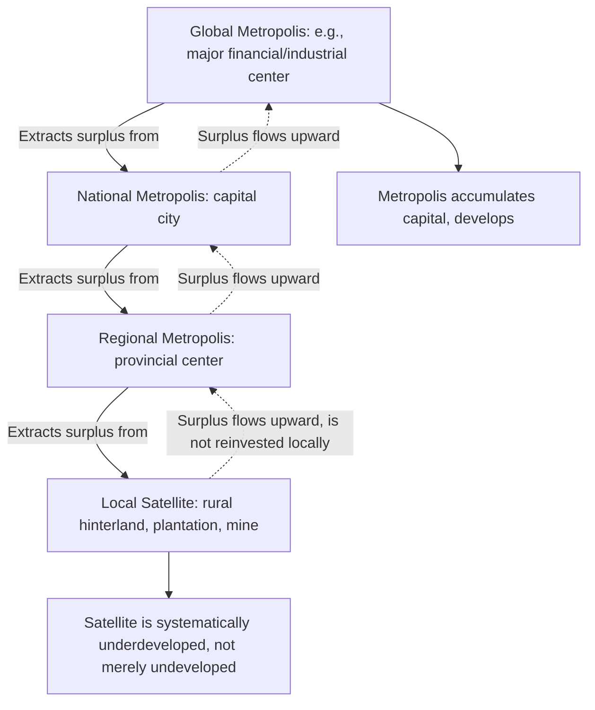

## Andre Gunder Frank and underdevelopment

### Overview

André Gunder Frank (1929–2005) was a German-American economic historian and sociologist whose work in the mid-to-late 1960s produced the most radical and influential formulation of dependency theory, centered on his signature thesis that **underdevelopment is not an original or natural condition but an actively produced historical outcome of capitalist world-economy integration**. Frank's most famous formulation of this idea — **"the development of underdevelopment"** — directly challenged both mainstream modernization theory and the more moderate CEPAL/structuralist tradition of Prebisch, arguing that Latin America's poverty was not a lagging pre-capitalist condition waiting to be modernized, but rather the direct, ongoing product of centuries of capitalist exploitation through colonial and neocolonial economic relationships.

### Biographical and Intellectual Context

Frank conducted extensive fieldwork and historical research in Latin America (particularly Chile and Brazil) during the 1960s, a period marked by disillusionment among many Latin American intellectuals with both classical modernization theory and the practical results of CEPAL-inspired Import Substitution Industrialization, which by the 1960s had failed to deliver the broad-based industrial catch-up its proponents had hoped for. Frank's work, most notably his 1967 book *Capitalism and Underdevelopment in Latin America*, emerged directly from this intellectual and political moment, drawing on Marxist political economy to offer a more radical diagnosis than Prebisch's trade-focused structuralism.

---

### The Core Thesis: "The Development of Underdevelopment"

Frank's central and most widely cited claim, published as a standalone 1966 essay titled "The Development of Underdevelopment" (in *Monthly Review*) and elaborated in his 1967 book, can be summarized as:

$$\text{Underdevelopment} \neq \text{Original/Traditional condition}$$

$$\text{Underdevelopment} = \text{Historical product of capitalist exploitation via metropolis-satellite relations}$$

Frank explicitly rejected the modernization-theory assumption (associated with Rostow and others) that "underdeveloped" countries represent an earlier historical stage that developed countries had already passed through and that underdeveloped countries would eventually traverse given sufficient time, capital, and appropriate policy. Instead, he argued that contemporary underdeveloped regions had been **actively integrated into the capitalist world-economy from the period of European colonial expansion onward**, and that this integration itself — not isolation from capitalism, nor a failure to yet fully enter it — was the direct cause of their persistent poverty.

---

### The Metropolis-Satellite Framework

Frank's key analytical structure is the **metropolis-satellite** relationship (closely related to, but articulated with greater emphasis on internal replication than, Prebisch's center-periphery model):

- **Metropolis**: A dominant economic center that extracts economic surplus from subordinate regions.
- **Satellite**: A subordinate region whose economic surplus is extracted by, and flows toward, its metropolis.

Frank's crucial and distinctive innovation was arguing this relationship **replicates fractally at multiple geographic scales simultaneously** — not simply as a single global core-periphery divide, but as a nested chain of metropolis-satellite relationships operating from the international level down to the local level within a single country.

#### The Chain of Surplus Extraction

$$\text{World metropolis (e.g., London, later New York)} \rightarrow \text{National metropolis (e.g., a Latin American capital city)} \rightarrow \text{Regional metropolis (a provincial city)} \rightarrow \text{Local satellite (rural hinterland, plantation, mine)}$$

At each link in this chain, the "satellite" at that level has its economic surplus extracted and channeled upward toward the "metropolis" at that level, which in turn functions as a satellite to the next metropolis further up the chain, all the way to the ultimate global metropolis.

#### Diagram: The Metropolis-Satellite Chain

Frank's key point in constructing this nested chain: underdevelopment is reproduced *within* peripheral countries themselves, not only at the level of the country's relationship to the wider world-economy — a rural region within Brazil, for example, stands in the same exploitative satellite relationship to a Brazilian metropolitan center that Brazil as a whole stands in relative to the global metropolis.

---

### "Development of Underdevelopment" vs. "Undevelopment"

Frank drew a sharp analytical distinction between two very different conditions frequently conflated in mainstream development discourse:

| Concept | Definition | Frank's Position |
| --- | --- | --- |
| **Undeveloped** | A region that has not yet been substantially integrated into a wider economic system; a "pristine" or traditional pre-capitalist condition | Frank argued this describes historically isolated societies before capitalist contact — largely irrelevant to explaining contemporary Latin American poverty |
| **Underdeveloped** | A region actively integrated into the capitalist world-economy, but in a subordinate satellite role that systematically extracts its surplus toward a metropolis | Frank argued this is the accurate description of contemporary Latin America — its poverty is a *product of*, not a *precondition prior to*, capitalist integration |

This distinction is the technical core of the phrase "development of underdevelopment": underdevelopment is not the absence of development, but is *itself actively generated* — "developed" in the sense of being produced and reproduced — by the very process of capitalist expansion and integration.

---

### Historical Evidence Frank Marshaled

Frank drew on historical case studies to argue that regions of Latin America that had been *most intensively* integrated into colonial and capitalist trade relationships (e.g., through mining, plantation agriculture tied to export markets) tended to exhibit *greater*, not lesser, long-run underdevelopment relative to more isolated regions — directly inverting the modernization-theory expectation that greater contact with advanced capitalist economies should have produced faster development.

**Examples commonly cited in Frank's analysis** (as characterized in the broader dependency literature building on his work):

- Historically intensively mined or plantation-based regions in Latin America, which generated substantial wealth extracted toward colonial and later national/international metropolises, frequently show persistent underdevelopment in subsequent periods relative to regions that were less thoroughly integrated into export-extraction economies during the colonial and early post-colonial periods. [Inference: the specific regional case studies and their interpretation remain debated in subsequent economic history scholarship, and alternative explanations — institutional quality, geography, disease environment — have been proposed for similar patterns by later researchers (e.g., work in the "colonial origins of comparative development" tradition).]

---

### Diagram: Frank's Thesis vs. Modernization Theory (svg_diagram)

<svg xmlns="http://www.w3.org/2000/svg" viewBox="0 0 700 380" font-family="Helvetica, Arial, sans-serif">
<text x="350" y="28" font-size="17" font-weight="bold" text-anchor="middle">Frank's Thesis vs. Modernization Theory (svg_diagram)</text>
<rect x="40" y="60" width="280" height="130" rx="10" fill="#2980b9" opacity="0.9" />
<text x="180" y="90" font-size="14" fill="white" text-anchor="middle" font-weight="bold">Modernization Theory</text>
<text x="180" y="115" font-size="11" fill="white" text-anchor="middle">Traditional society</text>
<text x="180" y="132" font-size="11" fill="white" text-anchor="middle">↓ (linear stages)</text>
<text x="180" y="149" font-size="11" fill="white" text-anchor="middle">Takeoff and industrialization</text>
<text x="180" y="166" font-size="11" fill="white" text-anchor="middle">↓</text>
<rect x="380" y="60" width="280" height="130" rx="10" fill="#c0392b" opacity="0.9" />
<text x="520" y="90" font-size="14" fill="white" text-anchor="middle" font-weight="bold">Frank's Thesis</text>
<text x="520" y="115" font-size="11" fill="white" text-anchor="middle">Capitalist world-system contact</text>
<text x="520" y="132" font-size="11" fill="white" text-anchor="middle">↓ (satellite integration)</text>
<text x="520" y="149" font-size="11" fill="white" text-anchor="middle">Surplus extraction to metropolis</text>
<text x="520" y="166" font-size="11" fill="white" text-anchor="middle">↓</text>

<text x="180" y="230" font-size="12" text-anchor="middle" fill="`#2980b9`" font-weight="bold">"Developed" (eventual outcome)</text>

<text x="520" y="230" font-size="12" text-anchor="middle" fill="`#c0392b`" font-weight="bold">"Underdeveloped" (produced outcome)</text>

<text x="180" y="270" font-size="11" text-anchor="middle">Contact with advanced economies</text>

<text x="180" y="285" font-size="11" text-anchor="middle">accelerates development</text>

<text x="520" y="270" font-size="11" text-anchor="middle">Contact with metropolis</text>

<text x="520" y="285" font-size="11" text-anchor="middle">causes underdevelopment</text>

</svg>

---

### Policy and Political Implications

Frank's radical diagnosis led to a substantially more radical prescription than Prebisch's CEPAL-style reformism:

- **Rejection of reformist ISI**: Since Frank located the cause of underdevelopment in the structural relationship of capitalist exploitation itself, he was skeptical that reformist policies operating *within* the capitalist system (such as ISI, foreign aid, or gradual industrial policy) could resolve the underlying problem, since such policies leave the fundamental metropolis-satellite extraction relationship intact.
- **Delinking**: Frank's analysis is associated with (though not identical to) the broader dependency-theory-adjacent policy idea of **"delinking"** — the argument that peripheral/satellite economies might need to substantially reduce or restructure their integration into the capitalist world-economy to break the surplus-extraction relationship, rather than seeking deeper integration on existing terms.
- **Socialist/revolutionary orientation**: Frank's work was explicitly situated within a Marxist analytical tradition and was influential among Latin American intellectuals and political movements advocating more fundamental socioeconomic transformation rather than incremental reform, distinguishing his political implications sharply from Prebisch's more institutionally oriented, UN-affiliated reformism.

---

### Comparison with Related Dependency Theorists

| Thinker | Relationship to Frank's Thesis |
| --- | --- |
| **Raúl Prebisch** | More moderate predecessor; focused on trade/terms-of-trade mechanisms and advocated reformist ISI policy within the existing system, rather than Frank's more totalizing capitalist-exploitation framework |
| **Fernando Henrique Cardoso & Enzo Faletto** | Explicitly critiqued Frank's thesis as overly deterministic and mechanical; their "dependent development" framework allowed for the possibility of *some* industrialization and growth occurring within a dependency relationship, contingent on specific domestic political and class configurations — a more historically and politically nuanced alternative to Frank's more sweeping structural claim |
| **Theotônio dos Santos** | Broadly aligned with Frank's radical dependency tradition, similarly emphasizing dependency as a structurally conditioning (though not fully deterministic) situation |
| **Immanuel Wallerstein** | Built on and generalized concepts closely related to Frank's metropolis-satellite framework into the broader, more historically extensive world-systems theory, adding the semi-periphery category that Frank's more bipolar metropolis-satellite model did not emphasize as distinctly |

---

### Criticisms of Frank's Thesis

- **Excessive determinism**: The most frequently repeated criticism, including from within the dependency theory tradition itself (notably from Cardoso and Faletto), is that Frank's framework is overly mechanical and deterministic, treating underdevelopment as an almost automatic, near-total consequence of capitalist world-system integration, with insufficient attention to variation in domestic political coalitions, state capacity, and policy choices that might allow some dependent economies to achieve substantial industrialization despite continued integration into the capitalist world-system.
- **East Asian counter-cases**: The subsequent rapid industrialization of several East Asian economies through deep integration into international capitalist trade and investment networks — rather than through delinking — is frequently cited as posing a direct empirical challenge to Frank's core prediction that deeper capitalist integration systematically produces underdevelopment rather than development. [Inference: Frank and sympathetic scholars offered various responses to this challenge (e.g., emphasizing specific Cold War geopolitical circumstances providing preferential treatment to these cases), but whether these responses adequately resolve the challenge to the general thesis remains contested in the scholarly literature.]
- **Historical/empirical methodology critiques**: Economic historians have challenged some of the specific historical case evidence Frank marshaled for the inverse relationship between colonial-era integration intensity and subsequent development, with some studies emphasizing alternative explanatory variables (colonial institutional design, disease environment affecting settlement patterns, geographic factors) as competing or complementary explanations for similar observed patterns of long-run regional divergence. [Unverified: the relative explanatory weight of Frank's surplus-extraction mechanism versus these alternative institutional and geographic explanations remains an active area of debate in economic history and development economics, without a single settled consensus.]
- **Limited policy guidance**: Critics note that even where Frank's diagnosis is found persuasive, his framework offers comparatively less specific, actionable policy guidance for governments operating within existing global structures, compared to the more concrete (if contested) policy prescriptions offered by CEPAL structuralism (ISI) or later dependent-development theorists.
- **Underestimation of internal class dynamics**: Some Marxist critics of Frank (a critique also echoed by Cardoso and Faletto from a different angle) argued his framework understates the importance of internal class structures and conflicts *within* peripheral societies, treating the metropolis-satellite relationship as doing more explanatory work than internal social relations of production.

---

### Position Relative to Other Development Theories

- **Vs. Modernization Theory**: Frank's work stands as the most direct and total rejection of modernization theory's core premise within the dependency tradition — where modernization theory sees underdevelopment as a *stage prior to* capitalist integration, Frank sees it as a *product of* that integration.
- **Vs. Prebisch/CEPAL Structuralism**: A radicalization of Prebisch's center-periphery framework — Frank extends the analysis from a trade-price mechanism (terms of trade) to a broader Marxist surplus-extraction mechanism, and extends the geographic scale of analysis from purely international relationships down to a fractal, multi-level metropolis-satellite chain operating within countries as well as between them.
- **Vs. Cardoso and Faletto's Dependent Development**: The key internal debate within dependency theory — Frank's more deterministic, near-total exploitation thesis versus Cardoso and Faletto's more historically contingent, politically nuanced framework allowing for variable outcomes within dependency relationships.
- **Precursor to Wallerstein's World-Systems Theory**: Frank's metropolis-satellite framework is a direct conceptual ancestor of Wallerstein's core-periphery-semi-periphery model, sharing the emphasis on a single integrated capitalist world-economy as the fundamental unit of analysis, though Wallerstein's framework offers a more differentiated three-tier structure and a more extensive historical periodization than Frank's original bipolar model.

---

### Related Topics

- Origins of dependency theory in Latin America (Prebisch, CEPAL)
- Prebisch-Singer thesis on terms of trade
- Core-periphery framework and Wallerstein's world-systems theory
- Cardoso and Faletto's dependent development framework
- Delinking as a dependency-theory-associated policy strategy
- Colonial origins of comparative development (institutional economic history)
- Import substitution industrialization and its critiques
- Marxist political economy approaches to development