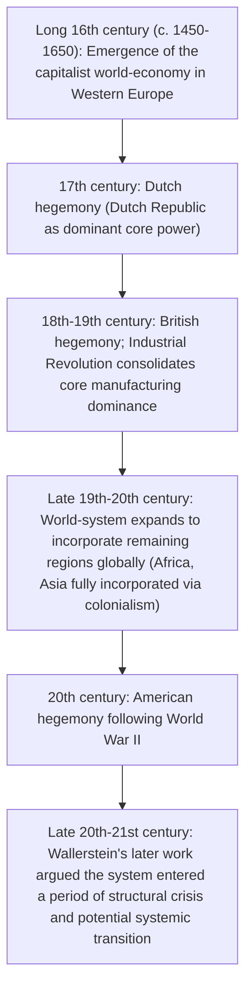

## World-systems theory and Wallerstein

### Overview

World-systems theory, developed principally by American sociologist **Immanuel Wallerstein** beginning with *The Modern World-System, Volume I* (1974), is the most comprehensive and historically extensive elaboration of the core-periphery structural approach to global economic development. Wallerstein proposed that the appropriate unit of analysis for understanding social and economic change is neither the individual nation-state nor any single society, but the **entire capitalist world-economy** as a single, historically bounded social system — one that emerged in a specific historical period (roughly the "long 16th century," c. 1450–1650) and has since expanded to encompass the entire globe. Within this single integrated system, Wallerstein argued, countries and regions occupy structurally differentiated positions — **core, semi-periphery, and periphery** — that shape their developmental trajectories in ways that cannot be understood by examining any single country in isolation.

### Historical and Intellectual Context

Wallerstein's project drew together several intellectual traditions: Marxist political economy, the French *Annales* school of historiography (particularly Fernand Braudel's long-duration historical analysis), and the dependency theory tradition emerging from Latin America (Prebisch, Frank). Wallerstein sought to synthesize these into a single, unified historical-sociological theory capable of explaining the entire trajectory of global capitalism from its origins through the present, rather than treating "development" and "underdevelopment" as separate national-level phenomena to be explained country by country.

The first volume of *The Modern World-System* was published in 1974, with subsequent volumes extending the historical analysis into later centuries (Volume II in 1980, Volume III in 1989, Volume IV in 2011), tracing the world-system's expansion, consolidation, and periodic reorganization from the 16th century through the 20th century.

---

### The World-Economy as the Unit of Analysis

Wallerstein's foundational methodological claim is that social scientific analysis has historically erred by taking the nation-state as the primary unit of analysis, when in fact the relevant bounded social system since roughly 1500 has been the capitalist **world-economy** — a single division of labor spanning multiple political jurisdictions, unified by economic exchange relationships even though (crucially, in Wallerstein's framework) it lacks a single overarching political authority.

$$\text{World-Economy} \neq \sum \text{(individual national economies)}$$

Rather, Wallerstein argued, individual national economies are best understood as differentiated *parts* of a single, more fundamental world-economic division of labor, and their developmental trajectories are shaped substantially by their structural position within this single system.

#### World-Empire vs. World-Economy

Wallerstein distinguished the modern capitalist world-economy from historically prior large-scale social systems, particularly **world-empires** (e.g., the Roman Empire, ancient China under unified dynastic rule):

| Feature | World-Empire | (Capitalist) World-Economy |
| --- | --- | --- |
| Political structure | Single overarching political/military authority | Multiple competing sovereign states; no single political authority |
| Economic surplus extraction | Primarily through political/military tribute and taxation | Primarily through market exchange relationships and capital accumulation |
| Historical examples | Roman Empire, various dynastic Chinese empires | The modern capitalist world-economy since c. 1500 |

Wallerstein argued the *absence* of a single overarching political authority is actually essential to the capitalist world-economy's dynamism — the existence of multiple competing states prevents any single political actor from fully suppressing market-driven capital accumulation, allowing capitalism to develop and expand in ways a unified world-empire's political control might have constrained.

---

### The Three-Tier Structure: Core, Semi-Periphery, Periphery

(See the companion topic on the core-periphery framework for the fuller structural elaboration of this three-tier system; this section focuses on Wallerstein's specific historical and theoretical contributions to it.)

Wallerstein's key structural innovation beyond Prebisch's original bipolar core-periphery model was the addition of the **semi-periphery** as a distinct, theoretically necessary intermediate category — not merely a residual or transitional zone, but a structurally essential component of the world-system's stability.

#### The Semi-Periphery's Structural Function

Wallerstein argued the semi-periphery serves crucial **political-economic stabilizing functions** for the world-system as a whole:

1. **Political buffer**: By providing an intermediate tier, the semi-periphery diffuses what would otherwise be a stark, potentially destabilizing binary conflict between core and periphery into a more complex, less politically polarized three-tier structure.
2. **Economic mixing function**: Semi-peripheral states engage in some core-like activities (limited manufacturing, more diversified economic structures) while continuing periphery-like activities (raw material export, lower-wage production relative to the core), allowing them to sometimes act as intermediaries in core-periphery exchange relationships.
3. **Zone of relative state strength**: Semi-peripheral states, in Wallerstein's analysis, often possess relatively stronger state apparatuses than peripheral states, capable of pursuing more interventionist economic strategies (state-led industrialization, protective trade policy) aimed at improving their position within the world-system.

---

### Historical Periodization of the World-System

Wallerstein's multi-volume historical analysis traces several major phases in the world-system's development:

#### Hegemonic Cycles

A key dynamic element in Wallerstein's framework is the concept of **hegemonic cycles** — periods in which a single core state achieves a position of clear, dominant leadership within the core (combining superiority in production, commerce, and finance simultaneously), followed by periods of hegemonic decline and rivalry among core powers as that dominance erodes:

$$\text{Hegemonic ascent} \rightarrow \text{Hegemonic maturity/dominance} \rightarrow \text{Hegemonic decline} \rightarrow \text{Rivalry among core powers} \rightarrow \text{New hegemonic ascent}$$

Wallerstein identified three historical instances of full hegemonic dominance within the modern world-system: the **Dutch Republic** (17th century), the **United Kingdom** (mid-19th century), and the **United States** (mid-20th century, following World War II), with periods of inter-core rivalry and conflict occurring between these hegemonic phases (e.g., the extended Anglo-French rivalry preceding British hegemony, and the period of inter-imperial rivalry preceding and including the World Wars, preceding American hegemony).

---

### Incorporation and Expansion of the World-System

A central historical process in Wallerstein's framework is the geographic **expansion and incorporation** of previously external regions into the capitalist world-economy over time — regions not yet part of the system are termed "external areas," and their subsequent incorporation (often through colonial conquest or forced trade opening) transforms them into peripheral (or occasionally semi-peripheral) zones of the expanding system.

$$\text{External area (outside the world-system)} \rightarrow \text{Incorporation (colonial conquest, forced trade)} \rightarrow \text{Peripheralization (assigned a subordinate structural role)}$$

Wallerstein argued this incorporation process was substantially completed by the late 19th/early 20th century through the height of European colonial expansion, after which point essentially the entire globe had been drawn into a single capitalist world-economy — a key claim distinguishing his analysis from frameworks that treat "underdeveloped" regions as simply not-yet-integrated into global capitalism, rather than as already-integrated subordinate participants within it.

---

### Diagram: World-System Structure and Dynamics (svg_diagram)

<svg xmlns="http://www.w3.org/2000/svg" viewBox="0 0 720 460" font-family="Helvetica, Arial, sans-serif">
<text x="360" y="28" font-size="17" font-weight="bold" text-anchor="middle">World-System Structure Across Time (svg_diagram)</text>

<circle cx="360" cy="250" r="180" fill="#c0392b" opacity="0.25" />
<circle cx="360" cy="250" r="120" fill="#8e67ad" opacity="0.4" />
<circle cx="360" cy="250" r="60" fill="#2980b9" opacity="0.85" />

<text x="360" y="255" font-size="13" fill="white" text-anchor="middle" font-weight="bold">CORE</text>

<text x="360" y="150" font-size="13" fill="`#5b2d7a`" text-anchor="middle" font-weight="bold">SEMI-PERIPHERY</text>

<text x="360" y="90" font-size="13" fill="`#8b2e1f`" text-anchor="middle" font-weight="bold">PERIPHERY</text>

<path d="M 250 400 Q 360 440 470 400" stroke="#27ae60" stroke-width="2.5" fill="none" marker-end="url(#arrow5)" />
<text x="360" y="435" font-size="12" fill="#27ae60" text-anchor="middle">Hegemonic cycles: Dutch → British → American</text>
<text x="360" y="50" font-size="12" text-anchor="middle" fill="#333">Single integrated capitalist world-economy since c. 1500</text>

</svg>

---

### Kondratieff Waves and Systemic Cycles

Wallerstein's framework incorporates **Kondratieff long waves** — cycles of roughly 50-60 years combining phases of economic expansion (A-phase) and stagnation/contraction (B-phase) — as a recurring rhythmic feature of the capitalist world-economy's overall development, associated with cycles of technological innovation, over-accumulation, and subsequent restructuring. Wallerstein integrated this concept (originally developed by Soviet economist Nikolai Kondratieff and later elaborated by Joseph Schumpeter) into his broader account of how the world-system periodically reorganizes itself, including shifts in the relative position of specific core, semi-peripheral, and peripheral zones during different long-wave phases.

---

### Systemic Crisis and Wallerstein's Later Work

In his later career, Wallerstein argued the modern capitalist world-system was entering a prolonged period of **structural crisis** — a period distinct from ordinary cyclical downturns, in which the fundamental structures sustaining the capitalist world-economy's continued functioning (including the availability of cheap labor reserves for continued incorporation, the capacity of states to manage social conflict, and ecological constraints on continued capital accumulation) would come under increasing strain, potentially leading to a **systemic transition** to some qualitatively different social system over an extended historical period (Wallerstein and collaborators associated with this later work sometimes framed this transition as unfolding over a horizon of several decades). [Speculation: this systemic-crisis and transition thesis represents a more speculative, forward-looking extension of Wallerstein's historical analytical framework, and is treated with considerably less consensus — even among world-systems scholars — than his historical analysis of the system's origins and past dynamics.]

---

### Criticisms of World-Systems Theory

- **Economic reductionism**: Critics, including some from within Marxist and sociological traditions, argue Wallerstein's framework places excessive explanatory weight on economic/structural position within the world-system, potentially understating the causal importance of domestic political institutions, culture, and specific historical contingencies within individual countries.
- **Eurocentric historical starting point debated**: Some historians and sociologists (including scholars working in "global history" and world-history traditions) have challenged Wallerstein's specific historical periodization, particularly his dating of the world-system's origin to 16th-century Europe, arguing for either earlier or more geographically distributed origins of large-scale interconnected economic systems (e.g., pointing to earlier and broader Afro-Eurasian trade networks). [Unverified: this remains a genuinely contested area of historical scholarship rather than a matter with a single settled resolution.]
- **Determinism and limited state agency**: As with dependency theory more broadly, critics argue the framework can understate the degree to which individual states have historically been able to alter their structural position through deliberate policy — the East Asian industrialization experience is frequently cited (as with critiques of Frank's dependency thesis) as a case of significant relative mobility that some scholars argue challenges strong versions of world-systems determinism. [Inference: Wallerstein and sympathetic scholars offered responses situating such cases within specific historical/geopolitical circumstances, but whether this fully resolves the critique remains debated.]
- **Difficulty of empirical testing**: The scale and historical scope of world-systems theory (encompassing centuries and the entire globe as a single unit of analysis) makes rigorous empirical testing of its specific causal claims considerably more difficult than testing more narrowly scoped, country- or period-specific economic theories.
- **Semi-periphery classification ambiguity**: As noted in the companion core-periphery framework topic, precisely classifying specific countries into the core/semi-periphery/periphery scheme, and tracking their movement between categories over time, remains methodologically contested among world-systems scholars themselves.

---

### Position Relative to Other Development Theories

- **Vs. Modernization Theory**: The most comprehensive and historically extensive rejection of modernization theory's country-by-country, linear-stages framework — Wallerstein's world-economy unit of analysis directly denies that individual countries can be meaningfully understood as progressing through development stages independent of their relational position within the single global system.
- **Extension of Prebisch and Frank**: Wallerstein's core-semi-periphery-periphery framework directly builds on and generalizes Prebisch's original bipolar center-periphery model and Frank's metropolis-satellite dependency framework, adding the semi-periphery category and a far more extensive historical periodization stretching back to the 16th century, rather than focusing primarily on 20th-century trade and colonial relationships.
- **Vs. Structural Change and Big Push Theories**: These theories analyze development primarily as a domestic, within-country coordination and resource-allocation problem; world-systems theory relocates the entire analytical frame to the level of a single global system, treating domestic developmental outcomes as substantially conditioned by structural position within that system rather than as independently determined by domestic investment and policy choices alone.
- **Influence on contemporary global political economy**: World-systems theory's emphasis on hegemonic cycles, systemic crisis, and long-run structural analysis continues to influence contemporary international political economy scholarship examining questions of great-power transition, global economic governance, and long-run patterns of uneven development, even where scholars do not adopt the full Wallersteinian framework.

---

### Related Topics

- Core-periphery framework (Prebisch's original bipolar model)
- Andre Gunder Frank and the metropolis-satellite dependency framework
- Origins of dependency theory in Latin America
- Hegemonic stability theory in international political economy
- Kondratieff long waves and cycles of capital accumulation
- Braudel and the Annales school of historiography
- Colonialism and the historical incorporation of peripheral regions
- Global value chains as a contemporary extension of world-systems analysis