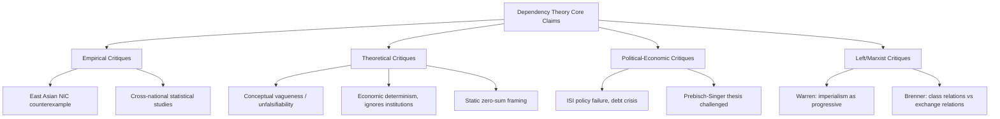

## Critiques of Dependency Theory

### Overview

Dependency theory, developed primarily by Latin American structuralist and Marxist economists from the 1950s through the 1970s, proposed that underdevelopment in peripheral nations is a structural consequence of their integration into a world capitalist system dominated by core industrialized nations. While influential in shaping mid-20th-century development discourse, dependency theory has faced sustained and multidimensional criticism from neoclassical economists, empirical researchers, Marxist theorists, and later world-systems and post-development scholars. This chapter surveys the major lines of critique: empirical, methodological, theoretical, political, and historical.

### Empirical Critiques

#### The East Asian Counterexample

The most frequently cited empirical challenge to dependency theory is the divergent trajectory of the East Asian Newly Industrializing Economies (NIEs) — South Korea, Taiwan, Singapore, and Hong Kong.

**Key Points**

- Dependency theory predicted that peripheral economies integrated into global capitalism through export-oriented trade with core nations would experience stagnation or "the development of underdevelopment."
- South Korea and Taiwan pursued export-oriented industrialization (EOI) while maintaining deep trade and investment ties with core economies (the United States and Japan) — precisely the kind of dependent relationship the theory identified as harmful.
- Despite this, these economies achieved sustained per-capita GDP growth rates exceeding 6-8% annually from the 1960s through the 1990s, moving from peripheral, low-income status to high-income, technologically sophisticated economies within roughly one generation.
- Critics argue this directly falsifies the core causal claim that dependency structurally forecloses upward mobility within the world economy.

Dependency theorists (notably within world-systems analysis) responded that these cases were exceptional, enabled by unique geopolitical conditions: Cold War strategic patronage, large-scale U.S. aid, permissive market access, and land reforms that reduced landlord-class obstruction to industrial policy. Critics counter that if the theory requires this many exogenous exceptions to explain its most prominent counterexamples, its predictive and explanatory power is substantially weakened.

#### Cross-National Statistical Studies

Quantitative sociologists and economists tested dependency propositions empirically, with mixed and often unsupportive results.

- Studies using measures of trade dependence, foreign investment penetration, and debt dependence (e.g., work in the tradition of Volker Bornschier and Christopher Chase-Dunn) found some short-term negative effects of foreign capital penetration on growth, but results were sensitive to model specification, time period, and country sample.
- [Unverified] The specific magnitude and consistency of these "penetration effects" across later replications remains contested in the empirical sociology literature, with some studies finding effects that disappear once alternative controls are introduced.
- Neoclassical economists (e.g., studies associated with the World Bank and NBER-affiliated researchers) generally found that openness to trade and foreign direct investment (FDI) correlates positively with long-run growth, contradicting the dependency prediction that such openness perpetuates underdevelopment.

### Theoretical and Conceptual Critiques

#### Vagueness and Unfalsifiability

A recurring criticism, most sharply articulated by economists such as **David Booth** and philosophers of social science, is that dependency theory's central concepts are too imprecisely defined to generate testable hypotheses.

- "Dependency" itself is used inconsistently across authors — sometimes as a description of trade structure, sometimes of financial relations, sometimes of a broader condition of externally-determined decision-making.
- Because almost any economic outcome (growth or stagnation) can be retrospectively attributed to some form of "dependency," critics argue the theory risks being unfalsifiable in the Popperian sense: it does not specify in advance what evidence would disconfirm it.
- This vagueness also makes it difficult to derive specific, actionable policy prescriptions beyond broad calls for delinking or import-substitution industrialization (ISI).

#### Economic Determinism and Neglect of Internal Factors

Critics — including some sympathetic reformist economists — argue dependency theory over-attributes underdevelopment to external structural forces while under-weighting domestic institutional, political, and cultural factors.

- Institutional economists (in the tradition later formalized by Douglass North, and subsequently by Daron Acemoglu and James Robinson) argue that domestic institutional quality — property rights security, rule of law, quality of governance, and the extractive versus inclusive character of political institutions — better explains long-run divergence than external position in the world trade system.
- Critics note that dependency theory struggles to explain substantial variation in outcomes among countries occupying structurally similar "peripheral" positions (e.g., why some Sub-Saharan African economies stagnated while others, or various Southeast Asian economies with similar colonial and trade histories, industrialized).
- This is sometimes called the "internal variation problem": if external position in the world system is the primary causal driver, within-periphery variance should be small, but observed variance is large.

#### Static Zero-Sum Framing

Dependency theory, particularly in its Andre Gunder Frank-influenced form, frames the world economy as approximately zero-sum: core enrichment is causally linked to and dependent upon peripheral impoverishment (the "development of underdevelopment" thesis).

- Critics argue this understates the possibility of positive-sum growth through trade, technology transfer, and capital mobility — mechanisms central to neoclassical trade theory (comparative advantage, per Ricardo, and later endogenous growth theory).
- [Inference] Whether global trade is net positive-sum or contains significant distributive core-periphery transfers remains an area of live debate among heterodox and mainstream economists, rather than a settled matter; the "zero-sum" critique targets an oversimplified version of the theory more than its most careful formulations.

### Political-Economic Critiques

#### Failure of Import-Substitution Industrialization (ISI)

Dependency theory's principal policy prescription — ISI, promoted through institutions like the UN Economic Commission for Latin America (ECLA/CEPAL) under Raúl Prebisch — was implemented across much of Latin America from the 1950s to 1980s, providing a real-world policy test.

**Key Points**

- ISI generated initial industrial growth but frequently produced: chronic balance-of-payments crises (due to continued need to import capital goods), inefficient, uncompetitive domestic industries protected by high tariffs, fiscal deficits from state subsidization of favored industries, and rent-seeking and cronyism, as protected sectors developed political interests opposed to reform.
- These accumulated problems are widely cited as a major contributing factor to the Latin American debt crisis of the 1980s (the "Lost Decade"), during which several ISI-oriented economies experienced stagnant or negative per-capita growth alongside high inflation.
- Critics (notably from the neoliberal/Washington Consensus tradition, e.g., economists associated with the IMF and World Bank in the 1980s-90s) argue this represents a direct policy failure attributable to dependency theory's prescriptions, contrasted with the export-oriented policies of East Asian economies over the same period.

Dependency-sympathetic scholars respond that ISI's failures reflected implementation flaws (excessive protection duration, inadequate export-discipline mechanisms) rather than a refutation of the underlying diagnosis of structural external constraint — though this response itself is contested as post hoc theory-saving.

#### Prebisch-Singer Thesis Challenges

The Prebisch-Singer thesis — that the terms of trade for primary-commodity exporters decline secularly relative to manufactured-goods exporters — is a foundational empirical claim underlying dependency theory (structuralist branch).

- Later econometric re-examinations (e.g., work by Jeffrey Sachs, John T. Cuddington, and others from the 1980s onward) found the evidence for a *secular* (long-run, monotonic) decline in commodity terms of trade to be much weaker and more period-dependent than originally claimed.
- [Unverified] Whether a robust, statistically significant secular decline exists across the full 20th- and 21st-century data record, once structural breaks and commodity-specific heterogeneity are accounted for, remains disputed among economic historians and econometricians.
- Even where some decline is found, critics argue it does not by itself establish dependency theory's stronger claim of *structural* exploitation, since terms-of-trade movements can also result from ordinary supply-and-demand dynamics (income elasticity differences between primary and manufactured goods, per Engel's Law) without requiring a core-periphery power framework.

### Critiques from the Marxist Left

Dependency theory has also been criticized from within the Marxist and world-systems tradition itself, notably by **Bill Warren** and, from a different angle, **Robert Brenner**.

- Warren's *Imperialism: Pioneer of Capitalism* (1980) argued dependency theory, by claiming imperialism blocks peripheral capitalist development, inverted Marx's own view that capitalist penetration (including via colonialism) is ultimately a *progressive*, developmental force that dissolves pre-capitalist relations of production and lays groundwork for industrialization.
- Warren pointed to observed industrial growth in parts of the post-colonial "Third World" as evidence against the "blocked development" thesis.
- Brenner's critique (the "Brenner debate," originating in critiques of both dependency and world-systems theory) argued that focusing on exchange relations and trade position (a "neo-Smithian" emphasis, in his terms) misidentifies the causal mechanism of capitalist development, which he located instead in class relations of production internal to specific social formations.
- These left-critiques matter because they show dependency theory's claims were contested not only by its ideological opponents but by scholars sharing its broader anti-capitalist or historical-materialist commitments.

### Methodological Critiques

- **Selection bias in case studies**: much of dependency theory's evidentiary base derives from qualitative case studies of Latin American economies (particularly Brazil, Chile, and Argentina) during specific historical windows, raising questions about generalizability to other regions and periods.
- **Conflation of correlation and causation**: peripheral status and underdevelopment are frequently observed together, but critics argue dependency theorists have not adequately ruled out reverse causation (weak states and institutions produce both peripheral trade position and poor development outcomes) or confounding factors (geography, disease environment, initial factor endowments, as later emphasized by Jeffrey Sachs and by Acemoglu, Johnson, and Robinson's work on colonial institutions).
- **Ahistorical treatment of colonialism's diversity**: critics note colonial and post-colonial experiences varied enormously (settler colonies vs. extractive colonies, direct vs. indirect rule), and dependency theory's relatively uniform "core-periphery" framework has been criticized for flattening this variation, a critique later developed rigorously in the institutional economics literature.

### Summary Comparison of Major Critique Lines

| Critique Type | Key Proponents | Core Argument | Primary Dependency-Theory Response |
| --- | --- | --- | --- |
| Empirical (East Asia) | Neoclassical economists, modernization theorists | NIEs grew rapidly despite/through integration with core economies | Cold War exceptionalism; unique geopolitical conditions |
| Theoretical (vagueness) | David Booth | Concepts too imprecise to be falsifiable | Later refinements (e.g., Cardoso's "associated dependent development") added nuance |
| Institutional | North, Acemoglu & Robinson | Domestic institutions explain divergence better than external position | Institutions themselves are shaped by colonial/peripheral incorporation |
| Policy outcome (ISI) | Washington Consensus economists | ISI produced crises and inefficiency | Implementation failure, not diagnostic failure |
| Terms of trade | Sachs, Cuddington | Secular decline in commodity terms of trade not robust | Effect exists but is masked by short-run volatility |
| Marxist-internal | Bill Warren, Robert Brenner | Misidentifies capitalism as blocking rather than enabling development | Warren underestimates continued structural subordination |

### Diagram: Structure of the Critique Landscape

### Contemporary Relevance and Synthesis

**Conclusion**

Most contemporary development economists treat dependency theory not as a discarded relic but as a partially superseded framework: its emphasis on structural power asymmetries in global trade and finance persists in modified forms within world-systems analysis, global commodity chain / global value chain analysis, and some strands of post-Keynesian and structuralist development economics. However, its strongest original claims — that peripheral integration into the world economy near-deterministically blocks industrial upgrading — are generally regarded as empirically overstated in light of East Asian industrialization and more recent cases such as China's post-1978 growth trajectory. [Inference] Current mainstream development economics tends to synthesize elements of both traditions, treating external trade structure as one input among several (alongside domestic institutions, state capacity, and human capital) rather than as the primary determinant of development outcomes, though the relative weighting of these factors remains an active research question rather than a settled consensus.

**Related Topics**

- World-systems theory (Wallerstein) and its refinements to core-periphery-semi-periphery structure
- Global value chains and global commodity chains analysis as successor frameworks
- The Prebisch-Singer thesis in depth
- Import-substitution industrialization: mechanisms and case studies
- East Asian developmental state theory (Amsden, Wade, Chang)
- New institutional economics and the Acemoglu-Robinson "Why Nations Fail" framework
- The Washington Consensus and structural adjustment programs
- Unequal exchange theory (Emmanuel, Amin)
- Post-development theory and critiques of the development concept itself