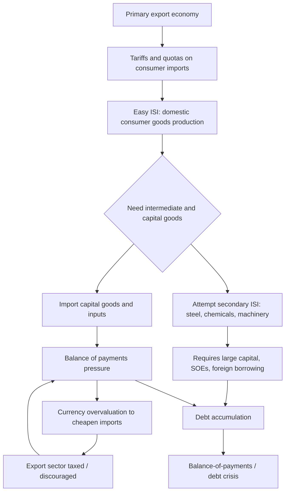

## Import Substitution Industrialization

### Overview

Import substitution industrialization (ISI) is a trade and industrial policy strategy in which a country deliberately replaces imported manufactured goods with domestically produced substitutes, typically through a combination of tariff protection, quantitative import restrictions, subsidized credit, exchange rate management, and state-directed investment. ISI was the dominant development strategy across Latin America, and in modified forms across parts of Africa and South Asia, from roughly the 1930s through the 1980s. It emerged directly from structuralist and dependency-theoretic diagnoses of underdevelopment, particularly the work of Raúl Prebisch and the UN Economic Commission for Latin America (ECLA/CEPAL).

### Theoretical Foundations

#### The Structuralist Diagnosis

**Key Points**

- Structuralist economists, led by Prebisch, argued the international division of labor locked "peripheral" primary-commodity exporters into a disadvantageous position relative to "core" manufacturing exporters.
- The Prebisch-Singer thesis held that the terms of trade for primary commodities decline secularly relative to manufactured goods, meaning peripheral economies would need to export ever-larger volumes of raw materials to afford a constant volume of imported manufactures.
- Structuralists argued that relying on primary-export-led growth ("agro-export model") therefore transferred the gains of productivity growth to core economies rather than retaining them domestically.
- The policy conclusion: peripheral states should industrialize deliberately, using state intervention to substitute domestic production for imports, rather than waiting for comparative-advantage-driven market forces to generate industrialization organically.

#### Relationship to Dependency Theory

ISI is best understood as the primary *policy arm* of dependency and structuralist theory (see prior chapter section). Where dependency theory diagnosed the problem (structural external constraint), ISI proposed the remedy (state-led industrial self-sufficiency). This linkage is important: critiques of ISI's real-world performance are frequently deployed as indirect critiques of the broader dependency-theoretic framework that motivated it.

### Mechanics and Policy Instruments

ISI was implemented through several overlapping instruments, typically sequenced in stages.

| Instrument | Function | Typical Stage |
| --- | --- | --- |
| Tariff barriers | Raise the price of imported manufactures to make domestic substitutes price-competitive | Early (consumer goods) |
| Quantitative import quotas / licensing | Directly restrict import volume, often more binding than tariffs | Early to mid |
| Overvalued exchange rates | Cheapen imported capital goods and inputs needed for domestic manufacturing, while implicitly taxing traditional export sectors | Throughout |
| Subsidized credit | Channel low-cost, state-directed capital to targeted "infant industries" | Early to mid |
| State-owned enterprises (SOEs) | Direct state production in capital-intensive or strategic sectors (steel, energy, petrochemicals) | Mid to late |
| Multiple exchange rate systems | Differentiate exchange rates by sector to favor industrial imports over consumer imports | Mid |
| Local-content requirements | Mandate a minimum share of domestically sourced inputs in manufactured goods | Mid to late |

#### The Two-Stage Model: Easy vs. Secondary ISI

Development economists (notably Albert Hirschman) distinguished two analytically distinct phases:

1. **Easy ISI (horizontal/primary stage)**: Substitution of simple, non-durable consumer goods (textiles, food processing, basic household goods) that require relatively low capital intensity, limited technological sophistication, and serve an existing, already-identified domestic market. This stage is relatively straightforward because domestic demand is already proven by pre-existing import volumes.
2. **Secondary/Deepening ISI (vertical stage)**: Substitution of intermediate goods (steel, chemicals, cement) and capital goods (machinery, vehicles, electronics) required as inputs to the first stage. This stage is substantially harder: it requires larger economies of scale, more sophisticated technology (often necessitating continued technology imports or licensing), and larger capital investments frequently exceeding domestic private capital markets' capacity — hence the common move toward state-owned enterprises and foreign borrowing to fund this stage.

Hirschman's own analytical framework (linkages theory) suggested secondary ISI could succeed where it exploited strong "backward linkages" (input demand stimulating upstream production) — but many Latin American economies struggled precisely at this transition point.

### Diagram: ISI Policy Sequence and Structural Bottleneck

### Regional Implementation: Case Studies

#### Brazil

- Brazil pursued one of the most sustained and comprehensive ISI programs, particularly from the 1950s (under Juscelino Kubitschek's "Programa de Metas") through the 1970s military-government period.
- Achieved substantial diversification into automobiles, capital goods, and later aerospace (Embraer) and computing.
- [Inference] Brazil's relatively large domestic market size is generally considered by economic historians to have been a significant enabling factor for secondary ISI, since it allowed manufacturers to achieve minimum efficient scale from domestic demand alone, unlike smaller Latin American economies.
- Accumulated substantial external debt to finance capital-intensive secondary ISI (notably under the "Brazilian Miracle" period of the early 1970s), contributing to severe debt distress after the 1979 oil shock and global interest rate increases.

#### Argentina

- Pursued ISI intensively from the Perón era (1946-1955) onward, but with more persistent macroeconomic instability (chronic inflation, recurring balance-of-payments crises) than Brazil.
- Argentina's smaller relative market size and more fragmented industrial policy implementation are frequently cited as contributing to less successful secondary-stage deepening compared to Brazil.

#### India

- India pursued a variant of ISI (heavily influenced by Soviet-style planning under the Mahalanobis model in the Second Five-Year Plan, 1956-1961) emphasizing heavy industry and capital goods production under substantial state ownership and licensing control (the "License Raj").
- [Inference] Economic historians generally regard India's ISI period as having produced a diversified industrial base but at a cost of chronically low growth rates (the so-called "Hindu rate of growth," roughly 3-4% annually) through the 1960s-1980s, attributed in large part to excessive regulatory constraint on private enterprise rather than to ISI's trade-protection elements alone.

#### Sub-Saharan Africa

- Many newly independent African states (e.g., Ghana under Nkrumah, Tanzania under Nyerere's Ujamaa policies) adopted ISI-influenced strategies in the 1960s-70s, often combined with broader socialist or African-socialist economic planning.
- These programs frequently faced more severe implementation constraints than Latin American or Asian cases: smaller domestic markets, weaker pre-existing industrial and administrative infrastructure, and greater vulnerability to commodity price shocks funding state investment.

### Outcomes and Performance Assessment

#### Documented Successes

- ISI did generate substantial manufacturing sector growth and diversification in large-market economies (Brazil, Mexico, India, Argentina) during its peak decades, measurably raising manufacturing's share of GDP and employment.
- Contributed to significant human capital formation and technological learning within protected domestic industries, some of which (e.g., Brazilian aerospace and agribusiness technology, Indian pharmaceuticals and software services later) proved internationally competitive once liberalized.
- Reduced short-run balance-of-payments vulnerability to fluctuations in specific imported consumer goods.

#### Documented Structural Problems

**Key Points**

- **Persistent balance-of-payments pressure**: Secondary ISI required continued imports of capital goods, technology, and intermediate inputs, meaning the strategy often failed to achieve its core stated goal of reducing import dependence — it merely shifted the composition of imports from consumer goods to capital goods.
- **X-inefficiency and lack of competitive discipline**: Protected domestic industries, insulated from international competition, frequently exhibited persistently higher production costs and lower quality than international benchmarks, since tariff protection removed the competitive pressure to improve productivity.
- **Currency overvaluation and export sector taxation**: The exchange rate management necessary to cheapen capital goods imports simultaneously taxed traditional export sectors (particularly agriculture), depressing rural incomes and export earnings needed to service growing external debt.
- **Fiscal burden**: State subsidization of targeted industries and state-owned enterprise operating losses placed sustained pressure on government budgets, often financed through inflationary monetary expansion or external borrowing.
- **Rent-seeking and crony capitalism**: The allocation of import licenses, tariff protection, and subsidized credit created powerful incentives for firms to invest in political lobbying rather than productivity improvement — a dynamic formalized in the economic literature as **directly unproductive profit-seeking (DUP)** activity (Bhagwati) and rent-seeking (Krueger).
- **Debt crisis linkage**: The accumulated external borrowing used to finance secondary ISI, combined with declining export competitiveness, is widely identified by economic historians as a major structural contributor to the Latin American debt crisis of 1982 and the subsequent "Lost Decade."

#### The East Asian Counter-Model

The most consequential comparative critique of ISI comes from the divergent East Asian strategy of export-oriented industrialization (EOI), pursued by South Korea, Taiwan, Singapore, and (with modifications) Hong Kong from the 1960s onward.

- Rather than protecting domestic markets indefinitely, these economies used export performance as the key discipline mechanism and eligibility criterion for continued state support (subsidized credit, protection) — firms that failed to become internationally competitive within a defined time horizon lost state support.
- [Inference] Economic historians (e.g., Alice Amsden, Robert Wade) generally attribute East Asian success partly to this "export discipline" mechanism, which prevented the indefinite protection-without-improvement pattern common in Latin American ISI, though the degree to which state industrial policy versus market liberalization drove these outcomes remains genuinely debated between developmental-state theorists and neoclassical economists.
- By the 1990s, per-capita income in South Korea and Taiwan had surpassed most Latin American ISI-era economies, despite starting from comparable or lower income levels in the 1950s-60s — a comparison frequently cited in development economics as strong evidence against sustained, indefinite ISI as a growth strategy.

### Transition Away from ISI: The Debt Crisis and Structural Adjustment

- The 1982 Mexican debt default triggered a broader Latin American debt crisis, exposing the unsustainability of debt-financed secondary ISI combined with declining export competitiveness and rising global interest rates (following the U.S. Federal Reserve's Volcker-era monetary tightening).
- The IMF and World Bank responded with **structural adjustment programs (SAPs)**, conditioning further lending on trade liberalization, privatization of state-owned enterprises, currency devaluation, and fiscal austerity — collectively associated with what became known as the **Washington Consensus** (a term coined by John Williamson in 1989).
- Most Latin American economies substantially liberalized trade policy through the late 1980s and 1990s (e.g., Mexico's accession to GATT in 1986 and subsequent NAFTA membership in 1994; Argentina's Convertibility Plan of 1991), marking the formal end of the ISI era across the region.

### Contemporary Reassessment

**Conclusion**

Mainstream development economics today generally regards pure, indefinite ISI as an unsuccessful long-run strategy, primarily due to its failure to instill competitive discipline and its structural tendency toward balance-of-payments and debt crises. However, a more nuanced contemporary view — associated with the "new developmentalism" and industrial policy revival literature (e.g., work by Dani Rodrik, Ha-Joon Chang) — holds that *temporary, performance-conditioned, export-linked* protection of infant industries (broadly, the East Asian model) can be a legitimate and effective component of industrial policy, distinguishing it from the largely indefinite and unconditional protection characteristic of classical Latin American ISI. [Inference] This reassessment suggests the central lesson drawn by most current development economists is not that state intervention in industrialization is inherently ineffective, but that the *design* of intervention — particularly the presence or absence of competitive discipline and sunset conditions — is the key determinant of success, though this remains an area of active policy debate rather than settled consensus.

### Related Topics

- Critiques of dependency theory (preceding section) and the Prebisch-Singer thesis
- East Asian developmental state theory (Amsden, Wade, Johnson, Chang)
- The Washington Consensus and structural adjustment programs
- Infant industry protection theory (List, Hamilton) and its modern revival
- The Latin American debt crisis of 1982 and the "Lost Decade"
- Export-oriented industrialization (EOI) as a comparative strategy
- Rent-seeking theory (Krueger) and directly unproductive profit-seeking (Bhagwati)
- Hirschman's linkage theory (backward and forward linkages)
- Trade liberalization sequencing in post-ISI economies (Mexico, Argentina, Brazil since the 1990s)