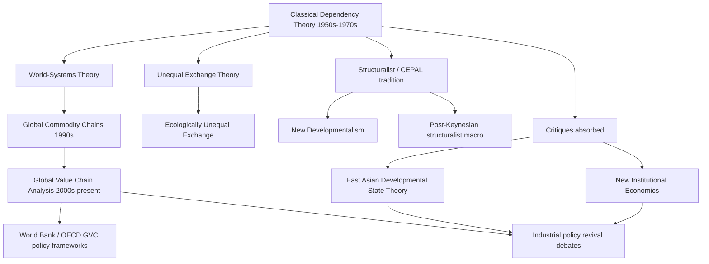

## Legacy of Dependency Theory in Modern Debates

### Overview

Although classical dependency theory's strongest claims were substantially challenged by East Asian industrialization and later empirical work, its analytical vocabulary, structural intuitions, and core concerns persist across multiple contemporary strands of development economics, economic sociology, and international political economy. Rather than disappearing, dependency theory's insights were absorbed, reformulated, and tested against new empirical contexts, producing several distinct successor and adjacent research programs. This chapter traces these lines of continuity.

### Direct Theoretical Descendants

#### World-Systems Theory

**Key Points**

- Immanuel Wallerstein's world-systems analysis (from the mid-1970s onward) generalized dependency theory's core-periphery framework into a more elaborate, historically expansive model featuring a three-tier structure: core, semi-periphery, and periphery.
- The semi-periphery category was a significant conceptual innovation over classical dependency theory, explicitly designed to accommodate cases (e.g., mid-tier industrializing economies) that classical core-periphery dichotomies struggled to classify.
- World-systems theory retained dependency theory's emphasis on structural position within a single integrated world capitalist economy as a primary determinant of national development trajectories, while adding greater attention to long-run historical cycles (Kondratiev waves, hegemonic transitions).

#### Global Commodity Chains and Global Value Chains (GVC) Analysis

- Emerging from world-systems sociology in the 1990s (Gary Gereffi, Miguel Korzeniewicz) and later adopted extensively by mainstream development economics and international organizations (World Bank, UNCTAD, WTO), GVC analysis examines how production processes are fragmented and distributed across countries within firm-coordinated international production networks.
- **Key retained insight**: value and profit capture within global production networks are unevenly distributed across chain segments — a direct descendant of dependency theory's concern with unequal exchange — but GVC analysis reframes this as a question of firm-level governance and upgrading strategy rather than a rigid, near-deterministic structural constraint.
- **Key departure from classical dependency theory**: GVC analysis explicitly theorizes pathways for peripheral firms and economies to "upgrade" (moving from low-value assembly to higher-value design, branding, or full-package manufacturing), a possibility classical dependency theory's more static core-periphery framework did not readily accommodate.
- This framework is now the dominant analytical lens used by institutions such as the World Bank and OECD for analyzing developing-country integration into international trade, effectively institutionalizing a moderated version of dependency theory's original concerns within mainstream development policy.

#### Unequal Exchange Theory

- Arghiri Emmanuel's unequal exchange theory (1972) and later refinements by Samir Amin provided a more formalized economic mechanism for dependency theory's redistributive claims, arguing that wage differentials between core and peripheral economies, combined with international price equalization for traded goods, generate a hidden transfer of value from low-wage to high-wage economies through the terms of trade.
- [Inference] Contemporary heterodox economists (notably in ecological economics and some strands of post-Keynesian trade theory) continue to draw on unequal exchange concepts, particularly in analyses of "ecologically unequal exchange" — the argument that core economies externalize environmental costs and resource extraction onto peripheral economies — though this remains a heterodox rather than mainstream framework.

### Diagram: Genealogy of Dependency Theory's Successor Frameworks

### Absorption Into Mainstream Institutional Economics

Somewhat paradoxically, some of dependency theory's structural concerns re-entered mainstream economics through frameworks originally developed partly in opposition to it.

- **New institutional economics** (Douglass North; later Daron Acemoglu and James Robinson's work on "extractive vs. inclusive institutions") retained dependency theory's interest in explaining persistent core-periphery income divergence, but relocated the causal mechanism from external trade structure to domestic institutional quality, itself frequently traced back to colonial-era institutional choices — creating a partial synthesis in which colonial history (a dependency-theory concern) explains institutional outcomes (an institutionalist mechanism).
- **Middle-income trap literature**: contemporary development economics' concern with why some middle-income economies (e.g., several Latin American economies, and debates around China's post-2010s growth trajectory) fail to converge further toward high-income status echoes dependency theory's original concern with structural barriers to catch-up growth, though the proposed mechanisms (institutional quality, human capital, innovation capacity) differ substantially from classical dependency theory's trade-structure focus.

### Persistence in Political and Policy Discourse

#### Global South Solidarity and Trade Negotiations

- Dependency theory's framing of a structurally disadvantaged "Global South" continues to inform the rhetoric and negotiating positions of developing-country coalitions in international forums, including UNCTAD, the G77, and WTO trade negotiations (e.g., debates over Special and Differential Treatment provisions for developing countries).
- Contemporary debates over intellectual property rights (e.g., TRIPS flexibilities, COVID-19 vaccine patent waiver debates), technology transfer obligations, and climate finance ("loss and damage" mechanisms, common but differentiated responsibilities in UNFCCC negotiations) frequently invoke dependency-theoretic language regarding historical and structural inequities between core and peripheral nations, even when the underlying economic analysis draws on different theoretical traditions.

#### Post-Development and Decolonial Critiques

- Distinct from dependency theory but sharing some genealogical roots, post-development theory (Arturo Escobar, Gustavo Esteva) and decolonial scholarship extend dependency theory's critique of core-periphery power relations into a broader critique of the entire concept of "development" as a Western-centric, discursively imposed framework.
- [Inference] This represents a divergence from dependency theory's own framework, since dependency theorists generally accepted industrialization and development as valid goals (disputing only the *means* by which peripheral economies could achieve them), whereas post-development theory questions the goal itself — making this a related but analytically distinct successor discourse rather than a direct continuation.

### Contemporary Empirical Applications

#### China's Rise and Renewed Core-Periphery Debates

- China's post-1978 growth trajectory, and particularly its Belt and Road Initiative (BRI) infrastructure financing across Africa, Asia, and Latin America since 2013, has generated a substantial literature applying (and contesting) dependency-theoretic frameworks to China's relationship with recipient economies.
- Critics of BRI financing arrangements have invoked dependency-theoretic and "debt-trap" framings, arguing certain infrastructure financing arrangements risk replicating core-periphery power asymmetries with China occupying a core-like creditor position.
- [Unverified] Whether the "debt-trap diplomacy" characterization of Chinese infrastructure lending is empirically well-supported across the full range of BRI-financed projects, or represents an overgeneralization from a small number of prominent cases (e.g., Sri Lanka's Hambantota Port), remains actively disputed among international political economy researchers, with several empirical studies finding the pattern less systematic than the popular framing suggests.

#### Financialization and Global South Debt

- Contemporary heterodox economists studying sovereign debt crises in developing economies (e.g., recurring Argentine debt crises, and the 2020s wave of debt distress across several African and South Asian economies following COVID-19 and global interest rate increases) frequently draw on dependency-theoretic concepts of structural financial subordination to describe peripheral economies' vulnerability to capital flow reversals and currency volatility originating in core financial centers (particularly U.S. Federal Reserve monetary policy).
- This connects to the more recent **subordinate financialization** literature within post-Keynesian and structuralist economics, which explicitly builds on dependency theory's core-periphery framework while updating it for an era of globalized capital markets rather than primarily trade-based core-periphery relations.

### Assessment: What Survived and What Didn't

| Element of Classical Dependency Theory | Status in Contemporary Debates |
| --- | --- |
| Core-periphery structural framing | Retained, substantially modified (semi-periphery, GVC positions) |
| Deterministic "development of underdevelopment" | Largely rejected; replaced by conditional/probabilistic upgrading frameworks |
| Import-substitution as policy prescription | Largely rejected in pure form; survives in modified "infant industry with sunset clauses" form |
| Terms-of-trade deterioration (Prebisch-Singer) | Contested empirically; not treated as a settled secular law |
| Structural power asymmetry in trade/finance | Retained across GVC analysis, subordinate financialization literature, Global South trade diplomacy |
| Zero-sum core-periphery relationship | Largely rejected in mainstream economics; retained in some heterodox and ecological economics strands |
| Colonial history as explanatory variable | Retained and formalized, but relocated into institutional economics mechanisms |

### Conclusion

**Conclusion**

Dependency theory's legacy in contemporary development economics is best characterized as diffusion and reformulation rather than either vindication or wholesale rejection. Its central intuition — that structural position within an integrated global economic system shapes national development possibilities in ways that pure market-liberalization frameworks understate — persists across GVC analysis, subordinate financialization theory, and Global South policy diplomacy. However, its most deterministic and empirically falsified claims (blocked development, indefinite ISI, zero-sum core-periphery relations) have been substantially abandoned or heavily qualified. [Inference] The most defensible characterization within current development economics scholarship is that dependency theory correctly identified a set of structural concerns (unequal power in trade and financial relations, colonial legacy effects) while proposing mechanisms and policy solutions that later research found to be overstated or incompletely specified — a pattern common in the history of economic thought, where an theory's diagnostic insights outlive its specific causal and policy claims.

### Related Topics

- World-systems theory: core-periphery-semi-periphery structure (Wallerstein)
- Global value chain governance and industrial upgrading pathways (Gereffi)
- Subordinate financialization and Global South debt cycles
- New institutional economics and colonial-origins-of-institutions literature (Acemoglu, Johnson, Robinson)
- The middle-income trap and convergence debates
- China's Belt and Road Initiative and contemporary core-periphery debates
- Post-development and decolonial critiques of the development paradigm
- Special and Differential Treatment in WTO negotiations
- Ecologically unequal exchange and climate finance justice debates