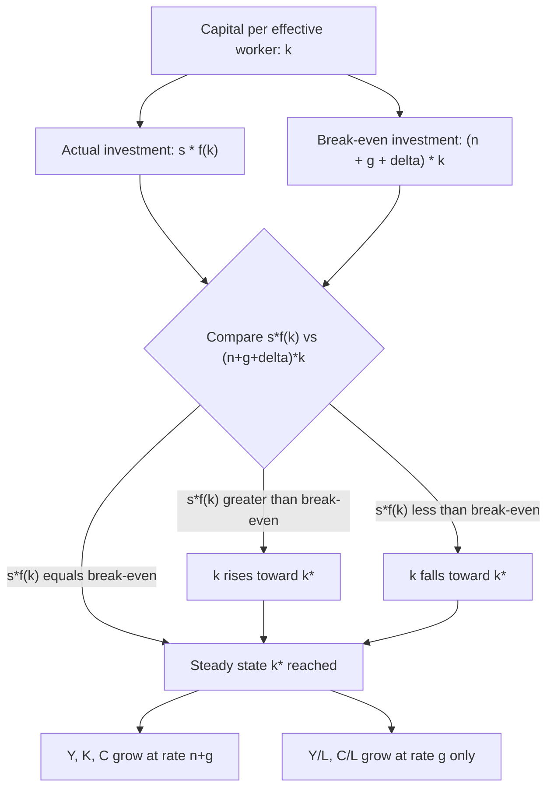

## Solow-Swan Growth Model

### Overview

The Solow-Swan model, developed independently by Robert Solow (1956) and Trevor Swan (1956), is the foundational neoclassical model of long-run economic growth. It explains output growth as a function of capital accumulation, labor force growth, and exogenous technological progress, and generates the central prediction of **conditional convergence** — that economies with similar structural parameters (savings rates, population growth, technology) will converge to the same steady-state level of income per capita, regardless of initial conditions. The model earned Solow the 1987 Nobel Memorial Prize in Economic Sciences and remains the workhorse baseline against which nearly all subsequent growth theory (endogenous growth models, unified growth theory) is compared.

### Core Assumptions

**Key Points**

- A single homogeneous output good, which can be either consumed or invested (saved) to become capital.
- A neoclassical aggregate production function $Y = F(K, L, A)$ exhibiting constant returns to scale in capital ($K$) and labor ($L$), positive but diminishing marginal returns to each factor individually, and satisfying the Inada conditions (marginal product approaches infinity as the factor approaches zero, and approaches zero as the factor approaches infinity).
- A constant, exogenously given savings rate $s$ (the fraction of output saved and invested).
- Labor force $L$ grows at a constant exogenous rate $n$.
- Capital depreciates at a constant exogenous rate $\delta$.
- Technology $A$ (labor-augmenting, "Harrod-neutral") grows at a constant exogenous rate $g$.
- Perfectly competitive factor markets, with factors paid their marginal products.
- No government, no international trade (in the baseline closed-economy version).

### Mathematical Structure

#### The Production Function

The model typically employs a Cobb-Douglas production function for tractability, though the qualitative results generalize to any neoclassical production function satisfying the Inada conditions:

$$Y_t = K_t^{\alpha} (A_t L_t)^{1-\alpha}$$

where $\alpha \in (0,1)$ is capital's share of output, and $A_t L_t$ represents "effective labor" (labor measured in efficiency units).

#### Per-Effective-Worker Variables

Defining variables in per-effective-worker terms — $k = K/(AL)$ (capital per effective worker) and $y = Y/(AL)$ (output per effective worker) — allows the model to be reduced to a single state variable. The Cobb-Douglas production function in intensive form becomes:

$$y_t = k_t^{\alpha}$$

#### The Fundamental Dynamic Equation

The central equation of the model describes how capital per effective worker evolves over time:

$$\dot{k} = s f(k) - (n + g + \delta) k$$

**Explanation of terms**

- $s f(k)$: actual investment per effective worker (savings channeled into new capital).
- $(n + g + \delta)k$: "break-even investment" — the amount of new investment per effective worker required merely to keep $k$ constant, given that population growth ($n$) and technological progress ($g$) continuously increase the effective labor supply, and depreciation ($\delta$) continuously erodes the existing capital stock.
- When actual investment exceeds break-even investment ($sf(k) > (n+g+\delta)k$), $k$ rises; when actual investment falls short, $k$ falls.

#### The Steady State

The steady state $k^*$ occurs where $\dot{k} = 0$, i.e., where actual investment exactly equals break-even investment:

$$s f(k^*) = (n + g + \delta) k^*$$

For the Cobb-Douglas case, this yields a closed-form solution:

$$k^* = \left( \frac{s}{n+g+\delta} \right)^{\frac{1}{1-\alpha}}$$

At the steady state, capital per effective worker, output per effective worker, and consumption per effective worker are all constant. However, because effective labor $AL$ grows at rate $n+g$, **total output, total capital, and total consumption all grow at rate $n+g$ along the steady-state path**, while output *per worker* ($Y/L$) grows at rate $g$ — meaning long-run per-capita growth in the model is driven entirely by exogenous technological progress, not by capital accumulation.

### Diagram: The Solow Diagram

The standard textbook illustration plots $sf(k)$ and $(n+g+\delta)k$ as functions of $k$ on the same axes; because $f(k)$ is concave (diminishing marginal product of capital) while the break-even line is linear, the two curves intersect exactly once at $k^* > 0$, and the diagram visually demonstrates convergence from any initial $k_0$ toward $k^*$.

### The Golden Rule Savings Rate

A distinct normative question the model addresses is: what savings rate maximizes steady-state consumption per effective worker? Since steady-state consumption is $c^* = f(k^*) - (n+g+\delta)k^*$, maximizing over $k^*$ yields the **Golden Rule condition**:

$$f'(k_{gold}^*) = n + g + \delta$$

That is, at the Golden Rule steady state, the marginal product of capital equals the effective depreciation rate. Economies saving more than the Golden Rule rate are **dynamically inefficient** — they could increase consumption at every point in time (including during transition) by reducing savings, since they are over-accumulating capital beyond the point where its marginal return justifies the foregone consumption.

### Comparative Statics and Predictions

| Parameter Change | Effect on Steady-State $k^*$ and $y^*$ | Effect on Growth Rate of $Y/L$ |
| --- | --- | --- |
| Increase in savings rate $s$ | Increases $k^*$ and $y^*$ (level effect) | Temporary increase during transition; no permanent change (returns to rate $g$) |
| Increase in population growth $n$ | Decreases $k^*$ and $y^*$ | Temporary decrease during transition; no permanent change |
| Increase in depreciation $\delta$ | Decreases $k^*$ and $y^*$ | Temporary decrease during transition; no permanent change |
| Increase in technology growth $g$ | No effect on $k^*$ (defined in effective-worker terms) | Permanent increase, one-for-one |

**Key Points**

- A central and often counterintuitive result: changes in the savings rate, population growth rate, or depreciation rate affect only the **level** of the steady-state growth path, not its long-run **growth rate**. Only changes in the technology growth rate $g$ produce a permanent change in the per-capita growth rate.
- This is the model's central limitation as a theory of long-run growth: it treats the ultimate driver of sustained per-capita growth (technological progress, $g$) as entirely exogenous — the model explains *how* an economy approaches its steady state but not *why* technology grows at the rate it does. This limitation directly motivated the development of endogenous growth theory (Romer, Lucas) in the 1980s.

### The Convergence Hypothesis

#### Conditional Convergence

The model predicts **conditional convergence**: economies with the *same* steady-state determinants ($s$, $n$, $\delta$, $g$, and the production function) will converge to the *same* steady-state level of income per capita, and poorer economies among this group will grow *faster* than richer ones as they approach the shared steady state (due to diminishing marginal returns to capital — countries further from their steady state have higher marginal products of capital, hence higher returns to investment).

This is distinct from **absolute (unconditional) convergence** — the (empirically much weaker) claim that *all* countries converge to the *same* level of income regardless of their individual savings rates, population growth rates, or other structural characteristics.

#### Empirical Testing

- Robert Barro and Xavier Sala-i-Martin's empirical work (1990s) found strong support for conditional convergence — once controlling for differences in savings rates, population growth, and (crucially) measures of human capital, poorer economies show a convergence rate of roughly 2% per year toward their (country-specific) steady states.
- Absolute convergence is empirically rejected across the full sample of world economies (poor and rich countries have not converged to a common income level over the postwar period), but is more strongly supported within more homogeneous subsamples (e.g., U.S. states, OECD economies), consistent with the conditional convergence prediction.
- [Unverified] The precise numerical convergence rate (commonly cited around 2% annually) varies somewhat across studies depending on econometric specification, sample period, and the set of conditioning variables included, and should be treated as an approximate empirical regularity rather than a precisely estimated structural constant.

### Growth Accounting and the Solow Residual

The model provides the theoretical basis for **growth accounting**, a widely used empirical technique for decomposing observed output growth into contributions from factor accumulation versus technological progress (total factor productivity, TFP).

From the production function, differentiating and rearranging yields:

$$\frac{\dot{Y}}{Y} = \alpha \frac{\dot{K}}{K} + (1-\alpha) \frac{\dot{L}}{L} + \frac{\dot{A}}{A}$$

The term $\dot{A}/A$ — the portion of output growth not explained by measured capital and labor growth — is known as the **Solow residual**, used empirically as a proxy for TFP growth. This decomposition is standard practice in empirical growth economics and international organizations' productivity analyses (e.g., OECD, Conference Board Total Economy Database growth accounting exercises).

**Historical application**: growth accounting studies applied to the East Asian NIEs (notably Alwyn Young's and Paul Krugman's early-1990s analyses of Singapore) found that a substantial share of these economies' rapid output growth was attributable to factor accumulation (particularly capital deepening and rising labor force participation) rather than TFP growth — a finding often summarized in Krugman's phrase describing East Asian growth as reflecting "perspiration" rather than "inspiration," and used to question the sustainability of continued rapid growth once diminishing returns to factor accumulation set in.

### Limitations and Extensions

**Key Points**

- **Exogenous technology**: the model's central limitation, as noted above, treating the ultimate long-run growth driver as unexplained. Addressed by endogenous growth theory (Romer's 1990 model of technology as a non-rival, partially excludable good produced by purposive R&D investment; Lucas's 1988 human-capital-based model).
- **Exogenous savings rate**: the constant savings rate is a simplifying assumption rather than derived from optimizing household behavior. The **Ramsey-Cass-Koopmans model** extends the Solow framework by endogenizing savings through explicit intertemporal utility maximization by a representative household, while retaining the same production-side structure and long-run convergence properties.
- **No human capital**: the augmented Solow model (Mankiw, Romer, and Weil, 1992) extends the production function to include human capital as a third accumulable factor, substantially improving the model's empirical fit to cross-country income variation.
- **Closed economy assumption**: the baseline model excludes international capital mobility and trade, limiting its direct applicability to small open economies; open-economy extensions incorporate foreign borrowing and its effect on the speed of convergence.
- **Single sector, single good**: abstracts from structural transformation (the shift from agriculture to industry to services central to development economics) and from sector-specific productivity differences.

### Practical Example: Numerical Steady-State Calculation

Given a Cobb-Douglas production function with $\alpha = 0.33$, $s = 0.20$, $n = 0.01$, $g = 0.02$, and $\delta = 0.05$:

$$k^* = \left( \frac{0.20}{0.01+0.02+0.05} \right)^{\frac{1}{1-0.33}} = \left( \frac{0.20}{0.08} \right)^{1.4925} = (2.5)^{1.4925} \approx 3.68$$

Steady-state output per effective worker: $y^* = (k^*)^{0.33} \approx (3.68)^{0.33} \approx 1.55$.

**Output** (illustrating the sensitivity to the savings rate): doubling $s$ to $0.40$ raises $k^*$ to approximately $(5.0)^{1.4925} \approx 9.27$ and $y^*$ to approximately $(9.27)^{0.33} \approx 2.09$ — a substantial level effect, but one that (per the model's core prediction) does not change the long-run per-capita growth rate, which remains pinned at $g = 0.02$ in both cases.

### Related Topics

- Ramsey-Cass-Koopmans model (endogenized savings via household optimization)
- Endogenous growth theory: Romer's R&D-based model and Lucas's human capital model
- Mankiw-Romer-Weil augmented Solow model with human capital
- Growth accounting methodology and the Solow residual / TFP measurement
- Conditional vs. absolute convergence: empirical tests (Barro, Sala-i-Martin)
- Golden Rule savings and dynamic efficiency
- Structural transformation and multi-sector growth models
- Overlapping generations (OLG) models as an alternative micro-foundation for growth theory