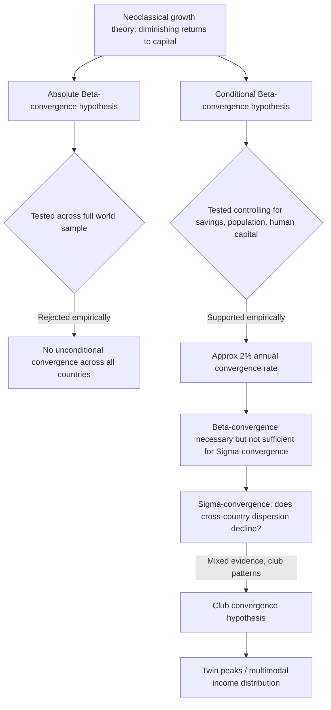

## Convergence Hypothesis and Empirical Evidence

### Overview

The convergence hypothesis is a central empirical and theoretical prediction of neoclassical growth theory, holding that poorer economies tend to grow faster than richer ones, leading over time to a narrowing of income gaps. The hypothesis derives directly from the Solow-Swan model's assumption of diminishing marginal returns to capital, and its empirical testing has generated one of the most extensive and methodologically sophisticated literatures in development and growth economics since the late 1980s. This chapter distinguishes the major theoretical variants of convergence, surveys the primary empirical methodologies used to test them, and evaluates the resulting evidence.

### Theoretical Foundations

#### Why Neoclassical Theory Predicts Convergence

**Key Points**

- In the Solow-Swan model, diminishing marginal returns to capital mean that economies with less capital per worker (typically, poorer economies) have a higher marginal product of capital, and therefore a stronger incentive and capacity to grow rapidly as they accumulate capital toward their steady state.
- An economy further below its own steady state grows faster than one closer to its steady state — this is the mechanism generating convergence *within* a group of economies sharing the same steady-state determinants (savings rate, population growth, depreciation, production technology).
- Convergence in this framework is therefore fundamentally a statement about the *speed of transition* toward a steady state, not a claim that all economies necessarily reach the *same* income level.

#### Three Distinct Convergence Concepts

The growth economics literature (following the taxonomy developed by Danny Quah, Xavier Sala-i-Martin, and others in the 1990s) distinguishes several analytically distinct convergence concepts, which are frequently conflated in casual usage but require different empirical tests.

| Concept | Definition | Typical Test |
| --- | --- | --- |
| **Absolute (unconditional) $\beta$-convergence** | Poorer economies grow faster than richer ones, *regardless* of other structural characteristics, implying convergence to a common income level | Regress growth rate on initial income level alone; negative and significant coefficient supports convergence |
| **Conditional $\beta$-convergence** | Poorer economies grow faster than richer ones *once other steady-state determinants are held constant* (savings rate, population growth, human capital, institutions); economies converge to their own, potentially different, steady states | Regress growth rate on initial income level *plus* controls for steady-state determinants |
| **$\sigma$-convergence** | The cross-sectional *dispersion* (variance or standard deviation) of income per capita across economies declines over time | Track the standard deviation of log income per capita across a sample over time |
| **Club convergence** | Convergence occurs only within subgroups ("clubs") of economies sharing similar initial conditions or structural characteristics, with persistent or widening gaps between clubs | Test for multiple modes in the cross-country income distribution (e.g., via kernel density estimation) |

**Important distinction**: $\beta$-convergence (poorer economies growing faster) is a *necessary but not sufficient* condition for $\sigma$-convergence (declining dispersion) — an economy can exhibit $\beta$-convergence while $\sigma$-convergence fails to occur, if idiosyncratic shocks continuously reintroduce dispersion even as mean-reversion pulls individual economies toward their steady states. This distinction, formalized prominently by Sala-i-Martin (1996), resolved considerable confusion in earlier literature that treated the two concepts as equivalent.

### The Barro Growth Regression Framework

The dominant empirical methodology for testing conditional convergence, developed by Robert Barro (1991) and extended with Xavier Sala-i-Martin, takes the form:

$$\frac{1}{T}\ln\left(\frac{y_{i,t+T}}{y_{i,t}}\right) = a - b \ln(y_{i,t}) + c' X_{i,t} + \varepsilon_{i,t}$$

**Explanation of terms**

- The dependent variable is the average annual growth rate of per-capita income for country $i$ over period $T$.
- $\ln(y_{i,t})$ is initial log income per capita; a negative and statistically significant coefficient $b$ is interpreted as evidence of convergence.
- $X_{i,t}$ is a vector of control variables representing steady-state determinants: investment/savings rates, population growth, human capital (typically measured via school enrollment rates or average years of schooling), government consumption share, institutional quality measures, and openness to trade.
- The implied convergence rate can be derived from $b$ via the relationship $b = (1-e^{-\lambda T})$, where $\lambda$ is the annualized convergence speed.

#### The Canonical Empirical Finding: The "2% Rule"

Barro and Sala-i-Martin's studies across multiple samples (the full cross-country sample, U.S. states, Japanese prefectures, European regions) repeatedly found a conditional convergence rate of approximately **2% per year** — meaning economies close roughly 2% of the gap between their current income and their steady-state income each year, implying a "half-life" (time to close half the gap) of approximately 35 years.

- [Unverified] The remarkable consistency of this approximately 2% figure across very different samples and time periods has itself been treated with some suspicion by subsequent researchers, since standard calibrated versions of the Solow model (using conventional capital share and depreciation parameters) predict a substantially *faster* convergence rate (often above 5-6% annually) than what is empirically observed — a discrepancy sometimes called the "convergence speed puzzle," which motivated the augmented Solow model's inclusion of human capital (a broader definition of capital slows the model's predicted convergence speed toward the empirically observed rate).

### Diagram: Convergence Concepts and Their Relationships

### Empirical Evidence: Absolute Convergence

- Testing absolute (unconditional) convergence across the full sample of world economies in the postwar period consistently **rejects** the hypothesis: initial income level shows no significant negative relationship with subsequent growth once the full range of poor and rich countries is included, and in some periods the relationship is mildly positive (rich countries growing as fast or faster than poor ones).
- Absolute convergence receives much stronger support within more homogeneous subsamples: studies of convergence among U.S. states (Barro and Sala-i-Martin, 1991), Japanese prefectures, and the original core group of OECD/advanced industrial economies find convergence rates broadly consistent with the "2% rule" even without extensive additional controls — consistent with the theoretical expectation that these economies share more similar steady-state determinants (technology, institutions, savings behavior).

### Empirical Evidence: Conditional Convergence

- Conditional convergence, by contrast, receives robust support across a wide range of studies once appropriate controls (particularly human capital and investment rates) are included, and is generally regarded as one of the more well-established stylized facts in empirical growth economics.
- Mankiw, Romer, and Weil's (1992) augmented Solow model, which added human capital as a third factor of production, substantially improved the model's ability to explain cross-country income variation (raising explained variance from roughly 50-60% to over 80% in their cross-country regressions) and produced convergence rate estimates closer to the model's theoretical prediction once human capital's contribution to effective capital deepening was accounted for.

### Empirical Evidence: Sigma-Convergence

- Global $\sigma$-convergence evidence is mixed and highly sensitive to weighting methodology (population-weighted vs. unweighted country averages) and time period.
- **Unweighted** cross-country income dispersion (treating each country equally regardless of population) generally shows limited or no decline over most of the postwar period through the early 2000s, reflecting persistent divergence among smaller economies (particularly across Sub-Saharan Africa relative to advanced economies) even as some large economies converged.
- **Population-weighted** dispersion, by contrast, shows more pronounced convergence from the 1990s onward, substantially driven by the extremely rapid growth of China and India — two countries containing a large share of the world's population — narrowing the population-weighted global income gap even while unweighted country-level dispersion remained more persistent.
- [Inference] This weighting sensitivity is widely regarded in the empirical growth literature as a genuine analytical ambiguity rather than a methodological error to be resolved in favor of one approach — the appropriate weighting depends on whether the research question concerns convergence among *countries as units* or convergence in *living standards experienced by the world's population*.

### Club Convergence and the "Twin Peaks" Evidence

- Danny Quah's influential work (1996, 1997) using non-parametric density estimation methods found the global cross-country income distribution evolved toward a **bimodal ("twin peaks")** shape over the postwar period — a persistent cluster of low-income economies and a persistent cluster of high-income economies, with a "hollowing out" of the middle-income range — rather than converging toward a single global mode as unconditional convergence would predict.
- This evidence is generally interpreted as supporting **club convergence**: convergence occurs *within* groups of economies with similar structural characteristics (broadly, "rich club" and "poor club"), but there is limited convergence *between* these groups, and mobility between clubs (crossing from the poor cluster into the rich cluster) has historically been relatively rare.
- The **middle-income trap** literature (a more recent, applied extension of this concern) examines why several middle-income economies — much of Latin America, and more recently questions raised about parts of Southeast Asia — appear to stall in growth after reaching middle-income status, rather than continuing to converge toward high-income levels, consistent with a club-convergence rather than universal-convergence pattern.

### Reconciling the Evidence: Growth Empirics Post-2000

**Key Points**

- Since roughly 2000, and particularly since 2010, some economists (notably in work associated with the IMF and World Bank examining "growth spells" and developing-economy catch-up) have identified renewed evidence of broader, if uneven, convergence, driven substantially by sustained rapid growth across large parts of Asia (China, India, and to a lesser extent parts of Southeast Asia) and improved (though more volatile) growth performance in several African economies during the 2000s commodity boom period.
- [Inference] Whether this represents a durable structural shift toward broader global convergence, or a temporary phase driven by specific favorable conditions (commodity price booms, China-centered global value chain integration) that could reverse, remains a genuinely open empirical question rather than a settled matter, particularly given renewed growth divergence concerns following the COVID-19 pandemic's uneven impact and subsequent debt distress across several developing economies.
- The overall empirical consensus can be summarized as: unconditional convergence across all world economies is not supported by the data; conditional convergence (controlling for savings, human capital, and institutional factors) is well supported and represents one of the most robust findings in empirical growth economics; and the pattern of convergence versus divergence in the unconditional cross-country income distribution has varied meaningfully across different historical periods, with evidence supporting club/bimodal patterns for much of the postwar period and more ambiguous, period-dependent evidence in recent decades.

### Methodological Critiques of Convergence Regressions

- **Endogeneity and reverse causality**: several right-hand-side variables in Barro-style regressions (institutional quality, investment rates, even human capital) are plausibly *outcomes* of the growth process rather than purely exogenous determinants, raising concerns about biased coefficient estimates; subsequent literature has employed instrumental variable approaches (e.g., using geographic or historical/colonial-origin instruments, following Acemoglu, Johnson, and Robinson) to address this.
- **Galton's fallacy concern**: some methodologists (following a critique originally associated with statistician Francis Galton's analysis of height regression to the mean) have cautioned that naive cross-sectional convergence regressions can mechanically generate an apparent "convergence" pattern due to measurement error and mean-reversion in noisy data, independent of any genuine underlying economic convergence process — though Sala-i-Martin and others have argued this concern, while valid in principle, does not substantially undermine the robustness of the broader conditional convergence finding once appropriately addressed.
- **Cross-sectional vs. panel data approaches**: earlier convergence studies relied heavily on cross-sectional regressions (a single growth-rate observation per country over a long period); subsequent panel-data approaches (allowing convergence coefficients to be estimated using within-country variation over multiple shorter time periods, and controlling for unobserved country-specific fixed effects) have generally found somewhat *faster* convergence rates than the classic cross-sectional 2% estimate, suggesting the cross-sectional approach may understate true convergence speed by failing to control for persistent unobserved country characteristics.

### Related Topics

- Solow-Swan growth model and the theoretical mechanism generating conditional convergence
- Mankiw-Romer-Weil augmented Solow model with human capital
- The middle-income trap and structural transformation stagnation
- Quah's twin-peaks distribution dynamics and club convergence
- Endogenous growth theory as an alternative framework without automatic convergence
- Growth accounting and total factor productivity (TFP) decomposition
- Institutional quality as a growth determinant (Acemoglu, Johnson, Robinson)
- Cross-country growth regression methodology and endogeneity concerns