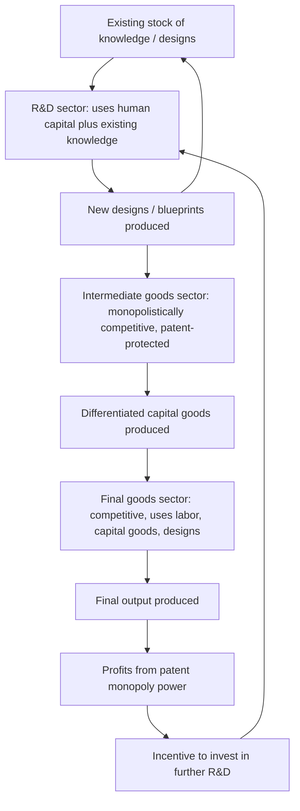

## Endogenous Growth Theory

### Overview

Endogenous growth theory refers to a family of growth models developed primarily from the mid-1980s onward that explain long-run per-capita income growth as an outcome of factors *internal* to the economic system — deliberate investment in knowledge, human capital, and innovation — rather than treating technological progress as exogenous, as in the Solow-Swan model. The theory emerged directly as a response to the Solow model's central limitation: its inability to explain the ultimate source of sustained long-run growth. Paul Romer and Robert Lucas are generally credited as the founding figures of the field, with Romer's 1990 paper "Endogenous Technological Change" and Lucas's 1988 paper "On the Mechanics of Economic Development" serving as the two most influential foundational contributions. Romer received the 2018 Nobel Memorial Prize in Economic Sciences substantially for this body of work.

### Motivation: The Solow Model's Limitation

**Key Points**

- In the Solow-Swan model, diminishing marginal returns to capital ensure that capital accumulation alone cannot sustain long-run per-capita growth; the economy converges to a steady state where per-capita growth equals the exogenous rate of technological progress $g$.
- Because $g$ is not explained within the model, Solow-Swan can describe the *transition dynamics* toward a steady state but cannot explain why some countries have sustained higher long-run per-capita growth than others, nor can it generate policy-relevant predictions about how growth itself might be influenced.
- Endogenous growth theory's central project is to relax the assumption of diminishing returns (either at the aggregate level or specifically for the factor driving technological progress) so that sustained per-capita growth can emerge from the model's own internal mechanics rather than being assumed exogenously.

### The AK Model: The Simplest Endogenous Growth Framework

The most basic endogenous growth model replaces the neoclassical production function with a linear ("AK") specification:

$$Y = AK$$

where $A$ is a constant representing the (constant) marginal and average product of capital, and $K$ is now interpreted broadly to include not just physical capital but potentially human capital and knowledge capital as well.

**Key mechanism**: because there is no diminishing marginal return to capital in this specification (the marginal product of capital, $A$, remains constant regardless of the capital stock's size), a constant savings rate can generate a **permanently rising** capital stock and output, with no convergence to a steady state and no dependence on exogenous technological progress:

$$\frac{\dot{Y}}{Y} = \frac{\dot{K}}{K} = sA - \delta$$

- If $sA > \delta$ (savings-adjusted returns to capital exceed depreciation), the economy grows *indefinitely* at rate $sA - \delta$, entirely as a function of the savings rate $s$ — directly contradicting the Solow model's prediction that savings rate changes have only level effects, not growth-rate effects.
- **Critical implication for convergence**: the AK model predicts *no* convergence, conditional or otherwise — countries with different capital stocks per worker do not necessarily grow at different rates, since the marginal product of capital does not diminish with capital deepening. This is a major point of empirical and theoretical departure from the Solow-Swan framework.

### Romer's R&D-Based Model (1990)

Romer's more elaborate and influential model provides explicit microfoundations for why knowledge might exhibit non-diminishing (or increasing) returns at the aggregate level, resolving the AK model's somewhat ad hoc "constant returns to broad capital" assumption.

#### Key Structural Features

**Key Points**

- The economy is divided into three sectors: a final-goods sector (competitive, uses labor, capital, and a range of intermediate capital goods/designs), an intermediate-goods sector (monopolistically competitive firms producing differentiated capital goods based on patented designs), and an R&D sector (produces new designs/blueprints using human capital and the existing stock of knowledge).
- **Non-rivalry of ideas**: Romer's central conceptual innovation is treating technological knowledge (a "design" or blueprint for a new intermediate good) as a **non-rival** good — one firm's use of a design does not diminish another firm's ability to use it simultaneously — in contrast to conventional rival factors like capital and labor. This non-rivalry is what allows knowledge accumulation to escape the diminishing-returns logic that constrains rival factors.
- **Partial excludability via patents**: because pure non-rivalry combined with pure non-excludability would eliminate any private incentive to invest in R&D (competitors could freely copy new designs), the model relies on patent protection (or equivalent intellectual property mechanisms) to grant temporary monopoly power to innovators, creating the profit incentive necessary to motivate costly R&D investment.
- **Knowledge spillovers**: the R&D sector's productivity depends on the *existing stock* of accumulated knowledge (research builds on prior research) — this "standing on shoulders" effect is the mechanism generating increasing returns to knowledge accumulation at the aggregate level, even though individual firms face constant or diminishing returns to their own R&D efforts.

#### Growth Rate Determination

The model's long-run growth rate of technology (and hence per-capita output) is determined by:

$$\dot{A} = \delta H_A A$$

where $H_A$ is human capital allocated to the R&D sector and $\delta$ is a research productivity parameter. This yields the key comparative-static result: **the long-run growth rate depends on the level of human capital devoted to research**, meaning policies affecting the size of the research sector (education policy, R&D subsidies, intellectual property protection strength) can have *permanent* effects on the growth rate — a sharp contrast to the Solow model's prediction that such policies affect only levels.

### Diagram: Structure of Romer's R&D-Based Endogenous Growth Model

### Lucas's Human Capital Model (1988)

Robert Lucas's alternative endogenous growth framework locates the source of sustained growth in human capital accumulation rather than R&D-driven technological change.

**Key Points**

- Individual workers' human capital accumulates through time devoted to education/training (formal schooling) and, distinctively, through an **external effect**: the average level of human capital in the economy raises the productivity of *all* workers, not just the individual accumulating skills (a human-capital externality or spillover effect).
- This externality is the mechanism generating sustained per-capita growth without reliance on diminishing returns: an individual's private return to human capital investment may exhibit diminishing returns, but the aggregate external effect prevents the *social* return to human capital accumulation from diminishing, permitting continued growth.
- Lucas explicitly linked this human-capital-externality mechanism to observed productivity differences across cities and regions (denser, more educated urban areas exhibiting productivity premiums), providing a bridge between endogenous growth theory and urban/regional economics (agglomeration effects).

### Comparative Summary of Major Endogenous Growth Model Variants

| Model | Source of Sustained Growth | Key Mechanism | Policy Implication |
| --- | --- | --- | --- |
| AK Model | Constant returns to broadly defined capital | No diminishing returns to $K$ | Higher savings rate → permanently higher growth |
| Romer (1990) | Deliberate R&D investment | Non-rivalry and spillovers in knowledge production | R&D subsidies, IP policy, education → permanent growth effects |
| Lucas (1988) | Human capital accumulation with externalities | Aggregate human capital raises all workers' productivity | Education policy, agglomeration-supporting urban policy → permanent growth effects |
| Aghion-Howitt (1992) | Schumpeterian creative destruction | Quality-improving innovations replace prior technologies | Competition policy, patent design affecting innovation incentives |

### Schumpeterian Growth Theory: Aghion and Howitt

- Philippe Aghion and Peter Howitt's (1992) model introduced an explicitly **Schumpeterian "creative destruction"** mechanism into the endogenous growth framework: growth occurs through a sequence of quality-improving innovations, each of which renders the previous technology (and its associated monopoly rents) obsolete.
- This framework generates distinctive predictions absent from Romer's variety-expanding model, notably regarding the relationship between **market competition and innovation incentives** — since incumbent firms facing the threat of being displaced by creative destruction have different R&D incentives than firms in Romer's framework (where existing designs are not directly displaced, only supplemented by new varieties).
- [Inference] The competition-innovation relationship in Schumpeterian growth models is theoretically ambiguous and has generated a substantial empirical literature (e.g., work by Aghion and collaborators using UK and other firm-level panel data) generally finding an **inverted-U relationship** between market competition and innovation intensity, though the precise shape and generalizability of this relationship across different industries and country contexts remains an active empirical research area.

### Empirical Testing and Challenges

**Key Points**

- Empirically distinguishing endogenous growth models from the augmented (human-capital-inclusive) Solow model has proven genuinely difficult, since both frameworks can generate similar cross-country growth patterns under certain parameter configurations — this has been a persistent methodological challenge in the empirical growth literature since the early 1990s.
- Mankiw, Romer, and Weil's (1992) augmented Solow model, despite predating much of the fully developed endogenous growth empirical literature, demonstrated that a properly specified neoclassical (non-endogenous) model incorporating human capital could explain a very large share of cross-country income variation, somewhat undercutting claims that endogenous growth mechanisms were empirically necessary to fit observed data.
- [Unverified] Whether observed cross-country growth patterns are better explained by neoclassical convergence dynamics (with human capital) or genuine endogenous, non-convergent growth mechanisms remains a matter of ongoing empirical and methodological debate, in part because the two classes of models can be difficult to statistically distinguish using available cross-country data, particularly given data limitations on cross-country R&D and knowledge stock measurement.
- Direct microeconomic evidence on R&D and innovation (patent citation studies, firm-level R&D productivity studies) has generally been more supportive of core endogenous growth mechanisms (knowledge spillovers, non-rivalry effects) than aggregate cross-country growth regressions, which face greater identification challenges.

### Policy Implications and Applications

- **R&D subsidies and tax credits**: endogenous growth theory provides the standard theoretical justification for government R&D subsidies and R&D tax credit policies (widely implemented across OECD economies), on the grounds that private firms underinvest in R&D relative to the social optimum due to knowledge spillovers they cannot fully capture (a classic externality argument).
- **Intellectual property policy design**: the theory highlights an inherent policy tradeoff in patent design — stronger and longer patent protection increases the private incentive to innovate (by extending monopoly rents) but also increases the deadweight loss from monopoly pricing and can slow the diffusion of knowledge to subsequent innovators, an active area of applied research in innovation economics.
- **Education policy**: Lucas's human-capital framework provides theoretical support for public investment in education, particularly given the externality argument (private schooling decisions do not internalize the full social benefit of an economy's aggregate human capital stock).
- **Growth and development policy divergence from Solow-based prescriptions**: where the Solow model implies capital accumulation policies (savings incentives, foreign capital inflows) primarily raise income *levels* with only temporary growth effects, endogenous growth theory implies that policies affecting innovation capacity, education quality, and institutional support for R&D can have *permanent* growth-rate effects — a substantively different and more expansive set of policy levers.

### Limitations and Critiques

- **Scale effects problem**: early endogenous growth models (including Romer's original 1990 specification) implied that larger economies (with more researchers) should exhibit permanently higher growth rates — a prediction not strongly supported by cross-country evidence (e.g., large economies like the U.S. and small economies like several East Asian NIEs have both exhibited strong growth performance at different times). This "scale effects" critique motivated a subsequent generation of "second-generation" endogenous growth models (Jones, 1995; and others) that modified the R&D production function to eliminate this counterfactual scale prediction while retaining an endogenous growth mechanism.
- **Empirical identification challenges**: as noted above, distinguishing endogenous growth predictions from neoclassical convergence dynamics empirically remains difficult, limiting the theory's ability to generate uniquely falsifiable cross-country predictions.
- **Complexity and calibration difficulty**: the more elaborate multi-sector structure of R&D-based models (compared to Solow's single-sector framework) requires calibrating a larger number of parameters (research productivity, patent duration, spillover intensity) that are difficult to measure directly, complicating quantitative policy application.

### Related Topics

- Solow-Swan growth model (the neoclassical baseline endogenous growth theory responds to)
- Mankiw-Romer-Weil augmented Solow model and the convergence-vs-endogenous-growth empirical debate
- Schumpeterian creative destruction and the competition-innovation relationship (Aghion-Howitt)
- Intellectual property policy and optimal patent design
- Human capital externalities and agglomeration economics (Lucas, urban economics)
- Jones's "second-generation" semi-endogenous growth models and the scale effects critique
- R&D subsidy policy and innovation economics
- Growth accounting and total factor productivity as an empirical proxy for endogenous technological change