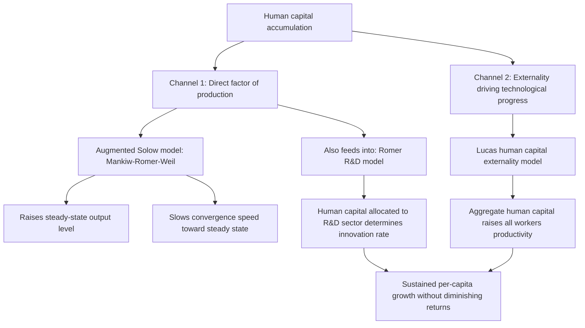

## Human Capital in Growth Models

### Overview

Human capital — the stock of knowledge, skills, health, and productive capacity embodied in individuals — has become one of the central explanatory variables in modern growth theory, addressing empirical patterns that pure physical-capital-based models (the basic Solow-Swan framework) struggle to explain. Human capital enters growth theory through two analytically distinct channels: as an additional accumulable **factor of production** (raising output directly, as in the augmented Solow model), and as a driver of **technological progress and innovation** (raising the rate of growth itself, as in endogenous growth frameworks). This chapter surveys both channels, their formal treatment, and the empirical evidence on human capital's growth contribution.

### Motivation: Why Add Human Capital to Growth Models?

**Key Points**

- The basic Solow-Swan model, using only physical capital and raw labor, substantially underpredicts cross-country income variation and requires implausibly large capital-share parameters to fit observed income differences when treated as a pure physical-capital model — a shortfall identified prominently by Mankiw, Romer, and Weil (1992).
- Human capital differences across countries are large and correlate strongly with income levels: cross-country data on average years of schooling, literacy rates, and more recently direct learning-outcome measures show substantial variation that plausibly explains part of the "residual" income variation the basic Solow model leaves unexplained.
- Beyond its role as a directly productive factor, human capital is also theorized to be necessary for **technology adoption and absorption** — countries with low human capital may be unable to effectively utilize or adapt frontier technology even when it is freely available, a mechanism distinct from human capital's role as a production input per se.

### Channel One: Human Capital as a Factor of Production (Augmented Solow Model)

#### Formal Structure

Mankiw, Romer, and Weil's (1992) augmented Solow model extends the standard Cobb-Douglas production function to include human capital $H$ as a third accumulable factor alongside physical capital $K$ and (raw) labor $L$:

$$Y = K^{\alpha} H^{\beta} (AL)^{1-\alpha-\beta}$$

where $\alpha$ and $\beta$ are the output elasticities of physical and human capital respectively, and $\alpha + \beta < 1$ preserves diminishing returns to the two accumulable factors jointly.

**Key mechanics**

- Human capital accumulates similarly to physical capital, via a separate investment/savings rate $s_H$ (representing resources devoted to education) and its own depreciation rate.
- The model retains the qualitative convergence properties of the basic Solow-Swan model (diminishing returns to the *combination* of $K$ and $H$ still hold as long as $\alpha + \beta < 1$), but the presence of human capital slows the *speed* of convergence relative to the basic model's prediction, since a larger effective capital share ($\alpha + \beta$, versus $\alpha$ alone) implies weaker diminishing returns and hence slower convergence toward steady state.
- [Inference] This slower predicted convergence speed is widely credited in the growth literature with resolving much of the "convergence speed puzzle" noted in comparisons between the basic Solow model's theoretical predictions (implying convergence rates above 5-6% annually) and the empirically observed approximately 2% annual convergence rate, though the degree of resolution depends on the specific human capital share parameter used.

#### Empirical Performance

- Mankiw, Romer, and Weil's original cross-country estimates found the augmented model explained roughly 78% of cross-country variation in income per capita (compared to roughly 50-60% for the basic Solow model using physical capital alone), a substantial improvement in empirical fit.
- Estimated human capital shares in this literature (typically using secondary school enrollment rates as a human capital proxy) were often found to be similar in magnitude to the physical capital share, suggesting human capital's quantitative importance for cross-country income differences is comparable to, or greater than, physical capital's.

### Channel Two: Human Capital and Endogenous Technological Progress (Lucas Model)

Robert Lucas's (1988) alternative framework treats human capital not merely as an accumulable production input but as the **source of sustained long-run growth itself**, via an externality mechanism.

**Key Points**

- Individual workers allocate time between current production and human capital accumulation (education/training); private returns to this accumulation may exhibit diminishing returns at the individual level.
- The model's critical feature is an **aggregate human capital externality**: the *average* level of human capital in the economy raises the productivity of every individual worker, regardless of that worker's own human capital level — analogous to a knowledge spillover or "social capital" effect operating through the aggregate stock of skills in a population.
- Because this externality operates at the aggregate level (where diminishing returns do not necessarily apply, unlike individual-level human capital investment), the model can generate **sustained, non-diminishing per-capita growth** driven entirely by continued human capital accumulation — providing an alternative (or complementary) source of endogenous growth to Romer's R&D-based mechanism.
- Lucas explicitly connected this framework to observed urban productivity premiums (denser, more human-capital-intensive cities showing higher output per worker even controlling for physical capital and observable individual skill), linking growth theory to urban and regional economics via agglomeration effects.

### Diagram: Two Channels of Human Capital in Growth Theory

### Human Capital as an Input to Innovation: The Romer Connection

- In Romer's (1990) R&D-based endogenous growth model, human capital plays a distinct third role: it is the direct input into the research sector producing new technological designs, meaning the *stock* and *allocation* of human capital (specifically, how much human capital is devoted to research versus final-goods production) directly determines the economy's long-run technological growth rate.
- This creates an important theoretical and policy distinction from the augmented Solow model: in Romer's framework, human capital devoted to research generates *permanent* growth-rate effects, whereas in the augmented Solow framework, human capital (like physical capital) generates primarily *level* effects with only temporary growth-rate impacts during the transition to a new (higher) steady state.
- [Inference] This distinction — whether human capital investment should be modeled as raising the *level* of output (Solow-style) or the *growth rate* of output (Romer/Lucas-style) — remains a genuinely important and empirically difficult-to-resolve question in applied growth economics, since the appropriate framework has substantially different implications for the long-run returns to education policy.

### Measurement Issues in Empirical Human Capital Research

**Key Points**

- **Quantity-based measures** (years of schooling, enrollment rates — as used in the original Mankiw-Romer-Weil study and Barro-Lee cross-country schooling datasets) are the most widely available and used measures but have been criticized for assuming a year of schooling produces equivalent human capital regardless of school quality, curriculum, or country context.
- **Quality-adjusted measures**: subsequent research (notably by Eric Hanushek and Ludger Wößmann) has argued that direct measures of cognitive skills and learning outcomes (using standardized international test score data such as PISA and TIMSS) are substantially better predictors of cross-country growth than raw schooling-quantity measures, and that school quality differences across countries are large enough to meaningfully change conclusions about human capital's growth contribution.
- [Unverified] The relative predictive power of quality-adjusted versus quantity-based human capital measures in cross-country growth regressions is an area of ongoing methodological refinement, and results are somewhat sensitive to the specific test-score dataset, sample period, and set of controls used, though the broader finding that school quality matters independently of schooling quantity is fairly well established in this literature.
- **Health as human capital**: some growth models and applied studies incorporate health outcomes (life expectancy, nutritional status, disease burden) as a component of human capital, motivated by evidence that health affects labor productivity, cognitive development, and the returns to educational investment — this is a less formally unified strand than the schooling-based literature but has been influential in development economics more broadly (e.g., work connecting the disease burden literature, including malaria and other tropical disease research, to long-run growth outcomes).

### Comparative Table: Human Capital's Role Across Growth Frameworks

| Framework | Human Capital's Role | Growth Effect | Convergence Implication |
| --- | --- | --- | --- |
| Basic Solow-Swan | Not included | N/A | Standard convergence prediction (often too fast relative to data) |
| Augmented Solow (Mankiw-Romer-Weil) | Additional accumulable production factor | Level effect (raises steady-state output) | Slower, more empirically consistent convergence speed |
| Lucas (1988) | Source of externality-driven sustained growth | Permanent growth-rate effect | No necessary convergence; growth depends on human capital accumulation trajectory |
| Romer (1990) | Direct input to R&D/innovation production | Permanent growth-rate effect (via allocation to research) | No necessary convergence; depends on research sector human capital allocation |

### Empirical Evidence on Human Capital's Growth Contribution

- Cross-country growth regressions consistently find a positive and statistically significant relationship between human capital measures (schooling, and increasingly, quality-adjusted cognitive skill measures) and subsequent growth, making this one of the more robust findings in the empirical growth literature, alongside conditional convergence itself.
- Microeconomic evidence on the **private returns to schooling** (Mincer-equation-based wage regressions across many countries, surveyed extensively by George Psacharopoulos and later Psacharopoulos and Harry Patrinos) consistently finds substantial private returns to additional years of schooling, typically in the range of 8-10% per additional year globally, though with meaningful variation by country income level, schooling level (primary vs. secondary vs. tertiary), and time period.
- **Reconciling micro and macro estimates**: a notable puzzle in this literature (highlighted by economists including Lant Pritchett) is that macro-level cross-country growth regressions have sometimes found weaker or less robust human-capital-growth relationships than would be implied by aggregating the well-established microeconomic returns to schooling, suggesting either measurement problems in cross-country schooling data, genuine differences between private and social returns to education, or issues with how education interacts with the broader economic and institutional environment in translating individual skill gains into aggregate productivity growth.

### Policy Implications

**Key Points**

- **Education investment**: both channels of human capital's role in growth theory (direct factor input and innovation-driving externality/input) support public investment in education, though the specific normative case differs: the augmented Solow framework justifies education investment on standard capital-accumulation grounds (raising output levels), while the Lucas and Romer frameworks provide an *additional* externality-based rationale (private education decisions do not internalize the full social benefit via spillovers or innovation contributions).
- **Quality over quantity emphasis**: the Hanushek-Wößmann quality-adjusted human capital literature has substantially influenced international development policy discourse (e.g., World Bank's shift toward "learning outcomes" rather than pure school enrollment/completion metrics in its human capital policy framework), reflecting growing consensus that schooling quantity without adequate learning quality yields limited growth returns.
- **Health-education complementarity**: given the theoretical and empirical links between health and human capital productivity, integrated health-and-education investment strategies are frequently emphasized in development policy design, particularly for low-income countries facing simultaneous deficits in both dimensions.

### Related Topics

- Solow-Swan growth model and the basic neoclassical growth framework
- Mankiw-Romer-Weil augmented Solow model (full technical treatment)
- Endogenous growth theory: Romer's R&D model and Lucas's externality model
- Mincer wage equations and microeconomic returns to schooling
- Hanushek-Wößmann cognitive skills and quality-adjusted human capital measures
- Convergence hypothesis and empirical evidence (human capital's role in convergence speed)
- Health economics and the disease burden literature in development
- Barro-Lee cross-country educational attainment dataset