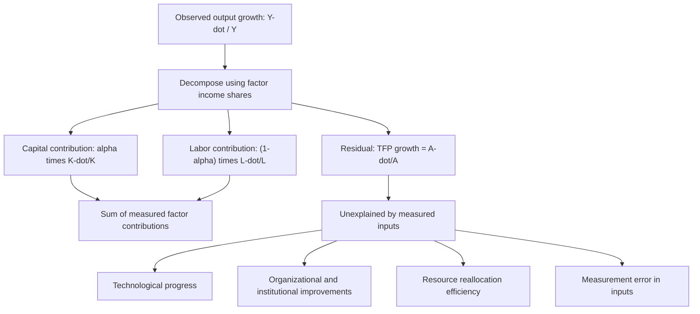

## Total Factor Productivity and Growth Accounting

### Overview

Growth accounting is the empirical methodology used to decompose observed output growth into the portions attributable to the accumulation of measurable factors of production (physical capital and labor) versus the residual portion attributable to **total factor productivity (TFP)** — improvements in the efficiency with which those factors are combined. TFP growth, often called the "Solow residual," captures technological progress, institutional and organizational improvements, resource reallocation efficiency, and any other source of output growth not directly explained by measured factor accumulation. Growth accounting, developed by Robert Solow (1957) alongside his growth model, remains one of the most widely used empirical tools in comparative macroeconomics and development economics.

### Theoretical Derivation

#### The Production Function Starting Point

Growth accounting begins from an aggregate production function, typically Cobb-Douglas:

$$Y_t = A_t K_t^{\alpha} L_t^{1-\alpha}$$

where $Y$ is output, $K$ is the physical capital stock, $L$ is labor input, $A$ is total factor productivity, and $\alpha$ is capital's output elasticity (under competitive factor markets, equal to capital's income share).

#### Deriving the Growth Accounting Equation

Taking logarithms and differentiating with respect to time yields the fundamental growth accounting decomposition:

$$\frac{\dot{Y}}{Y} = \frac{\dot{A}}{A} + \alpha \frac{\dot{K}}{K} + (1-\alpha) \frac{\dot{L}}{L}$$

Rearranging to isolate the TFP growth term (the **Solow residual**):

$$\frac{\dot{A}}{A} = \frac{\dot{Y}}{Y} - \alpha \frac{\dot{K}}{K} - (1-\alpha) \frac{\dot{L}}{L}$$

**Explanation of terms**

- $\dot{Y}/Y$: observed output growth rate, directly measurable from national accounts data.
- $\alpha \dot{K}/K$: the "capital deepening" contribution — capital's growth rate weighted by its income share.
- $(1-\alpha) \dot{L}/L$: the labor contribution — labor's growth rate weighted by its income share.
- $\dot{A}/A$: TFP growth, calculated as a **residual** — the portion of output growth left unexplained after accounting for measured factor input growth. Critically, TFP is not directly observed or measured; it is calculated indirectly by subtraction, which has significant implications for how the residual should be interpreted (see Critiques section below).

### Diagram: The Growth Accounting Decomposition

### Extensions to the Basic Framework

#### Incorporating Human Capital

Modern growth accounting exercises typically extend the basic labor input measure to account for changes in workforce quality (education, experience), following the augmented Solow framework:

$$\frac{\dot{Y}}{Y} = \frac{\dot{A}}{A} + \alpha \frac{\dot{K}}{K} + (1-\alpha)\left(\frac{\dot{L}}{L} + \frac{\dot{H}}{H}\right)$$

where $\dot{H}/H$ represents growth in human capital per worker (typically proxied by changes in average educational attainment or a Mincer-equation-weighted composite). This adjustment is now standard in institutional growth accounting exercises (e.g., the Conference Board Total Economy Database, Penn World Table-based studies) since failing to account for rising education levels would otherwise misattribute genuine human capital deepening to the TFP residual.

#### Capital Composition and Vintage Effects

More disaggregated growth accounting frameworks (following work by Dale Jorgenson and collaborators) further decompose capital input by asset type (structures, equipment, information and communications technology, intellectual property products), recognizing that different capital types have different productivity contributions and depreciation patterns. This disaggregation is particularly important for analyzing the growth contribution of information technology investment, since ICT capital has generally exhibited faster quality improvement and depreciation than traditional structures.

### Empirical Applications and Historical Findings

#### The East Asian Miracle Debate

**Key Points**

- Growth accounting became central to one of the most prominent debates in development economics: the sources of rapid East Asian growth in the 1960s-1990s.
- Alwyn Young's (1992, 1995) detailed growth accounting studies of Singapore, Hong Kong, South Korea, and Taiwan found that, once properly accounting for rapid growth in capital investment, labor force participation (particularly female labor force entry), and educational attainment, **TFP growth in these economies was relatively modest** — comparable to, or in some cases lower than, TFP growth rates observed in advanced industrial economies over the same period.
- Paul Krugman's widely cited 1994 *Foreign Affairs* article "The Myth of Asia's Miracle," drawing on Young's and related growth accounting work, popularized the framing that East Asian growth reflected "perspiration" (extraordinary rates of factor accumulation: savings, investment, education, labor force mobilization) rather than "inspiration" (extraordinary TFP/technological progress), and controversially suggested this implied East Asian growth rates would necessarily decelerate once diminishing returns to factor accumulation set in — a prediction frequently (though not universally) read as anticipating aspects of the 1997-98 Asian Financial Crisis.
- [Inference] The "perspiration vs. inspiration" framing remains influential but has been contested by subsequent researchers who argue growth accounting's residual-based TFP measure may understate genuine technological and organizational learning that manifests partly through the quality (not just quantity) of capital and labor inputs, meaning the low measured TFP growth in these studies may partly reflect measurement limitations rather than a complete absence of productivity-enhancing technological change.

#### U.S. Productivity Growth Patterns

- Growth accounting has been extensively applied to explain U.S. productivity growth patterns, including the productivity slowdown of the 1970s-1980s, the "New Economy" productivity acceleration of the late 1990s (substantially attributed by Jorgenson and collaborators to ICT capital deepening and TFP gains concentrated in ICT-producing industries), and the renewed productivity slowdown observed from the mid-2000s through the 2010s (a subject of continued debate, associated with economists including Robert Gordon, who has argued for a more pessimistic long-run view of future TFP growth prospects).
- [Unverified] The degree to which the post-2005 U.S. productivity slowdown reflects genuine deceleration in the underlying pace of technological innovation, versus measurement challenges in capturing productivity gains from digital and intangible economic activity (a concern raised prominently in debates around measuring the "digital economy"), remains actively disputed among growth and productivity economists.

### Growth Accounting in Cross-Country Development Comparisons

- International institutions (the World Bank, IMF, OECD, Asian Development Bank) routinely use growth accounting decompositions to compare the sources of growth across developing economies, informing assessments of whether growth is likely to be sustainable (broad-based TFP growth generally considered more durable) versus primarily dependent on factor accumulation (potentially subject to diminishing returns as capital deepens or as demographic dividends from labor force expansion are exhausted).
- Sub-Saharan African growth accounting studies have generally found more mixed and often negative TFP growth contributions during the 1970s-1990s "lost decades" period (compared to positive but modest East Asian TFP contributions over the same period), with TFP growth becoming more positive, though still comparatively modest, during the 2000s commodity-boom-supported growth acceleration across the region.
- China's growth accounting literature has generated substantial debate regarding the relative contributions of capital deepening (widely agreed to be very large, reflecting extraordinarily high investment rates often exceeding 40% of GDP) versus TFP growth (estimates vary considerably depending on data sources, methodology, and treatment of capital stock estimation, with some studies suggesting a marked TFP growth deceleration since the mid-2000s to 2010s as the economy's investment-driven growth model matured).

### Methodological Critiques and Limitations

**Key Points**

- **The residual is a measure of ignorance, not a directly estimated economic mechanism**: because TFP is calculated by subtraction rather than directly measured, it mechanically captures *everything* not explained by measured capital and labor inputs — including genuine technological progress, but also measurement error in capital and labor inputs, changes in capacity utilization over the business cycle, resource misallocation effects, and specification error in the assumed functional form of the production function. This has led some economists (notably in Moses Abramovitz's memorable characterization) to describe the Solow residual as "a measure of our ignorance."
- **Capital measurement challenges**: constructing capital stock series (typically using the perpetual inventory method, cumulating past investment flows net of estimated depreciation) involves substantial methodological choices (depreciation rate assumptions, capital good price deflators, treatment of capacity utilization) that can meaningfully affect resulting TFP estimates, particularly in cross-country comparisons where data quality varies considerably.
- **Factor share assumptions**: the standard approach assumes factor income shares (used as weights $\alpha$ and $1-\alpha$) equal output elasticities, which holds under the assumption of perfectly competitive factor markets and constant returns to scale — assumptions that may not hold precisely in economies with substantial market power, informal labor markets, or significant state-owned enterprise sectors (relevant concerns for many developing-economy applications).
- **Cyclicality and short-run misattribution**: measured TFP growth is typically procyclical (rising in booms, falling in recessions) even absent genuine changes in the underlying pace of technological progress, since firms do not immediately adjust labor and capital utilization to match short-run demand fluctuations — meaning growth accounting exercises are generally more reliable and interpretable when applied over longer time horizons (removing business-cycle noise) than for year-to-year analysis.
- **Endogeneity of measured TFP**: some economists argue TFP itself may be partly endogenous to factor accumulation (e.g., "learning by doing" effects, where accumulated capital investment itself generates productivity-enhancing organizational learning), complicating the growth accounting framework's implicit assumption that the residual represents an independent, exogenous productivity shock.

### Comparative Table: Growth Accounting Findings Across Selected Regions/Periods

| Region/Period | Capital Contribution | Labor Contribution | TFP Contribution | Interpretation |
| --- | --- | --- | --- | --- |
| East Asian NIEs, 1960s-1990s | Very high | High (rising participation) | Modest | "Perspiration" (Krugman/Young framing) |
| U.S., late 1990s | Moderate | Moderate | High (ICT-driven) | "New Economy" productivity acceleration |
| U.S., mid-2000s to 2010s | Moderate | Low/moderate | Low | Contested productivity slowdown |
| Sub-Saharan Africa, 1970s-1990s | Low/moderate | Moderate | Often negative | "Lost decades" period |
| China, 2000s-2010s | Very high | Moderate | Disputed, likely decelerating | Investment-driven growth model maturation debate |

### Related Topics

- Solow-Swan growth model (theoretical foundation for the growth accounting decomposition)
- Endogenous growth theory (alternative frameworks explaining the sources of the TFP residual)
- Human capital in growth models (adjustments to labor input measurement)
- The "perspiration vs. inspiration" debate on East Asian growth (Young, Krugman)
- Capital stock measurement methodology (perpetual inventory method)
- ICT capital deepening and the U.S. productivity acceleration/slowdown debate (Jorgenson, Gordon)
- Resource misallocation and aggregate productivity (Hsieh-Klenow framework)
- Convergence hypothesis and empirical evidence