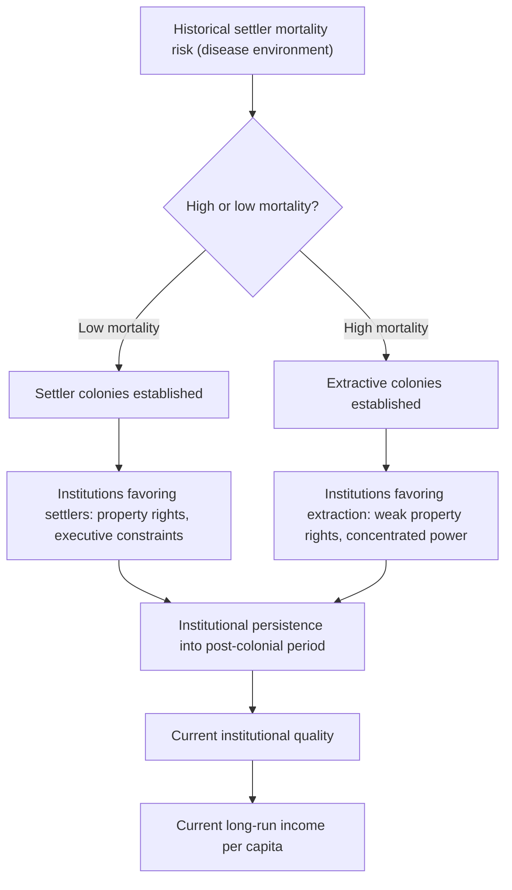

## Institutions and Long-Run Growth

### Overview

The institutions-and-growth literature investigates how the "rules of the game" — property rights protection, contract enforcement, political constraints on executive power, rule of law, and the broader organizational structure of political and economic life — shape long-run economic development. This body of work emerged partly as a response to the limitations of neoclassical growth accounting and endogenous growth theory in explaining persistent cross-country income divergence, and it has become one of the most influential research programs in development economics since the late 1990s. Douglass North's foundational theoretical contributions (earning him the 1993 Nobel Memorial Prize in Economic Sciences) and the subsequent empirical work of Daron Acemoglu, Simon Johnson, and James Robinson (whose 2024 Nobel Memorial Prize recognized this research program) form the core of the field.

### Theoretical Foundations

#### North's Institutional Framework

**Key Points**

- Douglass North defined institutions as the humanly devised constraints — both formal (constitutions, laws, property rights systems) and informal (norms, conventions, codes of conduct) — that structure political, economic, and social interaction.
- North's central argument, developed across works including *Institutions, Institutional Change and Economic Performance* (1990), is that institutions determine the **transaction costs** of economic exchange: societies with institutions that reliably enforce contracts, protect property rights, and constrain arbitrary expropriation by rulers or elites enable more complex, higher-value economic transactions (long-distance trade, impersonal exchange, large-scale investment) that are otherwise too risky to undertake.
- This framework provided a theoretical bridge between the "proximate causes" of growth emphasized by neoclassical and endogenous growth theory (capital accumulation, human capital, technological progress) and what North and subsequent researchers termed the "**fundamental**" or "**ultimate**" causes of growth — the institutional environment that determines whether the incentives for productive investment and innovation exist in the first place.

#### Extractive vs. Inclusive Institutions

Acemoglu and Robinson's influential synthesis (most accessibly presented in their popular book *Why Nations Fail*, 2012, building on their earlier academic work) distinguishes two broad institutional types:

- **Inclusive institutions**: broad-based political participation, secure and widely distributed property rights, constraints on elite expropriation, and economic systems that allow broad segments of the population to participate in and benefit from economic activity.
- **Extractive institutions**: political power concentrated among a narrow elite, weak or selectively enforced property rights (protecting the elite while leaving the broader population vulnerable to expropriation), and economic structures designed primarily to extract resources and labor for the benefit of a ruling group.
- The central causal claim: extractive institutions may permit *some* growth (particularly resource-extraction-based growth, or growth under authoritarian modernization), but this growth tends to be unsustainable and vulnerable to reversal, since extractive elites resist the "creative destruction" (technological and economic disruption) that sustained long-run growth typically requires, fearing it will undermine their political control.

### The Colonial Origins Hypothesis

The most empirically influential single contribution in this literature is Acemoglu, Johnson, and Robinson's (2001) paper "The Colonial Origins of Comparative Development," which proposed a causal identification strategy for institutions' effect on income using historical colonial settlement patterns.

#### The Core Argument

**Key Points**

- European colonizers faced varying disease environments (particularly malaria and yellow fever mortality risk) across different colonized territories, which shaped whether colonizers established **settler colonies** (where Europeans settled in large numbers, as in North America, Australia, and New Zealand) or **extractive colonies** (where high settler mortality discouraged large-scale European settlement, as in much of tropical Africa and parts of Latin America and South Asia).
- In settler colonies, colonizers had strong incentives to establish institutions similar to those in their home countries — secure property rights, constraints on executive power — since they intended to live under these institutions themselves.
- In extractive colonies, colonizers instead established institutions designed to extract resources and labor as efficiently as possible (often building on or intensifying pre-existing extractive structures), with limited concern for long-run institutional quality since colonizers did not intend to settle permanently.
- The paper's central claim is that these early institutional choices exhibited strong **persistence** — extractive or inclusive institutional patterns established during the colonial period substantially shaped the post-colonial institutional environment, which in turn shaped long-run economic development outcomes.

#### The Instrumental Variable Strategy

To address the obvious endogeneity concern (current institutions and current income are jointly determined, making simple correlation uninformative about causation), Acemoglu, Johnson, and Robinson used **historical settler mortality rates** as an instrumental variable for current institutional quality, on the argument that settler mortality centuries ago affects current income only through its effect on institutional development (the exclusion restriction), not through any direct channel.

$$\text{Current Institutional Quality} = f(\text{Historical Settler Mortality}) + \varepsilon$$

$$\text{Current Income per Capita} = g(\text{Predicted Institutional Quality}) + \varepsilon'$$

The two-stage least squares estimates found a strong and statistically significant effect of instrumented institutional quality on current income, substantially larger than simple OLS correlations would suggest — interpreted by the authors as evidence that institutions have a strong **causal** effect on long-run development, addressing the reverse-causality concern that plagued earlier institutions-and-growth correlational studies.

### Diagram: The Colonial Origins Causal Chain

### Related Empirical Strategies in the Institutions Literature

#### The Reversal of Fortune

- A related and striking empirical finding (Acemoglu, Johnson, and Robinson, 2002) is the **"reversal of fortune"**: territories that were relatively prosperous and densely populated *before* European colonization (often due to sophisticated pre-colonial civilizations and agricultural systems) frequently became *relatively poorer* after colonization than territories that were sparsely populated and less developed pre-colonization.
- The proposed explanation is consistent with the institutional persistence mechanism: densely populated, prosperous pre-colonial societies were more attractive targets for extractive institutional structures (an existing population and productive base to extract from), while sparsely populated regions were more likely to become settler colonies with inclusive institutions, reversing the relative income ranking over the subsequent centuries.

#### Alternative Instruments and Geography-Based Critiques

- Jeffrey Sachs and collaborators offered a competing "geography hypothesis," arguing that direct geographic and ecological factors (tropical disease burden, soil quality, distance from coast, climate effects on agricultural productivity) exert an independent causal effect on development that is not simply channeled through institutions — a direct challenge to the institutions-literature's claim that institutions "trump" geography as a fundamental cause.
- Subsequent econometric work (including further contributions from Acemoglu, Johnson, and Robinson responding directly to the geography critique) has generally found institutional quality retains a statistically significant effect even after controlling for a range of geographic variables, though the debate over the relative importance of geography versus institutions as fundamental causes of development remains active within the field.

### Critiques and Methodological Debates

**Key Points**

- **Data quality concerns regarding historical settler mortality**: subsequent researchers (notably David Albouy, 2012) raised significant concerns about the reliability and comparability of the historical settler mortality data underlying the original instrument, arguing that much of the data was drawn from selective, non-representative sources (military garrisons and troops rather than civilian settler populations) and that data quality issues could bias the instrumental variable estimates. This critique generated substantial subsequent debate and robustness-checking within the empirical development economics literature.
- **The exclusion restriction assumption**: critics have questioned whether historical settler mortality truly affects current income *only* through its effect on institutions, or whether it might also proxy for other persistent factors (disease burden's direct effects on human capital and health, or other geographic and ecological characteristics correlated with historical mortality) that independently affect current development — a violation of the exclusion restriction would bias the instrumental variable estimates.
- **Defining and measuring "institutions"**: critics note that "institutional quality" indices (such as those from the World Bank's Worldwide Governance Indicators, or the Polity IV democracy/autocracy scores frequently used in this literature) aggregate quite different and conceptually distinct phenomena (property rights security, political constraints, corruption levels, rule of law) into single composite measures, potentially obscuring which specific institutional dimensions matter most for growth.
- **Reverse causality within the broader institutions-growth relationship**: even setting aside the specific colonial-origins instrument, some economists have argued that the general direction of causation between institutions and growth may run in both directions — economic development itself may generate demand for and capacity to build better institutions (a version of modernization theory's classic claim), complicating simple unidirectional institutions-cause-growth interpretations.

### Institutions and Growth in Contemporary Development Policy

#### Governance Indicators and Aid Conditionality

- The institutions-and-growth research program has substantially influenced international development institutions' policy frameworks: the World Bank's "Doing Business" indicators (discontinued in 2021 following data integrity concerns, but influential for nearly two decades), the Worldwide Governance Indicators, and various donor "good governance" conditionality frameworks for development aid all draw substantially on this research tradition's emphasis on institutional quality as a growth determinant.
- [Inference] The practical translation of institutions-and-growth research findings into specific, actionable governance reform policy prescriptions has proven more difficult than the theoretical and empirical case for institutions' importance might suggest, since the literature is generally stronger at establishing the *correlation and plausible causal role* of institutions in long-run development than at specifying *how* institutional improvement can be reliably engineered through external policy intervention, particularly given institutions' apparent path-dependence and slow-moving nature.

#### Institutions and the Resource Curse

- A specific and policy-relevant application of the institutions framework is the **resource curse** literature, which examines why resource-abundant economies (particularly those with valuable point-source resources like oil and minerals) frequently exhibit worse long-run growth and governance outcomes than resource-scarce economies, despite the intuitive expectation that resource wealth should be advantageous.
- The institutions-based explanation (developed by economists including Halvor Mehlum, Karl Moene, and Ragnar Torvik, among others) argues that resource wealth's effect on growth is **conditional on institutional quality**: in economies with strong, inclusive institutions (e.g., Norway, Botswana), resource wealth can be effectively channeled into broad-based development; in economies with weak or extractive institutions, resource wealth instead intensifies rent-seeking, corruption, and conflict over control of resource rents, worsening rather than improving development outcomes.

### Summary Table: Institutions Literature Key Contributions

| Contribution | Author(s) | Key Claim | Primary Critique |
| --- | --- | --- | --- |
| Institutions as transaction-cost-reducing constraints | North | Institutions determine feasibility of complex exchange | Broad theoretical framework, less directly testable |
| Colonial origins hypothesis | Acemoglu, Johnson, Robinson (2001) | Settler mortality instruments causal institutional effect on income | Data quality of mortality instrument (Albouy) |
| Reversal of fortune | Acemoglu, Johnson, Robinson (2002) | Pre-colonial prosperity predicts post-colonial relative poverty | Alternative explanations involving direct geographic persistence |
| Geography hypothesis (competing) | Sachs and collaborators | Direct geographic/ecological effects independent of institutions | Institutions literature responses find institutions robust to geography controls |
| Resource curse conditionality | Mehlum, Moene, Torvik and others | Resource wealth's growth effect depends on institutional quality | Measuring institutional quality thresholds precisely remains difficult |

### Related Topics

- Solow-Swan growth model and the distinction between proximate and fundamental causes of growth
- Convergence hypothesis and empirical evidence (institutional quality as a convergence-regression control)
- The resource curse and natural resource management in development economics
- Sachs's geography hypothesis and the tropical disease burden literature
- Instrumental variable methodology and identification strategies in development economics
- Dependency theory and its relationship to colonial-legacy institutional explanations
- World Bank governance indicators and aid conditionality frameworks
- Path dependence and institutional persistence in economic history