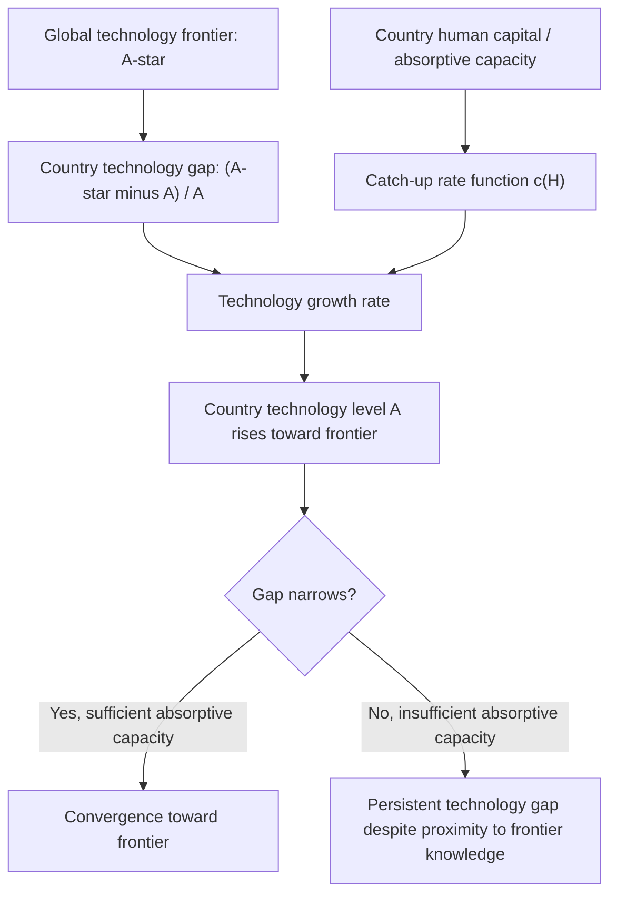

## New Growth Theory and Technology Diffusion

### Overview

New growth theory — largely synonymous with the endogenous growth theory tradition initiated by Romer and Lucas — reframed the analysis of long-run growth around the deliberate production of knowledge. A closely related but analytically distinct strand of this literature, **technology diffusion theory**, addresses a different but equally central question: not how frontier technology is invented, but how existing technology spreads across firms, sectors, and countries, and why this diffusion process is often slow, uneven, and a major independent source of cross-country income divergence. This chapter focuses on the diffusion dimension of new growth theory, examining its formal mechanisms, empirical evidence, and its distinct policy implications relative to innovation-focused endogenous growth models.

### Why Diffusion Matters Separately from Innovation

**Key Points**

- Much of endogenous growth theory (Romer's R&D model, Aghion-Howitt's Schumpeterian model) focuses on the **invention frontier** — how new technologies and designs are created. This is most directly relevant to advanced economies operating near the global technology frontier.
- For the large majority of developing and middle-income economies, however, the more empirically relevant growth margin is **catching up to the existing global technology frontier** rather than pushing that frontier outward — meaning the economics of technology *diffusion and adoption* is arguably more directly policy-relevant for development economics than the economics of frontier innovation itself.
- This distinction underlies the influential concept of **appropriate technology** and **technology gap models** of growth (associated with economists including Moses Abramovitz and, more formally, Gene Grossman and Elhanan Helpman's trade-and-growth models): countries far from the technology frontier have substantial scope for rapid "catch-up" growth simply by adopting already-existing frontier technology, without needing to independently generate frontier innovations themselves.

### Formal Diffusion Models

#### The Nelson-Phelps Framework

Richard Nelson and Edmund Phelps's (1966) foundational diffusion model, though predating the formal "new growth theory" label, provides the conceptual basis for much subsequent technology-gap growth theory:

$$\frac{\dot{A}}{A} = c(H) \cdot \left(\frac{A^{*} - A}{A}\right)$$

**Explanation of terms**

- $A$ represents a country's current technology level, and $A^*$ represents the global frontier technology level.
- $(A^* - A)/A$ is the **technology gap** — the proportional distance between a country's current technology and the frontier; a larger gap implies greater catch-up growth potential, analogous to the convergence mechanism in the Solow model but applied to technology rather than capital.
- $c(H)$ is a "catch-up" or absorptive-capacity function, increasing in human capital $H$ — the model's central insight is that **human capital's primary growth-relevant role in follower economies is enabling technology adoption from the frontier**, rather than (or in addition to) directly producing new innovations, distinguishing this from Lucas's or Romer's treatment of human capital as directly productive or innovation-generating.
- This generates a distinctive testable implication: human capital's growth effect should be *larger* for countries farther from the technology frontier (where absorptive capacity for catch-up matters most) and relatively smaller for frontier economies (where genuine innovation, rather than adoption, is the relevant margin).

#### Diagram: Technology Gap and Catch-Up Dynamics

### Trade, FDI, and Technology Diffusion Channels

#### International Trade as a Diffusion Mechanism

**Key Points**

- Grossman and Helpman's (1991) trade-and-growth models formalized how international trade serves as a channel for technology diffusion — importing capital goods and intermediate inputs embodying frontier technology allows follower economies to access technological improvements they did not themselves develop, a mechanism termed "embodied technology transfer."
- Trade also facilitates **disembodied** technology diffusion through knowledge spillovers accompanying trade relationships — exposure to foreign competitors' products, quality standards, and production techniques can generate learning effects independent of the direct import of capital goods.
- Coe and Helpman's (1995) influential empirical work found that a country's total factor productivity is significantly related not only to its own domestic R&D stock but also to a trade-weighted measure of its trading partners' R&D stocks — interpreted as evidence that international trade serves as a significant channel for cross-border technology spillovers, with the magnitude of spillover benefits found to be larger for smaller and more trade-open economies (consistent with these economies relying more heavily on foreign-sourced technology rather than domestic innovation).

#### Foreign Direct Investment and Technology Transfer

- FDI is widely theorized and empirically studied as a particularly direct technology diffusion channel, since multinational firms typically bring frontier production technology, managerial practices, and organizational know-how directly into host-country operations.
- **Horizontal spillovers** (within the same industry, from multinational affiliates to domestic competitor firms) and **vertical spillovers** (from multinational affiliates to domestic supplier or customer firms in linked industries) are the two primary spillover channels studied in this literature.
- [Unverified] The empirical evidence on FDI spillovers is notably mixed: while vertical (backward-linkage) spillovers to domestic suppliers are relatively consistently found to be positive across country studies, evidence on horizontal spillovers to direct domestic competitors is considerably more mixed, with some studies finding negative effects (attributed to increased competition displacing less efficient domestic firms rather than generating positive technology transfer), and the overall magnitude and consistency of FDI spillover effects varies substantially by host-country absorptive capacity, sector, and study methodology.

### Technology Diffusion Lags and Historical Evidence

- Diego Comin and Bart Hobijn's influential empirical work (building the Cross-country Historical Adoption of Technology, or CHAT, dataset) documented substantial and persistent lags in the diffusion of specific technologies (from historical examples like the steam engine and railroads to more contemporary technologies like mobile telephony and the internet) across countries, with technology adoption lags historically ranging from several decades to, in some historical cases, over a century between initial invention and widespread adoption in follower economies.
- A key finding from this literature is that **diffusion lags themselves have generally shortened over successive waves of technological innovation** — more recent technologies (particularly information and communication technologies) have diffused globally considerably faster than earlier industrial-era technologies, a pattern with significant implications for understanding contemporary catch-up growth potential.
- Comin and Hobijn's work also found that **income differences across countries are substantially correlated with differences in technology adoption levels** across a broad range of technologies, providing empirical support for the general technology-gap framework's relevance to explaining cross-country income variation, complementing the more capital-and-human-capital-focused augmented Solow framework.

### Absorptive Capacity and the Limits of Diffusion

**Key Points**

- The technology diffusion literature's central complication is that technology is frequently **not a simple, freely transferable blueprint** — effective technology adoption typically requires complementary local capabilities (skilled labor, managerial capacity, complementary infrastructure, supporting institutions) that are themselves costly and slow to develop, meaning technology diffusion is far from automatic even when frontier knowledge is, in principle, freely available.
- This "absorptive capacity" concept (developed originally in the innovation management literature by Wesley Cohen and Daniel Levinthal, and subsequently incorporated into growth economics) helps explain why simple technology transfer policies (e.g., direct technology or equipment donation programs) have frequently underperformed expectations in development practice — the binding constraint is often local capability to effectively utilize technology, not access to the technology itself.
- [Inference] This absorptive-capacity emphasis provides a partial theoretical bridge between the institutions-and-growth literature and the technology-diffusion literature: institutional quality, human capital, and infrastructure — the same variables emphasized in the institutions and human-capital growth literatures — are increasingly understood in the diffusion literature as jointly determining a country's capacity to benefit from access to frontier technology, rather than technology diffusion operating as an independent growth channel separate from these other factors.

### Diffusion and the Middle-Income Trap

- Contemporary applications of diffusion-based growth theory have been prominently applied to understanding the **middle-income trap** phenomenon: the observation that many economies achieve substantial catch-up growth through relatively straightforward technology adoption and factor accumulation while at low- and middle-income levels, but subsequently struggle to continue converging toward high-income status once the easier catch-up-based diffusion opportunities are exhausted and further growth increasingly requires genuine frontier innovation capacity rather than adoption of already-existing technology.
- This framing (developed in applied World Bank and academic literature, including work associated with economists such as Indermit Gill and Homi Kharas, who coined the "middle-income trap" term in a 2007 World Bank report) suggests that the *type* of growth strategy required may need to shift qualitatively as an economy approaches the technology frontier — from diffusion-and-adoption-focused policies (education for absorptive capacity, openness to trade and FDI, infrastructure investment) toward innovation-focused policies (R&D investment, intellectual property system development, venture capital and entrepreneurship ecosystems) more characteristic of the Romer-style endogenous growth framework.

### Comparative Table: Innovation-Focused vs. Diffusion-Focused Growth Strategy

| Dimension | Innovation-Focused (Romer/Aghion-Howitt style) | Diffusion-Focused (Nelson-Phelps/technology-gap style) |
| --- | --- | --- |
| Relevant economies | Frontier/advanced economies | Developing/middle-income, technology-gap economies |
| Key growth mechanism | New R&D-driven invention | Adoption of already-existing frontier technology |
| Role of human capital | Direct input to R&D production | Absorptive capacity enabling technology adoption |
| Key policy levers | R&D subsidies, IP protection, university research funding | Trade openness, FDI attraction, education for absorptive capacity, infrastructure |
| Growth rate determinant | Domestic R&D investment and innovation ecosystem quality | Distance from frontier and absorptive capacity |

### Related Topics

- Endogenous growth theory: Romer's R&D model and Aghion-Howitt's Schumpeterian framework
- Human capital in growth models (absorptive capacity vs. direct production role)
- Convergence hypothesis and empirical evidence (technology-gap convergence as a distinct mechanism from capital-based convergence)
- FDI spillovers and multinational enterprise theory in development economics
- The middle-income trap and structural transformation
- Institutions and long-run growth (complementarity with absorptive capacity)
- Total factor productivity and growth accounting (technology diffusion as a TFP growth source)
- Comin and Hobijn's cross-country technology adoption dataset (CHAT) and historical diffusion lags