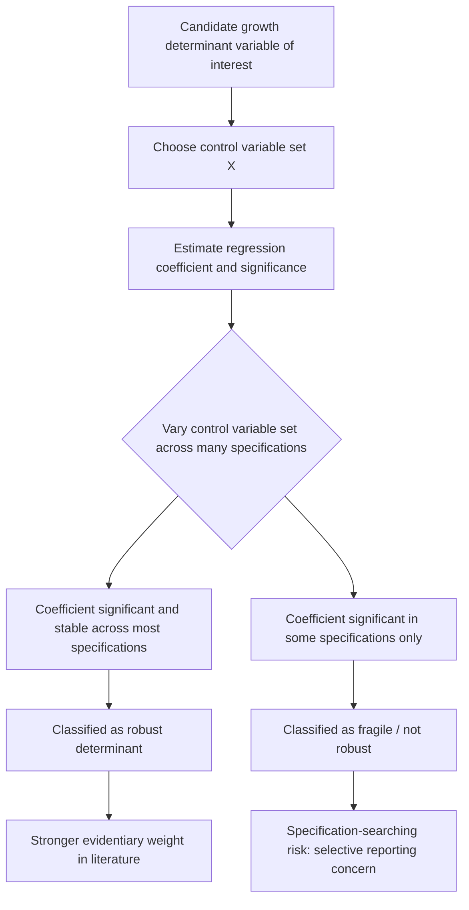

## Cross-Country Growth Regressions Methodology

### Overview

Cross-country growth regressions are the primary empirical technique used in growth economics to test theoretical predictions about the determinants of economic growth using data pooled across many countries. Pioneered by Robert Barro's (1991) paper "Economic Growth in a Cross Section of Countries" and substantially extended through the 1990s and 2000s, this methodology has produced much of the empirical evidence underlying conditional convergence, human capital's growth contribution, and institutions' role in development discussed elsewhere in this chapter. However, the methodology also faces well-documented and serious econometric challenges that have generated an extensive methodological critique literature, making a careful understanding of its strengths and limitations essential for interpreting growth-economics evidence.

### The Basic Regression Framework

#### The Barro-Style Specification

The canonical cross-country growth regression takes the form:

$$g_{i} = \alpha + \beta \ln(y_{i,0}) + \gamma' X_{i} + \varepsilon_{i}$$

**Explanation of terms**

- $g_i$: average annual growth rate of GDP per capita for country $i$ over the sample period (e.g., 1960-2000).
- $\ln(y_{i,0})$: log of initial GDP per capita, included to test the convergence hypothesis (a negative $\beta$ indicates conditional convergence).
- $X_i$: a vector of control variables representing hypothesized growth determinants — investment rates, population growth, human capital measures, institutional quality indices, trade openness, government consumption share, and numerous others depending on the specific research question.
- $\varepsilon_i$: an error term capturing unmeasured determinants of growth and measurement error.
- The regression is typically estimated via ordinary least squares (OLS) on a single cross-section of countries, though panel-data extensions (discussed below) address some of the basic cross-sectional approach's limitations.

#### Data Sources

**Key Points**

- The **Penn World Table** (PWT), originally developed by Robert Summers and Alan Heston and now maintained by researchers at the University of Groningen, provides purchasing-power-parity-adjusted GDP and related national accounts data across a large panel of countries and years, and is the dominant data source for cross-country growth regressions.
- The **Barro-Lee educational attainment dataset** provides internationally comparable schooling data (average years of schooling, attainment by education level) used as the standard human capital proxy in growth regressions.
- Institutional quality data commonly draws on the **Polity IV/V** project (measuring democracy and executive constraints), the **World Bank's Worldwide Governance Indicators**, or the **International Country Risk Guide (ICRG)** indices (particularly favored in the Acemoglu-Johnson-Robinson colonial-origins literature for their longer historical coverage).
- [Unverified] Data quality and comparability across these sources, particularly for lower-income countries with weaker national statistical capacity, remains a persistent and only partially resolved concern in the cross-country growth literature, and researchers frequently note that measurement error in key variables (especially historical GDP estimates for pre-1950 periods and informal-sector-heavy economies) may bias regression results in ways that are difficult to fully correct for.

### The "Growth Regression Industry" and Variable Proliferation

- Following Barro's original contribution, an enormous subsequent literature tested the growth effects of a very wide range of candidate explanatory variables — one influential survey (Xavier Sala-i-Martin's 1997 paper "I Just Ran Two Million Regressions") catalogued over 60 variables that had been found statistically significant in at least one published cross-country growth regression, ranging from clearly theoretically motivated variables (investment rates, schooling, institutional quality) to more idiosyncratic proposed determinants (measures of ethnolinguistic fractionalization, religious composition, and numerous others).
- This proliferation raised a serious **model uncertainty** problem: with dozens of plausible candidate control variables and a limited number of countries (typically 60-100 in a standard cross-section), researchers faced enormous scope for **specification searching** — selectively reporting regression specifications that produce statistically significant results for a variable of theoretical interest, while implicitly or explicitly not reporting specifications that fail to find significance.

#### Sala-i-Martin's Extreme Bounds Analysis Response

- Sala-i-Martin's response to this model uncertainty problem was to develop a **robustness testing methodology** examining whether a given variable's estimated coefficient remains statistically significant and stable in sign across a very large number of alternative regression specifications (varying which other control variables are included), rather than relying on a single preferred specification.
- Variables found "robust" using this approach (retaining significance across the large majority of tested specifications) were treated as having stronger evidentiary support than variables significant in only a narrow subset of specifications — this approach substantially influenced subsequent standards for reporting robustness in the empirical growth literature.
- Subsequent methodological refinements, including **Bayesian Model Averaging (BMA)** approaches (applied to growth regressions by economists including Jonathan Temple, and more formally by Fernandez, Ley, and Steel), provided an alternative, more formally grounded statistical framework for addressing model uncertainty by explicitly weighting evidence across many possible model specifications according to their statistical likelihood, rather than Sala-i-Martin's more ad hoc bounds-testing approach.

### Diagram: The Model Uncertainty Problem and Robustness Testing Response

### Core Econometric Challenges

#### Endogeneity and Reverse Causality

**Key Points**

- Many of the standard right-hand-side variables in growth regressions (investment rates, institutional quality, trade openness, even human capital) are themselves plausibly *outcomes* of the growth process, not purely exogenous determinants — a country that experiences a positive growth shock may subsequently invest more, develop stronger institutions, or expand trade, generating a spurious positive correlation that OLS cannot distinguish from genuine causal effects running from the regressor to growth.
- This concern is particularly acute for institutional quality measures (discussed extensively in the institutions-and-growth literature), motivating the widespread adoption of **instrumental variable (IV)** approaches — using a variable correlated with the endogenous regressor but plausibly uncorrelated with the growth error term except through that regressor (the "exclusion restriction").
- Prominent examples include Acemoglu, Johnson, and Robinson's use of historical settler mortality as an instrument for institutional quality, and Frankel and Romer's (1999) use of geographic characteristics (predicted trade share based on country size and distance from trading partners) as an instrument for actual trade openness, addressing the parallel endogeneity concern in the trade-and-growth literature.
- [Inference] The validity of any specific instrumental variable strategy in this literature rests critically on the exclusion restriction assumption, which is generally not directly testable and must instead be argued for on theoretical and historical grounds — meaning IV-based causal claims in growth economics, while methodologically stronger than simple OLS correlations, still rest on assumptions that reasonable researchers can and do dispute.

#### Omitted Variable Bias

- Cross-country growth regressions, given the limited number of countries available (constraining the number of control variables that can be included without exhausting degrees of freedom) and the inherent difficulty of measuring many theoretically relevant factors (culture, social capital, specific historical circumstances), are particularly vulnerable to omitted variable bias — unmeasured factors correlated with both the regressor of interest and the growth outcome can generate misleading coefficient estimates.
- **Country fixed effects** (feasible only with panel rather than pure cross-sectional data) provide one partial solution, controlling for all time-invariant unobserved country characteristics, though at the cost of being unable to estimate the effects of variables that themselves display limited within-country variation over the sample period (a relevant concern for slow-moving variables like institutional quality or geographic characteristics).

#### Parameter Heterogeneity

- The standard growth regression framework implicitly assumes that the estimated coefficients (the effect of investment, human capital, or institutions on growth) are **constant across all countries in the sample** — an assumption directly challenged by the club-convergence literature (discussed under the convergence hypothesis), which suggests different groups of countries may follow qualitatively different growth processes.
- Researchers have addressed this concern through various approaches: **threshold regression models** (testing whether coefficient values differ systematically across countries above/below some threshold level, such as initial income or institutional quality), and **quantile regression** approaches (examining whether growth determinants' effects differ at different points of the conditional growth-rate distribution) rather than assuming a single homogeneous linear relationship applies uniformly across all countries.

#### Galton's Fallacy and Measurement Error

- As noted in the discussion of convergence evidence, statistician Francis Galton's original observation regarding regression to the mean in height data has been invoked as a methodological caution for growth regressions: cross-sectional regressions of growth rates on initial income levels can mechanically generate apparent "convergence" patterns purely as an artifact of measurement error in the initial income variable, independent of any genuine underlying economic convergence process.
- [Unverified] While this concern is theoretically valid and has been carefully examined by growth economists including Sala-i-Martin, the consensus in the field is generally that properly specified conditional convergence regressions (using panel-data techniques and appropriate measurement-error corrections where feasible) are not substantially driven by this statistical artifact alone, though the concern reinforces the broader methodological caution warranted in interpreting any single cross-sectional regression result in isolation.

### Panel Data Approaches

**Key Points**

- Recognizing the limitations of pure cross-sectional analysis (a single growth-rate observation per country averaged over a long period, discarding potentially informative within-country time variation), much of the subsequent growth regression literature moved toward **panel-data approaches**, dividing the sample period into multiple shorter sub-periods (e.g., successive 5-year or 10-year intervals) and exploiting both cross-country and within-country time variation.
- Panel approaches allow for the inclusion of **country fixed effects** (controlling for unobserved, time-invariant country characteristics) and **time fixed effects** (controlling for common global shocks affecting all countries in a given period, such as global recessions or commodity price cycles), substantially strengthening identification relative to pure cross-sectional analysis.
- **Generalized Method of Moments (GMM)** estimators, particularly the **Arellano-Bond** and **Blundell-Bond system GMM** estimators developed originally for dynamic panel data models in corporate finance and labor economics, were adapted for growth regression applications (notably by economists including Caselli, Esquivel, and Lefort, 1996) to address the specific econometric challenge of a lagged dependent variable (initial income) being correlated with the fixed effect in short panels, a technical problem that simple fixed-effects estimation does not adequately resolve.
- [Inference] Panel-data growth regressions incorporating country fixed effects have generally found notably *faster* convergence rates than the classic cross-sectional approximately 2% estimate (sometimes reported in the range of 10% or higher annually), a finding interpreted by most researchers as evidence that the cross-sectional approach understated true convergence speed by failing to control for persistent unobserved country-specific heterogeneity in steady-state income levels, though some methodologists have raised concerns that certain dynamic panel GMM specifications may themselves be subject to weak-instrument problems that could bias convergence speed estimates upward.

### Comparative Table: Cross-Sectional vs. Panel Growth Regression Approaches

| Feature | Pure Cross-Sectional | Panel Data (Fixed Effects / GMM) |
| --- | --- | --- |
| Data structure | One growth-rate observation per country, long-run average | Multiple shorter-period observations per country |
| Unobserved heterogeneity | Not controlled for | Controlled via country fixed effects |
| Convergence rate estimate | Approximately 2% (classic Barro/Sala-i-Martin finding) | Often notably faster (10%+ in some studies) |
| Key limitation | Vulnerable to omitted variable bias from time-invariant factors | Cannot estimate effects of slow-moving/time-invariant variables well; potential weak-instrument concerns in GMM |
| Representative studies | Barro (1991), Mankiw-Romer-Weil (1992) | Caselli, Esquivel, Lefort (1996); Islam (1995) |

### Contemporary Methodological Developments

- **Machine learning and variable selection methods**: more recent growth economics research has begun applying machine-learning-based variable selection techniques (LASSO regression and related methods) as an alternative, more formally justified approach to the model-uncertainty problem originally addressed by Sala-i-Martin's extreme bounds analysis and Bayesian model averaging.
- **Natural experiments and quasi-experimental designs**: partly in response to persistent concerns about cross-country regression identification, a substantial portion of contemporary development economics research has shifted toward more narrowly focused natural-experiment and quasi-experimental research designs (regression discontinuity, difference-in-differences, and randomized controlled trials at the micro level) that can more credibly establish causal identification, though typically at the cost of external validity and applicability to broad cross-country growth questions relative to the (more identification-challenged) cross-country regression tradition.
- [Inference] The relationship between the cross-country growth regression tradition and the more recent "credibility revolution" in applied microeconomics (emphasizing quasi-experimental identification) is generally understood in the field as complementary rather than competing: cross-country regressions remain the primary tool for testing broad macro-development hypotheses that cannot be addressed at the micro/experimental level, while accepting correspondingly weaker causal identification than well-designed micro-level natural experiments can achieve.

### Related Topics

- Convergence hypothesis and empirical evidence (the primary substantive application of this methodology)
- Institutions and long-run growth (instrumental variable strategies in this literature)
- Sala-i-Martin's extreme bounds analysis and robustness testing in growth economics
- Bayesian Model Averaging applied to growth determinant uncertainty
- Penn World Table and Barro-Lee dataset construction methodology
- Dynamic panel GMM estimation (Arellano-Bond, Blundell-Bond) in growth applications
- The "credibility revolution" and quasi-experimental methods in development economics
- Frankel-Romer trade openness instrument and the trade-growth relationship